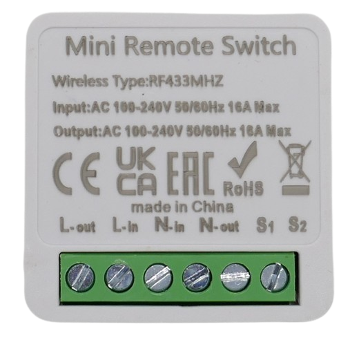

 
# Remote-Controlled Relais

> Turning Devices On And Off Remotely Using Direct Radio Or WiFi

Most people control devices wirelessly every day without even thinking about it: by using a *garage door opener*, *TV remote control*, *smartphone apps*, etc, you are controlling all kinds of electrical devices.

The *wireless relais* discussed here provide you with a *generic way* to retrofit *remote control capability* to *any* device you want.

**The wireless relais discussed here require dangerous AC voltage. Never use AC high voltage in your DIY projects unless you are a qualified electrician or have comparable expertise.**

> [!NOTE]
> *Wireless relais* may look very similarly, so always make sure you check the technical specs on the housing and ensure you are purchasing the *wireless technology* you intend to use.

## Overview

There are two types of radio signals used for remotely controlling devices:

* **RF Signals:** a license-free radio frequency is used to pair a remote control (sender) directly with a device (receiver). This works everywhere and requires no special prerequisite like *WiFi coverage* or *Internet connectivity*, but you must be in close proximity (around *10m*). Pick the frequency that is legal to use in your region (Europe: 433MHz, US: 315MHz)   
* **WiFi:** controllable via *WiFi* signals that are typically sent by a vendor-specific *cloud service*. You use the vendor-supplied *smartphone app* to initiate the control signals. This approach requires *Internet* and works from anywhere in the world.

> [!NOTE]
> Both techniques have their own set of advantages and shortcomings. Which one is preferrable depends entirely on your actual use case.

## Using Radio Frequency
*RF-controlled relais* use a direct *one-way communication* that is providing *autonomy*:

* **Simple:** no special prerequisites are required. You *do* need to purchase a compatible *RF remote control* separately, and pair it with the device.
* **Robust:** when your *WiFi* network fails or your *phone company's network* is temporarily down, your *RF-Controlled solutions* continue to work like a charm.

Here are the disadvantages:

* **Local:** The distance you can bridge is limited to *around 10m*: you need to be *close to the device* to operate it. 
* **No Feedback:** the *one-way communication* cannot send back feedback information. The *visual clue* you get from i.e. an opening garage door is all you get.
* **Potentially Insecure:** since *RF* is travelling freely through the air, attackers can pick them up, record them, and later play them back to clone your remote control - provided the attacker can get close enough to your remote control when you operate it.

> [!NOTE]
> There are solutions to *secure RF transmissions*, i.e. *rolling codes* or *encryption*, however most *cheap out-of-the-box* solutions do not come with this. 

## Using WiFi

Sending *control messages* via *WiFi* has these benefits:

* **Anywhere:** Commands issued by a *smartphone app* work anywhere and just need *Internet Access*. Your commands are automatically routed to your home *WiFi*, and then to the device that you want to control.
* **Feedback:** since *WiFi* uses two-way communications, the controlled device can return feedback, i.e. show its state, or confirm the operation.
* **Secure:** *WiFi* data is encrypted by default. Attackers cannot listen in or use *playback attacks*.

Here is the price you pay for this:

* **Coverage:** requires that your *WiFi network* provides good coverage. This may not be the case in areas like the garden or garage.
* **Internet:** requires a specific *vendor cloud solution*. Devices can be controlled only when connected to the *Internet*.
* **Privacy:** since you do not communicate directly with the device, all messages are routed through the vendor cloud service.

> [!TIP]
> Each vendor uses their own **incompatible** cloud services. Whichever vendor you may choose: stick to it (i.e. *Tuya*, *EweLink*). You cannot mix *WiFi*-device from different vendors (unless you want to use a number of different smartphone apps to control them all).

## Wiring

Most commercial devices (regardless of wireless technology) use *screw terminals* similar to these:

| Terminal | Description |
| --- | --- |
| Lin, Lout | the "live" line, controlled by the relais. |
| Nin, Nout | the *neutral* **AC** line. These two terminals are always connected. |
| S1, S2 | when connected, turns relais *on* *(optional, can be dangerous)* |

> [!CAUTION]
> **S1** and **S2** may be exposed to **AC**! **Never ever hook up a low voltage push button** to these terminals (see next section).

## Hazard

Cheap electronic components - like the ones discussed here - were designed to be **installed by professional electricians**. They were also *specifically* designed to be **integrated into existing applicances**, i.e. *light switches*.

**Before** you start using such components for DIY purposes, read and understand this:

* **Hazardous Voltage:** these components can only work when they are connected to hazardous *AC high voltage* (their internal low voltage circuitry is powered by *AC voltage*).  
* **AC Voltage can be deadly. It may not even hit you: you may be careful, and you may know the parts that "shouldn't be touched or pulled on". It may hit your child or a friend instead, when they trustfully operate one of your DIY devices that may not be safe to use. This may occur tomorrow. Or in two years time. Do not take this risk if you are not absolutely certain you know what you are doing.**

### Dangerous Designs

If you do decide to proceed, always make sure you *fully understand* how components are designed that you plan on using, and how they really work.

Even such a simple component like a *relais* may use dangerous designs and cause deadly misunderstandings. 

As an example, take a look at the terminals **S1** and **S2** found on all of the example devices I examined: 

According to its documentation, these two terminals can be short-cutted to hook up an external *switch* in order to control the relais manually.

> [!NOTE]
> **S1** and **S2** are perfectly in line with the original intention these components were designed for: when retrofitting remote control capabilities to a *light switch*, a licensed electrician would open the existing light switch, then hook up the *wireless relais* to the load, and finally hook up the *original switch* to **S1** and **S2**. This way, the load could now  be controlled via the existing switch **plus** also remotely.

When looking at the traces of this particular device, it becomes evident that dangerous *high voltage AC* is exposed at many surprising places, including **S1** and **S2**:

**S1**, **Nin** and **Nout** are connected, and so is the built-in push button. When you hook up this device as intended, *live AC* is available at **S1** once the relais is turned on. And if you accidentally reversed *L* and *N*, *live AC* is available at **S1** all the time.

### Deadly Misunderstandings
If you went just by the documentation, you might have *assumed* that **S1** and **S2** were terminals to connect a *low voltage* switch that interacts with the *low voltage control logic* - and this would have even been a sensible assumption: 

With a dedicated *DIY component*, **S1** and **S2** would probably have been implemented this way - and some *WiFi-controlled* devices I examined did use this safe design. But not the one I showed above.  

### Dangerous Consequences
If you had connected a simple *12V switch* to **S1** and **S2**, and used simple switching wires, possibly with a bit of sloppy insulation (assuming this to be part of the *5V circuit*), the result may be a life-threatening DIY execution device.

### Think Twice
So again, the devices discussed here are by no means rocket science, and can safely be used - if you have sufficient competence **and respect**. 

The important part is that the devices discussed here *must be used with AC high voltage*, and you *must not* use this type of voltage unless you are *qualified* and *fully understand the design and functionality* of the components you use with *high voltage AC*.

> Tags: Relais, Remote Control, ASK, OOK, SRD, WiFi, Switch

[Visit Page on Website](https://done.land/components/switch/relais/wireless?137944041230242855) - created 2024-04-29 - last edited 2024-07-28
