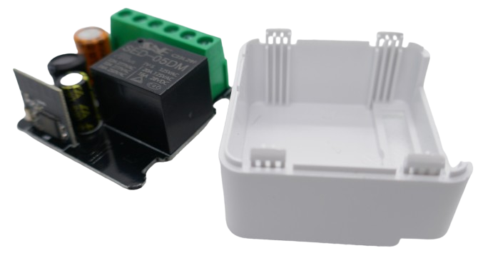
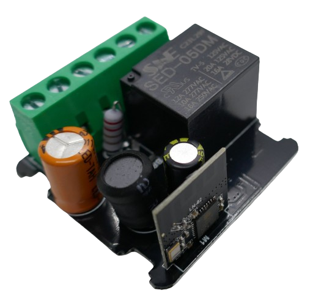

 
# WiFi

> WiFi-Controlled Relais

*WiFi*-controlled relais use a *microcontroller* to connect to a *WiFi network*.

## Connecting To WiFi
Since the *microcontroller firmware* controls this device (and how it connects to *WiFi*), make sure you understand its requirements.

Many cheap devices (like the one examined here) use a commercial *cloud platform* like *Tuya* and require you to use a smartphone app (i.e. *Tuya*, *SmartLife*). 

This has benefits: the device is ready-to-go out of the box. However, it also comes with limitations and privacy issues as you can only control such devices when you sign up with the commercial cloud platform, and when your internet connection is down, you may have limited control.

### Extending Automation Options
By default, you can control these devices exclusively via their vendor smartphone apps. 

This may be sufficient for simple use cases, but if you plan more sophisticated projects (i.e. building your own dashboard with buttons that control different *WiFi relais*), you need additional control.

One very simple way of extending your options is to use *Home Assistant* with its *Tuya Integration*: once you added the device to your official smartphone app, *Home Assistant* can import the device and control it via its *cloud api*.

While this does not releave you from the intransparent vendor cloud, and while you still may experience lack of control in cases of internet connectivity issues, you gain full control over the device and can include it in your automation scenarios.

For example, you can now build a simple button-device (i.e. using *ESPHome* and a *ESP8266* or *ESP32*), then hook up button presses to trigger the relais.

### Replacing Firmware
Most of the microcontrollers found in these devices can be re-flashed with open-source firmware like *Tasmota* or *ESPHome*.

This re-flashing process may be complex and may involve opening or even temporarily de-soldering the microcontroller, but it is no rocket science.

When you reflash the firmware, you gain full control over the hardware and remove all cloud dependencies.

> [!TIP]
> Provided you are experienced enough to re-flash such a device, this provides you with an excellent bang for the buck. Devices like the one examoned here are available for under €2 and include power supply, relais, microcontroller, screw terminals, and housing in a very small form factor. You wouldn't be able to construct such a device from individual components for such a price tag.   
 

## Hardware

The two housing parts of the examined model are held together by four clips. You can pry them open with a screwdriver. 

### WiFi Module

A separate breakout board marked *LN-02* is piggy-backed onto the main board. 

On the top rim, the PCB *WiFi antenna* can be seen:

> [!NOTE]
> The *plug-in piggy-back* board illustrates how these devices are manufactured: based on desired control type, the *WiFi* board can be plugged into the main board, or left out. Plug-in boards with different *WiFi*-enabled microcontrollers can be found, depending on microcontroller market prices and availability.

### Microcontroller

The microcontroller is a *LN882*, produced by *Lightning*. This microcontroller is comparable in features to the well-known *ESP8266* from *Espressif*.

> [!TIP]
> For the longest time, *WiFi*-enabled devices used original *ESP8266* microcontrollers that could easily be reprogrammed. Newer devices use less documented variants. Various [Open Source Projects](https://openbekeniot.github.io/webapp/devicesList.html) aim to document, access and reprogram them. There are [detailed instructions](https://www.elektroda.de/rtvforum/topic4045390.html) for the *LN882* (albeit not in German, use Google translate).

### Power Supply

A fuse resistor is present, as well as three large electrolytic capacitors. 

On the back, a *MB10* bridge rectifier and a *BP2525* transformerless *AC-to-DC* constant voltage converter turns *85-240V AC* directly to *5V DC* which is required to operate the *relais*.

A separate *AMS1117* provides the *3.3V* constant voltage required for the microcontroller.

## Board Design

The board and its traces show a better (safer) design: *Cut-outs* separate *AC* from *DC* parts, and while *Nin* and *Nout* are still connected (the cheap relais switches just one line and not both), the screw terminals for the *external switch* are *not connected* to *AC mains*.

## Summary

A *WiFi*-controlled relais shares the same fundamental components:

* Transformerless Power Supply
* Relais
* A separate *WiFi*-enabled microcontroller board is piggy-backed and digitally controls the *relais* via its *GPIO*

## Datasheets

[BP2525 AC-to-DC converter](materials/bp2525_datasheet.pdf)   
[MB10 Bridge Rectifier](materials/mb10_datasheet.pdf)   
[AMS1117 3.3V Voltage Regulator](materials/ams1117_datasheet.pdf)   

> Tags: Relais, Remote Control, WiFi, Microcontroller, LN882

