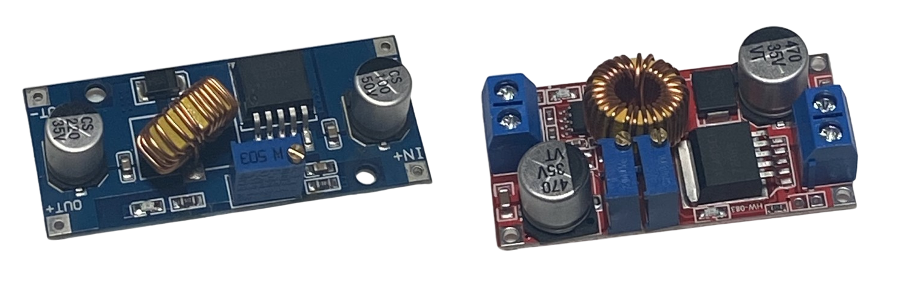

# XL4015
:stopwatch: Reading time: 4 minutes.

## Quick Overview

The **XL4015** from *XLSEMI* is a popular step-down converter capable of outputting significant currents of up to *5A*. 

The chip is sold separately and also embedded in a complete breakout, board ready-to-go, for as little as € 1.00 in total:

> [!WARNING]  
> These boards can *differ considerably*: not all boards support all **XL4015** features.
> 
> Some boards come with just *one* potentiometer to setup a *constant voltage* only (i.e. left board in above image). This may be sufficient if you plan to use the converter to supply a constant voltage to a microprocessor from a 8-36V input range.
> 
> At almost the same cost, different boards provide *two* potentiometers, so in addition to a *constant voltage*, you can also set a maximum *constant current*. This can be an important requirement, i.e. when you plan to use it for battery charging or to drive LEDs. 

| Property | Value |
| --- | --- |
| Input Voltage | 8-36V |
| Output Voltage | 1.2-32V |
| Max Constant Current Output | 5A |
| Efficiency | up to 96% |
| Switching Frequency | 180kHz fixed |

> [!TIP]
> The maximum output current of **5A** requires to add a heat sink to the chip. While the **XL4015** is dependable and rugged, avoid exploting the maximum capacities. The boards using **XL4015** run well for long-time output currents of **3-4A**.
>
> The available stable output current also depends on the voltage difference between input and output. The lower the difference, the less work needs to be done, and the more stable output current and the less heat is produced.

| Feature | Supported |
| --- | --- |
| Constant Current | yes |
| Output Shortcut Protection | yes |
| Thermal Protection | yes |

[Data Sheet](materials/XL4015_datasheet.pdf)

