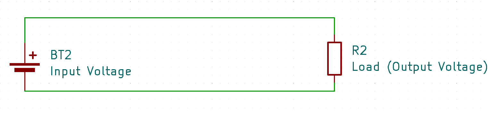
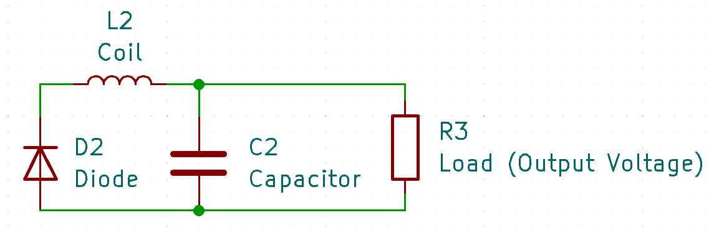

# Buck Converters
:stopwatch: Reading time: 8 minutes.

## Quick Overview

**Buck** converters are electronic circuits that can *lower* **DC** voltage, and the output voltage of a **Buck** converter is always lower than its input voltage.

## Principle

There are many simple ways of lowering a voltage, for example a *voltage divider* (using *resistors*). In fact, *any* load will reduce the voltage by consuming part of the energy.

If you want to lower the voltage *without* consuming energy (and i.e. dissipating it as heat), you can use a **Buck** converter.

### Switching Power On And Off In Rapid Succession

At the basis, a **Buck** converter consists of a high-frequency switch that turns the circuit on and off in rapid succession. This is the *switching frequency*, and this is why **Buck** converters are often called *switching power supply*. Typically, **Buck** converters use a switching frequency of 50kHz up to a few MHz.

If we'd stop here, we would have a **PWM** circuitry: the output would be switched on and off in rapid succession, and the output device would receive the full input voltage, alternating with no input voltage at all. In the *average*, the received output voltage would already be lower than the input voltage, and in fact loads such as *LED* and *motors* can be controlled this way because they don't really care much about voltage spikes.

Hoewever, if you plan to supply more sensitive devices such as microcontrollers, you cannot use **PWM** output directly. You need to supply a *constant voltage* and cannot have a mixture of voltage spikes and no voltage.

This is why **Buck** converters add a *coil*, a *diode*, and a *capacitor*. Here is a circuit diagram showing only the principal components of a **Buck** converter:

### Extracting And Temporarily Saving Energy

Let's first look at the **Buck** converter when its high-frequency switch is turned *on*. Here is the relevant part of the schematics:

On its way to the load, the input voltage flows through the *coil*. A *coil* is just like another load switched in series, and it consumes energy (to create a magnetic field). 

Until the magnetic field is fully created and stabilizes, the *coil* acts just like a *resistor* in a *voltage divider* and reduces the voltage.

Unlike a *resistor* though, the *coil* did not just dissipate the energy through heat, but it "invested" the energy into a magnetic field. Which brings us to the second half of operation: the *off* phase. In this phase, the relevant part of the schematics looks like this:

As you see, the input voltage source vanished. Since the **Buck** switched it off, it no longer supplys energy.

Instead, the magnetic field starts to collapse, and the *coil* starts to return the energy it previously extracted. The energy that was needed to create the magnetic field is now used, and the *coil* acts like a battery.

Of course, current can only flow through your load when there is a closed circuit and the electrons can flow back. However, at this point the input source is separated, and the circuit is *off* (disconnected). That's why a **Buck** converter needs a *diode* so that the current from the *coil* can flow back in this phase.

When the **Buck** converter switches back to *on* mode in time *before* the magnetic field has fully collapsed, the process repeats. In the *on* phase, the output voltage comes again from the input power supply and is again reduced by the energy that the *coil* needs to rebuild its magnetic field. The *diode* is now in blocking mode.

An additional capacitor can help even out the voltage which otherwise would be "rippled" because building and collapsing a magnetic field isn't linear.

In short, a **Buck** converter is reducing the voltage much similar to a *resistor*. But instead of wasting the unwated voltage uncontrolled by dissipating heat, it temporarily stores this energy in a magnetic field, and returns it while at the same time, the input power supply is temporarily cut off.   

> A **Buck** converter works almost as if you'd charge a battery in series with your load, extracting and transferring energy to that battery. Then, once the battery is full, you run your circuit for a while from the battery until it is empty, and repeat. So in a **Buck** converter, the *coil* and its magnetic field act like a wear-free fast-loading and fast-unloading *battery*.

The *switching frequency* of a **Buck** converter determines the size of the *coil* and *capacitor*. The higher the switching frequency, the shorter the two *on* and *off* phases are, so less energy needs to be temporarily stored, and components can be smaller.

At the same time, with higher frequency the energy must be stored and retured more often. Any loss associated with this process increases. Higher switching frequencies can therefore decrease efficiency.
