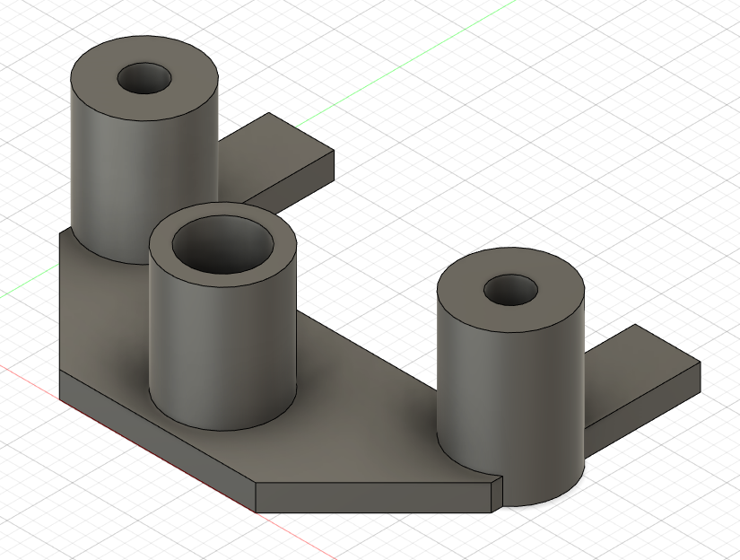
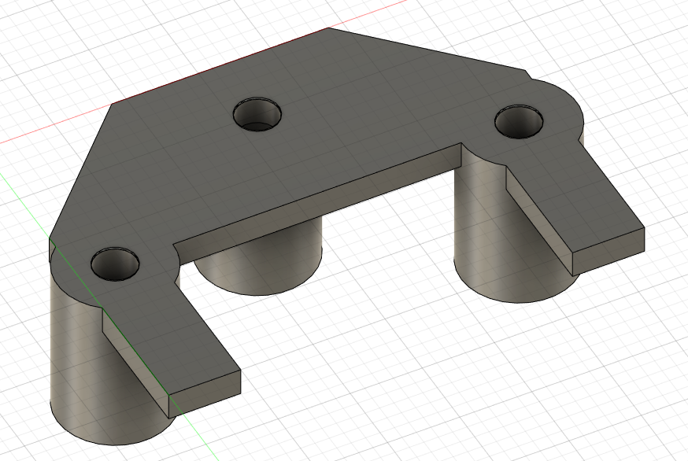
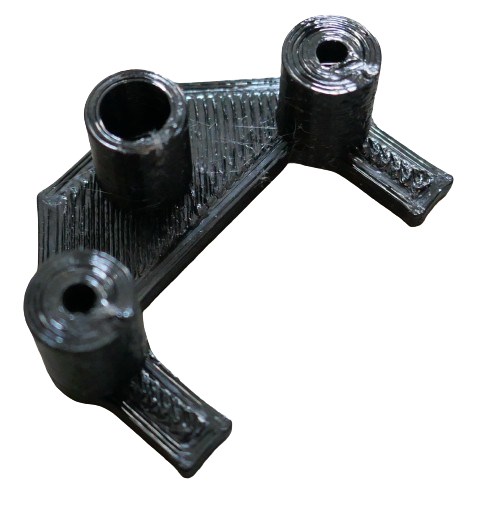
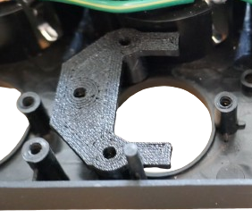
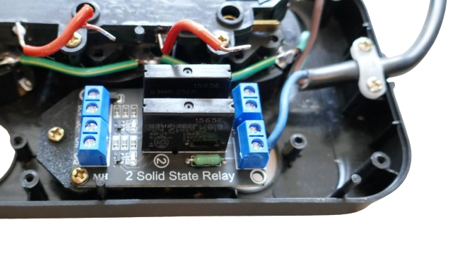

 
# 4-Socket Smart Powerstrip

> Enhancing Commercial 4-Socket Powerstrip With ESPHome-Based Home Assistant Controller

In this article, I am using the [4-Socket Commericial Powerstrip](https://done.land/projects/esphome/switchesandcontrollingdevices/remotecontrolledpowerstrip/repurposingpowerstrip) that I disassembled before: it comes with all that is needed for a *smart powerstrip*, including a *5V power supply* and individually switchable sockets.

## Adding Bi-Color Signal LEDs
The original socket comes with simple *3mm red signal LEDs* that are directly wired to *AC power*. They are *on* when a particular socket was powered.

If you want more sophisticated *singal LEDs* that can signal both *on* and *off* state, replace the existing *LED* with *3mm bi-color bi-polar LEDs* that can emit *red* **and** *green* light, based on their polarity.

### Replacement
Pull out the existing *LED*, and de-solder their wires (including their current limiting resistors).

Solder a *330R* current limiting resistor to one leg of your *bi-polar LED*, and solder two wires to the other end of the resistor and the remaining *LED leg*. Make sure these wires are long enough to be connected to the microcontroller later.

Slide in the new LED into the holes in the housing where the old *LEDs* were located, and secure them with some *hot glue* or *superglue*.

## Mounting Solid State Relais
I chose to use commonly available *DIY AC solid state relays* for this project. Both *low level* and *high level* trigger boards will work:

> [!IMPORTANT]
> These simple DIY *SSR* can only handle **light loads** of up to *440W* (*2A*). For switching some simple low current lights, that is perfect. If you need to switch larger loads, do use appropriately rated *mechanical relais* or *industrial SSR*. When using the *SSR* I used here, **clearly label** your powerstrip. You (or others) may not remember this crucial limitation when the powerstrip is in use later.

Each relay board comes with *two relais*, so *two boards* are required.

> [!TIP]
> You can get these *SSR boards* also with just *one*, or with *four* SSR relais. Since the boards need to fit into the existing smartstrip housing, using two *two-relais* boards worked best.

### Designing Relais Mount

To safely secure both boards, I designed and *3D printed* two simple holders, repurposing the screw holes that were left in the powerstrip housing from the removed mechanical buttons:

The mount is designed to be slid onto one of the screw mounts left from the mechanical switches, then secured with the screw that originally helt a mechanical switch:

You can [download the STL file](materials/ssr1_holder_4socket_smart_powerstrip.stl) if you like. This is what the *3D printer* part looks like:

### Assemble Solid State Relais

The *mount* slides onto one of the pillars that previously secured the mechanical buttons:

The fixation can then be secured to the pillar using one of the original screws. The *SSR* is then placed onto the fixation, and also secured, using two screws:

## Materials

[STL file for SSR mount](materials/ssr1_holder_4socket_smart_powerstrip.stl)

> Tags: Smart Powerstrip, Home Assistant, ESPHome, Bi-Color LED, Bi-Polar LED

[Visit Page on Website](https://done.land/projects/esphome/switchesandcontrollingdevices/remotecontrolledpowerstrip/4-socketsmartpowerstrip?220724091201243010) - created 2024-08-31 - last edited 2024-08-31
