 
# 4-Socket Smart Powerstrip

> Enhancing Commercial 4-Socket Powerstrip With ESPHome-Based Home Assistant Controller

In this article, I am using the [4-Socket Commericial Powerstrip](https://done.land/projects/esphome/switchesandcontrollingdevices/remotecontrolledpowerstrip/repurposingpowerstrip) that I disassembled before: it comes with all that is needed for a *smart powerstrip*, including a *5V power supply* and individually switchable sockets.


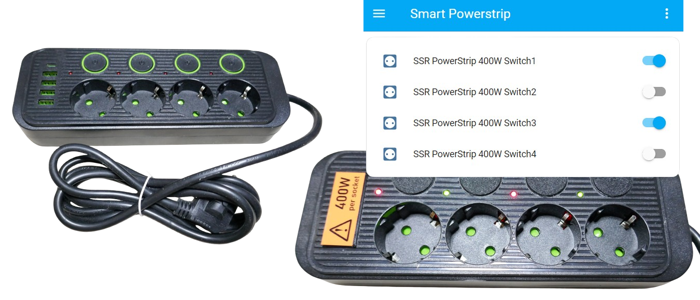


## Preparing Manual Powerstrip
Open and disassemble the powerstrip you want to use. Make sure it is a powerstrip with *individually switchable sockets*.


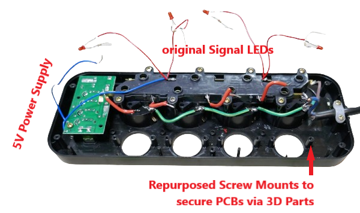


## Adding Microcontroller
For this project, I am repurposing [this ESPHome configuration](https://done.land/projects/esphome/switchesandcontrollingdevices/remotecontrolledpowerstrip/dual-gpioesphomeconfiguration), using a [ESP32-C3 Super Mini](https://done.land/components/microcontroller/families/esp/esp32/c3/c3supermini) because of its tiny footprint and low cost.

> [!NOTE]
> While it makes sense to solder all wires directly to the *ESP32-C3 board* for robustness and to further reduce space requirements, I chose to use header pins and pluggable cables so I can experiment and play with this prototype.


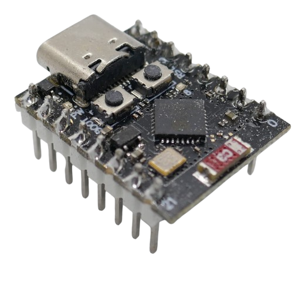

### ESPHome Configuration
The microcontroller is going to control *four sockets* and uses *two GPIOs* per switch that are *inverted* (so you can use *low level trigger* and *high level trigger* relais, and can use [bi-polar bi-color signal LEDs](https://done.land/components/light/led/signalleds/bi-colorsignals/bipolarbicolorled)).

Here is the *ESPHome configuration*:

````
esphome:
  name: powerstrip-400w-ssr-1
  friendly_name: SSR PowerStrip 400W
  platformio_options:
    board_build.f_flash: 40000000L
    board_build.flash_mode: dio
    board_build.flash_size: 4MB

esp32:
  board: esp32-c3-devkitm-1
  variant: esp32c3
  framework:
    type: arduino

# Enable logging
logger:

# Enable Home Assistant API
api:
  encryption:
    key: "xxx"

ota:
  - platform: esphome
    password: "xxx"

wifi:
  ssid: !secret wifi_ssid
  password: !secret wifi_password

  # Enable fallback hotspot (captive portal) in case wifi connection fails
  ap:
    ssid: "Powerstrip-Ssr-400W"
    password: "xxx"

captive_portal:


light:
  - platform: status_led
    name: "Status LED"
    id: esp_status_led
    icon: "mdi:alarm-light"
    pin:
      number: GPIO8
      inverted: true
    restore_mode: ALWAYS_OFF

output:
  - platform: gpio
    pin: GPIO0
    id: 'relay1'
    inverted: true
  - platform: gpio
    pin: GPIO2
    id: 'led1'
  - platform: gpio
    pin: GPIO3
    id: 'relay2'
    inverted: true
  - platform: gpio
    pin: GPIO4
    id: 'led2'
  - platform: gpio
    pin: GPIO21
    id: 'relay3'
    inverted: true
  - platform: gpio
    pin: GPIO20
    id: 'led3'
  - platform: gpio
    pin: GPIO10
    id: 'relay4'
    inverted: true
  - platform: gpio
    pin: GPIO7
    id: 'led4'
  
switch:
  - platform: output
    name: "Switch1"
    icon: "mdi:power-socket-eu"
    restore_mode: RESTORE_DEFAULT_OFF
    output: relay1
    on_turn_on:
      then: 
        - output.turn_on: led1
    on_turn_off:
      then:
        - output.turn_off: led1

  - platform: output
    name: "Switch2"
    icon: "mdi:power-socket-eu"
    restore_mode: RESTORE_DEFAULT_OFF
    output: relay2
    on_turn_on:
      then: 
        - output.turn_on: led2
    on_turn_off:
      then:
        - output.turn_off: led2
  
  - platform: output
    name: "Switch3"
    icon: "mdi:power-socket-eu"
    restore_mode: RESTORE_DEFAULT_OFF
    output: relay3
    on_turn_on:
      then: 
        - output.turn_on: led3
    on_turn_off:
      then:
        - output.turn_off: led3

  - platform: output
    name: "Switch4"
    icon: "mdi:power-socket-eu"
    restore_mode: RESTORE_DEFAULT_OFF
    output: relay4
    on_turn_on:
      then: 
        - output.turn_on: led4
    on_turn_off:
      then:
        - output.turn_off: led4
````

### Testing
Upload the *ESPHome configuration* to the microcontroller, and make sure everything works as expected - before you proceed with anything else:

* **Add to Home Assistant:** *Home Assistant* should recognize your new device once it goes online for the first time. Add it to *Home Assistant*
* **Visit Device:** In *Home Assistant*, go to *Settings/Devices&services*, click *Devices* tab, search for your device name, and check to see whether your device (and all of its entities) can be found.

    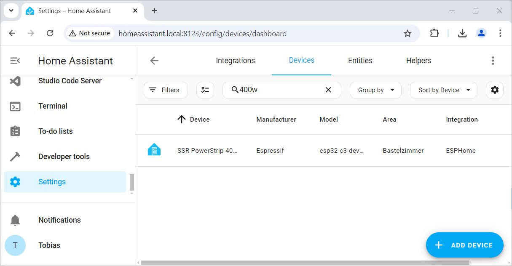

* **Test-Drive Switches:** Open the device and double-check that the *Controls* section looks like this:

    

    Even if you did not yet connect anything to the microcontroller, you can still test it: use the *Status LED* switch to turn the blue on-boad LED on and off.

Once everything works, you can disconnect the microcontroller and start mounting it in the powerstrip housing. Since the *AC*-driven *5V power supply* won't be functional until at the very end, you may want to connect the microcontroller to a powerbank via its *USB connection* so you can continuously test it while adding *LEDs* and relais boards.

> [!IMPORTANT]
> **Do not connect AC** to the powerstrip at this time. Since there are many uninsulated open contacts, that would be irresponsible and dangerous. We'll be able to do all testing with a safe *5V voltage supply* from a *USB powerbank*.

### Custom Expansion Board
Since I want to *play* with this setup and try out different components (such as different relays and signal LEDs), I created a simple *expansion board* for the *ESP32-C3 Super Mini* out of some left-over header pin sockets:


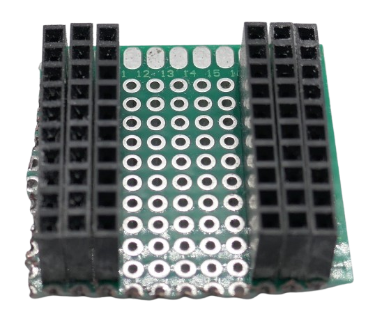

The microcontroller plugs into the inner header row:

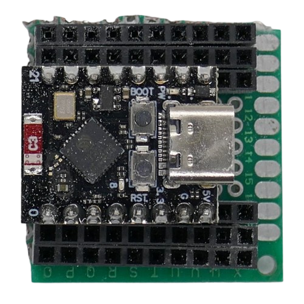

On the reverse side, I connected the headers so each microcontroller pin now has *two sockets* that I can use to connect relais trigger and/or signal LEDs:


### Mounting Microcontroller

Inside the commercial socket housing, I reuse the screw mounts that were originally holding the mechanical buttons. 

#### Mount directly
If you'd like to use the microcontroller board directly, a [3D printed part](materials/mc%20mount.stl) slides over one of the pilars of the original housing that previously secured the mechanical buttons, and can be screwed onto the pilar using the original screw:

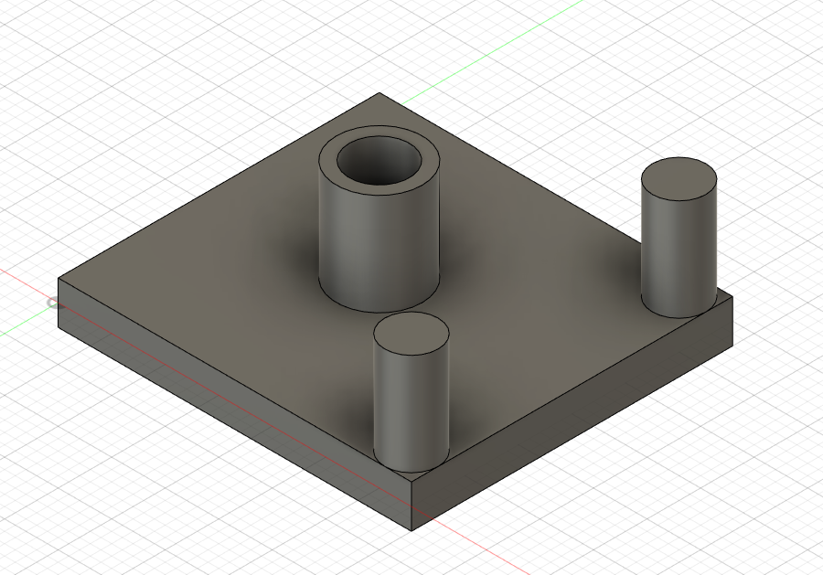

Flipped over, you see the recess for the screw that secures the part to the housing, and an *M2 hole* at one of the corners that will secure the *PCB*:

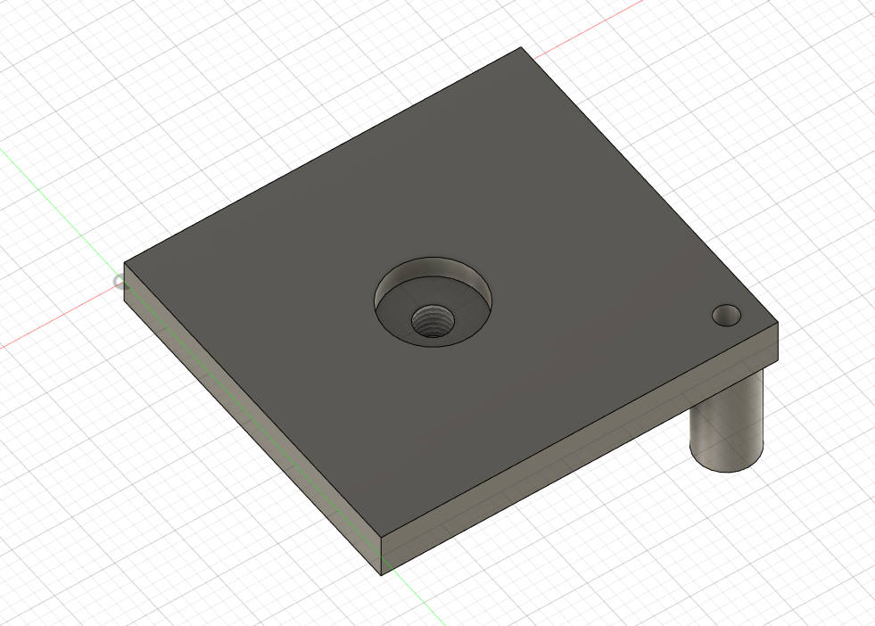

The part provides you with a *30x33mm* flat mounting area where you can i.e. use glue or strips to secure the microcontroller board directly. Use this [3D .stl file](materials/mc%20mount.stl) to slice and print the part if you like.

Slide the part over one of the screw pilars, then use the original screw to secure the part to it. Now you can glue or screw the microcontroller board onto the mounting area:

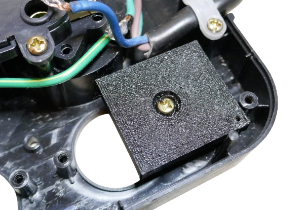

#### Mounting Expansion Board
Since I am using a fairly large *expansion board* (see above), it cannot be mounted on the mounting plate. The overall height would exceed the space constraints.

Instead, I drilled a *8mm* hole into the middle of the PCB so that it can slide onto the plastic pilar of the original housing. 


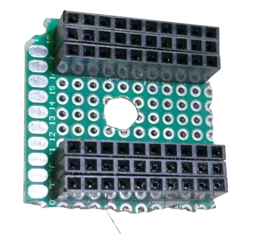

With an even smaller [3D printed part](materials/mc%20mount%20small.stl), it can then secured using the original screw:

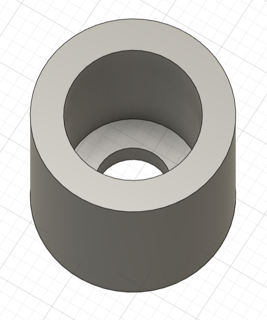

Next, slide the PCB over one of the srew pilars:

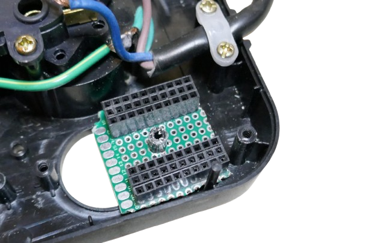

Press the *3D part* onto the pilar until the PCB cannot move anymore. Then use the original screw to tighten the cap on the pilar:


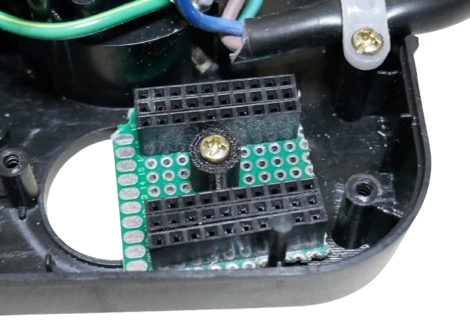

Finally, plug in the *ESP32 C3 Super Mini*. You now have plenty of headroom to use header pins and cables and still be able to close the original housing:


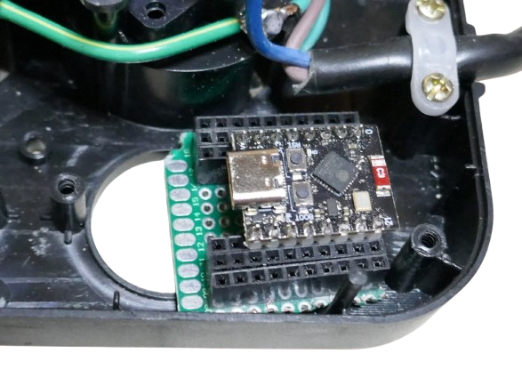


## Adding Bi-Color Signal LEDs
The original powerstrip came with simple *3mm red signal LEDs* that are directly wired to *AC power* and *on* when a particular socket was powered. You can leave them in place if that's what you want.

If you opt for more sophisticated *singal LEDs* that can signal both *on* and *off* state (in *red* and *green*), replace the existing *LED* with [3mm bi-color bi-polar LEDs](https://done.land/components/light/led/signalleds/bi-colorsignals/bipolarbicolorled) that can emit two colors, based on their polarity.

### LED Replacement
Pull out the existing *LED*, and de-solder their wires from the sockets (including their current limiting resistors).

Solder a *150R* current limiting resistor to one leg of your *bi-polar LED*. Solder two wires to the *LED* that are long enough to be connected to the microcontroller. Plug the wires into the two *GPIOs* that represent one switch, i.e. use *GPIO0* and *GPIO2* for *switch 1* (see *ESPHome configuration* above for GPIO assignments).

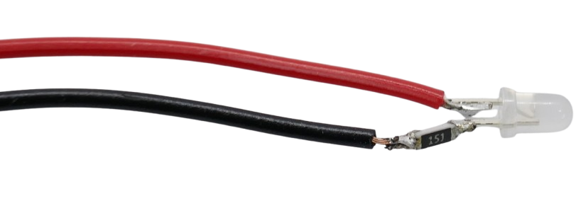

> [!TIP]
> I had a left-over reel of 150R SMD resistors and used these with the *LEDs*. It is a bit more fiddly but works well. A regular resistor is much easier to solder. Don't forget to use *shrink tube* to insulate and protect resistor and solder connections.


Once you connect the *LED* to the microcontroller, power it on using external power (i.e. a powerbank). The LED should show a *red* light. If it emits *green*, then switch over the cables (reverse LED polarity).

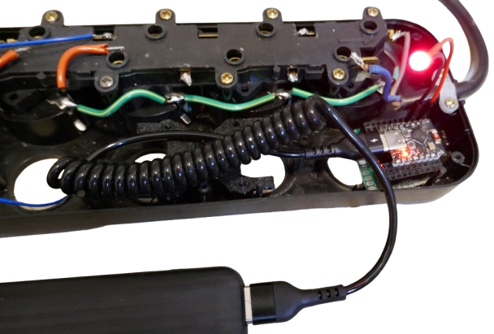


Next, go to *Home Assistant* again, and navigate to your device's *control* panel (see above). 

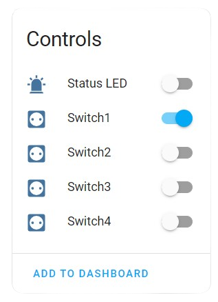

Turn *Switch 1* on. The *LED* should turn *green*. *Turn off* the switch. The *LED* should turn *red*.

Turn *on* the switch again, then remove power from the microcontroller. The *LED* is off. Now restore power. The *LED* should immediately come up with a *green* light. Thanks to the *restore mode*, each switch remembers its state.

Once all four *LED* work as expected, you can position them in the existing *3mm LED holes*, and glue them.

Now it's time to add the *relais* that do the actual *AC* switching. 

## Mounting Solid State Relais


I chose to use commonly available *DIY AC solid state relays* for this project. Both *low level* and *high level* trigger boards will work:


> [!IMPORTANT]
> These simple DIY *SSR* can only handle **light loads** of up to *440W* (*2A*). For switching some simple low current lights, that is perfect. If you need to switch larger loads, do use appropriately rated *mechanical relais* or *industrial SSR*. When using the *SSR* I used here, **clearly label** your powerstrip. You (or others) may not remember this crucial limitation when the powerstrip is in use later.

These boards come with low-quality screw terminals that are too small to use larger-diameter wire, plus the terminals waste a lot of space. That's why I decided to *remove the screw terminals* with a *hot air gun*, and solder cables directly. 


If you don't feel comfortable removing them, you could also solder your own wires directly to the solder pins on the backside of the board. If you do, you might want to use the *through-pins* of the *SSR* directly, and not use the *screw terminal pins*.

Each relay board comes with *two relais*, so *two boards* are required.

> [!TIP]
> You can get these *SSR boards* also with just *one*, or with *four* SSR relais. Since the boards need to fit into the existing smartstrip housing, using two *two-relais* boards worked best.

### Designing Relais Mount

To safely secure both boards, I designed and *3D printed* two simple holders, repurposing the screw holes that were left in the powerstrip housing from the removed mechanical buttons:


The mount is designed to be slid onto one of the screw mounts left from the mechanical switches, then secured with the screw that originally helt a mechanical switch:


You can [download the STL file](materials/ssr1_holder_4socket_smart_powerstrip.stl) if you like. This is what the *3D printer* part looks like:


### Assemble Solid State Relais

The *mount* slides onto one of the pillars that previously secured the mechanical buttons:


The fixation can then be secured to the pillar using one of the original screws. The *SSR* is then placed onto the fixation, and also secured, using two screws:


### Wiring
The *two SSR relais* breakout boards I used have two *AC outputs*, marked as *A1/B1* and *A2/B2*. 

* Connect the *blue AC wire* that comes from the outside AC wire to *A1* and *A2*.   
* Connect *B1/B2* to one socket each. You may be able to reuse the existing red cable that originally connected to a mechanical button, or replace this wire with a longer wire (just make sure it has a sufficient diameter).

* On the other (DC) side, the boards require *5V DC*, so solder two *black* and *red* wires, or use the scew terminals (if you did not remove them).   
* The relais are triggered by *CH1/CH2*. Triggering can be done with *3.3V*, so connect each *CHx* to one of the *GPIOs* you assigned to switches.

If you used the *ESPHome configuration* above, the *GPIO* assignments are as follows:

| Switch | Low Active | High Active |
| --- | --- | --- |
| Switch 1 | GPIO0 | GPIO2 |
| Switch 2 | GPIO3 | GPIO4 |
| Switch 3 | GPIO21 | GPIO20 |
| Switch 4 | GPIO10 | GPIO7 |

> [!TIP]
> *Relais can be *low active* (turned on when the GPIO is *low*) **or** *high active* (turned on when the GPIO is *high*). Since each switch has two complementary GPIOs, just pick the one that matches your relais board. 


## Power Supply
If the *commercial powerstrip* comes with a built-in *USB power supply*, you may want to use it for your microcontroller and relais. That's what I did first, too, and here are the results:


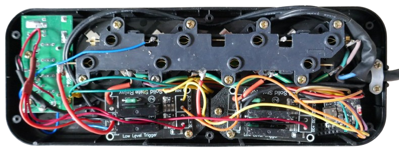

On the left side, I connected the *DC power wires* directly to the *USB C* connector of the built-in power supply:

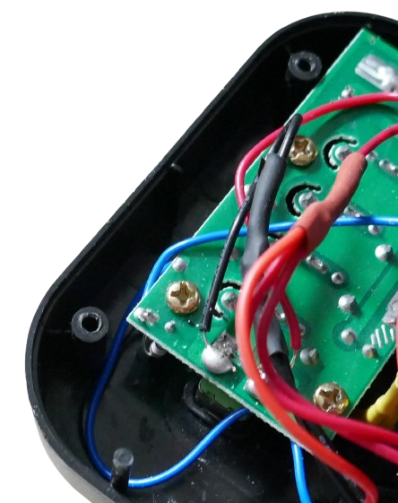

### Caveats
Using a built-in power supply of unknown origin may cause problems:

* **Overload:** when a user connects a device to the USB power supply (i.e. a phone charger), this may overload the USB power supply, causing a voltage drop significant enough for the microcontroller to *brown out* and reset.  
* **Bad Quality:** I did not anticipate the poor quality of these built-in power supplys: some of the *SSR boards* did not trigger correctly, most likely because of strong *EMI* emissions.

### Unreliable SSR Trigger
When I tested the setup using a power bank, all worked as expected. Once I powered it via the built-in power supply, strange things happened:

The microcontroller continued to work just fine, and also the bi-color signal LEDs switched color based on state alright. So that part was alright, and the supply voltages were ok, too.

However, only *one* SSR switched from *on* to *off* and vice versa. All remaining three relais were constantly *on*. So apparently, there was a problem either with the trigger voltage, or with the *SSR boards* altogether.

Since the *supply voltage* was perfectly fine, it seemed unlikely that the built-in power supply was too weak, or that the *signal LED* would draw too much current and cause a voltage drop at the *GPIO*.

#### EMI
What made me wonder was that *one* relais did work correctly - which happened to be the one with the *greatest distance* to the *USB power supply*. So apparently, *EMI* (electromagnetic interference) generated by the unshielded and rather primitively designed built-in power supply interfered with the *SSR breakout boards*.

Without further investigation, I removed the built-in USB power supply altogether. I won't need it anyway, and I definitely do not want to introduce a source of radio interference to my lab where I intend to use the *smart powerstrip*. 

Plus, now I needed the space since I had to fit in a decent quality *5V 1A* encapsulated power module from *HiLink*:

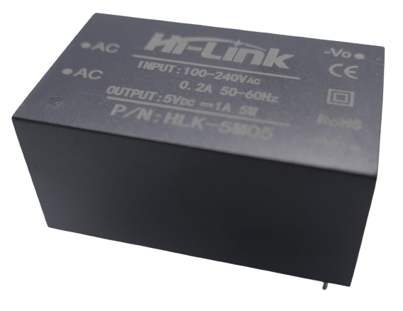


## Finalizing

When all changes have been made, and the housing is closed, there are still some holes that were originally used by the manual buttons and the *USB power supply*.

Below I provided *STL files* to *3D print* covers. You can use any type of cover. Just don't let these holes be accessible, and do not use simple card board covers: **there is dangerous AC voltage directly below. Do not let users ever touch and "explore" these holes.**

Here is the original powerstrip with all *3D printed* covers in place:


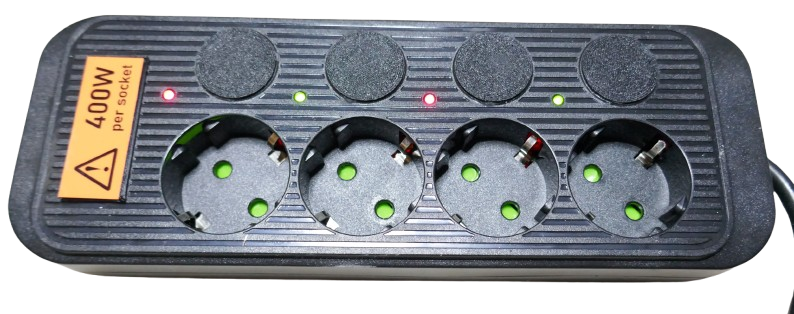


> [!IMPORTANT]
> If you (like me) used simple *solid state relais* boards, make sure you add a prominent sticker that clearly states their limitations: *440W* (*400W* as a safety margin) per socket (relais) is the **maximum power* they can switch. Do not take this light-heartedly: these *SSR* will blow in a split-second when overloaded. Use a different type of relais if you need to switch more load.


## Learning Points

It's a thrilling moment when the *idea finally materializes*, and the end result works as expected. 

Typically it is a *long way* until you get there, often much longer than anticipated. And not all of this way is always pure joy.

Here are some lessons that I learned:

* **Time:** Ideas seem *so simple*. Then they turn out to be much more complex. That's part of the learning experience, but to not get overwhelmed trying to *simplifying* projects is always a good idea. Aim get a rewarding end product within the time you have. No one likes *half finished* stuff, or revisiting projects from the past year. And once you lose the temper and rush things, the project is dead for sure. Rushing produces errors and results that break easily. So here are my back thoughts:
    * It was a great idea to use a *switchable powerstrip* to start with. Building a *smart powerstrip* out of individual sockets and *3D printed housing* can be done but takes much more time.   
    * It is debatable whether the two-color signal LEDs were worth the effort. They look awesome, yet *getting these LEDs*, adding complexity to the *ESPHome configuration*, plus a lot more wiring kept me wondering if keeping the *AC powered* built-in *signal LEDs* wouldn't have been the better approach. After all, the *smart powerstrip* will be hidden away most of the time anyway, so signal LEDs just need to signal state. The extra benefit of dual-color LEDs is esthetical at most, and adding them easily duplicated the project time.
* **Material:** When the *needed material* isn't at hand, that sucks: wires of just the *right* diameter (big enough for the currents, small enough to fit the through holes) for example. Lacking the right components (and having to improvise or working around) is taking the most time and produces the least solid results. This boils down to *better planning*: what *are* actually the parts required?
* **Soldering:** I can solder, but I *hate* it. I am just way too often missing a third arm.
    * **PCB Design:** I am finally going to look into designing my own PCBs. I tried to ignore this topic but it is just too useful to be avoided. I am definitely fed up with perfboard and having to go through all kinds of compromises
    * **Tools:** For cases where soldering is not related to *PCBs* (i.e. soldering wires or resistors to *LEDs* directly), I need better *helping hands*. The ones I have are too unprecise. They swing back and forth. I'd like to have something more rigid, with *wheels* to move the parts by the millimeter until they perfectly align. Maybe it's an *age thing*, too.


## Materials

[STL file for large microcontroller mount](materials/mc%20mount.stl): flat *30x33mm* mounting surface     
[STL file for small microcontroller mount](materials/mc%20mount%20small.stl): simple plastic cover to secure a PCB on one of the plastic pilars of the original housing     
[STL file for SSR mount](materials/ssr1_holder_4socket_smart_powerstrip.stl): mounting part to hold a *SSD breakout board*.     
[STL file for round cover](materials/cover_round.stl): round plastic cover (outer diameter *26mm*, inner diameter *24mm*) to cover the holes used by the removed mechanical buttons.   
[STL file for usbport cover](materials/cover_round.stl): if you remove the built-in USB power supply, this part covers its holes in the housing.    

> Tags: Smart Powerstrip, Home Assistant, ESPHome, Bi-Color LED, Bi-Polar LED

[Visit Page on Website](https://done.land/projects/esphome/switchesandcontrollingdevices/remotecontrolledpowerstrip/4-socketsmartpowerstrip?220724091201243010) - created 2024-08-31 - last edited 2024-09-07
