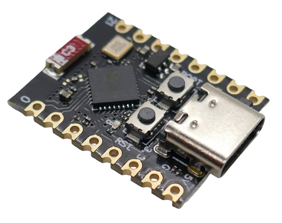
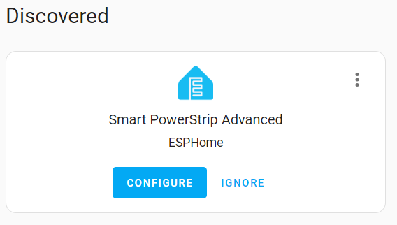
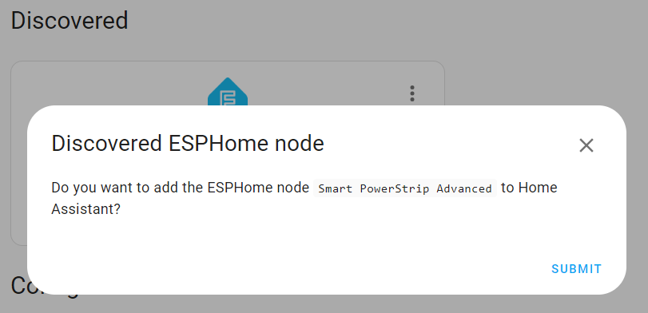
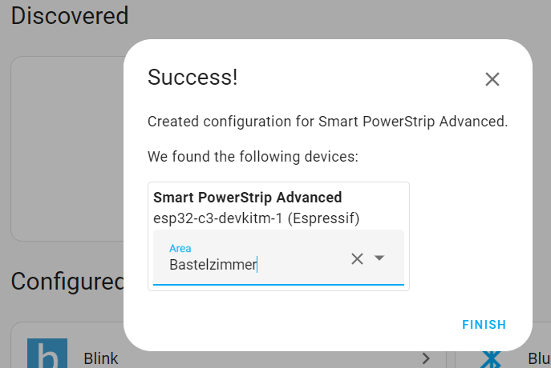
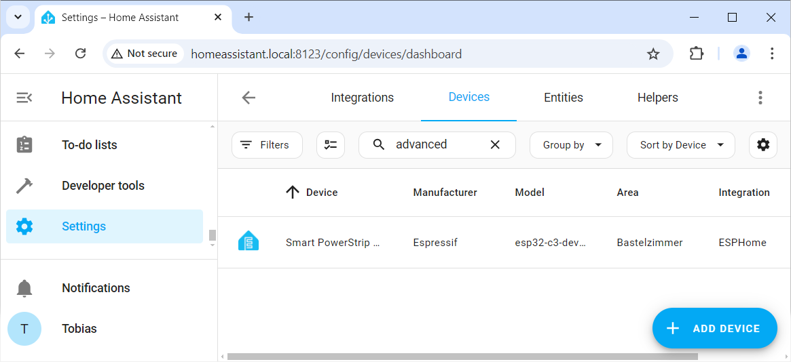
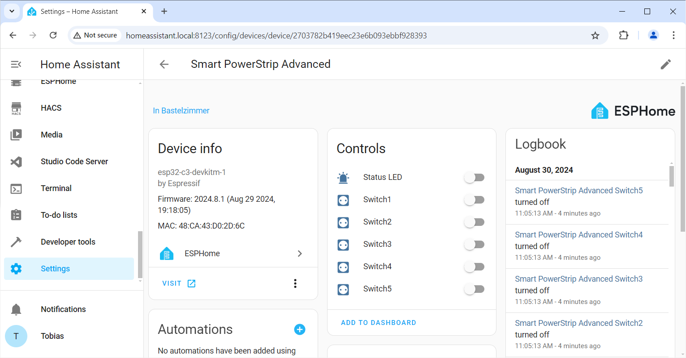
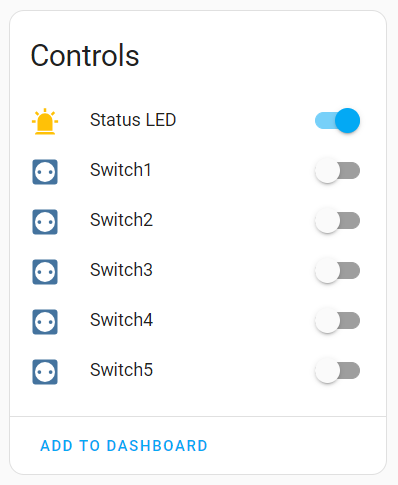
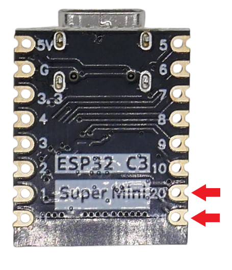
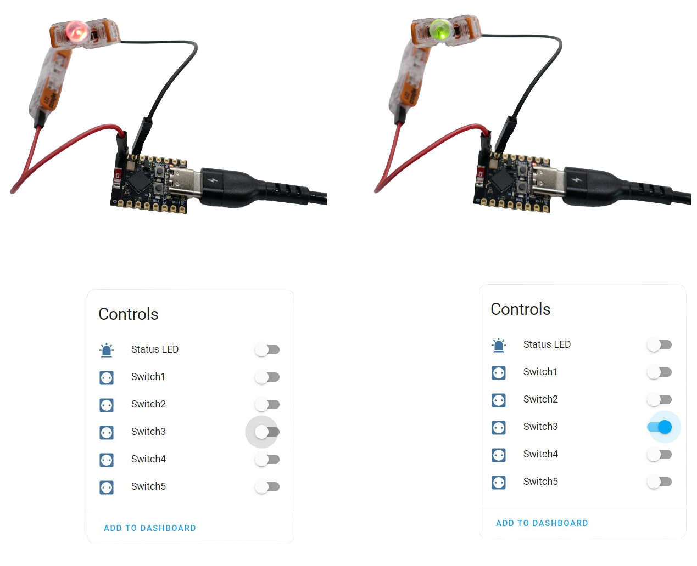

 
# Dual-GPIO ESPHome Configuration for Powerstrip

> Extremely Flexible ESPHome Configuration For A PowerStrip That Can Operate Two GPIOs Per Switch

The previously discussed [simple ESPHome configuration](https://done.land/projects/esphome/switchesandcontrollingdevices/remotecontrolledpowerstrip/simpleesphomeconfiguration) works perfectly well to switch *on* and *off* relais, and work as a *smart powerstrip*. You could even connect a simple *LED* to signal socket state.

## Highly Flexible PowerStrip Controller

In *this* article, I'll add some rather minor changes to the [previous configuration](https://done.land/projects/esphome/switchesandcontrollingdevices/remotecontrolledpowerstrip/simpleesphomeconfiguration). These changes create a highly flexible powerstrip controller that can be used with all types of *relais*,  and supports simple as well as the most sophisticated *signal LEDs*.

The *new configuration* below uses *two GPIOs* per switch that work *complementary* to each other (so when one *GPIO* is *high*, then the other one is *low*). That's all the magic that is required to provide you with a highly functional microcontroller at the heart of smart powerstrips:

* **Active Low And Active High Relais:** there are two different *relay board types* available: *active high* turn the relais *on* when the trigger pin is *high*, whereas *active low* does the opposite. Since this configuration provides both an *active high* and an *active low GPIO*, it is at your discretion what type of relais you want to useand whether you want the relais to be *on* or *off* when the switch is *on*. Simply connect the relais trigger pin to the appropriate *GPIO*.
* **Signal LED:** with two *complimentary switched GPIOs*, both capable of *sourcing* and *sinking* current, you have virtually all options available to hook up any type of *signal LEDs* (just make sure you always use a current limiting resistor as you would normally do): for example, connect a simple LED to one *GPIO* and *GND* to indicate *on* or *off* state. Or, connect two simple LEDs in reverse order to each other in order to have *one LED* signal *on* state and *the other LED* signal *off* state. You can even connect a [bi-polar bi-color status LED](https://done.land/components/light/led/signalleds/bi-colorsignals/bipolarbicolorled) directly across *both GPIOs* (while still using a current limiting resistor in series), and have this *one bi-color LED* change colors based on switch state. If you use a *three-legged bi-color LED or a four-legged RGB LED*, connect the common cathode to *GND*/the common anode to positive supply voltage, and connect either leg to one of the *GPIOs*. 


## Picking Microcontroller

I picked a [ESP32-C3 Super Mini](https://done.land/components/microcontroller/families/esp/esp32/c3/c3supermini) microcontroller for this project. I chose this microcontroller because...



* **Size:** it has a very small foot print, and since I want to squeeze it into a commercial powerstrip, a small size matters
* **GPIO:** five switches require ten *GPIOs*, and this microcontroller has ten freely usable GPIOs
* **Five Switches:** implementing *five* switches seems like a reasonable trade-off as it supports 2-, 3-, 4-, and 5-socket *powerstrips*, and may even provide a spare *switch* to use with 4-socket powerstrips that have a built-in *USB power supply*.


### Using Different Microcontroller
If you don't have a *ESP32-C3 Super Mini* at hand, you can of course use any other microcontroller that is [supported by *ESPHome*](https://done.land/tools/software/esphome/introduction/provisionnewmicrocontroller#supported-microcontrollers). 

If you do use a different microcontroller, make sure you change the microcontroller type in your *configuration*, and adjust the assigned *GPIO numbers* to those available with the microcontroller you picked. 

If your microcontroller has less than ten available GPIOs, simply reduce the number of switches, and if it has more, you can add more switches.

### ESP32-C3 Super Mini
Here is the initial part of the *ESPHome configuration* for a [ESP32-C3 Super Mini](https://done.land/components/microcontroller/families/esp/esp32/c3/c3supermini):


````
esphome:
  name: c3-supermini-test
  friendly_name: C3 SuperMini Test
  platformio_options:
    board_build.f_flash: 40000000L
    board_build.flash_mode: dio
    board_build.flash_size: 4MB

esp32:
  board: esp32-c3-devkitm-1
  variant: esp32c3
  framework:
    type: arduino
````
### Assigned Pins
The switches defined in this configuration will use all ten *freely usable GPIOs* available with the *ESP32-C3 Super Mini*:


| Switch | GPIO High | GPIO Low |
| --- | ---: | --- |
| Switch 1 | 2 | 0 |
| Switch 2 | 4 | 3 |
| Switch 3 | 20 | 21 |
| Switch 4 | 7 | 10 |
| Switch 5 | 5 | 6 |

> [!NOTE]
> *GPIO High* is the *GPIO* that goes *high* when the switch is *on* (*high active*). *GPIO Low* is the *GPIO* that goes *low* when the *same* switch is *on* (*low active*).


> [!IMPORTANT]
> If you pick a different microcontroller type, make sure you *change* the *GPIO numbers* and use the *GPIO numbers* that are freely available with the microcontroller *you* picked.

## Defining Switches

The microcontroller needs to implement *five switches*. Each switch controls *two GPIOs* and switches them complimentary to each other. So when one *GPIO* is *high*, then the other *GPIO* is *low*, and vice versa.

Here is what the *configuration* is defining to implement this behavior:

* **Status LED:** (*optional*) `light:` defines a status led and uses the built-in LED on the microcontroller board (pin 8 with the *ESP32-C3 Super Mini*, *inverted* = *low active*). This LED will later signal connectivity status and can also be manually turned *on* and *off* for diagnosis. If you pick a different microcontroller, change pin 8 to whatever pin is wired to the built-in LED on your board. Remove `inverted: true` if the LED on your board is *high active*. If your board has no built-in LED, or if you don't want a status LED, remove the section.
* **Output Pins:** `output:` defines the output pins (*GPIOs*). Note that there is always an *inverted GPIO* (`inverted: true`), and a *normal GPIO* per switch.
* **Switches:** `switch:` defines the switches. Per switch, it defines the primary *GPIO* (using `output:`), plus it defines events (`on_turn_on:`, `on_turn_off:`) to define the *secondary GPIO*. It uses `restore_mode: RESTORE_DEFAULT_OFF` to remember switch state, and if no saved state is available, the switch is *turned off* by default.


````
light:
  - platform: status_led
    name: "Status LED"
    id: esp_status_led
    icon: "mdi:alarm-light"
    pin:
      number: GPIO8
      inverted: true
    restore_mode: ALWAYS_OFF

output:
  - platform: gpio
    pin: GPIO0
    id: 'relay1'
    inverted: true
  - platform: gpio
    pin: GPIO2
    id: 'led1'
  - platform: gpio
    pin: GPIO3
    id: 'relay2'
    inverted: true
  - platform: gpio
    pin: GPIO4
    id: 'led2'
  - platform: gpio
    pin: GPIO21
    id: 'relay3'
    inverted: true
  - platform: gpio
    pin: GPIO20
    id: 'led3'
  - platform: gpio
    pin: GPIO10
    id: 'relay4'
    inverted: true
  - platform: gpio
    pin: GPIO7
    id: 'led4'
  - platform: gpio
    pin: GPIO6
    id: 'relay5'
    inverted: true
  - platform: gpio
    pin: GPIO5
    id: 'led5'
  
switch:
  - platform: output
    name: "Switch1"
    icon: "mdi:power-socket-eu"
    restore_mode: RESTORE_DEFAULT_OFF
    output: relay1
    on_turn_on:
      then: 
        - output.turn_on: led1
    on_turn_off:
      then:
        - output.turn_off: led1

  - platform: output
    name: "Switch2"
    icon: "mdi:power-socket-eu"
    restore_mode: RESTORE_DEFAULT_OFF
    output: relay2
    on_turn_on:
      then: 
        - output.turn_on: led2
    on_turn_off:
      then:
        - output.turn_off: led2
  
  - platform: output
    name: "Switch3"
    icon: "mdi:power-socket-eu"
    restore_mode: RESTORE_DEFAULT_OFF
    output: relay3
    on_turn_on:
      then: 
        - output.turn_on: led3
    on_turn_off:
      then:
        - output.turn_off: led3

  - platform: output
    name: "Switch4"
    icon: "mdi:power-socket-eu"
    restore_mode: RESTORE_DEFAULT_OFF
    output: relay4
    on_turn_on:
      then: 
        - output.turn_on: led4
    on_turn_off:
      then:
        - output.turn_off: led4

  - platform: output
    name: "Switch5"
    icon: "mdi:power-socket-eu"
    restore_mode: RESTORE_DEFAULT_OFF
    output: relay5
    on_turn_on:
      then: 
        - output.turn_on: led5
    on_turn_off:
      then:
        - output.turn_off: led5
````

> [!NOTE]
> It would be so much easier if *ESPHome* allowed `output:` to have more than one value, or to allow more than one `output:`. However, as of now this is not the case. That is why the configuration resorts to using the mentioned events in order to address an additional *GPIO*. I am sure there are many other workarounds to achieve the same, and maybe you feel inclined to leave a comment with your favorite solution.


## Test Driving Microcontroller
Do not connect any components to your microcontroller yet. First, test the *configuration* on a naked microcontroller. So go ahead and [install](https://done.land/tools/software/esphome/introduction/provisioningdirectly) the *configuration* to your microcontroller. 

1. Connect the microcontroller via *USB* to the computer running *ESPHome* (i.e. a *Raspberry Pi*), then [install the configuration](https://done.land/tools/software/esphome/introduction/editconfiguration). Once the new firmware is uploaded and the microcontroller has rebooted, *Home Assistant* [auto-detects your new device](https://done.land/tools/software/esphome/introduction/addtohomeassistant) and notifies you in its sidebar. 


    


2. Click *CONFIGURE*, and in the next dialog, click *SUBMIT*. 


    

3. You can then assign a location to the device. When done, click *FINISH*. The microcontroller is now added to *Home Assistant*. 

    


4. Now is the time to go and grab a coffee. Give *Home Assistant* a few minutes to *fully import* your new *ESPHome device*. If you continue right away, the device (and its entities like the *switches*) may not be ready yet, so they might be still missing, or are incomplete. It takes a few minutes for the import to be fully completed.

    

5. To verify that the configuration worked (and *after* you waited a few minutes), in the *Home Assistant* side bar, click *Settings*, then *Devices&Services*, then on the top of the window, click the tab *Devices*. Enter the *name* of your device (the name you used in the *configuration*). Double-click the device.

    

6. You now see the device details. In *Device info*, you see the microcontroller type you used. *Controls* lists the controls your microcontroller implements. This should be the *Status LED*, plus five switches. And *Logbook* shows the *history*: it logs when you turn switches *on* and *off*.

> [!NOTE]
> The section *Controls* will be used next to actually test-drive your microcontroller. If this section does not look like in the image above, and you are not seeing one *Status LED* and five switches, then you may have to wait a few minutes for *Home Assistant* to fully import your new device. If controls are *still* missing after waiting, carefully review your configuration and all the steps taken, and look for error messages you may have overlooked.

### Testing Switches

You are now ready to test your microcontrollers' functionality.


#### Testing Status LED
Start with a simple test, and toggle the *Status LED*. This should switch the *blue on-board LED* on the microcontroller board *on* and *off*. At the same time, whenever you change the state of one of the controls, the section *Logbook* records your action.



#### Testing Switch
Once this works, switch *on* the switch labeled *Switch 3*. This switch uses pins *20* and *21* which are conveniently located at one of the microcontrollers' edges:



Connect a *multimeter* to these two pins, and set it to a voltage range of at least *5V*. The *multimeter* should now show the *supply voltage* (i.e. *3.3V*). When you turn *off* the switch, the *multimeter* **still** shows the supply voltage, but with *reversed polarity* (i.e. **-***3.3V*).

 


Additional tests:

* Connect one lead of the *multimeter* to pin 20, and the other one to *GND*. You now get either *supply voltage* or *0V*, based on switch state.
* Connect one lead of the *multimeter* to pin 21, and the other one to *GND*. You now *again* get either *supply voltage* or *0V*, based on switch state - but *this time* in **reversed order** compared to the other pin.
* Connect a *bi-polar bi-color LED* to pin 20 (if you have one at hand). Connect a *330R* current limiting resistor to the other LED leg, and connect the other end of the resistor to pin 21 (effectively powering the LED from both pins). The led should change color, based on switch state (because across both pins, there is always supply voltage, but with reversed polarity based on switch state).


## Next Steps
Once you tested the configuration, and all works fine,  you can now connect your relais *trigger line* to **one** of the two *GPIOs* per switch. 

Which *GPIO* you choose depends on the type of *relais logic*, and how you want the relais to behave. With a *low active* relais, connect it to the *GPIO Low* pin (see the table above for the pin assignments). 

If you'd like the relais to be *off* when the switch is *on*, or if you are using a *high active* relais, take the other *GPIO*.

> Tags: Powerstrip, EspHome, Configuration, Switch, Multiple GPIO, High Active, Low Active, Bi-Polar LED

[Visit Page on Website](https://done.land/projects/esphome/switchesandcontrollingdevices/remotecontrolledpowerstrip/dual-gpioesphomeconfiguration?529530081829243258) - created 2024-08-28 - last edited 2024-08-28
