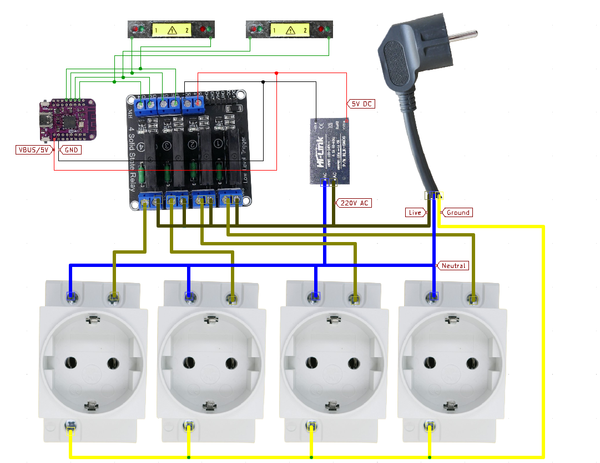
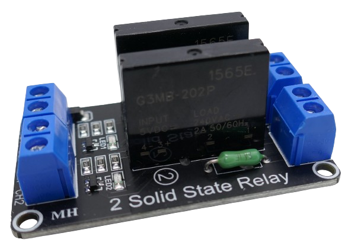
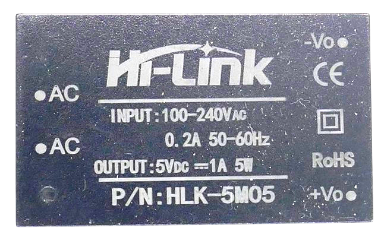

 
# Remote Controlled Powerstrip

> Creating A PowerStrip That Can Be Controlled By EspHome And Home Assistant

In this project, I am creating a *Remote Control Powerstrip*, implemented as an [ESPHome device](https://done.land/tools/software/esphome) which integrates with [Home Assistant](https://done.land/tools/software/homeassistant).

The story behind this project...
 

Controlling *AC Devices* remotely can be a lot of fun and is very convenient, especially when you need to control devices in a lab (oscilloscope, soldering iron, fan, various lights and magnifying lights, 3d printer, filament heater, usb and bench power supplies, computer monitor, you name it...) or other hobby environment: 

Rather than searching for power buttons (often in inconvenient locations), simply turn devices on or off via  smartphone app, or create physical dashboards with all important power buttons snug together in one place.

### Tuya Smart Plugs
When I started this, I used *Tuya WiFi Smart Plugs* that can be controlled via smartphone apps like *Tuya* or *SmartLife*.

### Home Assistant and ESPHome
That worked well, however I did not like the smartphone apps, so I integrated them into *Home Assistant*. That also worked amazingly well. Now I was able to build my own *dashboards*.

Since *Home Assistant* and *ESPHome* can beautifully team up, I also built some physical dashboards with real buttons, so I now was able to conveniently control all my electrical devices from one place.

This is where this story could find its *happy end*, and there would have been no need to start this project.

However, while working with the solution above, I started to experience its *issues* and *shortcomings*.

### Randomly Going Offline

At first, some of the *Tuya smart plugs* occasionally and randomly started to go offline, requiring me to *again* climb behind devices and manually toggle the *smart plug*.

I searched and investigated but never found a solid reason for this odd behavior. When I temporarily cut power to the smart plugs, they started to respond again. Waiting for a while would also magically solve the problem. Both was no option though.

> [!NOTE]
> This issue wasn't terribly limiting nor did it occur with a lot of plugs, or regularly. Still, it made me wonder how reliable this approach was.

### Interference On Close Distance

I then noticed that the plugs affected were always the same. Many plugs never exposed this odd behavior and worked rock-solid. 

Replacing the affected plugs did not change much. I then noticed though that the affected plugs were always located in close proximity to other *smart plugs* (a few of them in a *power strip* for example).

Apparently, these devices aren't properly shielded and may interfere with each other when used very close together.

At this point, I was almost ready to skip using *power strips*, and place the *smart plugs* further away from each other.

### Cloud-Dependent

Then we had a temporary *Internet outage* which made me realize the hard way how the *Home Assistant Tuya integration* really works: it uses exclusively the *Tuya Cloud API*, so when the *Internet* is down, so are all smart plugs. 

That's unfortunate because the official *Tuya* and *SmartLife* smartphone apps continue to work even without *Internet connectivity*. They use the *local fallback API* (that is also used by the *Tuya Local* integration).

*Internet outages* aren't very common in our region, and in this unlikely event I could always fall back to using the official smartphone apps, so again there was a workaround available. However, the issues and workarounds required seemed to add up, and this experience left me wondering *what else* might happen to the *cloud backend* that could mess up my setup.

The answer came a few weeks later when the *Tuya integration* did not load correctly and required a *new authentication*. 

> [!NOTE]
> When you start using the *Home Assistant Tuya Integration*, it asks you to *authenticate* it with your *Tuya* or *SmartLife* app. Basically, it requests an *API key*. By design, this needs to be done only once and doesn't differ from other web services.   

Only, I wasn't able to re-authenticate: no matter how often I tried, the error message kept coming back, and I realized that there really isn't any good logging which would enable users like me to better understand what's going on and who is causing the issue. 

As it turns out, I wasn't the only one affected, and the culprit was with a hickup at the *Tuya Cloud servers*. The (surprisingly approachable) *Tuya technical support* worked on it and increased server capacity, and since then the issue never came back. However, this only intensified the feeling that with my current solution, I was trusting a lot of things to work that were beyond my control: Internet connection, Tuya cloud, local interference, and bugs and shortcomings in the still relatively fresh *Tuya integration*.

### Power Consumption

One of the reasons why I started using *smart plugs* all over the place was to get a better understanding of power consumption: these awesome little *smart plugs* come with a quite good *power monitor*. The results have been surprising, and I was able to identify a few power hogs (for example our beloved but 15 years old big refrigerator). 

Monitoring power consumption backfired at the *smart plugs* though: it turned out that they consume a few watts themselves. They are pretty efficient, taking only *1-2W*, but with a lot of these plugs deployed, it adds up. Even more so since these plugs use *simple and cheap mechanical relais* that are renown for being *rugged* and *dependable*, but also *power hungry*.

So I started wondering whether it is really smart to operate one dedicated microcontroller per plug. If I wanted to control multiple devices in close proximity anyway, why not just take *one* microcontroller and have it control a bunch of devices? While at it, why not using *power-efficient* and *noise-free* solid state relais (*SSR*)?

### The Project

This project was born: one *ESP32* - running on *ESPHome firmware* - controls a number of *AC sockets* via *solid state relais*. This should address and solve all my issues:

* **No cloud:** *ESPHome* is a completely *local* solution under my full control. No outages when the *Internet* is down or the *Cloud service* has hickups. Plus, since requests are not routed via a *cloud service* anymore, the response times with *ESPHome* and direct communications should be much faster.

> [!NOTE]
> Response times with *Tuya* can be momentarily, but can also take up to a few seconds. This seems to be random and beyond user control, probably depending more on how the *cloud service* is queuing requests coming in from  the entire world.

* **No interference:** Since I am using just one microcontroller, there is no pile up of unshielded and cheap microcontrollers in close proximity anymore. 
* **Power-efficient:** I need to run just one *microcontroller*, and triggering an *SSD* relais takes just a few *mA*.

Disclaimer and Safety Warnings
 

Handling AC currents can be extremely dangerous. Improper handling can result in serious injury or death. Ensure all safety precautions are taken and consult with a professional.

#### Using Insulated Housing
Always consider that not *just you* but **anyone** may be exposed to your device: kids, cleaning personnel, colleagues, family members. 

Temporary setups are *not ok* for anything exposing *live AC currents*. 

Always keep your prototypes *disconnected from AC* when not under your direct supervision **until you enclose the electrical components within an insulated housing**, ensuring all connections are secure and no live parts are exposed. Double-check the installation to make sure the housing is properly sealed and provides full coverage. Ensure there are no gaps that could expose wires or connections.

#### Disclaimer
The information provided in this article is for educational and informational purposes only. The author and publisher are not responsible for any injuries, damages, or losses resulting from the use or misuse of the information provided. Working with electricity is inherently dangerous and should only be performed by qualified professionals. Always follow proper safety procedures and consult a licensed electrician before attempting any electrical work.

#### Safety Guidelines
- Always turn off the power at the main circuit breaker before starting any electrical work.
- Use insulated tools and wear rubber-soled shoes to reduce the risk of electrical shock.
- Never work on electrical systems in wet or damp conditions.
- Verify that the power is off using a reliable voltage tester or multimeter.
- Do not touch live wires or components with bare hands.
- If unsure about any procedure, consult a licensed electrician.

## Overview

You can build a *remote control powerstrip* in many different ways, and in this article you learn about the required components and your individual options and variations.

The fundamental concept looks like this:

Let's take a closer look at the parts (and the options you have):

### Microcontroller

Since this power strip is supposed to be remotely controllable via *ESPHome* and *Home Assistant*, it requires a *WiFi-enabled microcontroller*. You need a microcontroller that is [supported by ESPHome](https://done.land/tools/software/esphome/introduction/provisionnewmicrocontroller#supported-microcontrollers) and that has at least *four available output GPIOs* (for a *four-socket-powerstrip*; one *GPIO* per socket).

Almost all *Espressif microcontrollers* will work, yet if space is constrained, here is a quick comparison of sizes for three suitable and popular *ESP32*-family members: *ESP32-C3 Supermini*, *ESP32-S2 Mini*, and *ESP32 DevKit*:

 
Here is what I did:

* **Prototyping:** I used a *ESP32 DevKitC V4* as there are handy *expansion boards* available for it that make prototyping a breeze. 
* **Production:** in the real thing - the *powerstrip* I use in every-day life - I went with the much smaller [ESP32-S2 Mini](https://done.land/components/microcontroller/families/esp/esp32/s2/s2mini) and [ESP32-C3 Super Mini](https://done.land/components/signalprocessing/microcontroller/families/esp/esp32/c3/c3supermini): the *S2 Mini* is exceptionally *flat* and can be slid into even the smallest gap, whereas the *C3 Super Mini* has the smallest surface area. Both provide more than enough *GPIOs*.

### Relays
Switching needs to be performed by an *electrical switch* (so the *GPIO* can control it): you need one *relay* per socket. 

For *small loads* (below *400W*), the small *solid state relay (SSR) boards* such as *G3MB-202P* are great. They come with *one*, *two*, *four*, or more relais,  can be triggered directly via *GPIOs*, work with *3.3V* triggers (while requiring *5V* supply voltage), and are cheap. As *SSR*, they are also completely noise-free and require no flyback diode.

> [!CAUTION]
> Use these *SSR* only if you can *ascertain* that your *powerstrip* will **never** be used with loads greater than *400W* (per socket), or else you will blow the *SSR*. So if you just want to switch a few lamps, they are fine. If you want to control *heaters*, *printers*, or large *screens*, do *not* use them.

When you need to switch higher loads, either use *mechanical relais* that are often rated for *10A* or *16A*.

> [!CAUTION]
> When using a mechanical relais, make sure it has a *flyback diode* that takes care of high voltage spikes when the relais turns off and its magnetic field collapses. Also make sure your *5V power supply* provides enough current. Mechanical relais require much more current to operate than *SSR*.

Or, use industrial *DA* (*dc trigger-ac load*) SSR relais which are available in almost any strength:

> [!CAUTION]
> Legit industrial SSR are costly. If you get these for cheap, divide their ratings by factor 4. Fake SSR typically use thyristors rated for half the claimed load, and might catch fire when used close to their claimed maximum ratings. A *40A SSR* from doubtful origin can typically be safely used for up to *10A loads* (entirely your own risk, the only safe way to find out is disassembling the SSR and looking at its internal parts). Note also that SSR switching loads of more than 1-2A **require a heat sink**.

### Power Supply
The *powerstrip* is controlled by a microcontroller, so you need an energy-efficient and safe way to supply *5V DC*. 

> [!TIP]
> Do not look into *3.3V* power supplies because typically, the *SSR* and *mechanical relais* require a *5V power supply* (the trigger signal can be *3.3V*). 

The safest way is adding completely shielded AC power modules like the ones from *Hi-Link*. 

* **PM01:** when I used *solid state relais*, I picked the *PM01* which provides *600mA* at *5V*

    

* **5M05:** when using *mechanical relais*, more power is required, and I chose the slightly larger *5M05* which can deliver up to *1000mA*:

    

### Sockets

If you want to design your *powerstrip* completely yourself, and i.e. *3D print* your own housing, you can use sockets that can be latched into your housing.

Or, you use *DIN rail plugs* which can be slid onto a *aluminum DIN rail*. This rail then can be safely screwed to the bottom of your housing.

Probably one of the safest, easiest and most economical approaches is to purchase a power strip with individually switchable sockets, then use this as a base, and replace the physical switches with relays.

### Signal LEDs
If the power strip is going to be located inaccessibly under a table or behind a chair, then *signal leds* won't be much benefit, and you can omit them. 

> [!TIP]
> If you use *mechanical relais*, their *click* sound may be enough of audible feedback, and you may not need the additional complexity of signal LEDs.

If you'd like to add *signal LEDs*, you have a few options:

* **Single LED:** you can drive a single classic LED off each *GPIO*. Then you'd see a signal when a particular socket is powered, else the LED is off. This is closest to how signal LEDs work in sockets with mechanical switches.

    

* **Two LEDs:** only marginally more complex is the use of *two* simple and classic signal LED, just in reverse direction to each other. In this case, one LED would light up when the socket is *on* (as previously), and the other LED (in a different color) would light up when the socket is *off*. [Here is an example](https://done.land/components/light/led/signalleds/bi-colorsignals/twoseparateled).
* **Bi-Color LEDs:** if you would like to have just *one* LED that can display *two* colors (maybe there is just one *LED* hole in the powerstrip you are enhancing, and you don't want to drill another one), then you can either use [bi-polar LED](https://done.land/components/light/led/signalleds/bi-colorsignals/bipolarbicolorled) with *two legs* that are used in opposite polarity, or you use a *bi-color LED* with *three* legs and a common anode or cathode. In all of these cases, you'd now need *two GPIOs* per socket (unless you want to add complex hardware to solve the reversal of voltage in hardware).

> Tags: Plug, Smart Plug, Home Assistant, ESPHome

[Visit Page on Website](https://done.land/projects/esphome/switchesandcontrollingdevices/remotecontrolledpowerstrip?349454081302245855) - created 2024-08-01 - last edited 2024-08-01
