 
# Repurposing Powerstrip

> Taking Apart Switchable Powerstrip And Prepare For Adding Smart Microcontroller 

Individually switchable powerstrips are a great start for building a *smart Home Assistant-compatible powerstrip* that can be remotely controlled via an *ESPHome microcontroller*.

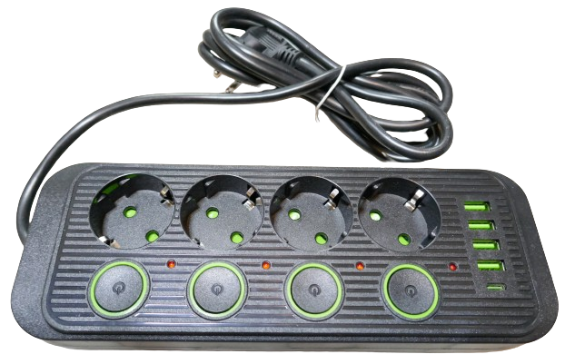

Some Initial Remarks...
    

When building a DIY *smart powerstrip*, never forget that you are dealing with *dangerous AC voltages* and potentially *high currents*. 

### Save Work And Add Safety

Building such a powerstrip completely from scratch in a safe manner can be a challenge, and costly, too:

* **Housing:** you need to construct and *3D print* a suitable housing. If you don't invest good time, it will most likely look ugly and may not have the stability required.
* **Sockets:** you need to purchase sockets that can latch into your housing. Such sockets are quite costly.
* **Accessoires:** don't forget that you'll need a *power cord* and wires of sufficient diameter.

By purchasing a commercial powerstrip **with individual mechanical switches per socket**, you get great material to start with: you get a ready-to-use powerstrip with all wiring, typically in a nice-looking housing. All that's left for you to do is to replace the mechanical switches with *relays*, and fit your microcontroller and a *5V power supply* into the housing. 

> [!TIP]
> If the powerstrip you purchased has a *USB power supply* built-in (like the one pictured above), you can even save the power supply for your microcontroller.

### Where To Get?
*Powerstrips* with individually switchable sockets aren't as available as regular powerstrips but you can get them at places like *AliExpress*. Quite a lot of different designs are available. 

Ordering *powerstrips* from untrusted overseas sources may not be recommended if you planned to use the powerstrip *as-is* - quality and safety of such components doesn't always meet local standards. However, since you are going to open and repurpose the powerstrip anyway, you will have plenty of chances to review the build quality and make improvements where necessary. 

The risk is low: powerstrips like the one pictured above was available for less than €6. Another advantage of powerstrips ordered from China is that they can be easily opened. Regular philips screws hold them together (whereas Western manufacturers typically make it very hard to open up their housings by either using specialized screws, or by molding the parts together in the first place).

## Opening And Exploring

Most powerstrips from *China* use very basic components and can be easily opened using a philips screw driver. The one I used here is held together by six screws that are accessible from the backside.

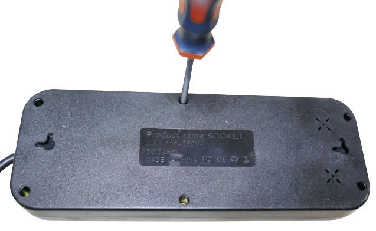

### Understanding Design
Once you removed the screws, you can examine its internal design: 

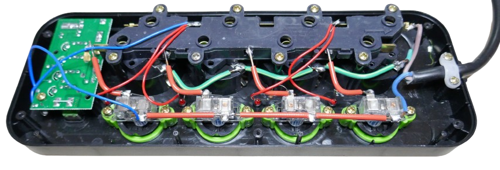

#### Good Component Quality
This design is actually very straight-forward and perfect for adding *smart switching capabilities*:

* **Neutral:** the *neutral AC line* (brown) is connected to one continuous metal strip that supplies voltage to one side of each socket.
* **Live:** the *live AC line* (*blue*) is connected to a *mechanical switch*, and from there it is distributed to all other switches. The other side of each switch is connected to the remaining side of the respective socket. So each switch just needs to be replaced by a *relais*.
* **Ground:** the *ground line* (*yellow-green*) is connected to all ground contacts of all sockets.
* **Signal LED:** there is a *red LED* for each socket, located next to each switch. The *LED* is simply wired to both poles of each socket, using a simple *current limiting resistor*. You can keep this *LED* (if you want to continue to have a simple indicator LED), or replace it with a more sophisticated indicator LED (i.e. a *bi-polar bi-color LED*).
* **USB Power Supply:** the powerstrip I picked came with a *USB power supply*. It is connected to *AC* using two thin *blue wires* and cannot be switched off. You can either keep it connected *as-is*, make it *switchable* as well, or repurpose it to power your microcontroller - in which case you might want to remove access from outside to not overload it. 

#### Bad Assembly Quality
When you look at the *assembly quality* of some of the *AC cables*, it becomes clear why it is generally *not recommended* to use cheap Chinese powerstrips out of the box for an end user:

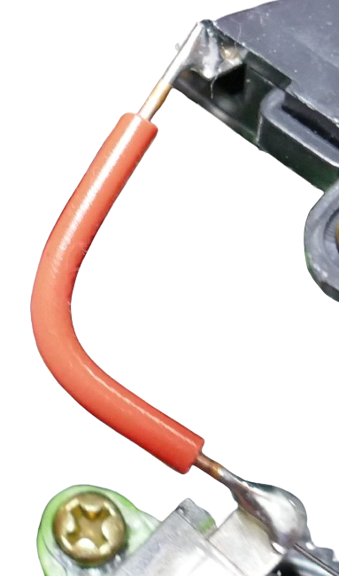

Some of the solder joints are not directly connected to the metal and just bridged by solder. Keep in mind that this powerstrip is rated at *2400W*. If you ever were to use this claimed maximum, and connected some beefy heaters to this powerstrip, most likely such joints would just heat up and melt away.

Fortunately, for *DIY projects*, the component quality is all that matters, and bad solder joints can be fixed.

## Removing Unwanted Parts

Since the sockets are going to be controlled by a microcontroller, the bulky mechanical switches are not needed and can be removed, providing extra room for the new components. 

De-solder the wires that are connected to the switches, and unscrew the buttons.

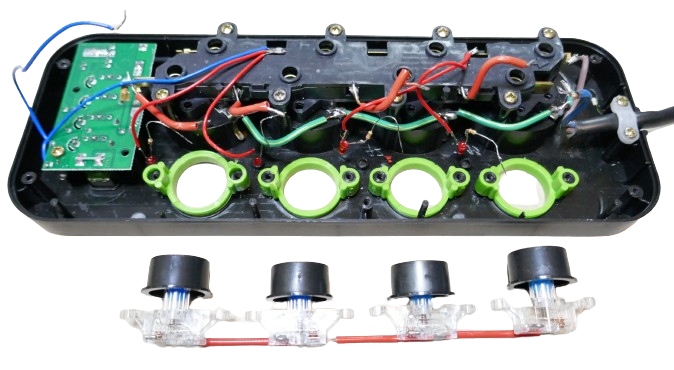

### Examining Inlays And Openings

The particular powerstrip I used has neon-green inlays that hold the buttons. These inlays can simply be taken out:

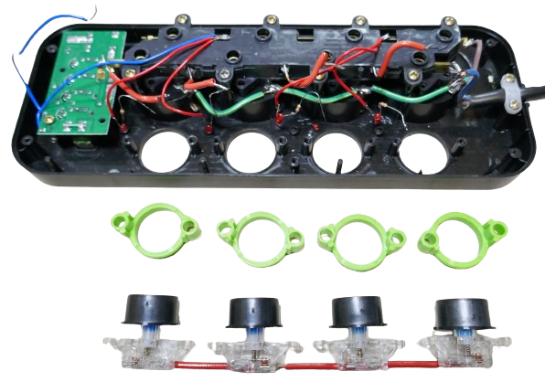

This design is great because it makes it very easy to *3D design* similar inlays as part of a structure that can be plugged into the openings. It turned out that each inlay has a diameter of *24mm* and uses two *M3 screws* with a distance of *30mm*.

It shouldn't be hard to *3D design* a suitable replacement, and the fact that simple *M3 screws* can be used to secure it is a welcome benefit.

### Stripping Unwanted Parts
The *built-in signal LEDs* might be useful: they light up when a socket is powered. Connecting *LEDs* directly to *AC* isn't the most recommended design, but it works and is simple.

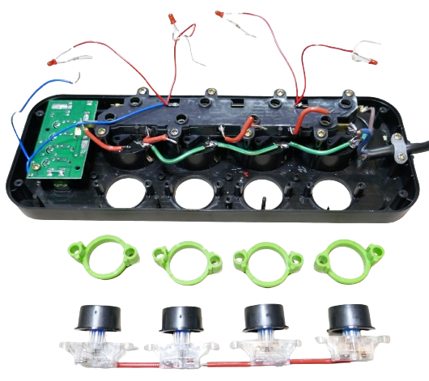

Why connecting LEDs directly to AC shpuldn't work (and still does)
    

Connecting a *LED* to *220V AC* is not the recommended way, however it can work, and it is cheap. 

There are two problems: 

* **Reverse Breakdown Voltage:** *LEDs* have a very low *reverse breakdown voltage* of around *5-30V*. Any voltage exceeding this that is "going the wrong direction" will destroy the *LED*. Obviously, *220V* **is** exceeding this limit, and *AC* **is** sending voltage the "wrong way" every half wave.
* **Heat:** Since the *LED* requires only a fraction of the energy available, a *current limiting resistor* would need to convert the rest to heat. A lot of heat.

The simple signal *LED* works fine nevertheless because a *very high* current limiting resistor is used, i.e. *200kOhm*. This limits the current to roughly *1.5mA*. Many *LEDs* can tolerate such low currents when applied "in the wrong direction", and they still emit enough light when applied "in the right direction". The *50Hz* flicker isn't visible to the human eye.

If you decide to implement a *safer* or *more sophisticated* concept for your signal *LEDs*, pull out the *LEDs* and de-solder their wires.

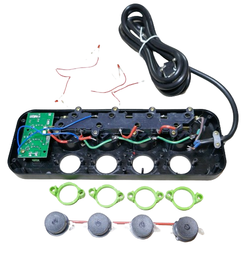

## USB Power Supply

The *powerstrip* comes with a built-in *USB Power Supply* that is connected to *AC* via two thin blue wires.

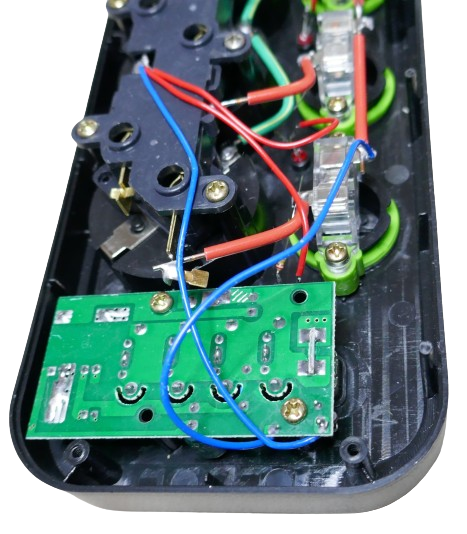

Here are a few options:

* **Remove:** unscrew and remove the board to get more space. That's especially useful if you need to use larger *relays*.
* **Keep:** leave as-is, and use a constantly powered *USB supply*
* **Make Switchable:** add a relay to one of the blue power cables, and make the USB supply remotely switchable. This can in fact be a great idea if you would like to remotely control USB devices.
* **Combined Use:** share the *USB power supply* with the *end users* and your microcontroller, and run your microcontroller off it while keeping the ability to also connect external USB devices.
* **Repurpose:** Remove the ability for end-users to plug in USB devices, and use the *5V* from this board *exclusively* as a *dedicated* power supply for your microcontroller. 

### Power Microcontroller And Relais

It would be absolutely convenient to power the microcontroller and relais off the *USB power supply* found in the powerstrip - saving a dedicated *AC/5V converter* plus the space it requires.

To check whether this *USB power supply* is at all capable of running your components, you need to know what the maximum power consumption of your *smart electronics* is that you want to fit into the powerstrip.

> [!TIP]
> What matters is the *absolute maximum peak current* that your components may draw in the worst circumstance. If the maximum current that the power supply can deliver is exceeded only for a very short time, i.e. because of a *WiFi burst the microcontroller sends out while enabling all four relais*, then this would result in an immediate voltage drop which in turn would *brown-out* your microcontroller.

#### Microcontroller
Here are *peak* currents for some popular microcontrollers:

| Microcontroller | Peak Currents (WiFi Transmit, mA) |
| --- | --- |
| ESP32S | 300 |
| ESP32-C3 | 200 |
| ESP32-S2 | 290 |
| ESP8266 | 300 |

> [!NOTE]
> The old single-core *ESP8266* requires roughly as much energy as the more modern dual core *ESP32S*. The even more modern single core *ESP32-C3* however is much more efficient.

#### Relais
The *type* of relais affects power consumption considerably:

* A *solid state relay* requires around *15mA*, and with four sockets, this adds up to *60mA*.
* A *mechanical relay* requires hefty *100mA*, summing up to *400mA* for four sockets.

#### Overall Peak Consumption

You have considerable options to fine tune energy consumption. Depending on the **microcontroller type** and the **type of relays** you pick, overall power consumption for a four-socket powerstrip varies between *300mA* and *800mA* (including 15% safety margin):

* **Efficient (300mA):** *ESP32-C3* and *solid state relays*
* **Inefficient (800mA):** *ESP8266* and *mechanical relays*

### Available USB Power

For the powerstrip used, its USB power supply is rated at *2.1A* at *5V*. This would leave *1.3A* for end users, and you could be intreagued to run your microcontroller/relais off it **and also** enable the end user to charge devices.

Here are two caveats to consider:

* **Overload:** if you keep public access to the *USB power supply*, then you always run the risk that end users overload it, cause a shortcut, or whatnot, effectively *browning out* or shutting down your microcontroller. So if you want public access to the *USB power supply*, use a different and dedicated power supply for your microcontroller/relays.
* **False Specs:** if you plan to use the internal *USB power supply* to power your microcontroller/relays, do not trust the vendor specifications. They are often wrong or imprecise (maybe you can draw up to *2.1A*, but for how long?). Always take a look at the hardware, test it, and judge for yourself. Else, use a dedicated *AC/5V* power supply from trusted sources to power your mission critical components.

### Examining USB Power Hardware
This is the *USB power supply board* found in the powerstrip:

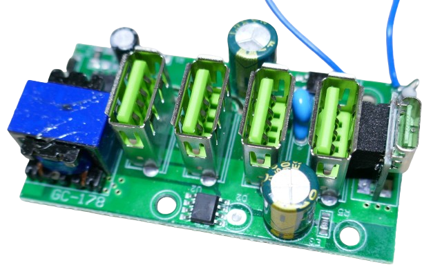

#### Circuit Analysis
It comes with four *USB-A* and one *USB-C* port. All five *USB port* are connected to each other, so there is just one power supply for all ports.

There are two chips identifyable on the board with hardly readable markings. One is a *MT6704* with a logo:

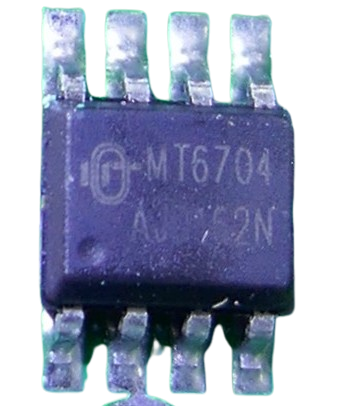

The other one is a *PL3369*:

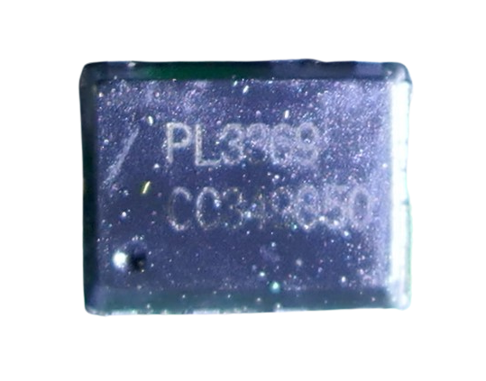

Both are unknown to me, so from looking at the components, it seems impossible to verify the vendors' claims of *2.1A* at *5V*.

#### Testing True Peak Current
This leaves *testing* as only remaining option. For this, an [electronic load](https://done.land/tools/devices/electronicload) is needed to simulate varying loads:

* Connect the electronic load to the *USB output*. The *USB-C* connector has two easily accessible solder pads, or you simply use a *USB cable*, plug it in, and connect its other end to the *electronic load*. Just make sure you use a cable capable of handling the test currents, and you connect the USB output in correct polarity: some *electronic loads* cannot handle reverse polarity.
* Next, connect the *USB power supply board* to *AC power* using the two blue wires. Obviously, take great care. *AC power* is dangerous and can kill.
* The electronic load now shows the output voltage of *5V*. 
* Switch the load to *constant current* (*CC*) mode, set an initial current of *200mA*, and enable the load. The *electronic load* now acts as a load, drawing exactly the specified current.
* Now increase the constant current gradually up to the claimed maximum of *2.1A*. Should the voltage break in (drop considerably below *5V*), or if the power supply shuts off unexpectedly, then the true maximum current was exceeded.

#### Testing True Sustainable Current
Once you know the true maximum **peak** current (that the supply can handle for a *short* period of time), you need to determine the *sustainable* maximum load that can be drawn for a long period of time. For this, you need to define a *maximum temperature* you want the board to *not exceed*. This temperature is somewhat arbitrary. It is the highest temperature that you want to allow inside the powerstrip.

> [!TIP]
> It is not unusual for power supplies to reach temperatures up to 100C and more. This does not mean that such temperatures are *your* safe limit. I wouldn't want the internals of my powerstrip to ever get hotter than 70C.

Keep drawing the *peak* maximum current, and closely monitor the *PCB* and its components with an *infrared camera*. It tells you the temperatures and hot spots.

When temperatures rise above your threshold temperature, lower the current until the temperature starts to drop. Adjust the constant current to the sweet spot where the component temperature stabilizes at your temperature threshold. Continue to draw this current for an hour, and verify that the temperature is stable. 

This is the maximum sustainable current the board can deliver.
 

> Tags: Powerstrip, Repurposing

