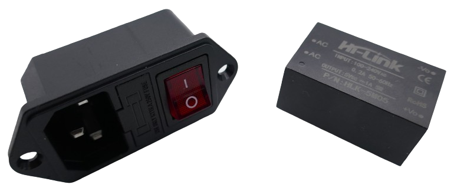
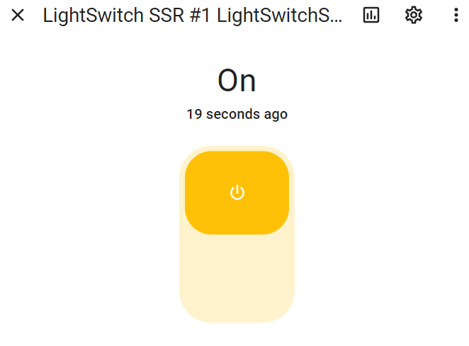

 
# SSD-based Switch Box

> Controlling AC-Devices Wirelessly With SSD Relais

In this project, I am building a *ESPHome device* that can control six *AC devices*.


<details><summary>The story behind this project...</summary><br/>


Controlling *AC Devices* remotely can be a lot of fun and is very convenient, especially when you need to control devices in a lab (oscilloscope, soldering iron, fan, various lights and magnifying lights, 3d printer, filament heater, usb and bench power supplies, computer monitor, you name it...): 

Rather than searching for power buttons (often in inconvenient locations), simply turn devices on or off via  smartphone app, or create physical dashboards with all important power buttons snug together in one place.

### Tuya Smart Plugs
When I started this, I used *Tuya WiFi Smart Plugs* that can be controlled via smartphone apps like *Tuya* or *SmartLife*.


### Home Assistant and ESPHome
That worked well, however I did not like the smartphone apps, so I integrated them into *Home Assistant*. That also worked amazingly well. Now I was able to build my own *dashboards*.


Since *Home Assistant* and *ESPHome* can beautifully team up, I also built some physical dashboards with real buttons, so I now was able to conveniently control all my electrical devices from one place.

This is where this story could find its *happy end*, and there would have been no need to start this project.

However, while working with the solution above, I started to experience its *issues* and *shortcomings*.

### Randomly Going Offline

At first, some of the *Tuya smart plugs* occasionally and randomly started to go offline, requiring me to *again* climb behind devices and manually toggle the *smart plug*.

I searched and investigated but never found a solid reason for this odd behavior. When I temporarily cut power to the smart plugs, they started to respond again. Waiting for a while would also magically solve the problem. Both was no option though.


> [!NOTE]
> This issue wasn't terribly limiting nor did it occur with a lot of plugs, or regularly. Still, it made me wonder how reliable this approach was.

### Interference On Close Distance

I then noticed that the plugs affected were always the same. Many plugs never exposed this odd behavior and worked rock-solid. 

Replacing the affected plugs did not change much. I then noticed though that the affected plugs were always located in close proximity to other *smart plugs* (a few of them in a *power strip* for example).

Apparently, these devices aren't properly shielded and may interfere with each other when used very close together.

At this point, I was almost ready to skip using *power strips*, and place the *smart plugs* further away from each other.


### Cloud-Dependent

Then we had a temporary *Internet outage* which made me realize the hard way how the *Home Assistant Tuya integration* really works: it uses exclusively the *Tuya Cloud API*, so when the *Internet* is down, so are all smart plugs. 

That's unfortunate because the official *Tuya* and *SmartLife* smartphone apps continue to work even without *Internet connectivity*. They use the *local fallback API* (that is also used by the *Tuya Local* integration).

*Internet outages* aren't very common in our region, and in this unlikely event I could always fall back to using the official smartphone apps, so again there was a workaround available. However, the issues and workarounds required seemed to add up, and this experience left me wondering *what else* might happen to the *cloud backend* that could mess up my setup.

The answer came a few weeks later when the *Tuya integration* did not load correctly and required a *new authentication*. 

> [!NOTE]
> When you start using the *Home Assistant Tuya Integration*, it asks you to *authenticate* it with your *Tuya* or *SmartLife* app. Basically, it requests an *API key*. By design, this needs to be done only once and doesn't differ from other web services.   

Only, I wasn't able to re-authenticate: no matter how often I tried, the error message kept coming back, and I realized that there really isn't any good logging which would enable users like me to better understand what's going on and who is causing the issue. 

As it turns out, I wasn't the only one affected, and the culprit was with a hickup at the *Tuya Cloud servers*. The (surprisingly approachable) *Tuya technical support* worked on it and increased server capacity, and since then the issue never came back. However, this only intensified the feeling that with my current solution, I was trusting a lot of things to work that were beyond my control: Internet connection, Tuya cloud, local interference, and bugs and shortcomings in the still relatively fresh *Tuya integration*.

### Power Consumption

One of the reasons why I started using *smart plugs* all over the place was to get a better understanding of power consumption: these awesome little *smart plugs* come with a quite good *power monitor*. The results have been surprising, and I was able to identify a few power hogs (for example our beloved but 15 years old big refrigerator). 

Monitoring power consumption backfired at the *smart plugs* though: it turned out that they consume a few watts themselves. They are pretty efficient, taking only *1-2W*, but with a lot of these plugs deployed, it adds up. Even more so since these plugs use *simple and cheap mechanical relais* that are renown for being *rugged* and *dependable*, but also *power hungry*.

So I started wondering whether it is really smart to operate one dedicated microcontroller per plug. If I wanted to control multiple devices in close proximity anyway, why not just take *one* microcontroller and have it control a bunch of devices? While at it, why not using *power-efficient* and *noise-free* solid state relais (*SSR*)?

### The Project

This project was born: one *ESP32* - running on *ESPHome firmware* - controls a number of *AC sockets* via *solid state relais*. This should address and solve all my issues:


* **No cloud:** *ESPHome* is a completely *local* solution under my full control. No outages when the *Internet* is down or the *Cloud service* has hickups. Plus, since requests are not routed via a *cloud service* anymore, the response times with *ESPHome* and direct communications should be much faster.

> [!NOTE]
> Response times with *Tuya* can be momentarily, but can also take up to a few seconds. This seems to be random and beyond user control, probably depending more on how the *cloud service* is queuing requests coming in from  the entire world.

* **No interference:** Since I am using just one microcontroller, there is no pile up of unshielded and cheap microcontrollers in close proximity anymore. 
* **Power-efficient:** I need to run just one *microcontroller*, and triggering an *SSD* relais takes just a few *mA*.


</details>


<details><summary>Disclaimer and Safety Warnings</summary><br/>

Handling AC currents can be extremely dangerous. Improper handling can result in serious injury or death. Ensure all safety precautions are taken and consult with a professional.

#### Using Insulated Housing
Always consider that not *just you* but **anyone** may be exposed to your device: kids, cleaning personnel, colleagues, family members. 

Temporary setups are *not ok* for anything exposing *live AC currents*. 

Always keep your prototypes *disconnected from AC* when not under your direct supervision **until you enclose the electrical components within an insulated housing**, ensuring all connections are secure and no live parts are exposed. Double-check the installation to make sure the housing is properly sealed and provides full coverage. Ensure there are no gaps that could expose wires or connections.


#### Disclaimer
The information provided in this article is for educational and informational purposes only. The author and publisher are not responsible for any injuries, damages, or losses resulting from the use or misuse of the information provided. Working with electricity is inherently dangerous and should only be performed by qualified professionals. Always follow proper safety procedures and consult a licensed electrician before attempting any electrical work.


#### Safety Guidelines
- Always turn off the power at the main circuit breaker before starting any electrical work.
- Use insulated tools and wear rubber-soled shoes to reduce the risk of electrical shock.
- Never work on electrical systems in wet or damp conditions.
- Verify that the power is off using a reliable voltage tester or multimeter.
- Do not touch live wires or components with bare hands.
- If unsure about any procedure, consult a licensed electrician.


</details>

## Overview

This is the parts list for this project:

* **Microcontroller:** For prototyping and testing, I am using a *ESP32 DevKitC V4* as there are *expansion boards* available for it that make prototyping a breeze. For production, I am using a *ESP32 S2 Mini* due to its much smaller foot print. Both microcontrollers come with *WiFi capabilities* and provide sufficient general purpose *GPIO*.


* **Solid State Relais:** For my particular use case, I am using three *G3MB-202P solid state relais* on a break board with *two SSR each*. These boards are small, can be triggered directly via *GPIOs*, work with *3.3V*, and are cheap. Their drawback is the relatively low switching capacity of just *2A* (*440W*). Since I need to switch just low-current devices like lamps, small power supplies, and computer screens, that's a good match. These boards are available with two, four, and even six *SSR relais*, and it would have been a better choice to select the version with six *SSR*. The ones I had at hand had just two *SSR*, so I took three of these.


> [!TIP]
> You can easily swap the relais with *stronger SSR* if your loads require more current. Or you can fall back to using classic mechanical relais. Swapping relais types does not change the circuitry or concepts in any significant way. Just make sure you understand their voltage and current requirements. Mechanical relais for example cannot be driven directly by a *GPIO pin*, and you will need a *flyback diode* to protect your microcontroller.   

* **Power Supply:** I decided to add a dedicated *5V 1A* power supply that is fed by *AC*. This way, the box requires just a *220V AC* plug and no additional *USB connector*. For safety reasons, I chose a *Hi-Link HLK-5M05* module.



* **Sockets:** I wanted the six devices to be separately attachable, so I used *six generic 220V AC sockets* that I would be able to plug into the housing.


* **LEDs:** I wanted to add a simple *visual clue* that indicates whether a given socket is powered or not. Of course, that's optional. I used two generic *LED* (one green, one red) plus appropriate resistors *per socket*. With six sockets, that sums up to six green and six red *LED*.


* **Housing:** I designed a simple *housing* in *Fusion360* and exported the parts as *stl-files* for *3d Printing*.


## ESPHome Configuration

The microcontroller controls six switches that in turn switch six *GPIOs*. This makes the *ESPHome configuration* very simple:

````
switch:
  - platform: gpio
    pin: GPIO4
    name: "LightSwitchSSR1"
    inverted: true

  - platform: gpio
    pin: GPIO13
    name: "LightSwitchSSR2"
    inverted: true

  - platform: gpio
    pin: GPIO14
    name: "LightSwitchSSR3"
    inverted: true

  - platform: gpio
    pin: GPIO16
    name: "LightSwitchSSR4"
    inverted: true

  - platform: gpio
    pin: GPIO17
    name: "LightSwitchSSR5"
    inverted: true

  - platform: gpio
    pin: GPIO20
    name: "LightSwitchSSR6"
    inverted: true
````

> [!TIP]
> If you are not familiar with *ESPHome* and don't know what a *configuration* is, you may want to head over to this [ESPHome Introduction](https://done.land/tools/software/esphome/introduction). In a nutshell, a *configuration* is the *programming* of your microcontroller, and as you see, with *ESPHome* there is no complex *C++ code*. You simply *describe* how you wired up your hardware - done.

### Adjustments

You may want to adjust this *configuration* in three places:

* **GPIO:** I chose the *general purpose GPIOs* that are available with *ESP32* microcontrollers. If you are using a different microcontroller, adjust the *GPIOs* to the ones that can be used with your microcontroller.
* **Inverted:** The *solid state relais* I use are *low level trigger*: to turn them *on*, the *GPIO signal* must be *low* (*high* turns them off). With *inverted: true* I ask *ESPHome* to pull the *GPIO low* when the switch is *on*, and vice versa. If you are using a *high level trigger* relais, simply remove this line for each *GPIO*.
* **Name:** Obviously, you can name your entities as you wish. The name you pick will later (in *Home Assistant*) become the default name for the switch. You can also rename it later.


## Test Driving Microcontroller

Do not connect any components to your microcontroller. Power it up with its *USB connection*, then [install the configuration](https://done.land/tools/software/esphome/introduction/editconfiguration) to your microcontroller.

Once the new firmware is uploaded and the microcontroller has rebooted, *Home Assistant* [auto-detects your new device](https://done.land/tools/software/esphome/introduction/addtohomeassistant). Make sure you approve adding your new device to *Home Assistant* when asked.

Once done, it is now time to go and grab a coffee. Give *Home Assistant* a few minutes to *fully import* your new *ESPHome device*.

> [!IMPORTANT]
> If you start working right away with a freshly imported device in *Home Assistant*, it is not ready yet, and its *entities* may be missing, or are incomplete. It takes a few minutes for the import to be fully completed.


### Creating Test Environment

Before connecting any component or hardware to your microcontroller, first test its basic functionality, and set up a *test dashboard*.

1. In *Home Assistant*, go to *Settings*, then *Devices & services*. On the *Integrations* tab, click *ESPHome*. You now see all of your imported *ESPHome devices*.

    

2. Identify your device (mine is called *LightSwitch SSR #1*), and verify the number of *entities* reported below its name. There should be *7 entities*. If there is just one, you may have to wait a few more minutes for *Home Assistant* to fully import your device.

    

3. Click on *7 entities*. You now see all seven *entities* and their *unique ID names*. Six of them represent the six switches you defined in your *configuration*. The seventh entity is added by default and can update the microcontroller firmware.

    

4. Next, [add a new dashboard](https://done.land/tools/software/esphome/introduction/usingdashboards) in *Home Assistant*, and add the six entities that represent your six switches to the dashboard. You may rename your dashboards' default name *HOME* to something better. I called my dashboard *TestSwitch*. Your dashboard is easily accessible via the *Home Assistant sidebar* on the left side of the *Home Assistant screen*.

    

### Testing Switch Logic
You now have a great test environment where you can change any of the switches and verify the results:

* Slide a switch to see if it stays that way. When it slides back after a moment, then your microcontroller may be offline or not reachable.
* Click on the icon in front of a switch. This opens a larger version of the switch control that tells you when this switch was changed the last time. Play with the switches, and verify that the logging works as expected.

    

### Testing Logic Levels
Once that works, it's now time to test the actual *GPIOs* on your microcontroller.


Hook up a multimeter to one of the *GPIOs* you assigned to a switch, and to *GND*.

> [!IMPORTANT]
> Make sure you set your multimeter to a voltage range that can handle *5V* **before you connect the multimeter** to a *GPIO*. **Always disconnect** the multimeter before you turn it off again. Else, it may get **destroyed**: when you try and move its knob to **OFF**, it may switch to lower voltage ranges first (before it eventually reaches the **OFF** position). When the measured input signal is *high*, the *ADC* in cheap multimeters will be irreversibly damaged.

The multimeter should show either *0V* (*low*) or something close to *3.3V* (*high*). When you change the switch in your test dashboard that is associated with the *GPIO* you measure, the voltage should change.

If you used *inverted: true* in your *configuration*, the *GPIO* should show be *low* (and the multimeter should show *0V*) when the switch is **turned ON**.

Test this for all six *GPIOs* to make sure your logic works as intended.

> [!TIP]
> Verify that the *GPIO logic level* matches the logic level your *relais* requires. If the logic levels are mixed up, remove *inverted: true* from your configuration.

## Indicator LED
To indicate whether a socket is powered or not, *two LED* are used. When the socket is powered, a *green LED* is *on*, else a *red LED*.

### Schematics

In order to keep the effort minimal, both *LED* should be controlled by the *same GPIO* that also controls the *SSR*. Here is the schematic:


And here's a quick refresher on *LEDs* and where to find their *cathode* (**-**) and *anode* (**+**):


### Description

The *LEDs* used in this project require approximately *10mA* to light up. At *3.3V*, this requires a current limiting resistor of *90 ohms* for the *green LED*, and *130 ohms* for the *red LED*:

````powershell
PS> Get-LedResistor -Current 10 -OperatingVoltage 3.3 -Color red, green


Required Resistor (Ohm) : 130
Operating Voltage (V)   : 3.3
Led Current (mA)        : 10
Led Voltage (V)         : 2
Led Color               : red

Required Resistor (Ohm) : 90
Operating Voltage (V)   : 3.3
Led Current (mA)        : 10
Led Voltage (V)         : 2.4
Led Color               : green

WARNING: LED Forward Voltage was guessed from color and can be completely different. Use at own risk.
````

The *GPIO* is either *high* (supplying *VDD*) or *low* (connected to *GND*).

* **Low:** When the *GPIO* is *low*, the **green** *LED* is on. Its *anode* (**+**) is connected to the positive voltage supply.
* **High:** When the *GPIO* is *high*, then the *green LED* is *off* (because being a *diode*, it cannot conduct power in this direction). Instead, the **red** *LED* turns on: its *cathode* (**-**) is connected to *GND*.

> [!IMPORTANT]
> Make up your mind *which LED* should turn on *when*. The circuit cannot be changed later. Since I am using a *low level trigger* board, the *solid state relais* is *on* when the *GPIO* is *low*. Accordingly, the **green** *LED* will be *on* when the outlet has power. If you want it the other way around, or if you want to use a *high level trigger* board, simply flip both *LEDs* and their resistors.


### Testing
Let's first test the schematics. For this, connect *3.3V* and *GND* to the rails of your breadboard. 

Then, connect one of the *GPIOs* that you use in your configuration (i.e. *GPIO4*) to both the *cathode* of the *green LED* and the *anode* of the *red LED*.


Connect the *90 ohms* resistor to the *anode* of your *green LED*, and connect the other end of the resistor to *3.3V*.

Likewise, connect the *130 ohms* resistor to the *cathode* of your *red LED*, and connect the other end of the resistor to *GND*.

Now, when you change the switch in your *Home Assistant* dashboard that represents the *GPIO* you wired up, the *LEDs* should indicate the current switch status.

## Creating Signal LED Panels

For a *smart power strip* with *four sockets*, we need *four LED pairs*. I decided to keep it modular by placing two LED pairs on one perfboard. Make sure you place the *green* and the *red LED* in opposite orientation onto the perfboard:


Next, ensure that both LED align with the perfboard and are not tilted:


Finally, bend the LED legs all the way to the sides so the LEDs are fixed and won't slide out when you solder them to the perfboard.


### Adding Resistors

Identify the side of the LEDs that will be connected to the *GPIO*: that's the *cathode* (shorter leg) of the *green LED* and the *anode* (longer leg) of the *red LED*.

On the *opposite* side of the *LEDs*, solder the *resistors* to the *LEDs*:


Do this on both sides.


Then trim off the legs of the *LEDs*. Do **Not** trim off any part of the resistors.

### Wires For GPIOs

Connect the other end of each *LED pair* with a wire, connecting the *red led anode* and the *green led cathode*. This provides you with two wires that later can be connected to the two *GPIOs* that you want to monitor.

### Wires For Plus And Minus

Connect the two resistors that come from the *red LEDs* somewhere in the middle of the perfboard. Where the resistors connect will be the place where you later connect *GND*.

Do the same with the two resistors that come from the *green LEDs*: where these connect will later be the supply point for *3.3V*.

> [!IMPORTANT]
> Since the wires will cross over each other at some point, you may want to put the resistors that come from the *green LEDs* in red *heat shrink*. Note how one resistor is covered in heat shrink in the picture below:


Finally, add the power supply cables: connect a *red wire* to the junction point of the two *green LED resistors*, and add a *black wire* to the junction point where the two *red LED resistors* connect:


### Testing

Once you have finished the perfboard, you can perform a first test: connect *3.3V* and *GND* to your red and black wire. Next, connect one of the *GPIO wires* to *GND*, then to *3.3V*. The appropriate LED should turn on.

When that works, it's time to add the perfboard to your test setup: connect two wires to two of the GPIOs you use in this project (i.e. GPIO13 and GPIO14).


Connect the perfboard cables for *3.3V* and *GND* to your breadboard power rail, then connect the two *GPIO wires* to the two GPIOs.

The two *LED pairs* on your perfboard should immediately start to signal the *GPIO state*, and when you go to your *Home Assistant test dashboard* and change the switches, then the *LEDs* on your perfboard should reflect these changes.

When this works for you, it is now time to add the *solid state relais*.


> Tags: Plug, Smart Plug, Home Assistant, ESPHome

[Visit Page on Website](https://done.land/projects/esphome/switchesandcontrollingdevices/ssd-basedswitchbox/plugs?349454081302245855) - created 2024-08-01 - last edited 2024-08-01
