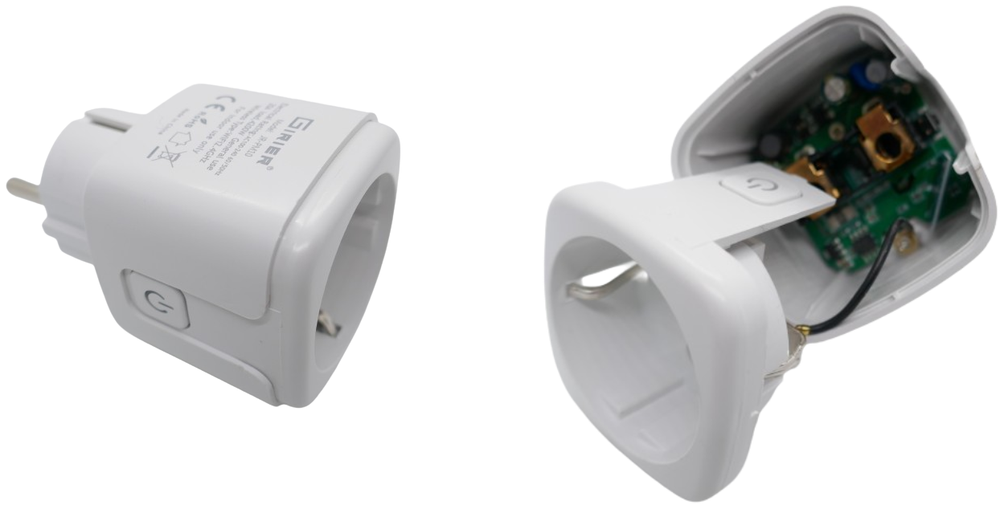
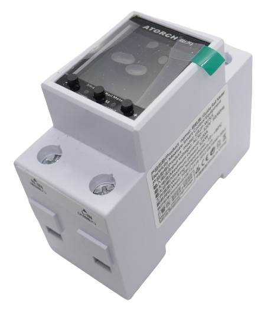
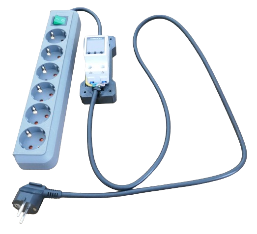
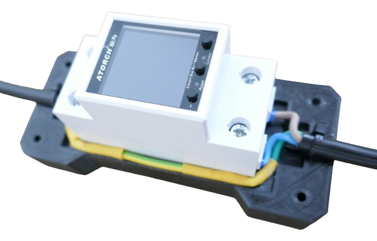
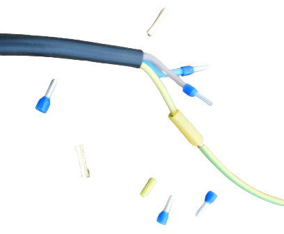
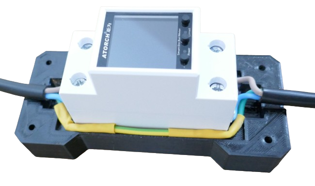
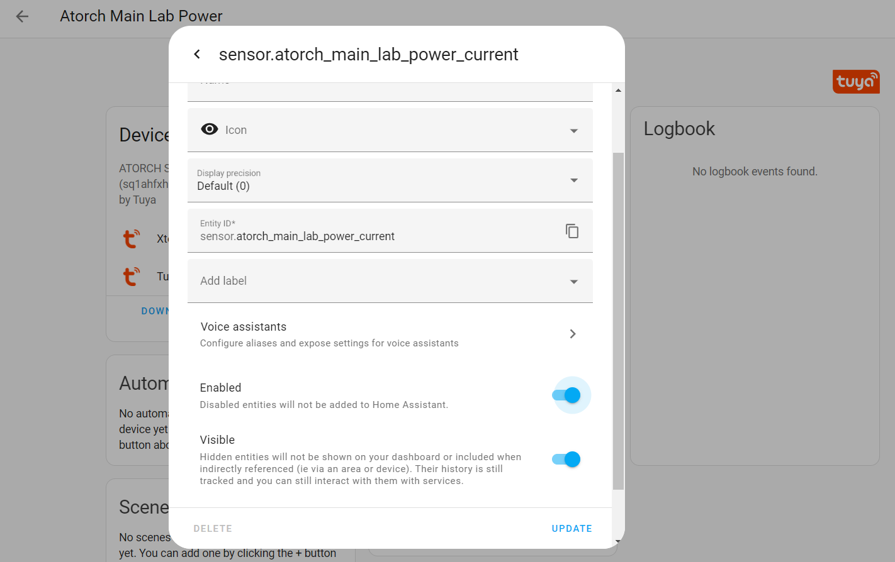
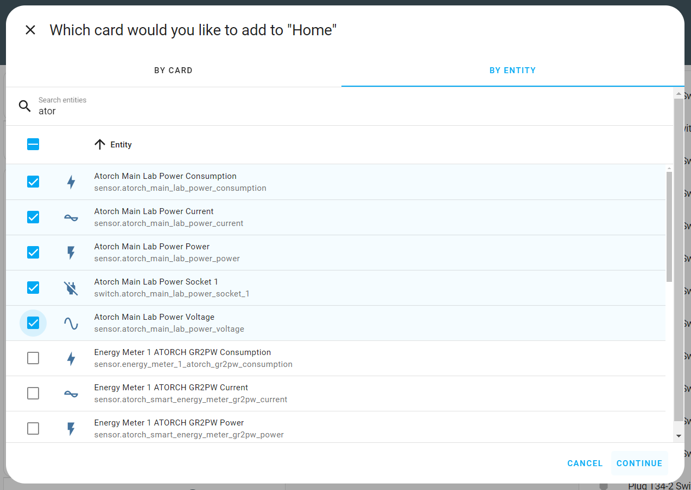
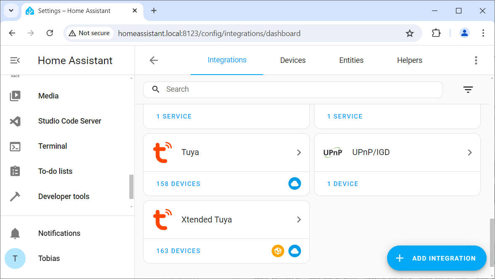
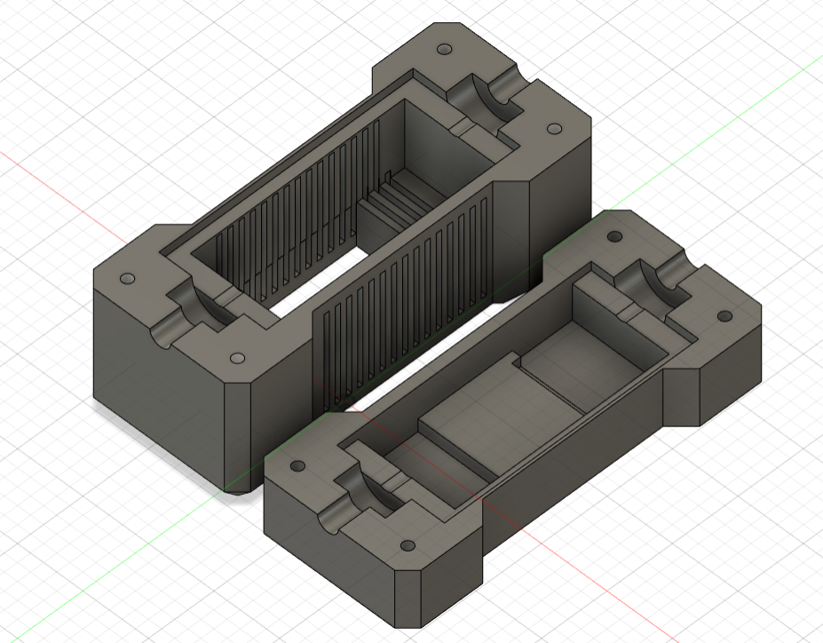

 
# Secure AC Power

> Monitoring Power Consumption And Securing Lab When Away From Home

This article involves *dangerous AC currents*. Working with AC currents requires utmost caution and expertise. 

Disclaimer and Safety Warnings
 

#### Warning
Handling AC currents can be extremely dangerous. Improper handling can result in serious injury or death. Ensure all safety precautions are taken and consult with a professional.

#### Using Insulated Housing
Always consider that not *just you* but **anyone** may be exposed to your device: kids, cleaning personnel, colleagues, family members. 

Temporary setups are *not ok* for anything exposing *live AC currents*. 

Always keep your prototypes *disconnected from AC* when not under your direct supervision **until you enclose the electrical components within an insulated housing**, ensuring all connections are secure and no live parts are exposed. Double-check the installation to make sure the housing is properly sealed and provides full coverage. Ensure there are no gaps that could expose wires or connections.

#### Disclaimer
The information provided in this article is for educational and informational purposes only. The author and publisher are not responsible for any injuries, damages, or losses resulting from the use or misuse of the information provided. Working with electricity is inherently dangerous and should only be performed by qualified professionals. Always follow proper safety procedures and consult a licensed electrician before attempting any electrical work.

#### Safety Guidelines
- Always turn off the power at the main circuit breaker before starting any electrical work.
- Use insulated tools and wear rubber-soled shoes to reduce the risk of electrical shock.
- Never work on electrical systems in wet or damp conditions.
- Verify that the power is off using a reliable voltage tester or multimeter.
- Do not touch live wires or components with bare hands.
- If unsure about any procedure, consult a licensed electrician.

> [!NOTE]
> Recently, a *smoldering USB cable* in the kitchen caught my attention. It was part of a USB *mist humidifier*, had a short circuit and was close to catching fire. Considering the *density* of devices of various origin and quality, power supplies and batteries, loose cables, and prototypes that can be found in our homes, let alone a *hobbyist lab*, it's a great idea to (a) cut off *AC power* when the lab is unattended, and (b) install a smoke alarm (if you haven't done so already).

A *power meter* and *mains switch* can secure *AC power supply* in environments like *labs* (also in many other scenarios). *Securing AC power* while a certain environment is not used or unattended can help *save energy*, but even more so *prevent fire hazards*.

Here are the *requirement specifications*:

* **High Currents:** the device controls the *total power consumption* of an entire *lab* (or when applied to other use cases: the charging loads for an electric car, or an entire area like the kitchen). In any respect, the device needs to safely handle *dangerous voltages* at *high currents*.
* **Logging:** Power consumption needs to be logged automatically so it can be analyzed in retrospect *when* power was used, and *how much total power* was consumed.
* **Remote Access:** Power supply must be *cut off* at any time from anywhere, including *secure* remote access (to check from abroad) since the device is supposed to cut off power for *safety reasons* whenever power is not required or the devices are unattended.

> [!NOTE]
> Obviously these specs are just an *example* and should be arbitrarily adjusted: cutting off power for the *kitchen* while away from home would probably turn out to be not the best of ideas once you peek into the refrigerator after returning home.

## Power Metering And Switching

To ensure that *power metering* and *power switching* is *safe*, using a *DIY solution* is not wise: the parts cost more than ready-to-use and proven-to-be-safe devices. 

### Logging And Remote Access

Since part of the requirements is *remote access*, when choosing a *WiFi*- or *Zigbee*-enabled *power monitoring component*, you get these features for free, and the component can be remotely controlled via a *vendor app*.  Often, this also includes *logging*.

A lot more features become available when you pick a vendor that is supported by any *Home Assistant integration* in which case the device can be easily added to [Home Assistant](https://done.land/tools/software/homeassistant). 

This adds additional features for free:

* more advanced logging
* custom *dashboards*
* *automation scripts* to connect the *power monitor features* with other devices.

> [!TIP]
> One of the *most economic* approaches is to look for devices that work with [Tuya](https://done.land/tools/software/tuya). You can pick from a wide variety of devices and get good hardware at extremely competitive prices.

### Smart Plugs
The cheapest solution is to use a *Tuya smart plug* (under €3 per piece): it comes with a *WiFi-enabled microcontroller*, *power metering*, is rated for *220V 20A*, and it can be integrated into *Home Assistant* via the official *Tuya integration*: 

On inspection, *smart plugs* in this low price region use very simple *mechanical relais* that - despite their specs - do not seem fit enough to deal with the anticipated currents.

### Rail Meters
*Rail power meters* are designed to be mounted to standard *DIN 35mm* rails inside fuse boxes. They are commonly used to *measure and switch* entire electrical *segments*.

The *rail meter* in this example is a *Tuya*-compliant *Atorch GR2PWS* rated at *50-320V AC/100A/32KW*. There are similar devices from other vendors. They cost around €15-20.

> [!IMPORTANT]
> Pay **very close** attention to the exact device **model** you order: most vendors also sell look-alike models with less features. You need a model that supports both *WiFi* and *Switching*. Also make sure the model has a *Home Assistant integration*, i.e. supported by *Tuya*.

Here are the different models for the *Atorch* device used in this example (along with feature-limited models you want to avoid):

| Feature | GR2P | GR2PW | **GR2PWS** |
| --- | --- | --- | --- |
| Power Monitoring | yes | yes | **yes** |
| WiFi | *missing* | yes | **yes** |
| Switch | *missing* | *missing* | **yes** |

## Adding Power Meter 

There are a few ways how you can add a *power meter*:

* **Directly:** connect the *power meter* directly to an *AC line* ensures that you have full control over **L** and **N** lines since a user cannot *unplug and accidentally reverse* these lines. The installation effort is higher, and the device isn't portable anymore.
* **Own Plugs:** dedicated two-pin earthed plugs (*"Schuko"* in Germany for *Schutzkontakt*) make a device fully portable: plug it into an outlet on one side, and plug in a load or an extension cord on its other side. This introduces  **risks** because *each additional plug* adds *additional resistance* which translates to *heat*, and with high currents results in *fire hazards*. It also requires you to add new *cables*, and when you pick cables with insufficient cross-sectional area, again this adds a *fire hazard*. That's why using dedicated plugs **is not recommended**.
* **Grind In:** Take a *good quality* extension cord with the appropriate ratings, and cut its cord. Connect both ends of the cord to the *power meter*, and *directly contact* the *Ground* wires of both ends. This approach has the least risks attached as you are using only materials that are certified for the use case and just need to make sure you are connecting both ends of the wire properly.

> [!IMPORTANT]
> Whether you should use *extension cords* or stationary *electrical installations* depends on the use case and the *power requirements* of the devices you use.

### Wiring

Wiring is as simple as connecting a regular switch: the device comes with two screw terminals: *N-IN* and *L-IN* are connected to *AC power*, and *N-OUT* and *L-OUT* connect to the devices.

What does "N" and "L" mean?
 

*AC power* uses three lines: *L (Live)*, *N (Neutral)*, and *Ground*. According to *IEC60446*, the *L*-line should be marked by a *brown* cable, and the *N*-line is marked by a *blue* cable.

* The **L**-line is *live* (dangerous): when you connect an *AC tester pen* to it, its indicator lamp glows. Likewise, when you *touch* this line, you get an electrical shock.

    > More likely, when you touch (or connect a device to) the *live line*, the **RCD** (*residual current breaker*) triggers and cuts off power. *RCD*s are mandatory in electrical installations in Europe but may be missing elsewhere or in very old installations.

* The **N**-line is *neutral* and works basically like the *internal ground* for the load and closes the circuit. Touching it causes no harm.

* The *Ground* line represents the *innocent bystander*-world, and modern electric installations monitor *Ground* and immediately disconnect power when it manages to make contact with *Ground*.

#### Always Connect Ground
That's why it is *very important* to always carefully connect *Ground*. The *power meter* is only concerned about **L** and **N** and *has no terminals for Ground* (because *Ground* is not important for its job). Make sure **you** connect the *Ground* from the power supply plug to the *Ground* of your load.

#### Using Plugs Can Reverse "N" And "L"

* With *fixed installations*, you have control over **L** and **N**: make sure you connect your power supply *live line* to the **L-IN** terminal of the *power meter*.

* If you use *plugs* (i.e. *extension cords*), you have **no** control over how the user later plugs in the plug, and **L** and **N** may be reversed.

Most cheap switches contain *only one* switch, so only *one* side of the circuit can be interrupted. When you plug in your device *in the wrong way* and reverse **L** and **N**, then the switch may cut the **N** line instead of the **L** line. 

The loads still stop working when you break **N** instead of **L** (since the circuit is interrupted), but now the *load* is ***always** connected to the live line*, and if there was a defect, or if a user would touch an uninsulated part of this *live line*, the user would get an electrical shock even though the *power meter* had *turned off* the circuit.

For practical purposes, this is not necessarily a problem: any *extension cord with a switch* has the same problem: when plugged in *"the wrong way"*, then the switch does not separate the loads from the *live line* (except if it uses a switch that always cuts both the **N** and the **L** wire.

> [!TIP]
> The device created here is not likely to be plugged in and out all the time. So when you plug it in, make sure you plug it in *the right way*, connecting its *live line* with the *live line* of the socket. In order to be able to do this, make sure you *mark* the *live line* at the plug of your device. 

### Connecting Cables

When you connect cables, you may want to add *cable shoes*. 

* **L-IN** (brown) and **N-IN** (blue) are connected to the *plug*.   
* **L-OUT** (brown) and **N-OUT** (blue) are connected to the *extension cord body*.   
* **Ground** (yellow) needs to be connected by yourself (always **do connect** *ground* for safety reasons):

    

* Add a *pull relief* of some kind to the cables, i.e. use *cable binders* that block the cables from being pulled out the housing.

    

## Pairing And Programming

Once you connect the plug to *AC power*, the *Atorch GR2PWS* turns on its screen and starts its intialization. You can customize it via the three push buttons when asked to, but if you simply *do nothing* and enjoy a coffee for a few minutes, the *power monitor boots fine with its default settings*.

### Local Control
If you stop here, the *power monitor* works in *local mode*: you can view the readings on its screen, and operate a simple menu via three push buttons.

The component even *logs data* already, so you can switch to a *graph view* and analyze past power consumption.

### Adding Device To WiFi
To remotely control the *power monitor*, you need to connect it to your *WiFi*. During *boot up*, the component displays a *QR code* that you can scan with your *smartphone* to use its temporary *access point*, and provide it with your *WiFi SSID* and *password*.

### Remote Control
If you'd like to later add the component to *Home Assistant*, or use the *vendor app* to control the component remotely from anywhere in the world, do not manually configure *WiFi* via the *QR code*. Instead, add the device to the *Tuya* or *SmartLife* app.

During this pairing, your *WiFi access* is shared with the device, and it appears in the app.

You can now view the current state, and use the button at the bottom of the screen to toggle the component between *on* and *off*. Since this uses the *Tuya Cloud API*, it already works at home and abroad.

> [!IMPORTANT]
> By default, the *component* turns the load *off*. You need to at least press the power button in the app *once* to turn the load *on*. You hear a mechanical relais *click* when you do this.

## Adding Device To Home Assistant
Once the device has been added to your *Tuya* or *SmartLife* app, it will be automatically imported into *Home Assistant* if you have enabled its *Tuya Integration*.

> [!TIP]
> To refresh *Tuya devices* immediately, in *Home Assistant* go to *Settings*, then *Devices & services*, then click the *Tuya integration*. Next, click the *three dot* menu, and choose *Reload*. If you have any issues, you may as well *reboot Home Assistant* altogether.

### Enabling Entities
By default, when the *power meter* is added to *Home Assistant*, you do not see all of its *entities*. For example, the entities for the current *voltage* and *current* are missing.

> [!NOTE]
> For some reason, *Home Assistant* generally **disables** many entities with *smart switches* and lets you only control the *switch*. You have to manually turn disabled entities on if you want to view the *readings*.

To enable entities, click them, then in the top of the page, click the *gear* icon.

Now, switch the entitiy to *Enabled*, then click *UPDATE*. It takes *30s* until the newly enabled entity becomes available in *Home Assistant*. Do this for all disabled entities.

Once done, you can now use (almost) all entities and can for example add them to *Home Assistant dashboards*:

### Viewing Total Power Consumption
There is *one entity* that cannot be enabled and in fact is missing in *Home Assistant*: the total power consumption.

> [!NOTE]
> Total power consumption is missing for all *Tuya devices*. It can by default only be viewed in the official vendor app.

To add *total power consumption*, and in fact to add ***all** missing Tuya entities* to your *Tuya devices* in *Home Assistant*, install the ingenious [Xtended Tuya](https://github.com/azerty9971/xtend_tuya) integration.

## Housing

The *rail meter* is designed to be used inside a *fuse box*. When you use it elsewhere, a proper housing is required.

### Design

Since the device is not in plain view for the use case discussed here, no sophisticated housing is required, and a *simple protective housing* can quickly be put together in *Fusion360* or any other CAD software:

### 3D Printed Housing
To *3D print* the housing, use the *STL files* below.

* [Bottom:](materials/atorch_powermonitor_housing_bottom.stl) takes the *Atorch GR2PWS* component and provides room for *friction cable pull relief* (by using cable binders on both cable ends), and spared room for connecting both *Ground* wires.  
* [Cover:](materials/atorch_powermonitor_housing_cover.stl) provides openings for ventilation, and an opening for the *Atorch GR2PWS screen and buttons*.

Use four *M4* screws to secure both parts. You may want to use a drill to clean the first few millimeters of each hole from printing residue.

> [!TIP]
> Before you close the housing, mark the **L** line at the plug. This way, for *added safety* you can plug it into a socket in such a way that the switch cuts the *live line* and not the *neutral line*.

Tags: Plug, Smart Plug, Power Monitor, Atorch GR2PWS, Rail Meter

[Visit Page on Website](https://done.land/projects/esphome/switchesandcontrollingdevices/secureacpower?099878071720241015) - created 2024-07-19 - last edited 2024-07-20
