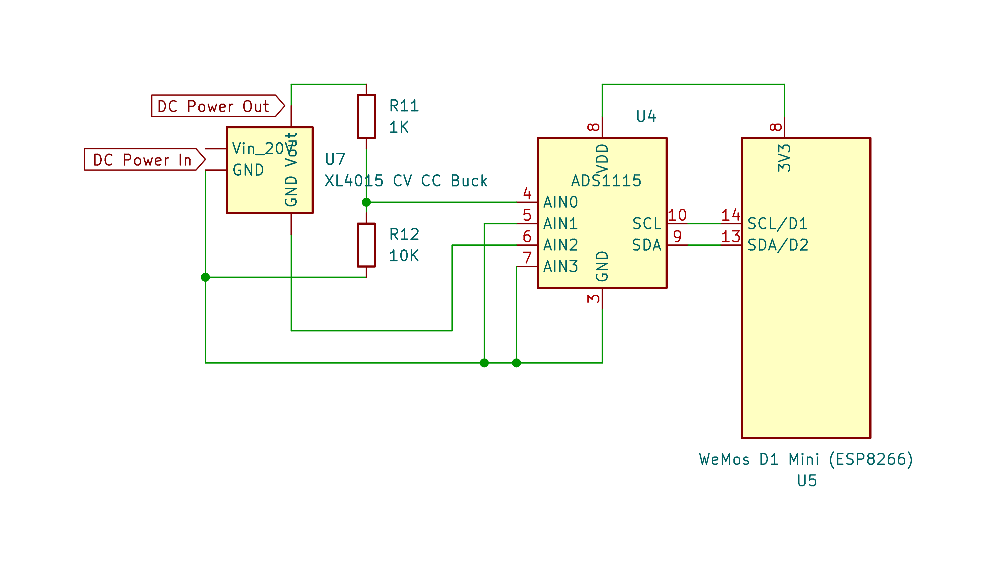

# Step 2: Monitoring Voltage And Current
:stopwatch: Reading time: 5 minutes.

## Concept

The microcontroller needs to know the actual *voltage* and *current* before it can tell the **Buck** breakout board what to do, so the next step is to implement a way how the microcontroller can find out these values.

Here is the part of the schematics that does this:

> [!TIP]
> There are many ways to monitor *voltage* and *current*. If you prefer an alternative way that you feel more confident with, go ahead. You can then skip this part and move on to the [next part](3_injecting_voltage.md). Al that matters is that your microcontroller knows the *current* and *voltage* at the output pins of the **Buck** converter.
>
> For example, you could use a *hall sensor* to measure *current* (i.e. if you wanted to adapt this concept to different **Buck** converters that have no easily accessible *shunt resistor* necessarily), or use your own *shunt resistor*.
>
> In fact, there are cheap boards available based on *INA226* or *INA3221* that do *current* and *voltage* measuring via *I2C* as a one-stop solution. They are also super cheap. However, most of them use *R100* shunt resistors and can only handle a maximum of **3A**.

	:information_source: How Voltage And Current Are Measured
</details 

### Measuring Voltages With ADC (Analog-to-Digital Converter)

The *voltage* and *current* measuring is done by a **ADS1115**: a cheap and precise 16-bit *ADC* (Analog-To-Digital-Converter). 

* **Do not use internal *ADC***: While you could try and use the on-board *ADC* that comes with your microprocessor, the €1-2 spent for an external *ADC* like *ADS1115* are well invested. It has a much higher precision and robustness. That's important when its readings are supposed to control voltage and currency.
* **Two Voltages Are Measured**: *ADS1115* comes with four inputs that can measure voltages independently. Or you combine two inputs to measure the voltage difference between these. That's how it is done in this project.
* **Voltage Measurement**: The *voltage* is measured by *AIN0* and *AIN1*: *AIN0* is connected to the positive *output* voltage, and *AIN1* is connected to **GND**. The measured *difference* is the *output voltage*. Most *ADC*s can measure only a limited voltage range and are very sensitive to over-voltage. That's why the *ADS11215* cannot measure the output voltage directly. It is too high.
* **Current Measurement Via Voltage Drop**: Current is measured as *voltage drop* at a *shunt resistor*. The shunt resistor built into the **Buck** converter is connected in series between **GND** input and **GND** output: the other two *ADC* inputs (*AIN2* and *AIN3*) are therefore connected to the **output GND** and the **input GND**. Since the voltage drop is typically a very low voltage, no additional *voltage divider* is required here. 

> Should you *not* find a big black *R050* *shunt resistor* on the back of your **Buck** converter then you might be using a different model.
>
> Natively, the *XL4015* chip used in these converters supports just *constant voltage* but does *not* support *constant current*. It is the discrete logic on the breakout board that *adds* *constant current* capabilities, and there are breakout boards out there that look much alike but are missing the additional **CC** logic (in which case you can still use the board in this project, but you will only be able to control voltage, not current).
>
> The external **CC** logic consists primarily of a *shunt resistor* (to measure current, like we do), a *potentiometer* to adjust *constant current* (so these boards have *two* potentiometers and not just one), and an *OpAmp* (that produces the actual control signal to tell the *XL4015* to lower its voltage when there is an over-current).

## Solder Points

To measure voltage and current, add wires to the **Buck** converter at the marked pins below:

## Designing The Microcontroller Hardware Setup

On the other end of your connector, the six cables are consumed by an *ESP8266* microcontroller. Let's quickly recap the six pins and their assignments:

|  Pin |  Description | Color Wire |
| --- | --- | --- |
| 1 GND IN | Measure current | 	:white_square_button: Black |
| 2 GND OUT | Measure current | :black_square_button: White |
| 3 V+ OUT | Measure voltage | :red_square: Red |
| 4 POT1 | Voltage control | :yellow_square: Yellow |
| 5 POT2.1 | Current control | :orange_square: Orange |
| 6 POT2.2 | 0V reference | :green_square: Green |

For the measuring part, we need pins 1, 2, and 3 only. Here is the schematics:

This is the parts list we need for now:

* **Microcontroller**: 1x *ESP8266* (I used a *Wemos D1 Mini* breakout board at €1-2)
* **Analog-Digital-Converter (ADC)**: 1x *ADS1115* (I used the super-mini breakout board at less than €2)
* **Voltage Divider**: 2x resistor (*1K* and *10K*) to lower the output voltage and meet the *ADS1115* range
* **OLED Display**: 1x generic 0.96 inch *I2C OLED* display (optional, most any *SSD1306* controlled *OLED* device will work. I used one from *AliExpress* for about €1)
* **Rotary Encoder**: 1x generic *I2C Rotary Encoder* (optional, I used [this one](https://www.duppa.net/shop/i2cencoder-mini-with-soldered-accessory/?v=3a52f3c22ed6) at less than €3.
* **5V Power Supply**: add a power supply for the *ESP8266* of your choice. This can be a battery, a USB port, a voltage regulator that takes the power from the **Buck** controller input or output, etc.

### Doing The Wiring

Here are the schematics to connect the parts list from above:

> [!NOTE]  
> Terminals in the below schematics make it simple to add (or not add) external components such as a display and/or a rotary encoder.
>
> * 2-port terminal to provide 5V input power for the microprocessor
> * 4-port terminal to optionally connect a *I2C OLED display (SSD1306)*
> * 5-port terminal to optionally connect a *I2C Rotary Encoder Knob*
> * 6-port terminal to connect to the **Buck** controller we want to digitally control

(Remainder TBD and in the works - check back soon)

## Next Step

Now that our microcontroller can monitor *voltage* and *current*, it is time to *control* them. This is done by *injecting* voltages into the **Buck** controller to mimick a change in the manual potentiometers. [The next part has the details](3_injecting_voltage.md).

