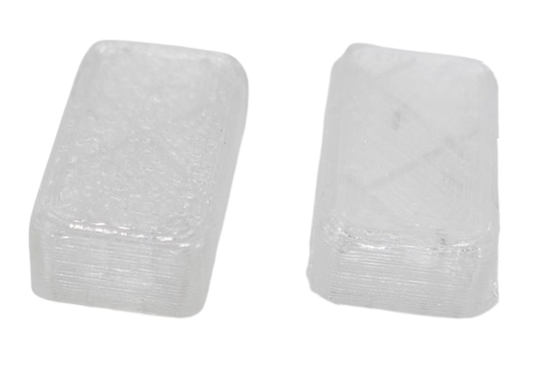

 
# Build Plate

> Understanding The Purpose Of Build Plates And Their Effect On Print Quality

A build plate, or print bed, is the flat surface in a 3D printer where material is deposited layer by layer to create the object. 

The build plate can feature various surface materials for better adhesion. Structures, such as textured, smooth, or coated finishes, can further enhance adhesion during printing and imprint structures onto the printed 3D object.

## Overview
Many build plates are designed as removable steel plates, making it easier to detach printed objects and swap surfaces for different materials or finishes. 

The surface of the build plate can vary significantly, with options such as textured, smooth, or flexible finishes to suit different printing needs. Popular surface materials include PEI (Polyetherimide) sheets, glass, adhesive build sheets, and magnetic flexible steel plates, each offering unique advantages for adhesion and print removal. 

Structures like textured PEI provide excellent grip for materials like PLA, while smooth glass plates can yield glossy bottom surfaces and are easy to clean.

> [!IMPORTANT]
> Build plates are made specifically for certain printer models. There are many vendors selling build plates, and you do not need to buy them from your printers' vendor, but always make sure the build plate was designed for your specific printer model and adheres to the correct sizes and shapes.   

## Surfaces

The build plate *surface* can have significant impact on print quality since the surface is imprinted on the print objects.

While *textured* plates provide excellent adhesion, they are not ideal for printing objects that need a smooth surface.

Here is a sample of a button cap. On the left side, the object was printed on a *textured* plate. The object on the right side was printed on a *smooth* plate and has an absolutely even surface (much more so than can be seen in the picture).

| **Surface Material**     | **Properties**                                                                                   | **Use Cases**                                                                                       |
|---------------------------|--------------------------------------------------------------------------------------------------|-----------------------------------------------------------------------------------------------------|
| **PEI (Polyetherimide)**  | Durable, high adhesion, works with heated beds, easy to maintain, available in smooth or textured finishes. | Ideal for PLA, PETG, and ABS; textured PEI excels for materials needing strong adhesion.             |
| **Glass**                 | Smooth surface, excellent flatness, easy to clean, requires adhesives for some materials (e.g., glue stick). | Best for PLA and materials that don't warp much; provides a glossy finish on the bottom of prints.  |
| **Adhesive Build Sheets** | Affordable, disposable, good adhesion for many materials, easy to apply but wears out over time. | Suitable for general-purpose printing with PLA, PETG, and other common filaments.                   |
| **Magnetic Flexible Steel Plate** | Removable, flexible for easy print removal, supports various coatings like PEI or powder-coated surfaces. | Versatile for multiple filaments; ideal for users who need quick and convenient print removal.       |
| **BuildTak or Similar**   | High adhesion, reusable, moderately durable, compatible with various materials.                  | Useful for beginners or when printing with PLA, ABS, and other standard filaments.                  |
| **Kapton Tape**           | Heat-resistant, smooth surface, good for high-temperature materials but requires reapplication over time. | Commonly used for ABS and other high-temperature filaments.                                         |
| **Painter’s Tape**        | Inexpensive, low-maintenance, single-use, compatible with unheated beds or low-temperature prints. | Great for PLA and other low-warp materials; often used in entry-level 3D printers.                  |
| **Textured Glass**        | Offers better adhesion than plain glass, smooth but with a slight grip, retains flatness.        | Ideal for PLA, PETG, and similar materials requiring moderate adhesion with easy removal.           |
| **Carborundum Glass**     | Durable, provides excellent adhesion when heated, smooth removal upon cooling, wear-resistant.   | Suitable for PLA, PETG, ABS, and TPU; great for repeatable and consistent results.                  |
| **Garolite (FR-4)**       | Excellent adhesion for nylon and other engineering-grade filaments, durable, moderately expensive. | Perfect for nylon and composite filaments requiring strong grip.                                   |

## Structures

Lately, build plates with geometric patterns and structures have become available. Since these structures are transferred to the print objects, you can create awesome surface effects (i.e. *Carbon*, *Honey Comb*, etc.)

| **Surface Structure** | **Properties**                                                                                     | **Use Cases**                                                                                       |
|------------------------|----------------------------------------------------------------------------------------------------|-----------------------------------------------------------------------------------------------------|
| **Textured**           | Rough surface, enhances grip, reduces warping, may leave a textured finish on the bottom of prints. | Ideal for materials like PETG and ABS, where strong adhesion is crucial; works well for functional prints. |
| **Smooth**             | Flat and polished surface, easy to clean, produces a glossy finish on the bottom of prints.        | Best for PLA and materials where aesthetics matter, such as decorative or display items.            |
| **Honeycomb**          | Patterned surface, balances adhesion and ease of removal, reduces contact area for easier release. | Suitable for flexible filaments like TPU or when moderate adhesion is required for specialty materials. |
| **Grid**               | Similar to honeycomb but with straight lines, offers uniform adhesion and release properties.      | Great for general-purpose printing and flexible filaments, providing consistent results.            |
| **Lines or Stripes**   | Alternating smooth and grippy areas, allows controlled adhesion while enabling easier removal.     | Useful for prints with varying contact areas or when minimizing warping is important.               |
| **Matte Finish**       | Subtle, slightly textured surface that reduces reflections, enhances grip without being too aggressive. | Suitable for PLA, PETG, and lightweight materials, often preferred for aesthetic prints.            |
| **Patterned (Custom)** | Custom textures or patterns, often tailored for specific material needs or aesthetic effects.      | Can be optimized for unique materials or to create decorative effects on the bottom of prints.      |

> Tags: Structure, Textured, Smooth, Print Quality, Surface

[Visit Page on Website](https://done.land/tools/devices/3dprinter/buildplate?619050011419250753) - created 2025-01-18 - last edited 2025-01-18
