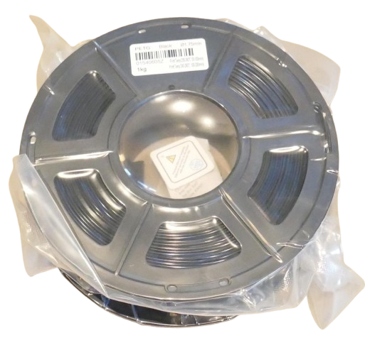
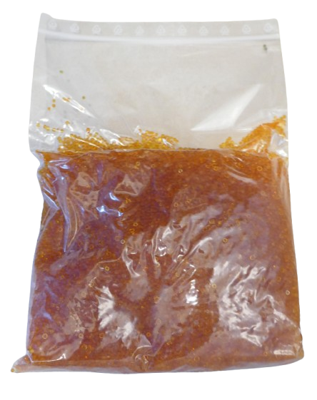
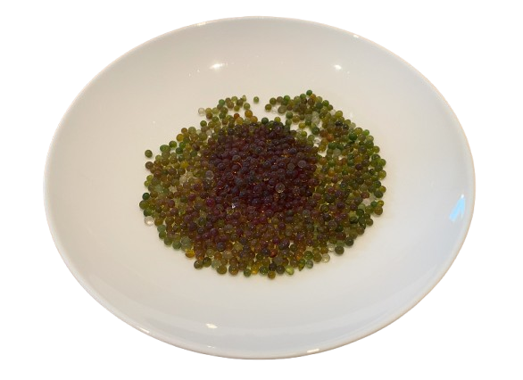
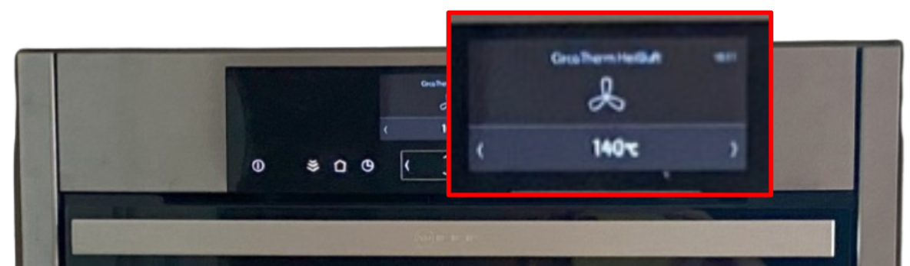
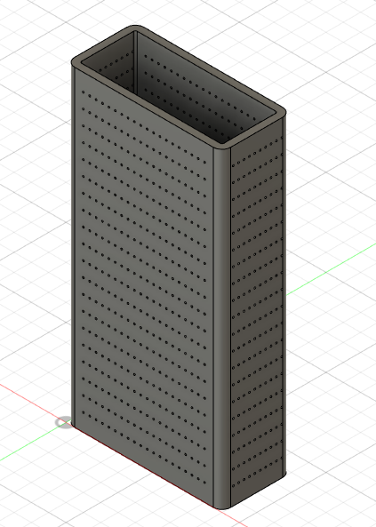
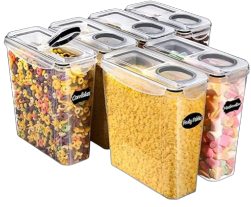
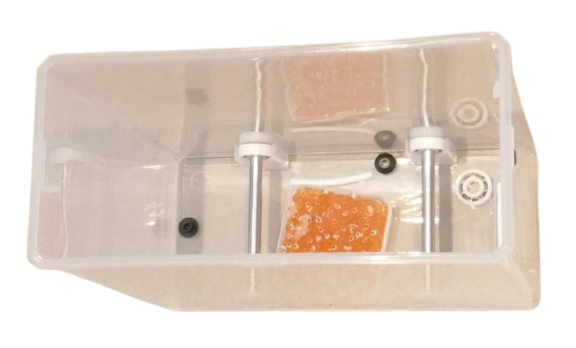
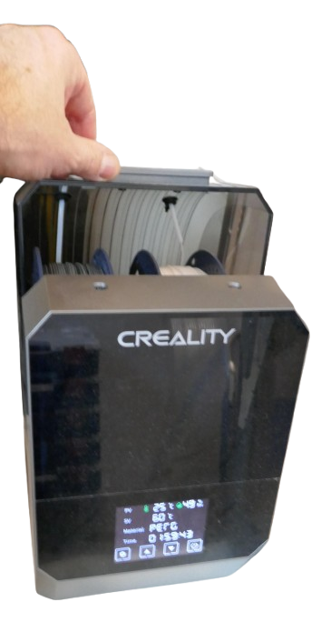
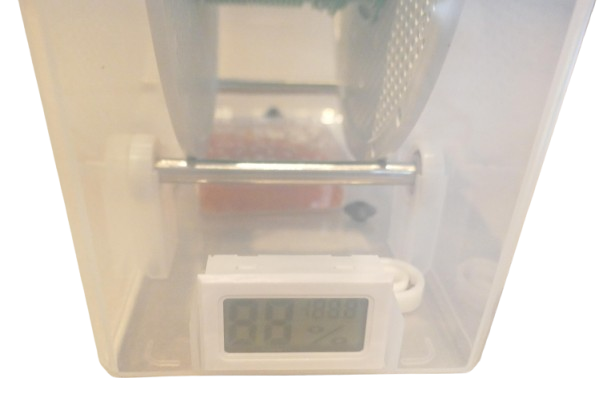
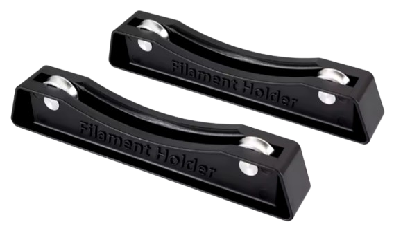

 
# Filament Storage

> Improve Print Quality by Storing 3D Printer Filament Correctly

Most filament spools come in airtight bags to protect them from moisture. When you open such packaging—or if the filament wasn’t delivered in a sealed, airtight bag in the first place—follow these simple guidelines to prevent your filament from degrading.

## Overview

Most filament materials are, to some degree, *hygroscopic*—they absorb moisture from the surrounding air over time. Wet filament can lead to degraded print quality, including stringing, bubbling, or weak layers which is why you should make sure your filament is kept in low humidity.

There are varying approaches to managing filament storage:

1. **Filament Dryers**: Actively remove moisture from filament.  
2. **Airtight Containers**: Store filament with silica gel for passive drying.  
3. **Unprotected Storage**: Leaving filament exposed to room air—often leading to issues.

The impact of moisture depends on:  
- **Relative Humidity (RH)** in the environment.  
- **Filament Material** and its susceptibility to moisture.

Highly hygroscopic materials (e.g., *PVA*, *Nylon*) require strict moisture control, whereas others (e.g., *PLA*) are more forgiving but still benefit from proper storage.

### Material Comparison Table

| **Filament**             | **Hygroscopy**    | **Speed of Absorption** | **Effects of Moisture During Print**        | **Resilience to Storage in High Humidity** |
|---------------------------|-------------------|-------------------------|--------------------------------------------|------------------------------------------|
| **PVA** (Water-Soluble)  | Very High         | Very Fast               | Severe bubbling, poor adhesion, unusable   | Very Low                                |
| **Nylon**                | Very High         | Fast                    | Stringing, bubbles, weak layers            | Low                                     |
| **PVB**                  | Very High         | Fast                    | Surface imperfections, weak adhesion       | Low                                     |
| **PC** (Polycarbonate)   | High              | Fast                    | Bubbles, cracks, weak layers               | Low                                     |
| **PETG**                 | Moderate to High  | Moderate                | Stringing, bubbles, reduced clarity        | Moderate                                |
| **TPU**                  | Moderate to High  | Moderate                | Stringing, inconsistent extrusion          | Moderate                                |
| **Wood-Filled**          | Moderate to High  | Moderate                | Swelling, inconsistent extrusion           | Low                                     |
| **PLA**                  | Moderate          | Slow                    | Brittle filament, minor surface issues     | Moderate                                |
| **PLA+**                 | Moderate          | Slow                    | Brittle filament, minor surface issues     | Moderate                                |
| **ABS**                  | Low               | Slow                    | Minimal (only under very high humidity)    | High                                    |
| **ASA**                  | Low               | Slow                    | Minimal                                    | High                                    |
| **HIPS**                 | Very Low          | Very Slow               | Negligible                                 | High                                    |
| **PP** (Polypropylene)   | Very Low          | Very Slow               | Negligible                                 | High                                    |
| **PEI/ULTEM**            | Very Low          | Very Slow               | Negligible                                 | High                                    |
| **Carbon Fiber Composites** | Low to Moderate | Varies                  | Minimal (depends on base material)         | Varies                                  |

> *Hygroscopy* refers to a material's affinity to water. The *Speed of Absorption* indicates how quickly a material absorbs moisture—*Very Fast* means significant absorption occurs within hours.

### Storage Recommendations

1. **Use Airtight Containers**: Store spools in plastic containers with airtight seals.
2. **Include Desiccants**: Add silica gel packs to absorb residual moisture.  
3. **Monitor Humidity**: Use a small digital hygrometer to ensure RH stays below 30%.  
4. **Avoid Problem Areas**: Don’t store filament near windows, heaters, or damp areas (e.g., basements).  

## Passive Drying

Passive drying prevents moisture absorption using desiccants, like silica gel, without applying heat.

- **Use Color-Changing Silica Gel**: Monitors saturation levels (e.g., orange → green or blue → pink).  
- **Silica Gel Requirements**: 20–30g per spool for optimal effectiveness.  
- **Regeneration**: Heat silica gel in an oven at 100–120°C for 2–3 hours.  

**Ideal Conditions**: Maintain relative humidity (RH) below 30% and temperature between 15–25°C.

Quality sellers ship their spools in airtight plastic bags and include small silica gel packs. **Do not throw these away.** They are designed to attach to your print spools and help keep humidity levels low, particularly when you store the spools in an enclosed container:

## Silica Gel

Silica gel is available both in small bags and in bulk packs. Buying a *1kg silica gel bag* is much more economic than using pre-fabricated small silica bags.

Silica gel is often **color-coded** to indicate its moisture level. It starts **orange** when dry and turns **greenish/blueish** once saturated. Here is a picture of some silica gel that was used for a month in a *Bambu Lab AMS*:

> [!TIP]     
> The time it takes for silica gel to become saturated depends on where you use it: in a well-sealed filament container, it can last many months. In a less sealed environment (like the *Bambu Lab AMS*), you may have to replace or regenerate it after a few weeks. Coincidentally, the more often you need to replace it, the more important it is that you use silica gel in the first place, as this is an indicator of how much moisture the gel absorbed (which would have otherwise damaged your filament).     

### Regenerating Silica Gel
Do not throw saturated (greenish/blueish) silica gel away—it can be easily regenerated:

1. Place the silica gel on a plate, spread it out in a thin layer, and place it into an oven.

     

2. Set the oven temperature to *110-150°C* (*230-300°F*), and use hot air (do not use grills or barbecue mode).

     

3. Leave it in the oven for approximately an hour. If you use color-coded silica gel, regeneration is complete when the silica turns orange again.

> [!NOTE]
> Ensure that the silica gel is placed in a heat-safe dish and kept away from direct contact with heating elements. Ventilate the area if any odor is noticed during regeneration. Always monitor the process to prevent overheating or damage to the silica gel.

### Caveats
Regenerating silica gel is straightforward with a reliable oven, but it is crucial to control the temperature accurately and ensure even heat distribution to prevent any fire hazard.

Household ovens may struggle to maintain low, precise temperatures since they are primarily designed for much higher cooking temperatures. If you are unsure about your oven's accuracy, start with a lower temperature and measure it with a reliable thermometer.

Always use an appropriate heating mode, such as hot air. Avoid modes that generate intense heat, like barbecue or grilling modes, as they can overheat the silica gel and pose risks.

Microwave ovens can also be used but are much harder to control due to the way they generate and apply heat. Typically, microwaves create hot spots, which can result in uneven heating. If you must use a microwave:

1. Set it to a low energy setting.  
2. Heat the silica gel in short intervals.  
3. Stir the gel frequently to distribute the heat evenly.  

> [!WARNING]
> Never leave silica gel unattended during regeneration, especially when using a microwave. Uneven heating or excessive temperatures can lead to overheating, damage to the gel, or even a fire hazard.

### Silica Containers

While small silica bags are convenient, they can become expensive if replaced frequently. A more cost-effective solution is to buy color-coded silica gel in *1kg bags*.

Often, you don’t even need a special container for the silica gel at all: when using plastic boxes to store filament spools, simply spread a thin layer of silica gel on the bottom of the box. This increases the surface area and helps humidity drop much faster—down to around 10%—compared to using separate containers or bags. 

When the silica gel becomes saturated and changes color, pour it onto a plate and regenerate it in an oven.

#### Self-Made Containers

Sometimes, pouring silica gel directly into a box isn't practical, such as when it might interfere with moving parts or when it's difficult to remove later. For instance, you wouldn’t want to pour silica gel directly into your *Bambu Lab AMS*. In such cases, creating silica containers is a good idea.

Small plastic cases, like those used for shipping electronic components, can be easily repurposed as silica containers. Just make sure they allow for air circulation.

To create one:
1. Choose a container large enough to hold **20g to 50g** of silica gel.
2. Drill numerous **ventilation holes** into the container. Ensure the holes are smaller than the silica gel pieces to prevent spillage.

    

Drilling holes is essential. For example, the container in the image was placed in a sealed filament box, but it took more than a week to drop the humidity to *10%*. For optimal results, you want humidity levels to drop within hours, not days.

> [!IMPORTANT]    
> **Surface area is critical**. Pouring silica gel directly into the box (when feasible) maximizes the surface area and allows humidity to drop much more quickly—often within just a few hours.

#### 3D-Printed Containers

Drilling numerous holes can be tedious, and in some cases, you may need containers with a specific shape. For instance, the *Bambu Lab AMS* has sufficient space for silica containers, but they need to be shaped to fit the available areas.

With access to a 3D printer, creating custom silica containers is simple. [Here is one](materials/silica%20container%20bambu%20ams.stl) I use with my *Bambu Lab AMS*:

This container fits perfectly in the space between the filament nozzles, and you can use up to three if needed. I printed it using transparent *PETG*, which allows me to easily monitor the silica gel's color change and know exactly when it’s time to regenerate it.

## Filament Storage Boxes

For storing filament spools, use air-tight plastic boxes. Here are your options in the order of cost and affordability (most economic first):

* **Cereal Boxes:** Generic plastic cereal boxes of the right size work just as well and are much cheaper. The ones I found on [Amazon](https://www.amazon.de/gp/product/B0CPNYJ44R) came in sets of six and are sized *24.5 x 20.0 x 35.5 cm*. These dimensions are perfect for storing regular *1kg spools*

    

* **Dedicated Filament Containers:** These are basically the same plastic boxes, however they typically come with ball-bearing support, a filament opening, and an electronic hygrometer.

    

* **Active Heaters:** The most expensive option adds an active heating element so that filament can be dried.

    

### Turning Cereal Boxes Into Filament Containers
If you just want to keep your filament spools in a low-humidity environment, cereal boxes work fine as-is. Just add a cheap electronic hygrometer so you can monitor humidity.

> [!TIP]
> Most inexpensive electronic hygrometers require one or two *LR44* button cells, which are not always included.

To also *feed* the filament directly from your container box to your printer, simply add the parts that dedicated filament boxes use: 

1. Add separate ball-bearing supports:

    

2. Drill a hole, and insert a small *PTFE* (polytetrafluoroethylene) tube to frictionlessly guide the filament from the box to your printer.

> [!IMPORTANT]
> Whether you use a cereal box or a dedicated filament storage box: always use dessicants like *silica gel* to keep humidity low inside your container. The only purpose of these containers is to *shield* your filament spools from environmental humidity. This makes sense only when you place silica gel inside the container that *lowers* the humidity. Else, humidity inside and outside your container would be the same, and you could as well leave the filament out in the open.    

### Do I Need Active Drying?  

The market for filament dryers has grown significantly, and they are often a considerable investment. But is active drying truly necessary? While some swear by it, the key consideration is this:  

**Has your filament already absorbed moisture?**  

If filament has absorbed moisture, you **must use** active drying. Passive desiccants like silica gel cannot *remove* existing moisture—they only *prevent* further absorption of *new* moisture.  

### Deciding If You Need a Filament Dryer  

Whether you should invest in a filament dryer depends on two main factors:  

- **Material:**  
  Materials like *PLA* are less hygroscopic and don't absorb much moisture, even if not stored perfectly. On the other hand, highly hygroscopic materials like *PVA* can absorb enough moisture to spoil them within hours if left exposed.  

- **Storage:**  
  If you consistently store your filament in airtight containers with silica gel and feed it directly to your printer, it won’t absorb moisture in the first place. Proper storage can often eliminate the need for active drying.  

### Recommendations  

The top priority should always be proper filament storage: keep your spools in airtight containers with silica gel to prevent moisture absorption and degradation.  

- **No Dryer Needed:**  
  Hobbyists using *PLA* typically do not need a dryer. *PLA* absorbs very little humidity and can be managed effectively with passive drying and proper storage.  

- **A Simple Dryer May Be Beneficial:**  
  If you frequently use *PETG* or other moderately hygroscopic materials, having a basic dryer on hand can help refresh spools that have been in use for a long time. Such occasional drying needs can also be handled with a generic oven or food dehydrator.  

- **Edge Cases:**  
  Multi-spool dryers or containers with attachable dryers are best suited for highly hygroscopic materials like Nylon, PVA, PVB, or Polycarbonate as they assume that **each and every spool** has already absorbed moisture. This assumption has no basis though for less hygroscopic materials, especially when properly stored.          

## Active Drying  

Active drying is essential for filament *that has already absorbed moisture*. However, it is unnecessary for filament that either isn’t prone to moisture absorption or has been stored in consistently low-humidity conditions.  

To dry filament, use a controlled hot environment that stays below the filament’s **glass transition temperature (Tg)**. Exceeding this temperature can cause softening or deformation, permanently damaging the filament.  

### Common Drying Methods  

- **Ovens**  
- **Food Dehydrators**  
- **Dedicated Filament Dryers**  

Be aware that most ovens and food dehydrators **lack precise temperature control**, which can lead to uneven or ineffective drying. They can also be inconvenient for regular use and are often energy-inefficient.

### Dedicated Filament Dryers

**Dedicated filament dryers** come in various shapes and sizes. They heat just as much room as is required to store the filament spool(s) you want to dry: some models can dry just **one spool** at a time, while others can handle **two or even four spools** simultaneously:

### Advantages of Filament Dryers

1. **Precision:** Filament dryers often include pre-programmed temperature settings for different filament types, eliminating the need to remember drying temperatures, and can maintain this temperature very precisely.
2. **Convenience:** Many models come with a built-in **timer**, allowing for automated drying cycles.
3. **Continuous Protection:** Most filament dryers allow you to **feed filament directly** from the dryer to the printer. This ensures the filament remains dry throughout the printing process.
4. **Improved Print Quality:** Printing with pre-heated filament can enhance print quality, particularly at **faster print speeds**: pre-heated filament reduces the print head's workload, minimizes friction in the tubes, and ensures smoother extrusion.

By combining proper storage, monitoring, and drying techniques, you can significantly extend the life of **hygroscopic** filament materials, and improve the quality of your 3D prints.

#### Drying Temperature Recommendations

| **Filament**   | **Drying Temp** | **Duration**      | **Softening Point (Tg)** |
|----------------|-----------------|-------------------|--------------------------|
| **PLA**       | 40–45°C         | 4–6 hours         | ~60°C                   |
| **PETG**      | 60–65°C         | 4–6 hours         | ~80°C                   |
| **Nylon**     | 70–80°C         | 8–12 hours        | ~90–100°C               |
| **PVA**       | 55–60°C         | 6–8 hours         | ~60°C                   |
| **PVB**       | 60–70°C         | 6–8 hours         | ~70°C                   |
| **ABS/ASA**   | 70–80°C         | 4–6 hours         | ~90°C                   |

> [!IMPORTANT]
> Lower temperatures work but take longer. For example, drying PETG at 30°C instead of 60°C will reduce moisture but take significantly longer.

## Environmental Humidity Thresholds

To help you understand how sensitive your filament materials are towards humidity, here is a comparison. The column *Max Safe RH* shows the humidity that should not be exceeded over lengthy periods of time, or else the material will start absorbing moisture.

| **Filament**   | **Max Safe RH (%)** | **Notes**                                                       |
|----------------|---------------------|-----------------------------------------------------------------|
| **PLA**       | 30–40               | Absorbs slowly; safe for months at low RH.                     |
| **PETG**      | 30–40               | Moisture causes stringing and reduced print quality.           |
| **TPU**       | 20–30               | Very sensitive; poor adhesion when exposed to moisture.        |
| **Nylon**     | 10–20               | Extremely hygroscopic; airtight storage is mandatory.          |
| **PVA**       | 10–20               | Requires sealed storage to avoid rapid degradation.            |
| **ABS/ASA**   | 30–40               | Resistant but benefits from dry environments.                  |
| **PC**        | 20–30               | Moisture causes bubbles and weak layers.                       |

## Summary

For best print quality:

1. **Store Filament Airtight**: Use containers with silica gel to maintain RH below 30%.  
2. **Dry Wet Filament**: If moisture absorption cannot be excluded, or has already happend, use a filament dryer at safe temperatures.  
3. **Monitor Your Environment**: Avoid high humidity or temperature fluctuations.  

> Tags: Filament, Storage, Drying, Silica Gel, Filament Dryer, Hygroscopy, Moisture Control

[Visit Page on Website](https://done.land/tools/devices/3dprinter/filament/storage?020138121914241844) - created 2024-12-13 - last edited 2025-01-02
