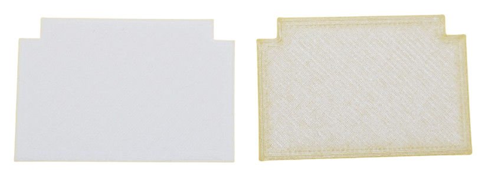
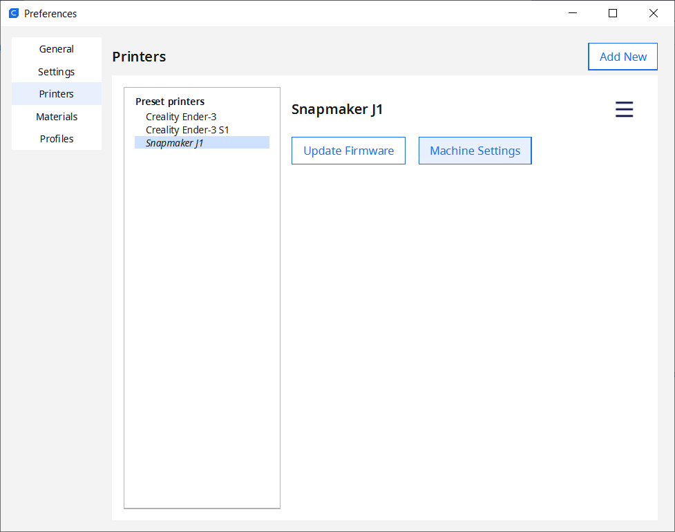
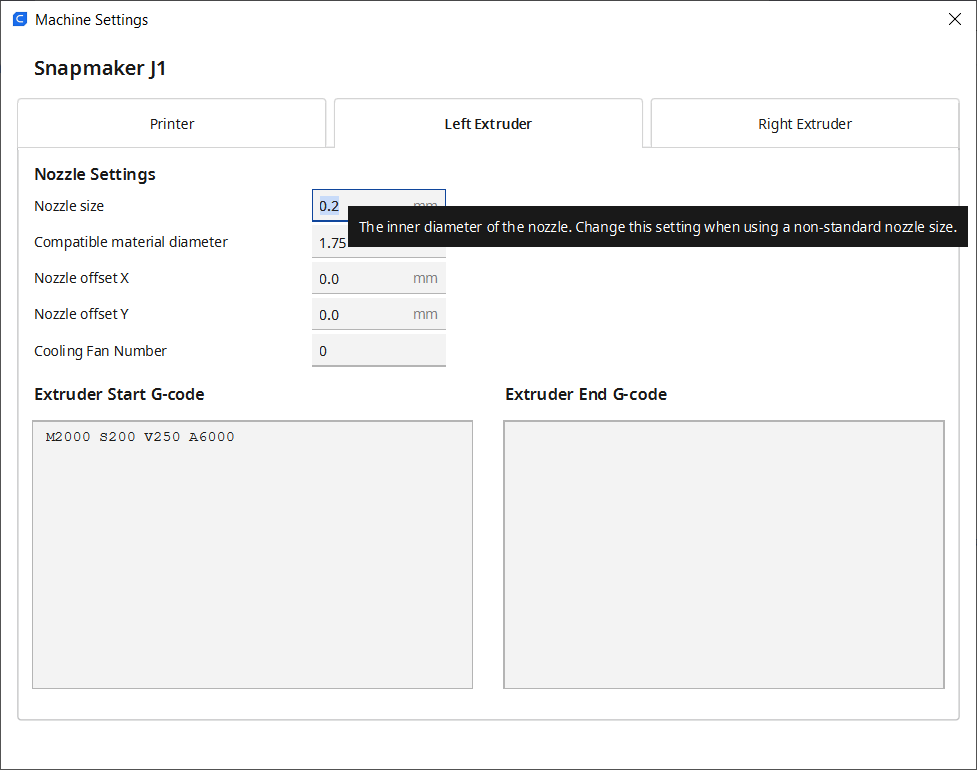

 
# Changing Hotends

> Changing Hotends For Snapmaker J1

The *hotend* is the part that emits the melted plastic. It consists of a *heater* and the *nozzle*. Obviously, there may be a time when you need to replace the hotend because of *wear and tear*, or other defects.

A much more common reason is to change the *nozzle diameter* and improve print quality. Below picture shows a separator that I originally printed with the default *0.4mm nozzle* using transparent filament (right side). You can clearly see individual lines. The example on the left side was printed using white filament, using a *0.2mm* nozzle size. Almost no individual print lines are visible anymore, and the part looks much crispier and a lot more professional. Print time doubled.

Since *Snapmaker* does not support changing just the nozzles, I illustrate below the steps it takes to replace the *hotends* (including nozzles) on a *Snapmaker J1 IDEX printer*.

> [!NOTE]
> It depends on your printer manufacturer, your experience, and your use case whether you can simply switch the metal nozzle, or whether you need to replace the entire *hotend*. Manufacturers like *Snapmaker* and *Bambulab* officially do not support swapping nozzles only.

## Why Nozzle Diameter Matters

Most 3D printers come with a default nozzle diameter of *0.4mm* which is a good compromise between *print quality* and *print speed* and used for generic use cases.

The *nozzle diameter* however directly relates to the *printer resolution* and thus greatly affects print quality:

The nozzle diameter...

* **X-Y Axis:** ...directly relates to the width of the "print lines" (X-Y axis): the smaller the diameter, the more narrow are the print lines. 
* **Z Axis:** ...indirectly determines the minumum and maximum *layer height* you can use in your slicer software.

Whenever you decrease the nozzle diameter, the increased resolution comes at the price of an increased print time.

### Layer Height
The *layer height* is the height of each layer of filament that gets deposited on top of each other. 

Since this setting determines the distance that the print head is lifted away from the print surface for each new layer, it is a setting *in your slicer software*, and not **directly** related to print head, nozzle, or any other physical part of your printer. 

However, the *nozzle diameter* does determine the **range** of layer heights that is available to you: a smaller nozzle can emit less material, thus the maximum possible layer height decreases. Likewise, a smaller nozzle enables *lower* layer heights because it can better control emitting *smaller amounts of material*.

> [!IMPORTANT]
> Of course, you can set *any layer height you want* in your slicer software. However, when the layer height you set does not match the nozzle diameter (and thus the minimum and maximum material flow rate - the almighty physics so to say), you get under- or over-extrusion, and your prints may fail or look ugly.

Here are some rules of thumb for *layer heights*:

* **Standard Layer Height:** 50% of nozzle diameter. For a default *0.4mm* nozzle, this is a *0.2mm* layer height.
* **Minimum Layer Height:** 25% of nozzle diameter
* **Maximum Layer Height:** 80% of nozzle diameter

### Best Practice
Amd here are some suggestions for *nozzle diameter* plus appropriate *layer height*:

| Use Case | Nozzle Diameter | Minimum | Default | Maximum |
| --- | --- | --- | --- | --- |
| High Detail | 0.2 | 0.05 | 0.1 | 0.16 |
| Multi Purpose | 0.4 | 0.1 | 0.2 | 0.32 |
| Large Models and Fast Print | 0.6 | 0.15 | 0.3 | 0.48 |
| Very Large Models/Fast Prototyping | 0.8 | 0.2 | 0.4 | 0.64 |

If *print time* is no concern to you, and *print quality* is your maximum priority, you could mount a *0.2mm nozzle*, and set the *layer height* in your slicer software to *0.05mm*.

## Overview

*Snapmaker* offers *dual hotends* for the *J1* in various diameters for roughly €100. The box comes with a *left* and a *right* hotend (they are different and clearly marked in the area where the fan is located), plus a small booklet:

## Change Hotends

Unload the filament if your existing hotends are still loaded. Then wait for the hotends to cool down to a safe temperature.

### Start With Right Hotend
First, remove the old **right** hotend:

1. Use the printer menu to move the **right** print head from its parking position into the middle of the build room so you can access it.
2. Use a *H2* hex key (it's the pink hex key if you have the hex keys at hand that came with the printer, but any *H2* hey key will do) to completely loosen the two screws (without removing them from the print head).   
    
3. Gently push outward the extruders side cover, then turn the thumb wheel **counterclockwise** until the print head is loose.   
    
4. Pull out the hot end downwards. Done!  
    

Next, insert the new **right** hotend. Make sure you use the *correct* hotend. *Left* and *right* are different (but clearly marked). 

Here is a picture of the **left** hotend - it has a large **L** printed next to its fan:

Take the one with the **R**, and proceed as follows:

1. Insert the new hotend with the copper contacts upwards, and the orange hotend part inwards. Push it upwards into the slot. When it is fully inserted, turn the *thumbwheel* **clockwise** to secure the hotend.    
    
2. Close the extruder's side cover, then tighten the two hex screws that you loosened initially.    
 

### Next, Change Left Hotend
Once you successfully exchanged the *right* hotend, you can now do the same with the *left* hotend. Before you do, please note the differences in the *print heads* that hold your hotends.

The *right* print head has a *thumbwheel* that you just used to unsecure and secure the hotend.

 

The *left* print head - the one that you are tackling next - has **no thumbwheel**. So once you loosen the *H2 hex screws*, the hotend is immediately loose and can be plugged out. Make sure it isn't falling out by itself.

So to replace the *left* hotend, just do this:

1. Use the printer menu to move the **right** print head back to its parking position, then move the **left** print head into view.
2. Use a *H2* hex key (it's the pink hex key if you have the hex keys at hand that came with the printer, but any *H2* hey key will do) to completely loosen the two screws (without removing them from the print head). While you do, support the orange hotend so it won't fall out. 
3. Gently push outward the extruders side cover, then pull out the hot end downwards. Done!  
   

Take the new hotend marked with the **L** next to its fan, and proceed as follows:

1. Insert the new hotend with the copper contacts upwards, and the orange hotend part inwards. Push it upwards into the slot. 
2. When it is fully inserted, close the extruder's side cover, then tighten the two hex screws that you loosened initially. 

## Calibration

Whenever you exchange hotends, you need to [re-calibrate the printer](https://www.youtube.com/watch?v=ZNXBElBMDtI). This makes sure the new nozzles maintain the correct distance to all parts of the print bed.

After you replaced hotends, start by removing the glas plate from the print bed. In the printer menu, start the following calibration units:

* **Heated Bed Leveling:** Only the **left** print head moves. The print head measures the distance to the print bed at various places. If the print bed is not leveled, you are asked to use one of the two big black manual hand screws below the print bed to adjust the print bed until the level indicator in the display is in the marked range.
* **Z Offset Calibration:** This makes sure the **right** extruder is exactly on the same level as the **left** extruder. To prepare, loosen the two hex screws on the **right** print head. The hotend is now secured only by the *thumbwheel* which can lower or raise the hotend minimally. The test now measures the distance between the print bed and the **right** hotend, then instructs you to move the *thumbwheel* either *clockwise* or *counterclockwise* until the **right** extruder is on equal height with the **left** extruder. **Do not confuse this test with the initial one, and do not turn the two big black screws underneath the print bed!**. Once completed, tighten both hex screws again.
* **XY Offset Calibration:** The last mandatory calibration has no manual intervention required and is performed automatically.

When done, replace the glas plate on the print bed.

## Updating Slicer Software

Whenever you change the *nozzle diameter* on any *3D printer*, you need to adjust the settings in your favorite slicer software as well. Your 3D models need to be sliced with the correct *nozzle diameter*.

Here is how you do this in *Cura*:

1. Choose *Settings/Printer/Manage Printers...*. This opens a dialog with all of your installed *3D Printers*.

   
2. Select the printer, then on the right side of the dialog, click *Machine Settings*.   
3. For each extruder (print head), the dialog shows a separate tab. Click each extruder tab, then set the new *nozzle size*.   

   

> [!TIP]
> Should you plan to change hotends (and different nozzle sizes) frequently, you may want to add your *3D printer* multiple times to *Cura*, and configure each instance to one of the nozzle sizes you use. This way, you can later easily switch back and forth without having to change settings each time.    

### Updating Print Settings
Once you change the *nozzle diameter*, you need to review some of your print settings, too:

* **Layer Height:** smaller nozzles require smaller layer heights (see section above) because they cannot emit as much material as a larger nozzle, and smaller layer height increases print resolution in the *Z axis*.
* **Line Width:** should not be less than the nozzle diameter.
* **Wall Lines:** since smaller nozzles produce smaller print lines, you may want to increase the wall thickness and related settings to ensure the same object strength as before.
* **Skirt:** since very fine print lines are hard to remove from the print bed, if you use a *skirt*, make sure you adjust the lines. If you used 2 lines for *0.4mm nozzles*, now use 4 lines.

> [!TIP]
> With *0.2mm nozzles*, print lines are very narrow. Single or double print lines can be hard to remove from the print bed. If you use 

> Tags: IDEX, Snapmaker J1, Hotend, Nozzle, Diameter, Replace Hotend

[Visit Page on Website](https://done.land/tools/devices/3dprinter/idexsnapmakerj1/changinghotend?585932091727244036) - created 2024-09-26 - last edited 2024-09-27
