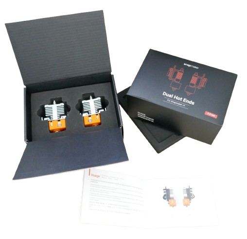
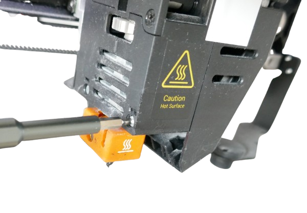
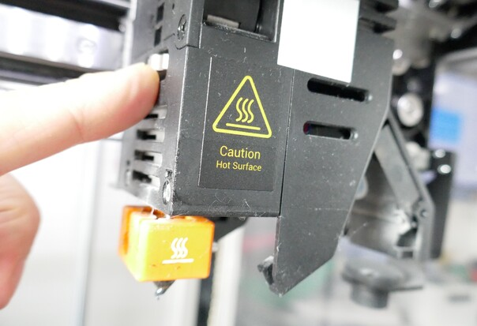
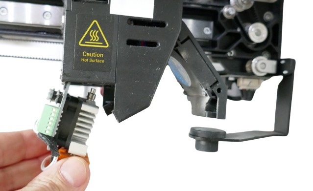
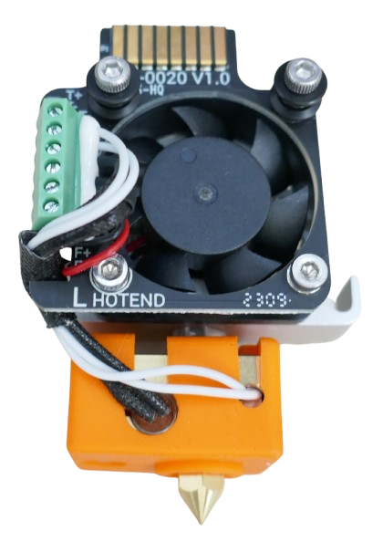

 
# Changing Hotends

> Changing Hotends For Snapmaker J1

The *hotend* is the part that emits the melted plastic. It consists of a *heater* and the *nozzle*. Obviously, there may be a time when you need to replace the hotend because of *wear and tear*, or other defects.

A much more common reason is to change the *nozzle diameter* and improve print quality.

In order to print some small high quality parts, I needed to change the default *0.4mm nozzle diameter* on my *Snapmaker J1* to *0.2mm*. Here is how you do it. 

## Nozzle Diameter

Most 3D printers come with a default nozzle diameter of *0.4mm*. This diameter directly relates to the width of the "print lines" and determines the *resolution* of your printer.

For better quality and to print more detail, you can *lower the diameter* to *0.2mm* at the expense of doubling the print time. Likewise, if you intend to print large objects, you may increase the nozzle diameter to *0.8mm*.

> [!IMPORTANT]
> With meny printers, you can change *nozzle diameter* by unscrewing the metal nozzle at the bottom of the hotend. Some printer manufacturers, including *Snapmaker* and *Bambulab*, do not support switching nozzles. Instead, they require users to switch the entire hotend. So in order to change the default *0.4mm nozzle diameter* on a *Snapmaker J1* to a finer *0.2mm*, you need to purchase *two new 0.2mm hotends* at a total cost of roughly €100.

## Overview

*Snapmaker* offers *dual hotends* for the *J1* in various diameters for roughly €100. The box comes with a *left* and a *right* hotend (they are different and clearly marked), plus a small booklet:

## Change Hotends

Unload the filament if your existing hotends are still loaded. Then wait for the hotends to cool down to a safe temperature.

### Start With Right Hotend
First, remove the old **right** hotend:

1. Use the printer menu to move the **right** print head from its parking position into the middle of the build room so you can access it.
2. Use a *H2* hex key (it's the pink hex key if you have the hex keys at hand that came with the printer, but any *H2* hey key will do) to completely loosen the two screws (without removing them from the print head).   
    
3. Gently push outward the extruders side cover, then turn the thumb wheel **counterclockwise** until the print head is loose.   
    
4. Pull out the hot end downwards. Done!  
    

Next, insert the new **right** hotend. Make sure you use the *correct* hotend. *Left* and *right* are different (but clearly marked). 

Here is a picture of the **left** hotend - it has a large **L** printed next to its fan:

Take the one with the **R**, and proceed as follows:

1. Insert the new hotend with the copper contacts upwards, and the orange hotend part inwards. Push it upwards into the slot. When it is fully inserted, turn the *thumbwheel* **clockwise** to secure the hotend.    
    
2. Close the extruder's side cover, then tighten the two hex screws that you loosened initially.    
 

### Next, Change Left Hotend
Once you successfully exchanged the *right* hotend, you can now do the same with the *left* hotend. Before you do, please note the differences in the *print heads* that hold your hotends.

The *right* print head has a *thumbwheel* that you just used to unsecure and secure the hotend.

 

The *left* print head - the one that you are tackling next - has **no thumbwheel**. So once you loosen the *H2 hex screws*, the hotend is immediately loose and can be plugged out. Make sure it isn't falling out by itself.

So to replace the *left* hotend, just do this:

1. Use the printer menu to move the **right** print head back to its parking position, then move the **left** print head into view.
2. Use a *H2* hex key (it's the pink hex key if you have the hex keys at hand that came with the printer, but any *H2* hey key will do) to completely loosen the two screws (without removing them from the print head). While you do, support the orange hotend so it won't fall out. 
3. Gently push outward the extruders side cover, then pull out the hot end downwards. Done!  
   

Take the new hotend marked with the **L** next to its fan, and proceed as follows:

1. Insert the new hotend with the copper contacts upwards, and the orange hotend part inwards. Push it upwards into the slot. 
2. When it is fully inserted, close the extruder's side cover, then tighten the two hex screws that you loosened initially. 

## Calibration

Whenever you exchange hotends, you need to [re-calibrate the printer](https://www.youtube.com/watch?v=ZNXBElBMDtI). This makes sure the new nozzles maintain the correct distance to all parts of the print bed.

After you replaced hotends, start by removing the glas plate from the print bed. In the printer menu, start the following calibration units:

* **Heated Bed Leveling:** Only the **left** print head moves. The print head measures the distance to the print bed at various places. If the print bed is not leveled, you are asked to use one of the two big black manual hand screws below the print bed to adjust the print bed until the level indicator in the display is in the marked range.
* **Z Offset Calibration:** This makes sure the **right** extruder is exactly on the same level as the **left** extruder. To prepare, loosen the two hex screws on the **right** print head. The hotend is now secured only by the *thumbwheel* which can lower or raise the hotend minimally. The test now measures the distance between the print bed and the **right** hotend, then instructs you to move the *thumbwheel* either *clockwise* or *counterclockwise* until the **right** extruder is on equal height with the **left** extruder. **Do not confuse this test with the initial one, and do not turn the two big black screws underneath the print bed!**. Once completed, tighten both hex screws again.
* **XY Offset Calibration:** The last mandatory calibration has no manual intervention required and is performed automatically.

When done, replace the glas plate on the print bed.

> Tags: IDEX, Snapmaker J1, Hotend, Nozzle, Diameter, Replace Hotend

