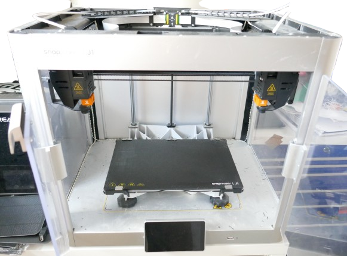
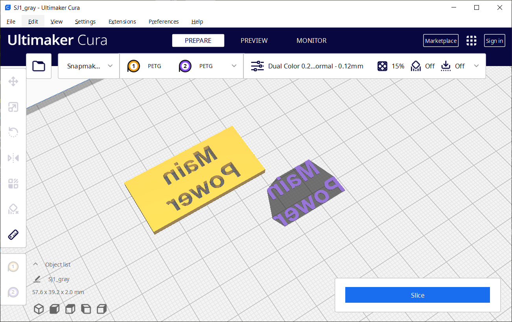
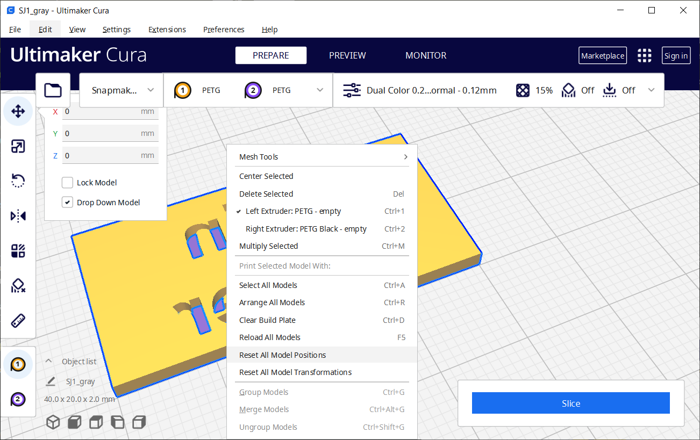
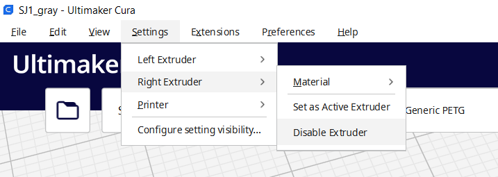

 
# IDEX - Snapmaker J1

> Exploring IDEX 3D Printing By Looking At The Snapmaker J1

**IDEX** (*Independent Dual Extruder*) 3D Printers feature **two** independent print heads, so they are basically like two printers in one. 

IDEX printers can print in two colors without time-consuming and wasteful filament change, and they can also print two (identical) objects at the same time, side-by-side, by using both print heads simultaneously.

In this article, I am exploring *IDEX 3D printing* with the [Snapmaker J1](https://www.snapmaker.com/en-US/j1s-idex-3d-printer).

> [!NOTE]
> I am not affiliated with *Snapmaker* in any way or endorse the *Snapmaker J1*. I just happened to purchase a *Snapmaker J1* a year ago (at full price as a regular customer). This is an IDEX printer I know and can talk about. All that matters in this article is *IDEX* as a technology, regardless of which IDEX printer you may have or favor, plus some personal tipps & tricks about my own IDEX journey using the *Snapmaker J1*.

## Overview
IDEX printers have two independent print heads, both of which can be fed a separate roll of filament. The *Snapmaker J1* i.e. has two filament roll holders on its back side, and two silicone tubes that feed the filament to both print heads.

> [!TIP]
> I added a separate filament dryer and feed the filament over a longer distance, using extended silicone tubes.

Basically, an IDEX printer works just like a regular 3D printer, except that there are *two* print heads.

### Benefits Of Two Print Heads
Since there are two separate print heads, you can use *two different filaments* **at the same time**, either to print in *dual color*, or to use *two different materials*. The latter can be useful for printing models with extensive support structures: by using i.e. a water-soluble printing material for the supports, they can later be easily removed.

Both print heads can also *print at the same time*. Since both print heads cannot move completely independently - they are mounted to the same X- and Y-axis - you cannot print two wildely different models at the same time. However, you *can* print two identical models simultaneously. When you need to "mass-produce" certain objects, this can cut print time essentially in half.

> [!NOTE]
> Printers with just a *single print head* can also print multi-color models, however they need to mechanically change the filament each time. Since color changes may occur *per layer*, and there can be hundreds of layers in a model, this may cause hundreds of filament changes. Each filament change takes time, but also wastes good filament (it needs to be pulled out of the print head and then is discarded). With some multi-color models, you may waste more filament than you actually use for printing. IDEX printers on the contrary do *not need to change filament*, so as long as *two colors* are sufficient, they print much faster and much more efficiently (cheaper). 

## Dual Color Printing
Printing dual-color models can be achieved with virtually any slicer software. Just create two models, one per color. Load both models into the slicer, and assign each model a different color.

Here is an example in *Cura*: a panel (assigned a yellow color), and embedded text (assigned a blueish color):

Next, align both models correctly so they resemble one object. To do this, don't try and arrange the models manually. Instead, in *Cura*, select both models (hold `CTRL` while clicking all models), then right-click the selection, and choose *Reset All Model Positions*.

Provided you originally have created both models with the same coordinate system (i.e. both models are components inside the same document), *Cura* aligns them exactly on top of each other. In the example, the colored text inlay now is positioned exactly at the top layer within the recesses of the second model.

> [!NOTE]
> The approach of using multiple models, one per color, is not specific to IDEX. When you use a single-printhead printer with a filament changer (such as a *Bambulab* printer with their *AMS* (*Automatic Material System*)), designing and slicing the model works fundamentally the same.

## Duplication Or Mirroring
A feature *unique to IDEX printers* is the ability to use both print heads *simultaneously* to print *two* copies of *one* model at the same time.

Typically, if you want to use these modes, you need to use specialized slicer software that is tailored towards the IDEX printer you are using. *Snapmaker J1* for example requires the use of the [Luban](https://wiki.snapmaker.com/en/snapmaker_j1/manual/User_Manual/Slicing_in_Snapmaker_Luban) slicer software. 

### Duplex Print With Cura (et al)
While printer-specific slicers like *Luban* make it really simple to use advanced *duplication* modes that use both print heads simultaneously, often these slicers  may not be the tools you enjoy using.

If you'd rather continue to work with your favorite slicer software, i.e. [Cura](https://ultimaker.com/de/software/ultimaker-cura), then you can. Just make sure you slice your model with just **one** enabled extruder (print head). It is not enough to just *not use* the second extruder. It **must be explicitly disabled** in *Cura* before you slice your model.

Also make sure your model is covering no more than half of the build plate (to leave the room for the duplicate copy). Do not place the model in the middle of the build plate. Move it over to the left or right side of it, so that there is the same amount of unused space on the opposite side (where later the second extruder creates the duplex object).

Slice your model with these settings, then upload the data to the printer as usual. When you now start the printing process, you can select the advanced duplex modes right in the printer menu (at least that's what *Snapmaker J1* allows you to do):

1. In the printer menu, go to the saved and sliced models, and select the one you want to print.
2. Select the print mode, then print the model.

> [!TIP]
> If the duplication modes in the printer menu are grayed out, then your sliced model is either too large (covering more than half of the build plate), or you did not **disable** the second extruder before you sliced the model in *Cura*.

### Disabling Extruder In Cura
In Cura, to disable the right extruder, go to *Settings / Right Extruder*, then choose "Disable Extruder*:

> Tags: IDEX, Snapmaker J1, Mirror Mode, Duplicate Mode, Print Head, Hotend

[Visit Page on Website](https://done.land/tools/devices/3dprinter/idexsnapmakerj1?962817091427241808) - created 2024-09-26 - last edited 2024-09-26
