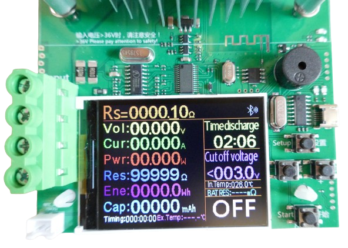

 
# DL24 Atorch

> Simple Electronic Load With Excellent Bang For Buck Targeted Towards DIY Makers

The *DL24* electronic load represents an entire line of *low-priced* yet capable testing devices that are all similarly built. 

While they may not support extremely high currents or voltages compared to more pricey lab equipment, they are sufficient for typical load testing in hobbyist labs.

> [!NOTE]
> There are a number of slightly different hardware versions available. Some come with *USB input connectors* mounted to the main PCB while others ship with a *USB extension PCB* that can be connected to *screw termials* when needed.

The device comes without a housing. A microcontroller and built-in firmware supports providing *constant current* (CC), *constant voltage* (CV), *constant resistance* (CR), and *constant power* (CP).

| Feature | Description |
| --- | --- |
| Over-Current Protection | >21A |
| Over-Temperature Protection | >100C |
| Overload Protection | >185W |
| Timer Cutoff | Cut-Off after interval |
| Voltage Cutoff | Under-Voltage Protection |
| Calibration | Current-calibration interface |
| Test Connections | Terminal, USB-C, Mini-USB, Micro-USB, Barrel Jack |
| Interfaces | Bluetooth LE, USB |
| Software | PC-Program, Android App |

## Warning
This electronic load is rated for testing power supplies outputting up to *200V* and/or up to *20A* (at a maximum power of *150W*). 

These specs do not go inline with the way the device and its components are designed. When getting even close to these values, chances are high that the *MosFET* will explode with a bang.

Reviewing the many blog posts who thoroughly tested this (and similar) loads, you should definitely stay below *32V* (which makes sense from a safety aspect anyway), and keep currents under *10A*. That said, these safe values are still more than sufficient for most hobbyist needs.

## Setup

The device requires its own power supply via a connector on its back. Do not confuse the power jack with the jack located on the *right side* of the device (which is a calibration output). Always use the jack *at the back* of the device. This jack is clearly labeled "power" on the PCB.

> [!TIP]
> You may want to exchange the included AC power adapter with a better *12V 1A* power adapter: the included adapter came with a *US plug* and a *EU plug adapter* that easily fell off.

Once power is connected, the screen briefly shows a company logo, then displays the settings for the currently activated mode. By default, *CC* mode is preselected:

## Connecting Test Power Supply

Electronic loads are used to *simulate a load* so they are used to test *power supplies*. Whether these are *DC-DC-converters*, *batteries*, or even *solar panels*: by connecting the electronic load to such a power supply, you can test and monitor its behavior under stress (load).

The power supply that you want to test is connected to the four screw terminals on the left:

You can either connect wires to the terminals (there are *two* screw terminals per pole), or use the included *adapter plate* to add *USB connectors*.

With the *USB adapter plate*, you can easily connect a *USB power supply* or a *USB power bank* to the electronic load.

## User Interface

The device is controlled by *four buttons* on the right side of the display. The buttons are labelled on the *PCB*: *Setup*, *+*, *-*, and *Start*.

## Changing Modes
The electronic load supports four main modes:

* **Constant Current (CC):** The load adjusts the voltage in order to maintain a *constant current*. This mode is typically used to discharge a battery with a constant current.
* **Constant Voltage (CV):** The load maintains a constant voltage by adjusting the *current*.
* **Constant Resistance (CR):** The load acts like a programmable *resistor* and creates the resistance chosen by the user.
* **Constant Power (CP):** The load draws a *constant power* by adjusting its *resistance*, based on input *voltage*.

To switch the fundamental *load mode*, press and hold *Setup*. Once the main mode display at the top of the screen starts to blink, use *+* and *-* to switch to another mode.

If you do not press *+* and *-* quickly enough, the display changes back into the current mode and lets you change its settings.

The picture below shows the *CR* mode where the electronic load creates a fixed resistance:

## Changing Settings
To change the settings for the current mode, press *Setup* and release it immediately. 

### Main Setting

A cursor appears, and you can use *+* and *-* to change the *main* setting, or press *Setup* again to move the cursor to a different digit.

What exactly the *main setting is* depends on the mode you are using. In *CC* mode, for example, you'd set the *current* (*Is*) that you want to keep constant. In *constant voltage* (CV) mode, this setting would be the desired *constant voltage* instead.

### Additional Settings
To change additional settings - such as setting the *timer*, or defining a *cutoff voltage*, press *Setup* for 1-2 seconds. The main mode display starts to blink.

Press now *Setup* again (short press) to move the input cursor to one of the other settings. You can now use *+* and *-* to adjust these settings.

## Invoking Load
To *turn on* the load, press *Start*. The load now starts to draw energy from the connected power supply. 

Depending on your settings and the amount of power, the big fan starts to run in order to cool down the mosfet and dissipate the heat that it is burning.

> [!TIP]
> If the load does not turn on when pressing *Start*, the display explains why and highlights conflicting settings. If for example you are in *CC* mode with a *cutoff voltage* set, then the load will only turn on if the connected power supply delivers *more than the cutoff voltage*. If not, or if the power supply isn't turned on, or if no power supply is connected yet, the load won't turn on.

## Temperature Probe
The device comes with an attachable temperature probe:

The temperature is displayed at the bottom of the screen. The probe can be attached to *powerbanks* or *power supplies* under test in order to ensure they do not overheat.

## System Menu
Long-pressing *Start* opens the internal *system menu* where you can change advanced settings:

1. Language (Chinese/English)
2. Reset counters (total time, capacity, energy) 
3. Nulling voltage and current
4. Calibrating voltage
5. Current calibration
6. Display brightness (active)
7. Display brightness (standby)
8. Time to switch to standby mode
9. Calibration of temperature probe
10. Calibration of external sensor
11. Setting maximum current, initially 185W (should be lowered to <150W)
12. Factory defaults
13. Save and Exit

## Remote Control
The device can be remotely controlled via *Bluetooth* and *USB*.

For *Android smartphones*, there is a *free app* that can be used to connect to the *bluetooth connector*. There is no *app* for *iOS*. ou can use *bluetooth* with free [custom apps](https://github.com/syssi/esphome-atorch-dl24) though.

A *Micro USB* port on the right side lets you connect the device to a *computer*. The device can then be read and controlled via a *USB cable* (included). Either use the [PC software](https://www.mediafire.com/folder/1c04afq923397/A3#m09i9bjv8703d) supplied by the vendor, or use [free tools](https://github.com/dimas/DL24-python) that [reverse-engineered](https://auto-scripting.com/2020/05/03/atorch-dl24-hack-1/) the protocol.

> [!TIP]
> The *DL24* protocol seems to be compatible to *TX100*. [Tools](https://github.com/misdoro/Electronic_load_px100) designed for this load seem to work at least with *some versions* of *DL24*.

Apparently, there are also ready-to-use [generic software solutions](https://www.eevblog.com/forum/testgear/program-that-can-log-from-many-multimeters/msg2981004/#msg2981004) that can [read and chart output](https://lygte-info.dk/project/TestControllerIntro%20UK.html) from this electronic load.

> Tags: Electronic Load, Constant Current, Constant Voltage, Constant Power, Constant Resistance, CC, CV, CP, CW, CR

[Visit Page on Website](https://done.land/tools/devices/electronicload/dl24atorch?221515051115241319) - created 2024-05-14 - last edited 2024-05-14
