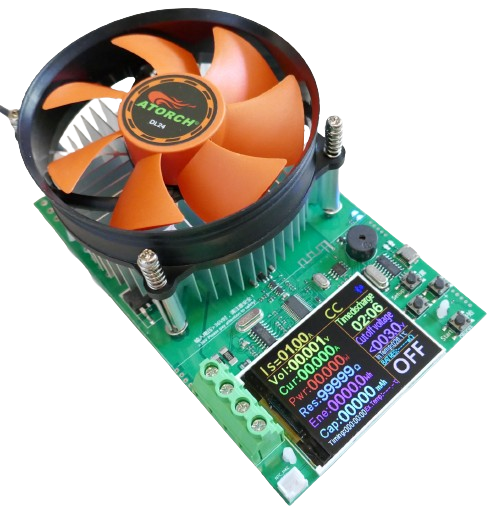
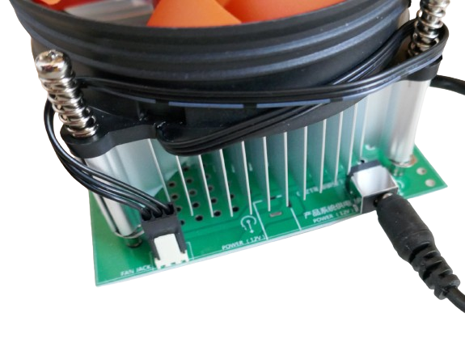
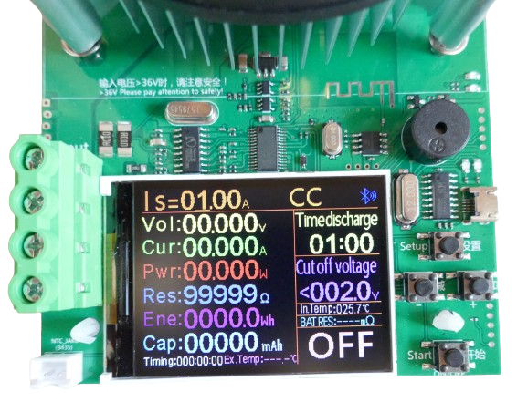
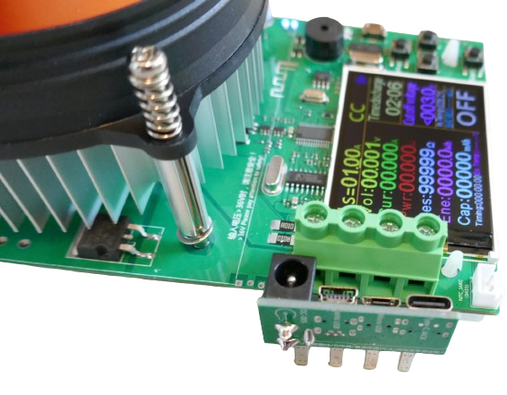
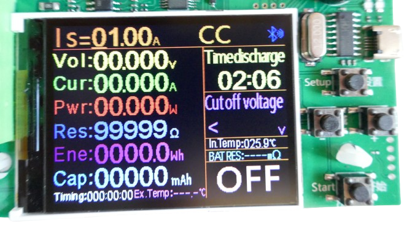
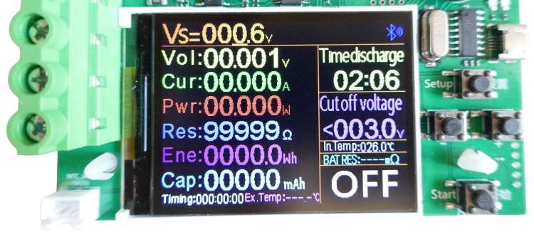
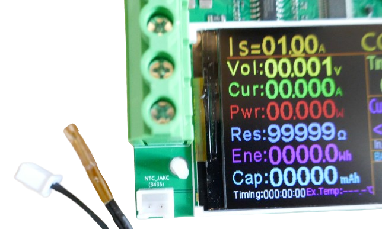
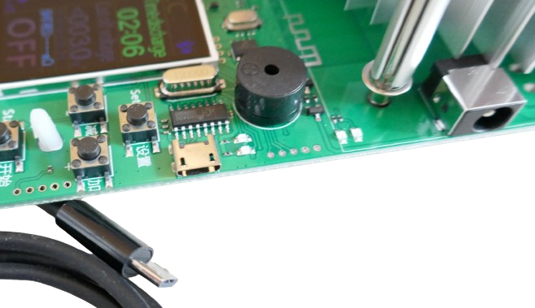

 
# DL24 Atorch

> Simple Electronic Load With Excellent Bang For Buck Targeted Towards DIY Makers

The *DL24* electronic load is a representative of an entire line of *low-priced* yet capable testing devices. While they may not support high currents and voltages compared to more pricey lab equipment, they are sufficient for typical load testing in hobbyist labs.

The device comes without a housing. A microcontroller and built-in firmware supports simulating *constant current* (CC), *constant voltage* (CV), *constant resistance* (CR), and *constant power* (CP).

## Setup

The device requires its own power supply via a connector on its back.

> [!TIP]
> The device came with a cheap external power supply and a socket adapter for *EU plugs* that easily fell off. You can replace the external power supply with any standard *12V 1A* power supply you may have lying around.

Once power is connected, the screen briefly shows a company logo, then displays the settings for the currently activated mode. By default, *CC* mode is preselected:

## Connecting Power Supply

Electronic loads are used to *simulate a load*. Typically, they are used to test *power supplies*. Whether these are *DC-DC-converters*, *batteries*, or even *solar panels*: by connecting the electronic load to such a power supply, you can test and monitor its behavior under load.

The load is connected to the four screw terminals on the left:

You can either connect wires to the terminals (there are *two* screw terminals per pole), or use the included *adapter plate* to add *USB connectors*.

With the *USB adapter plate*, you can easily connect a *USB power supply* or a *USB power bank* to the electronic load.

## User Interface

The device is controlled by *four buttons* on the right side of the display. The buttons are labelled on the *PCB*: *Setup*, *+*, *-*, and *Start*.

## Changing Modes
To switch the fundamental *load mode*, press and hold *Setup*. Once the main mode display at the top of the screen starts to blink, use *+* and *-* to switch to another mode.

If you do not press *+* and *-* quickly enough, the display changes back into the current mode and lets you change its settings.

## Changing Settins
To change the settings for the current mode, press *Setup* and release it immediately. 

### Major Setting

A cursor appears, and you can use *+* and *-* to change the major setting, or press *Setup* again to move the cursor to a different digit.

What exactly the *major setting is* depends on the mode you are using. In *CC* mode, for example, you'd set the *current* (*Is*) that you want to keep constant.

### Additional Settings
To change additional settings - such as setting the *timer*, or defining a *cutoff voltage*, press *Setup* for 1-2 seconds. The main mode display starts to blink.

Press now *Setup* again (short press) to move the input cursor to one of the other settings. You can now use *+* and *-* to adjust these settings.

## Invoking Load
To actually *turn on* the load, press *Start*. The load is now active, drawing energy from the connected power supply. Depending on your settings and the amount of power, the big ventilator starts to run in order to cool down the mosfet that burns the energy, and dissipate the heat.

> [!TIP]
> If the load does not turn on by pressing *Start*, the display explains why. If for example you are in *CC* mode with a *cutoff voltage* set, then the load will only turn on if the connected power supply delivers *more than the cutoff voltage*. If not, or if the power supply isn't turned on, or if no power supply is connected yet, the load won't turn on.

## Temperature Probe
The device comes with an attachable temperature probe:

The temperature is displayed in the screen. Typically, the probe can be attached to *powerbanks* or *power supplies* under test in order to ensure they do not overheat.

## System Menu
Long-pressing *Start* opens the internal *system menu* where you can change the language, clear and calibrate settings.

## Remote Control
The device can be remote controlled via *Bluetooth* and *USB*.

For *Android smartphones*, there is a *free app* that can be used to connect to the *bluetooth connector*. There is no *app* for *iOS*.

A *Micro USB* port on the right side lets you connect the device to a *computer*. The device can then be read and controlled via a *USB cable* (included). Either use the *PC software* supplied by the vendor, or use free tools that reverse-engineered the protocol.

> Tags: Electronic Load, Constant Current, Constant Voltage, Constant Power, Constant Resistance, CC, CV, CP, CW, CR
