 
# Power Profiler Kit II

> Measuring Tiny Currents And Optimizing Battery-Powered Devices

When you need to measure *current* in *sub-Microampere* range, and/or when you need to identify very short *current spikes*, classic *multimeters* won't do. Such measurements are frequently necessary when analyzing and optimizing power consumption of battery- or solar-operated devices.

This is where tools like the [Power Profiler Kit II (NRF-PPK2)](https://www.nordicsemi.com/Products/Development-hardware/Power-Profiler-Kit-2) come into play: 

| Item | Classic Multimeter | Power Profiler Kit II |
| ---  | --- | --- |
| Resolution (*Current*) | *10uA* | *200nA* (*0.2uA*) |
| Resolution (*Time*) | *0.5s* | *10uS* (*0.00001s*) |

## Overview

*PPK2* produces high resolution graphs and offers a *dynamic range* from *200nA* to *1A*. 

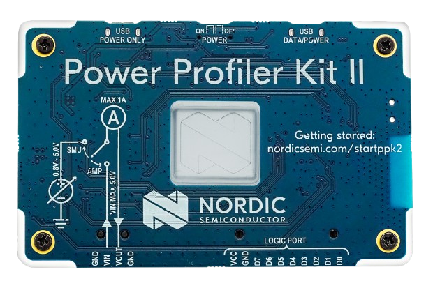

This device is available for around €80 which is surprising at first: professional multimeters with similar specs can cost way north of €2.000. One key difference is accuracy: *PPK2* guarantees a *10%* accuracy (and can measure *200nA* +- *20nA*) whereas high-end laboratory equipment has a margin of error in the range of *0.005-0.001%*.

*PPK2* is a very *cost-effective* tool for analyzing fast-changing currents across a huge dynamic range, and an ideal lab tool to analyze, understamd, and optimize battery- and solar-powered devices. It is *not* the right choice when you need *scientific-grade* accuracy.

### Features

Here are the features:

* **Flexible Power Source:** powered by one or two *Micro-USB cables*, it can source up to *1A* at configurable voltages in the range of *0.8V* and *5V*.
* **Ampere-Meter:** it can be used like a classic "Ampere-Meter". Here, *you* provide the power source (i.e. a battery), and the unit measures the current. The power source must be in the range of *0.8V* and *5V*.
* **Dynamic Range:** It can accurately measure power consumption over the entire range typically seen in low-power embedded applications by auto-switching between five current measurement ranges for optimal resolution. Resolution varies between *200nA* and *1mA* depending on the measurement range, all the way up to *1A*.
* **High Sampling Rate:** With *100kS/s*,  even small current spikes can be detected.
* **Advanced Logic Analyzing:** the unit comes with digital inputs that can be connected to *GPIO outputs* at the device under test. This enables code-synchronized measurements: your code sends markers by switching the *GPIO* to *high* or *low*, and these markers show up in the *current measurement graph*, enabling you to associate power consumption with particular code segments, helping to power-optimize code.

[Hardware files](https://nsscprodmedia.blob.core.windows.net/prod/software-and-other-downloads/dev-kits/power-profiler-kit-ii/pca63100-power-profiler-kit-ii---hw-files---1_0_1.zip) can be downloaded as [zip file](https://nsscprodmedia.blob.core.windows.net/prod/software-and-other-downloads/dev-kits/power-profiler-kit-ii/pca63100-power-profiler-kit-ii---hw-files---1_0_1.zip) and contain schematics, gerber files, and altium designer files.

### Dynamic Range
Here are the five dynamically-controlled ranges:

| Range | Resolution | Accuracy |
| ---  | --- | --- |
| 200nA - 50uA | 200nA | 10% |
| 50uA - 500uA | 500nA | 10% |
| 500uA - 5mA | 5 uA | 10% |
| 5mA - 50mA | 50uA | 10% |
| 50mA - 1000mA | 1mA | 15% |

*PPK2* automatically selects the range that is most appropriate for the measured current, and can switch between ranges dynamically during measurement. This way, you get the best possible resolution while being able to measure a huge range of currents, from *Nano-Ampere* to *one Ampere*.

> [!TIP]
> This link is helpful: [nordicsemi.com/startppk2](https://nordicsemi.com/startppk2). It is also printed onto the front cover of the device and brings you to a landing page where you find an overview plus a *Where to Buy* section listing resellers that currently have the unit in stock.

### Package
[Power Profiler Kit II](https://nordicsemi.com/startppk2) ships in a small box and consists of the analyzer unit, two *DuPont* cables, and no *Micro-USB* power cable. 

### Connectors
A 4-pin cable is used for simple current measurements, and a 10-pin logic port cable can connect up to eight digital **inputs** to arbitrary *GPIO* **outputs** on the device under test to add *markers* to the log.

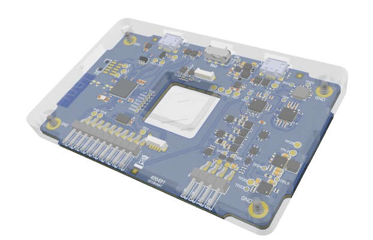

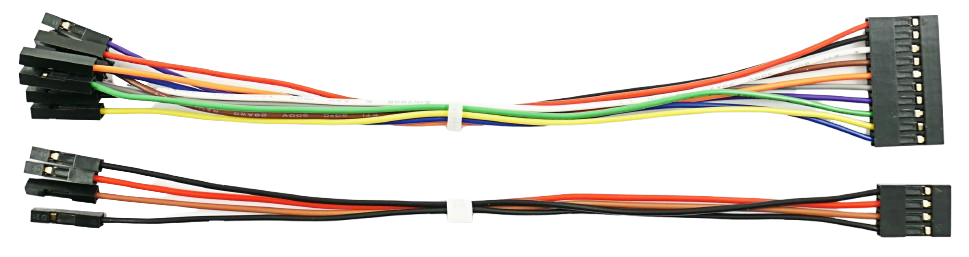

| Connector | Description |
| --- | --- |
| GND | Ground to *device under test* and *external power supply* (if any* ) |
| VIN | external power supply (*Ampere meter* mode only) |
| VOUT | positive output voltage to *device under test* |
| VCC | positive voltage **from** *device under test* (*optional*) |
| D0-D7 | eight digital input pins for logic analysis (*optional*) |
| USB DATA/POWER | *Micro-USB* to computer running *nRF Connect For Desktop* |
| USB POWER ONLY | *Micro-USB* to supply additional power (*optional*, *Source meter* mode only when requiring *>500mA*) |
| ON OFF POWER | Main power switch for unit |

To use the unit, you need to connect it via *Micro-USB cable* to a computer, and install the free cross-platform [nRF Connect For Desktop](https://www.nordicsemi.com/Products/Development-tools/nRF-Connect-for-Desktop) software (available for *Windows*, *Linux*, and *macOS*). Within this software, you install the *Power Profiler* app.

> [!TIP]
> [nRF Connect For Desktop](https://www.nordicsemi.com/Products/Development-tools/nRF-Connect-for-Desktop) offers many more *apps* to perform additional diagnostics. For example, the *Bluetooth Low Energy* app helps in *Bluetooth connectivity testing*. These additional apps are beyond the scope of this article.

## Initial Setup
Setting up *PPK2* requires these steps:

1. Download and install [nRF Connect For Desktop](https://www.nordicsemi.com/Products/Development-tools/nRF-Connect-for-Desktop) software on your computer.
2. Launch *nRF Connect For Desktop*, then install the *Power Profiler App* (which runs inside the main software)
3. Connect *PPK2* via *Micro-USB cable*. The cable needs to be connected to *USB DATA/POWER*, not *USB POWER ONLY*. Make sure the *power switch* on the unit is in *ON* position. A green light starts pulsating.
4. Software may require a *firmware update* ("Device needs to be programmed"). Perform the firmware update as instructed.
5. After the firmware update, the device may no longer be recognized. Reboot your computer.

## Using PPK2

Here are the steps to launch *PPK2* and perform measurements - assuming *PPK2* has been connected to your computer as illustrated above, its power switch is in **ON** position, and it is showing a pulsating **green** light:

1. Launch *nRF Connect For Desktop*. Identify the app *Power Profiler*, and click *Open*.

    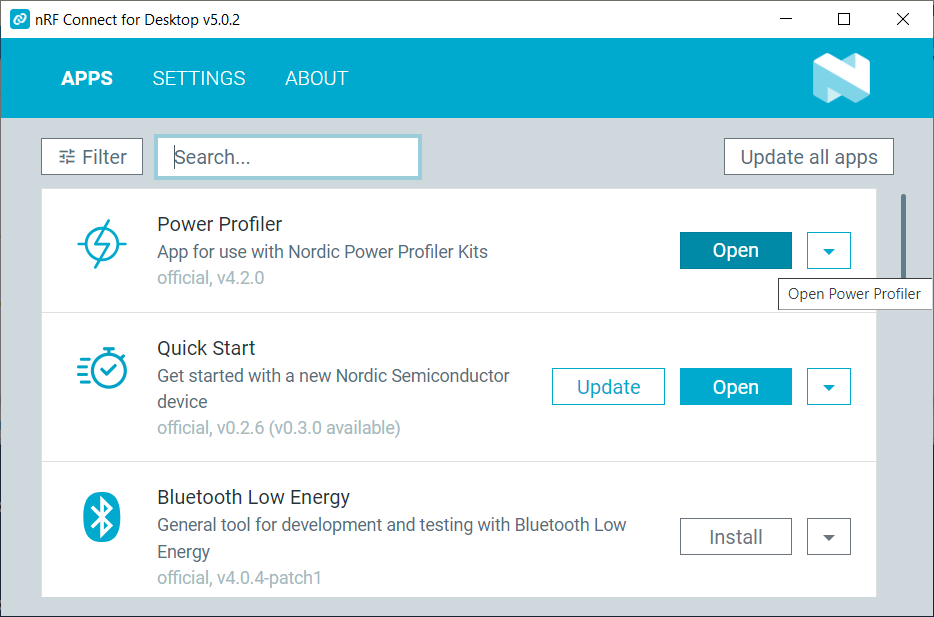

2. In the upper left corner, click *Select Device*. A list of recognized devices slides in. Click *PPK2*.

    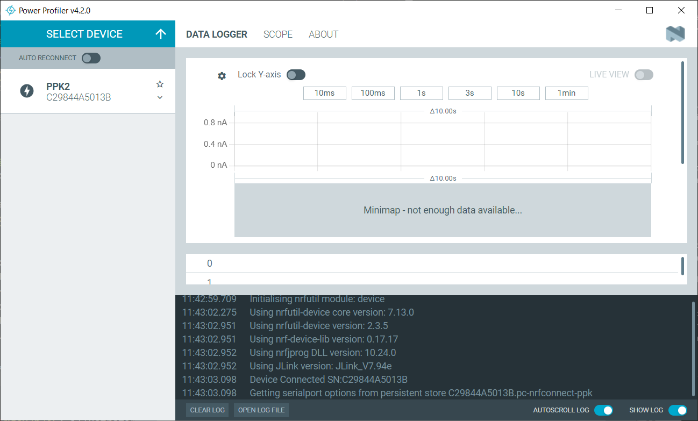

3. A connection to *PPK2* is established, and you see the *Power Profiler User Interface*.

Here is a [Youtube video](https://youtu.be/B42lPvkUSoc?si=Mn0YFKLNgcV3h3e6) illustrating most of the steps.

> [!NOTE]
> If your *PPK2* does not show up in the device list, it is either not connected, its *power* switch is not in the *ON* position, or it cannot be recognized yet by your computer. *PPK2* should show a pulsating *green* light. If you can't get the device to show up, reboot the computer. If you still can't see the device, uninstall and reinstall the software, and make sure you are installing *all parts of it*. 

### Caveats
The *nRF Connect For Desktop* installer seems to be a mix of different software packages that execute in series. During installation, you may see different instances of installers pop up. Make sure you install *all* of the components. 

*PPK2* needs *nRF Connect For Desktop* which in turn needs *J-Link* which is installed as part of the installation package (unless you manually cancel its installation).

> [!NOTE]
> The *J-Link installer* offers to optionally install paid *trial software*. Accepting trial software is not required, so you can safely opt-out. Just make sure you **do install** the main *J-Link software* and do not accidentally cancel the *J-Link installation* altogether. If you did, then *uninstall nRF Connect For Desktop*, and start over again.

### Introduction To User Interface
*PPK2* is controlled via the left sidebar in the user interface. Here, you select its mode:

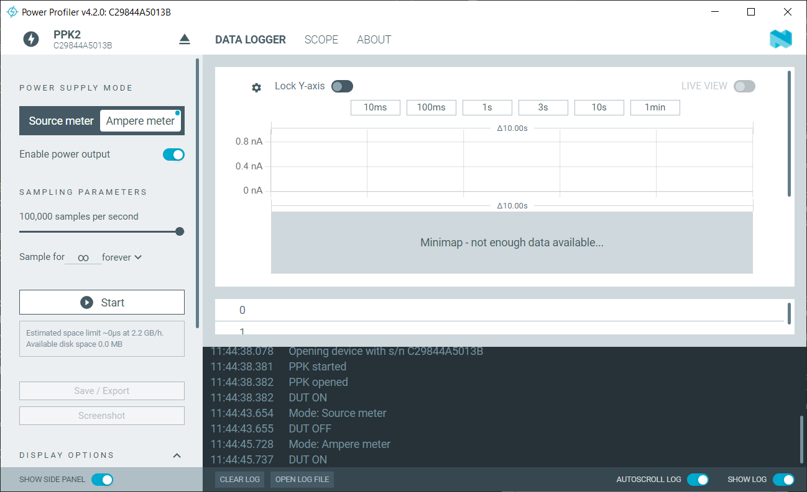

Two modes are available:

* **Source Meter:** The unit supplies a configurable source voltage that can be used to directly power the device under test. When enabled, the unit blinks in **red color**, and a slider appears that sets the source voltage in a range of *800mV* to *5V* that is available at pin *VOUT* to power the device under test. **The maximum current for this mode is 600mA** and requires both *Micro-USB cables* to be connected. 

    

* **Ampere meter:** In this mode, the unit blinks in **blue color**. It now acts like a traditional *Ampere meter*: you supply the source voltage to the pin *VIN* (i.e. a battery). The device under test is powered via the *VOUT* pin. **The maximum current for this mode is 1A.**

In either mode, pin *VOUT* can be turned *on* and *off* with the slider *Enable power output*.

## Performing Current Measurements

Here are the steps to perform a current measurement:

1. Connect *PPK2* and launch the software (see previous sections).
2. Select the *power supply mode* you want to use. In *Source meter* mode, select the desired output voltage (see previous sections).
3. Connect the power supply of your device under test to *PPK2* (see below), and enable power via *Enable power output*.
4. Set the desired *sample rate*, and start measuring the current consumption by clicking *Start* (see below).

### Connecting Device Under Test

*PPK2* acts as a monitored power supply and measures the current that is drawn from it. In other words: it acts as power supply for your device under test.

So the first step is to connect the power supply of your device under test to *PPK2* using pins *VOUT* and *GND* (either one). Before you do, ensure this:

* **Correct Voltage:** when in *Source meter* mode, make sure you have set the appropriate output voltage. When in *Ampere meter* mode, make sure your own power supply is set to the correct voltage.
* **Maximum Current:** make sure your device under test does not draw more than *1000mA* (*Ampere meter* mode) or *600mA* (*Source meter* mode). If in *Source meter* mode, when requiring more than *500mA*, you must attach a second *Micro-USB cable* to *USB POWER ONLY*.

*VOUT* sources power once you slide *Enable power output* into the *ON* position. It is *ON* by default.

Depending on the *power supply mode* you choose, these are the connections you need:

* **Source meter:** connect *VIN* to the positive power supply pin of your device, and *GND* to its *GND pin*. 

    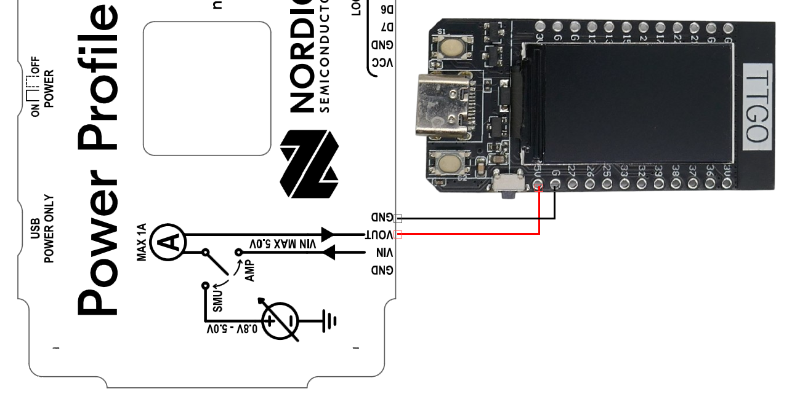

* **Ampere meter:** in addition, connect your own power source to *VIN* and *GND* (either one). It must be in the range of *0.8V* to *5V*, and this voltage will power your device under test at *VOUT*.  

    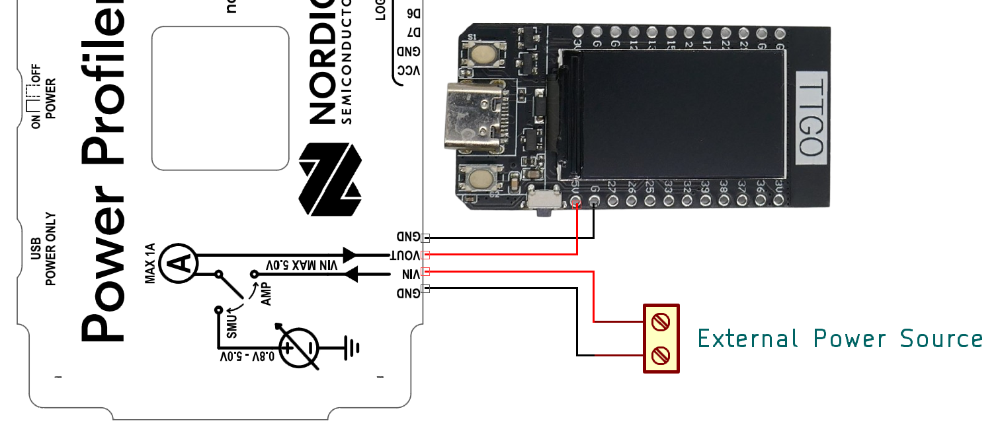

### Performing Test
To perform a current measurement, first make sure *VOUT* is enabled, and your device under test is powered: slide *Enable power output* to *ON*.

Next, select the desired *sample frequency* in the range of *1S/s* to *100.000S/s*. Optionally, set a *duration* for your measurement. By default, the measurement continues until you manually stop it.

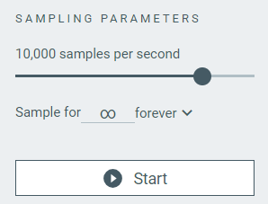

> [!IMPORTANT]
> **Do not** use the maximum sample frequency of *100.000 samples per second* **unless you really need it**. If you just want to check power consumption over time, i.e. to test *deep sleep* modes, *100 Samples/second* are more than enough. *100.000S/s* produces *huge amounts of data* and can fill your hard drive quickly. This resolution is required only when you want to perform *logic analysis* (see below), or need to identify very short *current spikes*.     

Click *Start* to start the measurement. The light on the *PPK2* switches from *pulse* to *solid*. 

You now see in real-time the current consumption in a graph on the right side. A *sliding window* constantly calculates average consumption, and *PPK2* switches dynamically between five different current ranges, depending on the measured current.

### Dynamic Range

The graph below is taken from a *deep sleep* test using a [TTGO T-Display development board](https://done.land/components/microcontroller/families/esp/esp32/developmentboards/esp32s/t-display/programming/usingesphome/addingdeepsleep/). You clearly see the current consumption during *wake time* and *deep sleep* in a highly dynamic range from as low as *373uA* to as high as *240mA*.

The resolution is constantly adapted to the measured currents. Below graph focuses only on the *deep sleep* phase and shows current consumption with a resolution of a few hundred *nA*:

Click *Stop* to stop the measurement. Data can be saved or else is discarded once you start the next measurement.

### Using the Logic Port
For advanced analysis, your device can send logic level information to *PPK2* via its *GPIOs*. Here is why this can be useful:

If you'd like to *optimize power consumption*, you may want to figure out which parts of your firmware code produces which current, or in other words: you want to find out how *power-efficient* your code is.

That's especially useful if you have *different ways* to achieve the same goal in your code, and you'd like to know which way is most power efficient.

In order to *synchronize* your code with the *PPK2 current graph*, you can use up to eight *GPIOs* to send markers to *PPK2*: by switching a given *GPIO* to *high* when you enter a routine, and *low* when exiting it, you can then clearly see the power consumption generated just by this part of your code (assuming there are no other concurrent tasks running).

> [!IMPORTANT]
> *D0–D7* are sampled with 100 kHz frequency with a typical bandwidth of 50 kHz. According to *Nyquist theorem*, the *minimum time interval* you can pick up is *10us*. If your code is executing faster, it cannot be reliably marked.

You can selectively *enable* and *disable* showing the digital channels in the lower left hand area of the *PPK2 user interface*.

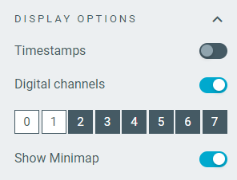

#### Wiring
To add *logic analysis*, use the *ten pin port* in addition to the *four-pin power port*:

* **Power Supply:** connect *VCC* to the supply voltage of your device under test. This ensures the logic levels match. *VCC* must be in a range of *1.65V* to *5.5V*.
* **D0-D7:** connect up to eight *GPIO **outputs*** on your device to the *D0-D7* **inputs** at the *PPK2*.

### Troubleshooting

| Issue | Recommendation |
| --- | --- |
| Measurements unexpectedly fluctuate | Power consumption may be close to a dynamic range switching point, causing *PPK2* to rapidly switch ranges. |
| Graph response is slow | Avoid *USB hubs* and *docking stations*. Connect *PPK2* directly to computer |
| "Disk is full" warning | When free disk space falls below the *disk full trigger* (*4GB* by default), recording stops. Either *clean up the hard drive* to restore free disk space, *lower* the *disk full trigger* (not recommended), or store data on a different (but fast-enough) drive. In future measurements, you may want to reduce the *sampling rate* unless you require it. |

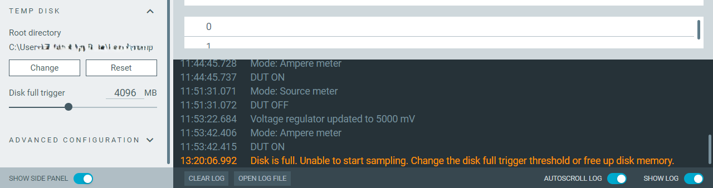

## Internal Design
Overall system and interconnections:

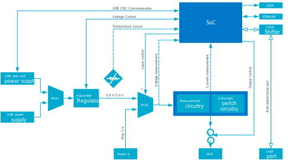

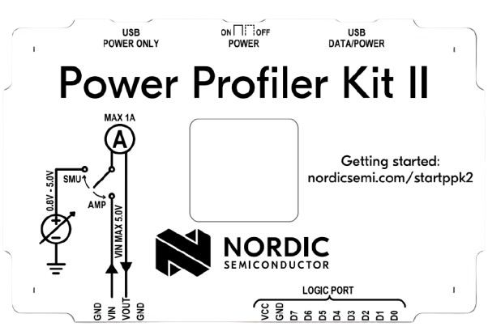
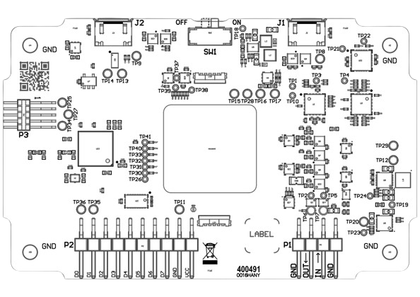

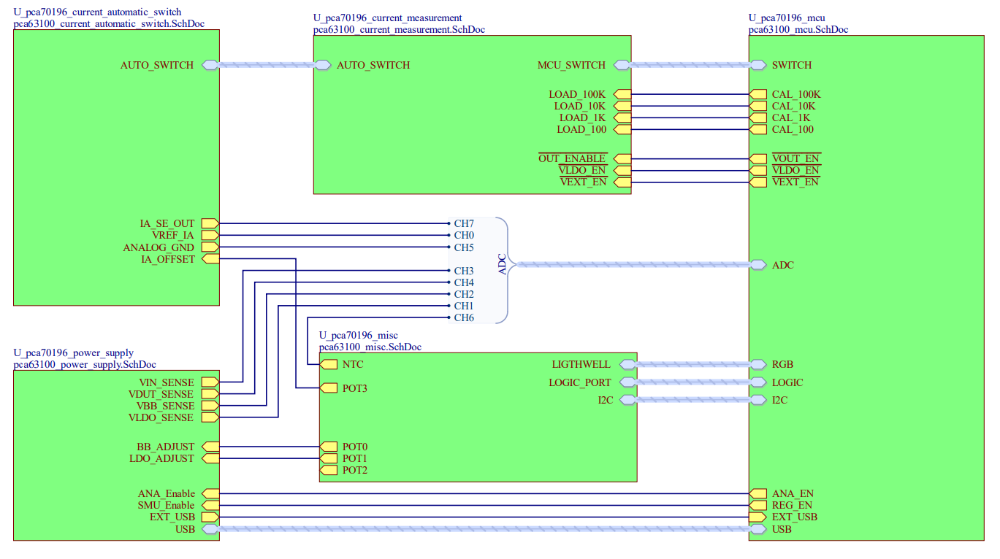

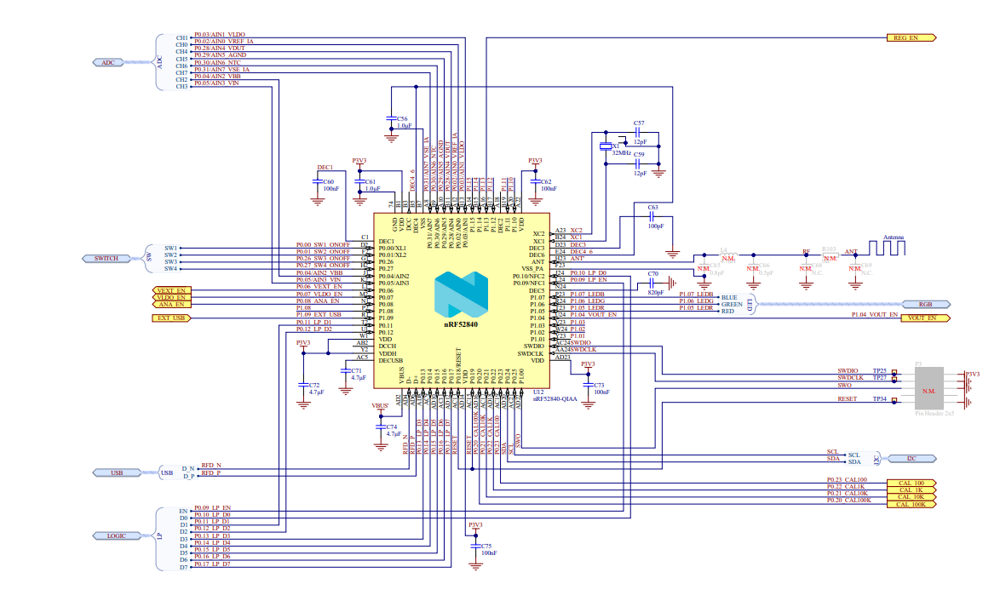

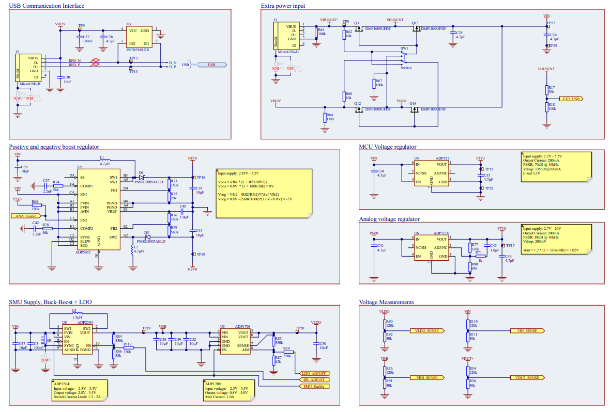

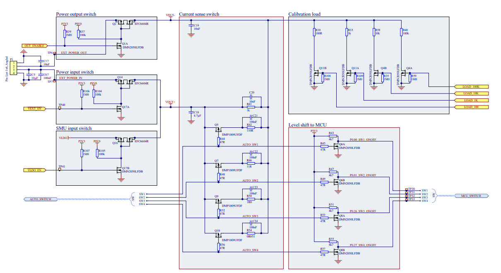

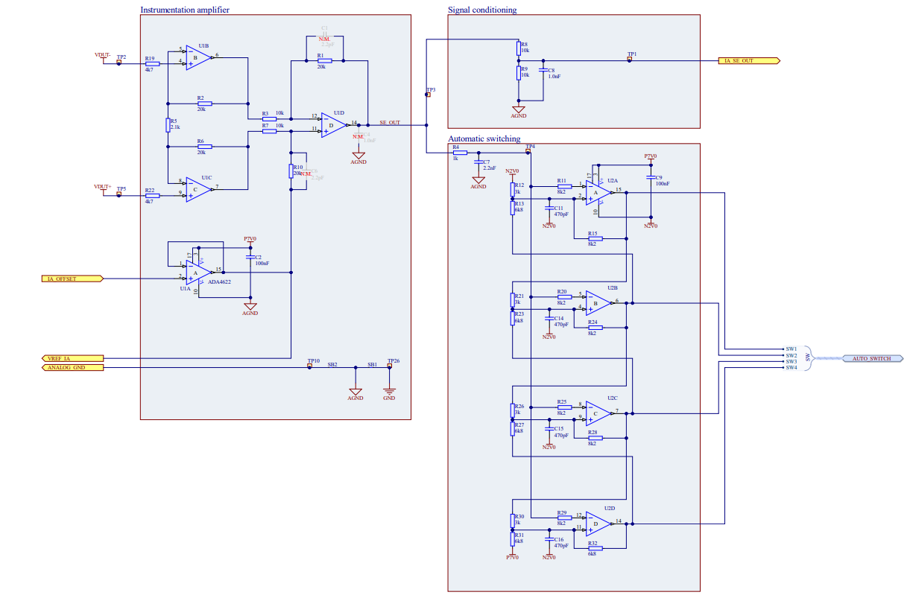

## Materials
[PPK2 User Guide (v1.0.1)](materials/ppk2_userguide_1.0.1.pdf)    
[PPK2 Hardware Files (v1.0.1)](materials/ppk2_hardwarefiles_1.0.1.zip)

> Tags: NRF-PPK2, PPK2, Current, Microampere, Logic Analyzer, Power Optimization, Power Consumption, Analyze, nRF Connect For Desktop

[Visit Page on Website](https://done.land/tools/devices/powerprofiler?262399101308241742) - created 2024-10-07 - last edited 2024-10-07
