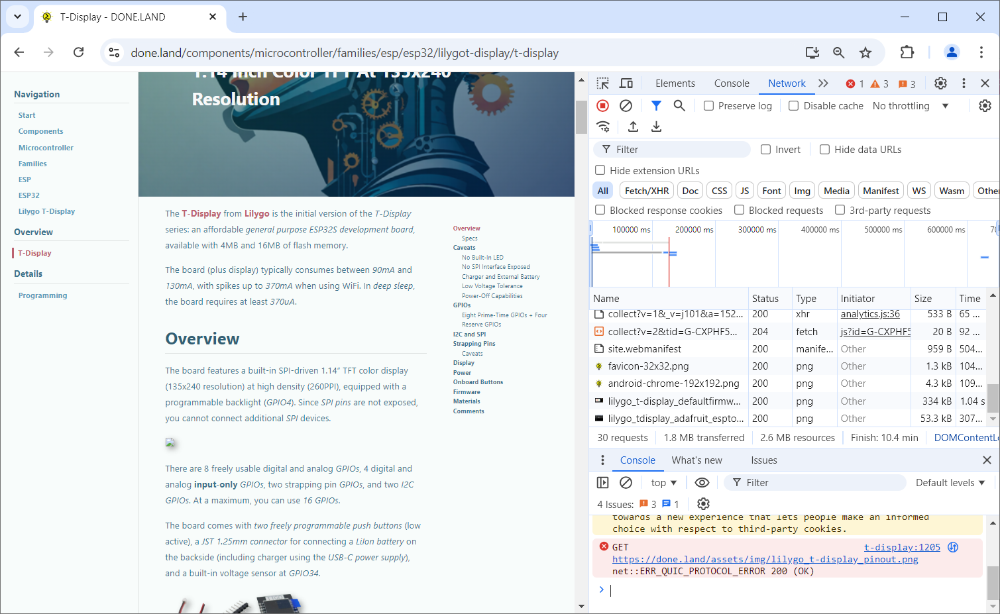
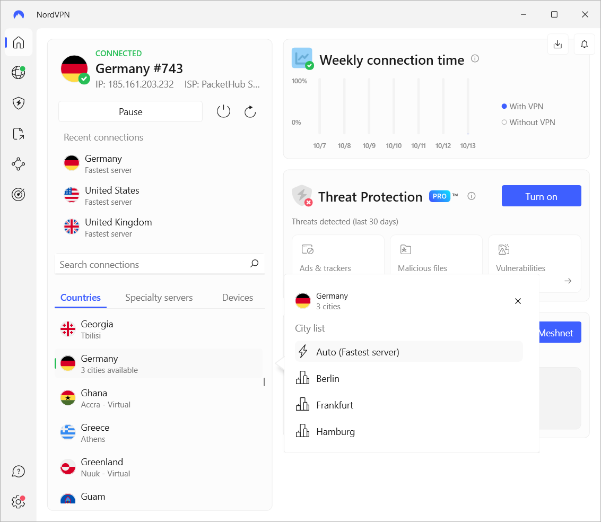
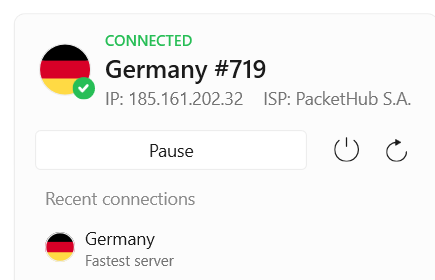
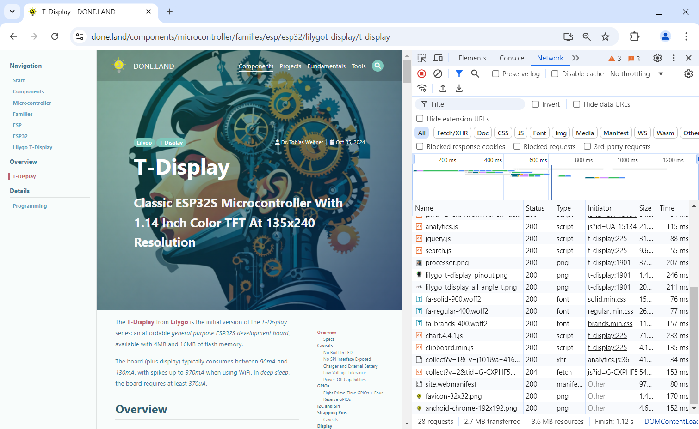

 
# Slow Website

> Why This Website May Be Loading Slow, And What You Can Do To Boost Your Internet 

[done.land](https://done.land/) is a very fast and modern website, designed for speed and rapid response times. It **shouldn't take more than a second** to view a page, including all pictures and assets. Still, a few of you experience *severe* slow-downs, and at times it may take **minutes** until a single page is loaded - not good.

The underlying problem is not *this particular website* - it's rather just a *symptom*, and you may experience other issues with downloads, services, and websites. The issue only affects a few websites, and the severity of the issue may vary during the day or over time.

It took me some time to figure out the cause, and in this article I'll explain both the problem and some great fixes. They won't just speed up *this* website but generally provide you with a snappier and more reliable *Internet experience*.

If your hair is on fire, below is a quick summary.

> [!TIP]
> Some *ISPs* like the *Deutsche Telekom* (and affiliated *ISPs* who are using the same infrastructure) are notorious for causing *routing problems*: when communicating with (predominantly) *US-based networks* like *AWS* or *github*, they may send packages on (very) inefficient routes. This problem might be present when *some* websites and downloads are exceptionally slow for you, while others work normally. Your choices are either to *change your ISP*, or to use a *VPN* like [NordVPN](https://refer-nordvpn.com/DdmJlprBMeZ) (should you decide to use *NordVPN* through this link, you are extending my own paid *NordVPN* by three months at no extra cost for you).

## Ingredients For Fast Internet Experience
Most users focus on their *Internet Service Provider* (*ISP*) when it comes to *fast Internet speed* and a great experience. They pay high monthly fees to get a "fast" *Internet connection*, i.e. *250MBit/s* or even *1GBit/s*. Even then, though, they occasionally experience surprisingly slow websites or downloads  while with other *urls*, the promised *high-speed Internet* works just fine.

To understand why that is, you need to know that there are **two** crucial ingredients for fast Internet, and your *ISP Internet access* is just one of them:

* **Internet Service Provider (ISP):** the company that provides you with a *modem* and physically connects you to the *Internet*. *ISPs* are responsible for taking care of the **last mile**: connecting *your home or smartphone* with all the other networks in the *Internet*. Having a *fast ISP* is your ticket to *entering the Internet in a fast way*. It does not guarantee *fast transfer speeds* **inside** the *Internet*, though.  
* **Routing:** Once your data packages *enter* the *Internet* through your *ISP access point*, they need to get directions on how to travel to the desired target - similar to a navigation system. That's called *Routing*. Routing is just as important as a fast *ISP*. Routing can send your packages to the nearest available *CDN server* (good), or it can route your packages across the globe to the *original webserver* (very bad).

> [!NOTE]
> View it this way: a *Ferrari* (aka *fast ISP*) won't win a race against a *Fiat* (aka *slow ISP*) when the *Ferarri's* navigation system (aka *Routing*) sends it back and forth and across the wildest dirt roads while the *Fiat navigation system* just takes the highway and uses the nearest exit.  

### Why *This* Website May Be Slow
This website is hosted by *AWS*, backed by sophisticated *CDNs* (*Content Delivery Networks*), and uses *static HTML* - all the ingredients for *super fast and super responsive websites*. And indeed, regularly performed global tests prove that this website is speed-wise among the top 5%.

If pages still take painstakenly long, and if you can i.e. see pictures appear line by line, or see missing fonts or icons, then there are only *three* potential issues:

* **Slow ISP/Bad Coverage:** Obviously, if you are using a *very slow ISP*, or if you are currently in an area with *very poor Internet coverage*, it is not surprising to experience slow Internet. In this case though, *all* websites are slow, not just *some*.
* *Slow Hoster:** theoretically, the operator of the Website (which would be *me*) could have choosen a *poor* service provider with slow download speeds and insufficient capacity. In this case though, *everyone* would experience a slow website, not just a *few users*.
* **Bad Routing:** if *you* experience a slow website while others enjoy lightning speed, then *your Routing* is messed up: the data packets travel around the globe and take detours instead of the direct route, and this occurs both on the way *to* the website, and on the way *back to you*. Most other users enjoy *appropriate routing*, and for them, the website responds lightning fast.


## What Does Routing Do?
Without delving too much into networking, when you open a website, your request needs to be transported to the webserver hosting the website, and the website data needs to travel back to you.

The *Internet* uses *data packages* and sends them from server to server, starting with servers close to you, until the data packages finally arrive at the intended target.

So *Routing* on the internet is the process of selecting paths through which data can travel from *you* to the *target* (and vice versa) across many interconnected networks. It works much like a *navigation system* in your car.

### Visualizing Route
You can visualize the *hops* your data packages take, i.e. with `tracert.exe` on *Windows*. Below you see the *route* that was selected for me to reach *done.land*:

````
PS C:\> tracert done.land

Tracing route to done.land [172.67.130.250]
over a maximum of 30 hops:

  1    <1 ms    <1 ms    <1 ms  192.168.68.1
  2     1 ms    <1 ms    <1 ms  speedport.ip [192.168.2.1]
  3     6 ms     5 ms     5 ms  p3e9bf353.dip0.t-ipconnect.de [62.155.243.83]
  4    92 ms    92 ms    92 ms  nyc-sb6-i.NYC.US.NET.DTAG.DE [62.154.5.206]
  5   111 ms    96 ms    96 ms  80.156.160.213
  6    98 ms    98 ms    98 ms  if-ae-0-2.tcore3.njy-newark.as6453.net [216.6.90.14]
  7    97 ms    96 ms    97 ms  66.198.70.2
  8   103 ms    99 ms   100 ms  162.158.61.113
  9    98 ms    97 ms    97 ms  172.67.130.250

Trace complete.
````

Do you see the issue? My packets were routed through my own router to the *Telekom*, then travelled to *New York City* and finally reached some *US servers*.

While it is true that my servers are located in the US, this is *not* where my website data comes from. I am using fast global *CDNs* (*content delivery networks) that operate servers all over the place. *You* should receive my website data from the nearest *CDN server* with lightning speed. Since I am currently located in *Germany*, my packets should definitely **not** cross the *Atlantic*. They should be routed to a *German CDN server*.

Before we look at *why* the routing of some *ISPs* is so insanely off, let's first take a look at the *practical consequences*, and closely examine *why* the website is loading so slowly.


### Debugging Slow Website
Most modern browsers come with advanced debugging tools. In *Chrome* press `F12` to open its debug tools. Then click the tab *Network*, and empty the list of network requests.

Always also clear your browser cache before testing so you are measuring download times rather than using cached elements from memory: in *Chrome*, click the *three-dot* menu, and choose *Delete browsing data...*. It is sufficient to delete the last *24 hours* of cached data.  

#### Navigate To Webpage Under Test
Now, enter the *url* of the website you want to test. I chose a random [*done.land* article](https://done.land/components/microcontroller/families/esp/esp32/lilygot-display/t-display) with a number of images and other resources. You can now watch how the browser downloads all the data that the web page is composed of, and for each resource you see its url, size, and time it took:



In this particular example, downloading the entire web page took impressive *10.4 **minutes***. During this long time, just *1.8MB* data was transferred. That is an average of *2800 bytes per second* on a *wired 250MBit/s* internet connection.

And when you look closely, the download wasn't even successful: one picture did not download and caused some obscure `ERR_QUIC_PROTOCOL_ERROR`.

Obviously, here is something seriously amiss.

### Border Gateway Protocol
*Routing* is complex and consists of many parts. Your *ISP* is responsible for the *Border Gateway Protocol* (*BGP*). It is used to exchange routing information between large networks, or "autonomous systems" (AS), such as *ISPs* (*Internet Service Providers*), big players (such as *AWS*), and most importantly *CDNs* (like *Cloudflare*).

Apparently, for many years, some *ISPs* like the *Deutsche Telekom* in *Germany*, seems to have bad *Peering Agreements*: *ISPs* enter into peering agreements with each other to exchange traffic. If the ISP has poor peering relationships or high costs for certain routes, they might route traffic through less optimal paths to avoid costs, severely impacting speed. 

There are [plenty of discussions in German forums](https://telekomhilft.telekom.de/t5/Festnetz-Internet/Unglaublich-schlechtes-Routing/td-p/6827554) illustrating the problem.

> [!IMPORTANT]
> If you are experiencing slow *done.land* web pages, keep in mind that this is just a *symptom* of a larger problem. It is tricky because only certain networks and content delivery systems are affected. However, even if you are not particular interested in *this site*, you may still want to fix the issue. You'll be surprised how much more enjoyable your *Internet experience* can become, and how much faster some downloads work.


## Solving the Issue
Since the fundamental *routing problem* is caused by the way how your *ISP* directs the data, you have two options:

* **Change ISP:** Change your current *ISP*, and choose a new *ISP*. This may be complicated because of contracts, current infrastructure, and alike. Plus, you would need to make sure that your *new ISP* isn't using crucial infrastructure provided by your *old ISP*.
* **Use VPN:** The easiest solution is to use a *VPN* (*Virtual Private Network*). Basically, you exchange the *routing of your ISP* with the *routing of the VPN*.

### Using VPN
When you use a *VPN*, you still use your *ISP* for the *last mile*. However, you then access the closest (and fastest) possible *VPN server* in your vicinity.

Your data packages then travel within the *VPN* server network. *VPNs* optimize routing for best speed.

Using a VPN has also *security benefits*: since you are *leaving your ISP network* at the first possible exit, your *privacy* is protected.

The downside of *VPNs* is that they are a *paid service* with *monthly fees*. After careful comparison, I personally opted for the basic [NordVPN](https://refer-nordvpn.com/DdmJlprBMeZ) and purchased a *2-year-package* for around €90 in total. It comes with a *30-day money back guarantee so you can test whether it works for you and fixes the speed problems. 

> If you decide to use [NordVPN](https://refer-nordvpn.com/DdmJlprBMeZ), too, and sign up via this link, then this gets me another free three months at no extra cost for you. Consider carefully. I'd greatly appreciate your support.

For me, it solved all speed problems immediately, and I also finally got the transfer and download speeds with some other services that used to be "miraculously slow" at times.

## Walkthrough: NordVPN
Here is a quick walk-through on how to set up and use [NordVPN](https://refer-nordvpn.com/DdmJlprBMeZ).

### Download NordVPN App
Your journey starts with downloading the [NordVPN app](https://nordvpn.com/download/). It is available for *Windows* and other operating systems as well as for smartphones.


After you installed the software, you find links on your *Desktop* and *Start Menu* (respective an *app icon* on your smartphone). When you start the *NordVPN* app, you can either *log in* or [create a NordVPN account (sign up)](https://refer-nordvpn.com/DdmJlprBMeZ). There are different *paid plans* and no *free tier*. If you have no *NordVPN* account yet, I'd greatly appreciate if you used [this link to sign up](https://refer-nordvpn.com/DdmJlprBMeZ) rather than the button in the dialog - with the link you can send me the gratitude of three more months on my own contract, at no extra cost for you.

When you click *Log in*, your browser opens and asks for your *username* and *password*. Once the browser-based authentication succeeds, you return to the *NordVPN app*.


### Select VPN Server
The *NordVPN app* shows your connection status: 

* **Not Connected:** a **red** *Not Connected* reports your current public IP address, and your current *ISP*.
* **Connected:** a **green** *Connected* lists the current *ISP name* which now is no longer the *ISP* that connects your home to the Internet.

To get the maximum speed, select a *VPN server* as close as possible to your current location. Do not use *Quick Connect*, and do not blindly use one of the recommended servers in the top list. 





Rather, in the lower list, select the country where you are currently located, i.e. *Germany*. This adds the country to your *upper list* (your favorites). To *connect* and start using the VPN, click the country in your top list.

> [!TIP]
> When you click the *three-dot menu* to the right of the selected country in the **lower** list, you see the available *cities* in the selected country. By default, *NordVPN* automatically selects the city with the fastest connection to you.

Once you are connected, you should see your *country* and the currently active *ISP* at the top of your window.




## Results of fix
Let's quickly repeat the website tests with the *VPN* active. Here is what the route now looks like:

````
PS> tracert done.land

Tracing route to done.land [188.114.96.4]
over a maximum of 30 hops:

  1    15 ms    15 ms    15 ms  10.5.0.1
  2     *        *        *     Request timed out.
  3     *        *        *     Request timed out.
  4    16 ms    16 ms    15 ms  188.114.96.4

Trace complete.
````

Within just *four* anonymous hops the data packages reached their destination. Note also how the destination IP address has changed. We are now getting the website and resources fron the ultra-fast *CDN*.

Now let's repeat the website test inside *Chrome* (don't forget to clear the browser cache before you test again). Last time, it took over **10 minutes** to fully load the web page.



This time, the same web page appears instantly. After mere *1.12s*, the complete web page and all of its pictures were loaded, and *2.7MB* were transfered. The transfer rate was *2.4MByte/s* (rather than 2.8KB/s as initially), almost *1000x* faster.

> Tags: Website, Slow, VPN, ISP, Router, NordVPN, Peering Agreement, Border Gateway Protocol, BGP, Telekom

[Visit Page on Website](https://done.land/tools/internet?015434101113241156) - created 2024-10-12 - last edited 2024-10-12
