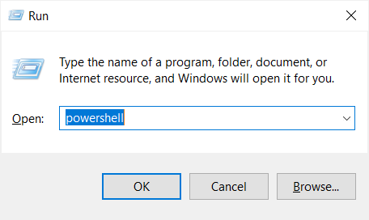
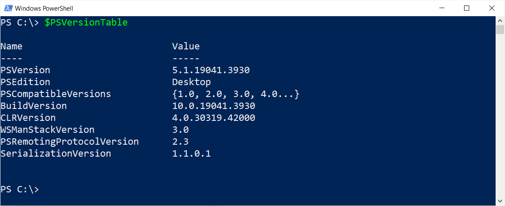
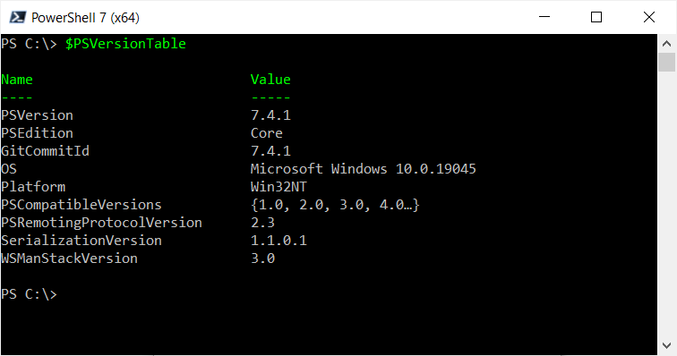

 
# PowerShell

> PowerShell Is A Cross-Platform Scripting Language - Perfect For Creating Tools And Custom Commands


**PowerShell** is a modern scripting language [available](https://github.com/PowerShell/PowerShell/releases) cross-platform for *Windows*, *Linux*, *MacOS* and many other operating systems.

## Installing PowerShell

On *Windows*, you do not necessarily need to install **PowerShell**: *Windows PowerShell* is part of the operating system: press `Win`+`R` to open the *Run* dialog.



Enter `powershell` and press `ENTER`. A *blue* console window opens and is labeled *Windows PowerShell*. This is your *built-in* *Windows* **PowerShell**. It runs **PowerShell** *version 5.1*. 




### PowerShell 7: Cross Platform

On other operating systems (and also on *Windows* if you want to use the *latest* **PowerShell** version), visit [PowerShell Releases](https://github.com/PowerShell/PowerShell/releases). 

Scroll down until you see the item *Assets*. Click to expand.


This opens a list of ready-to-download installation binaries, available for many operating systems and in many formats (*tar.gz*, *zip*, *msi*, *pkg*).

> [!CAUTION]
> Make sure you select the appropriate operating system. For *Windows*, this would be the suffix *win-x64*.

When you download an *archive* format such as *tar.gz* or *zip*, you can use **PowerShell** as a *portable app*. Here is how:

1. Download the appropriate archive file
2. *Unblock* the downloaded file *before* you unpack it: in *Windows*, right-click the downloaded archive file, choose *Properties*, then check *Unblock*.
3. Open the folder with the unpacked files, and launch `pwsh.exe`

The cross-platform **PowerShell** displays as a *black* console. 





> [!NOTE]
> **PowerShell** is actively developed: its *versions* increment rapidly. *Version 7.4.0* as depicted above is probably long outdated and replaced by a higher version number when you read this. 


## Install DoneLandTools

It's extremely *simple* to add new *Done.Land* **PowerShell** commands to your *PowerShell*: the module *DoneLandTools* is available for installation from the Microsoft [PowerShellGallery](https://www.powershellgallery.com/packages/DoneLandTools).

> **PowerShell** comes with a basic set of *general-purpose* commands. You extend them for your *specific needs and use cases* by adding additional *modules* that provide *more specific* commands.

To download and use the *DoneLandTools*, run this line:

```powershell
Install-Module -Name DoneLandTools -Scope CurrentUser -Force
```

> [!TIP]
> The switch `-Force` omits confirmation dialogs. If you'd rather see them, omit `-Force`. Modules are downloaded from the *Microsoft PowerShell Gallery*. Since this is a *public* place, and *Microsoft* is not taking responsibility for any materials you download from there, you need to confirm your choice.

### Module Installation Fails

Should the above command be unable to download the module, check these items:

* **Internet:** obviously you need to have internet access. Try visiting the [PowerShell Gallery](https://www.powershellgallery.com/) directly. 
* **Permissions:** within company networks, access to the gallery may be restricted.
* **Conflicts:** when an *existing* module added commands with the *same name* as commands in *DoneLandTools*, a *name conflict* would occur, and the new module cannot be installed. Either remove the conflicting module that is already present, or add the switch parameter `-AllowClobber` to install the *DoneLandTools* module anyway.
* **Outdated:** *Windows PowerShell* may use outdated libraries. Try updating them using this command: `Install-Module -Name PowerShellGet -Scope CurrentUser -Force`

## DoneLand Commands

To see the new **PowerShell** commands the *DoneLandTools* module provides, run this:

```powershell
Get-Command -Module DoneLandTools
```

```
CommandType Name                      Version Source
----------- ----                      ------- ------
Function    Get-LedResistor           1.0.0   donelandtools
Function    Get-LedStripFramerateInfo 1.0.0   donelandtools
Function    Show-Fat32Converter       1.0.0   donelandtools
```

> [!NOTE]
> The **PowerShell** module *DoneLandTools* is a work in progress. When you download and use it, it may contain *more* then the functions showed here. To *check for updates* and always use the *latest* version, you may want to occasionally run `Update-Module -Name DoneLandTools`.

### Exploring New Commands

All commands come with *help*. To i.e. find out what `Get-LedStripFramerateInfo` can do for you, run the command like this:

```powershell
 Get-LedStripFramerateInfo -?
```

```
NAME
    Get-LedStripFramerateInfo

SYNOPSIS
    Calculates the maximum frame rate possible for a LED strip or the maximum LED that can be used for a desired frame
    rate


SYNTAX
    Get-LedStripFramerateInfo -Framerate <Int32> [-LedPerMeter <Int32>] [-ResetTimeMicroSec <Int32>]
    [-IncludeWhiteLed] [-DataRateKhz <Int32>] [<CommonParameters>]

    Get-LedStripFramerateInfo -LedPerMeter <Int32> [-ResetTimeMicroSec <Int32>] [-IncludeWhiteLed] [-DataRateKhz
    <Int32>] -StripLengthCm <Double> [<CommonParameters>]

    Get-LedStripFramerateInfo [-ResetTimeMicroSec <Int32>] [-IncludeWhiteLed] [-DataRateKhz <Int32>] -TotalLedCount
    <Int32> [<CommonParameters>]


DESCRIPTION
    In WS2182B and similar strings of LED, the one-wire data line has a maximum data transmission rate.
    This command can calculate two things:
    - given the number of LED (or the length and type of LED string), it calculates the maximum possible frame rate
    - given the framerate, it calculates the maximum possible number of LED that you can string together


RELATED LINKS
    URLs to related sites
    The first link is opened by Get-Help -Online Get-LedStripInfo

REMARKS
    To see the examples, type: "get-help Get-LedStripFramerateInfo -examples".
    For more information, type: "get-help Get-LedStripFramerateInfo -detailed".
    For technical information, type: "get-help Get-LedStripFramerateInfo -full".
    For online help, type: "get-help Get-LedStripFramerateInfo -online"
```

This is the *complete* but sometimes *overwhelming* help information. 

> [!TIP]
> At the *bottom* of the help text in the section *Remarks*, you find additional ways of retrieving specific help information that may be more suitable for you. Run `help Get-LedStripFramerateInfo -Online` to open *this* page in your browser.

### Practical Examples

Much more fun are *examples* that show distinct use cases on how to actually run the command. Run this to get the examples for a command: 

```powershell
Get-Help Get-LedStripFramerateInfo -Examples
```

Now you get a list of fun examples that you can try:

```
NAME
    Get-LedStripFramerateInfo

SYNOPSIS
    Calculates the maximum frame rate possible for a LED strip or the maximum LED that can be used for a desired frame
    rate

    -------------------------- EXAMPLE 1 --------------------------

    PS C:\>Get-LedStripFramerateInfo -TotalLedCount 100

    Calculates the maximum framerate achievable for 100 RGB LEDs in a string:

    LedCount Type Framerate DataTime (us)
    -------- ---- --------- -------------
         100 RGB        305       0.00328


    -------------------------- EXAMPLE 2 --------------------------

    PS C:\>Get-LedStripFramerateInfo -TotalLedCount 100 -IncludeWhiteLed

    Calculates the maximum framerate achievable for 100 RGBW LEDs in a string (including separate white, 32 instead of 24 bit):

    LedCount Type Framerate DataTime (us)
    -------- ---- --------- -------------
         100 RGBW       234       0.00428


    -------------------------- EXAMPLE 3 --------------------------

    PS C:\>60,90,120,144 | Get-LedStripFramerateInfo -StripLengthCm 150

    Calculates the maximum framerates for a strip of 150cm length and different LED/m:

    LedCount Type Framerate DataTime (us)
    -------- ---- --------- -------------
      90     RGB  336       0.00298
     135     RGB  231       0.00433
     180     RGB  176       0.00568
     216     RGB  148       0.00676


    -------------------------- EXAMPLE 4 --------------------------

    PS C:\>Get-LedStripFramerateInfo -Framerate 60

    Determines the maximum number of LED that can be used to achieve a 60Hz frame rate:

    LedCount Type StripType StripLengthCm
    -------- ---- --------- -------------
         546 RGB  n/a       n/a


    -------------------------- EXAMPLE 5 --------------------------

    PS C:\>Get-LedStripFramerateInfo -Framerate 30 -LedPerMeter 144

    Determines the maximum length for a LED strip using 144 LED/m to achieve a 30Hz frame rate:

    LedCount Type StripType StripLengthCm
    -------- ---- --------- -------------
        1102 RGB  144LED/m          765.3


    -------------------------- EXAMPLE 6 --------------------------

    PS C:\>200,100,60,30,15 | Get-LedStripFramerateInfo -LedPerMeter 144

    Calculates the maximum length of a 144LED/m LED strip for various frame rates:

    LedCount Type StripType StripLengthCm
    -------- ---- --------- -------------
         157 RGB  144LED/m            109
         324 RGB  144LED/m            225
         546 RGB  144LED/m          379.2
        1102 RGB  144LED/m          765.3
        2213 RGB  144LED/m         1536.8
```

> Tags: PowerShell, Module, Install, Tools

[Visit Page on Website](https://done.land/tools/powershell?911673031121245307) - created 2024-03-21
