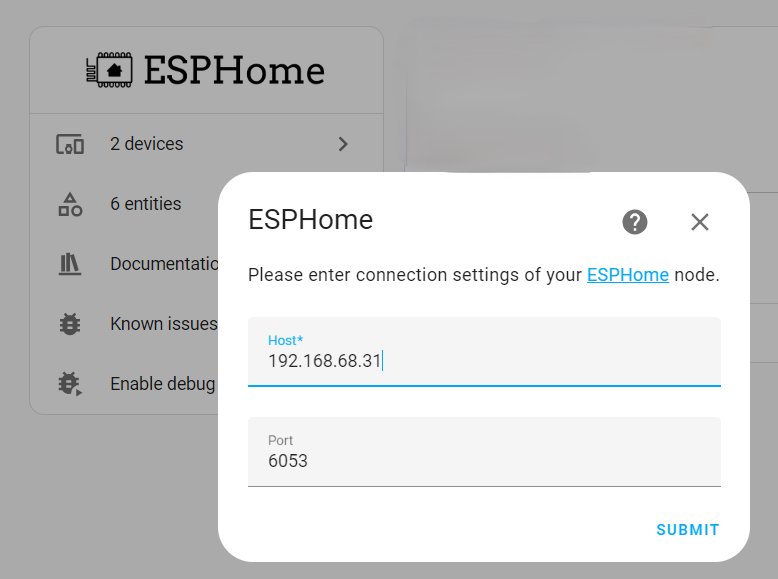

 
# Add To Home Assistant

> Adding ESPHome Device To Home Assistant ANd Turning It Into A Fully Manageable Sensor Or Actor

While it is not required, adding an *ESPHome device* to *Home Assistant* opens a whole new range of options.

Benefits of Home Assistant Integration
 

*ESPHome* runs stand-alone and does not require *Home Assistant*.

*Home Assistant* makes *ESPHome* just better. Without it, you need to add *user interfaces* and *automation logic* yourself. 

Adding *ESPHome* devices to *Home Assistant* turns your device into a "lego" piece, and it can now be used in conjunction with all the other devices you may have set up. No longer does your *ESPHome device* need to handle everything itself. 

You may for example want to create a really simple *CO2 sensor* that can just collect CO2 environmental data, and delegate the *display of these values* to a *Home Assistant dashboard* where you collect and display the environmental data from all of your sensor devices.

Or you may want to create a really simple *ESPHome push button device* that you can place anywhere. By adding it to *Home Assistant*, the push button device does not need to also implement the effector device. Instead, you can device yourself which other device the push button should control.

## Auto-Discovery

When all is configured correctly, your *ESPHome device* is automatically discovered by *Home Assistant* seconds after it goes online. If you live in this perfect world, the process looks like this:

1. Click *Notifications* in the *Home Assistant* side bar, then *check it out*, to see the newly discovered device:

  

2. Click *CONFIGURE* to add the new *push button device* to *Home Assistant*. When you confirm this, the device is added, and you can optionally assign it a location.

  

If *Auto-Discovery* does not work for you, add the *ESPHome device* manually. For this, you need to know its *IP address*.

Manually Adding ESPHome Device
 

If you don't know the *IP address* assigned to the *ESPHome device* you want to add, go to *ESPHome dashboard*, identify the tile for your *ESPHome device*, and click *LOGS*.

This opens a window with the device logs, and in this log you find the currently assigned IP address.

  
Once you know the devices' currently assigned *IP address*, follow these steps:

1. In *Home Assistant*, go to *Settings*, then *Devices & services*, then click on the integration *ESPHome*. 
2. On the *ESPHpme* page, click *ADD DEVICE*:

  

3. A dialog opens. As *Host*, enter the currently assigned *IP address* of your *ESPHome device*. Leave the port at *6503*, and click *SUBMIT*.

## Why Auto-Discovery May Fail
If you configured *Home Assistant*, *ESPHome*, and your *network* correctly, you should never need to manually add *ESPHome devices* to *Home Assistant*. The built-in *Auto-Discovery* should do this automatically.

So if *Auto´-Discovery* does not work, you may work around it by manually adding the device, but it is a much better idea to identify the underlying configuration issue that is preventing *Auto-Discovery* from working.

### mDNS Is Critical
*ESPHome* relies on *mDNS* names to identify and access devices. When *mDNS* is not working (correctly), *ESPHome* may not label your *ESPHome device* as *online*, and it may not get auto-discovered.

When you add the device *manually* by specifying its *IP address*, you are effectively bypassing *mDNS*. That's why in some instances, *ESPHome devices* can be added manually via *IP address* but cannot be auto-discovered.

The correct approach is to make sure that *mDNS* works for you. Typically, *mDNS* breaks when the computer that is running *ESPHome* is not connected **to the same network** as the *ESPHome devices*.

### Check Network Configuration
Typically, this occurs when you have connected the computer that is running *ESPHome* to a *wired* network. 

When your *WiFi* is running in *Router* mode (vs. *Access Point* mode), it runs a *separate* network. *mDNS* cannot traverse to the other network.

> [!IMPORTANT:]
> **Do not** light-heartedly switch your *WiFi* from *Router* mode to *Access Point* mode as this may have serious consequences for your existing network.     

Often the easiest way to heal the problem is to connect the network cable from your computer that runs *ESPHome* to your *wireless network* - either by using a cheap *WiFi Repeater* with a connector for a network cable, or by plugging the network cable right into your *WiFi box* (provided it has connectors for this).

> Tags: EspHome, Home Assistant, Discovery, Auto-Discovery, Adding

