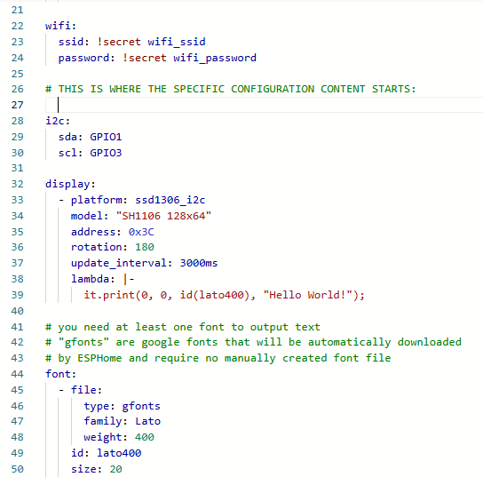

 
# Compile ESPHome Configuration

> How To Turn A ESPHome Configuration Into A Compiled Firmware And Upload It To Your Microcontroller

As a beginner, you may be confused how *ESPHome* configurations work, and what the steps are to get these configurations compiled and uploaded to your microcontroller. That's why I'll review the bare bone steps.

## What is a ESPHome Configuration?
If you already know what a *ESPHome configuration* is, then skip this part and directly move to the next one.

### Creating Firmware Without Programming
*ESPHome* is a new way of writing microcontroller code. Actually, you do not even *write the code yourself*. You simply *describe your hardware setup* with a *configuration*. Such a configuration might look like this:

````
# define the I2C pins that you use 
# to connect the display to your microcontroller
i2c:
  sda: GPIO21
  scl: GPIO22

display:
  - platform: ssd1306_i2c
    model: "SH1106 128x64"  # 0.96/1.3" 128x64 OLED display
    address: 0x3C           # default address, use 0x3D if default fails
    rotation: 180           # rotate content if needed
    update_interval: 3000ms # 1s is default (1000ms)
    lambda: |-
      it.print(0, 0, id(lato400), "Hello World!");

# you need at least one font to output text
font:
  - file:
      type: gfonts
      family: Lato
      weight: 400
    id: lato400
    size: 20
````

This configuration would be sufficient to output text to a *OLED display* that is connected via *I2C* to your microcontroller, using *GPIO21* for *SDA* and *GPIO22* for *SCL*.


### No Coding, Just Declaring
As you see, you do not need to program, and you can easily adjust and adapt the configuration:

* **I2C:** this particular configuration was made for a [ESP32](https://done.land/components/microcontroller/families/esp/esp32/developmentboards/esp32s/) and is using the default *I2C GPIOs* on this microcontroller. If you use a different board, or would like to use different *GPIOs*, then simply change the assignments in the configuration - done.
* **Display:** Instead of having to find an appropriate *C++* library, then figuring out how to configure it, *ESPHome* uses a wealth of *components*, and the *Display* component handles all kinds of displays, be it *OLED*, *TFT*, big or small. The *platform* then defines the display driver, and the [ssd1306_i2c](https://esphome.io/components/display/ssd1306.html) platform is good for almost all monochrome OLED displays, not just those using the [SSD1306](https://done.land/components/humaninterface/display/oled/ssd1306/) driver. *Model* defines the actual *OLED display* you want to use, and in this example, one of the many affordable *0.96"/1.3" 128x64 monochrome OLEDs* based on the *SH1106* driver was specified.
* **Font:** even font file handling is done for you: if you select the type *gfont*, you can specify any *Google Font*, and *ESPHome* automatically downloads the font for you and includes it into your firmware.

## Prerequisites: The Development Environment

Just like you would install [ArduinoIDE](https://www.arduino.cc/en/software) or [platformio](https://platformio.org/) if you wanted to write and compile *C++ source code*, you need a software to use *ESPHome configurations*, too. So you need to install the free *ESPHome* first. 

### Installing ESPHome
There are two ways how you can [install ESPHome](https://done.land/tools/software/esphome/#installing-esphome):

* [Stand-Alone:](https://done.land/tools/software/esphome/#installing-stand-alone-esphome-instance) download and install the software directly onto your PC. This requires a few steps as *ESPHome* really is a *Python script*, and you might want to also add a slick *GUI* on top of this.
* [Home Assistant](https://done.land/tools/software/esphome/#installing-esphome) if you are running [Home Assistant](https://done.land/tools/software/homeassistant/) already, then adding *ESPHome* to it is a snap: simply click [this link](https://my.home-assistant.io/redirect/supervisor_addon/?addon=5c53de3b_esphome&repository_url=https%3A%2F%2Fgithub.com%2Fesphome%2Fhome-assistant-addon). If you are *not* running *Home Assistant* (or don't even know what it is), you might want to [inform yourself](https://done.land/tools/software/homeassistant/). *ESPHome* and *Home Assistant* complement each other perfectly.


> [!NOTE]
> The remaining part assumes that you have installed *ESPHome* and know how to start it. When you install *ESPHome manually*, it is assumed that you also installed its *GUI*.

## Turning A Configuration Into A Firmware

With the prerequisites in place, let's take a look how simple it now is for you to create a new firmware. Let's assume you have hooked up a OLED display to your microcontroller and would like to use it.

Here are the three simple steps:

1. Add a new generic device to *ESPHome*. This device represents your microcontroller board that you want to program.
2. Edit the device configuration, and paste in the specific configuration(s) you want to run on your device.
3. Install the configuration: *ESPHome* converts your configuration file into a firmware binary and uploads it to your microcontroller.


### 1. Add New Device
First, add a new device in your *ESPHome dashboard*:

1. Visit the *ESPHome dashboard*, and add a *new device*. 
    * *Local Installation:** open your browser, and navigate to the local *ESPHome Webserver* on port *6052*, then click *NEW DEVICE* in the lower right corner:

        

    * *Home Assistant:** navigate to your *Home Assistant* web interface, select *ESPHome* (or *ESPHome Builder* as it is called in newer versions now), then click *NEW DEVICE* in the lower right corner:

        


2. A wizard opens. Click *CONTINUE*:
    
    

3. Assign a name to your new device. In my example, I am calling it *CO2 Sensor #1* because I want the OLED display to later show sensor readings from a CO2 sensor. In a nutshell, assign a meaningful name that you don't need to change later:

    

4. The new configuration will be created, and a secret key is generated that will be used to communicate wirelessly with your device later. You do not need to save it anywhere as *ESPHome* saves it automatically. Click *SKIP*.

    

### 2. Edit Configuration

In your *ESPHome dashboard*, you now see your new device tile. Click **EDIT** to open the configuration editor.

You now see the generic [default configuration](https://done.land/tools/software/esphome/introduction/defaultconfiguration/) which defines your microcontroller and crucial properties such as your *WLAN details* and device passwords.

Typically, you won't mess with this auto-generated part and just leave it as is. Once you are more familiar with *ESPHome*, you can start optimizing by *removing default parts* that you don't need, i.e. the *captive portal* and *wifi fallback hotspot*. But for now, and to minimize failure points, leave everything as it is.

Your *specific configuration(s)* can now be **appended** to the default configuration: just paste our sample configuration at the end of the default configuration:



Once done, review your specific configuration, and make sure all settings are correct. For example, in the picture *I2C settings* were already adapted to run on an *ESP32-C3*, and in this particular case use GPIO01 for *SDA* and GPIO3 for *SCL*

If everything looks right, click *SAVE* in the upper right corner of the window.

> [!IMPORTANT]
> If you just close the editor window without explictly clicking *SAVE*, your edits are lost without warning.

### 3. Uploading Firmware

Now it is time to convert your *configuration* into a binary firmware file, and upload it to your microcontroller.

In your *ESPHome dashboard*, look again at the tile that represents your newly created device. Instead of clicking *EDIT* again, this time click the three dot menu, and choose *INSTALL*.

> [!TIP]
> With the editor window still open, you can also click *INSTALL* instead of *SAVE* to both save and install.

You are now presented with a few options on how to upload the firmware to your microcontroller:


* **Wirelessly:** this is the most convenient option however it works only once you have uploaded the firmware at least once. 
* **Plug into this computer:** this option is right if you run *ESPHome* locally. Plug in your microcontroller via USB cable.
* **Plug into the computer running ESP Home Dashboard:** this option is right if you run *ESPHome* as part of *Home Assistant*. Plug your microcontroller into the computer that is running *Home Assistant*, i.e. a *Raspberry Pi*, or whatever server you use.
* **Manual Download:** download the binary firmware file to your computer. You could then use tools like the [Adafruit ESP Tool](https://adafruit.github.io/Adafruit_WebSerial_ESPTool/) to connect to your microcontroller, and manually upload the firmware file.

Once the firmware is uploaded, your microcontroller starts executing your firmware, and if you have followed closely and wired up a OLED display, it should now greet you with a text.

> Tags: ESPHome, Configuration, HowTo, Firmware, Upload

[Visit Page on Website](https://done.land/tools/software/esphome/compileconfiguration?787084011911251558) - created 2025-01-10 - last edited 2025-01-10
