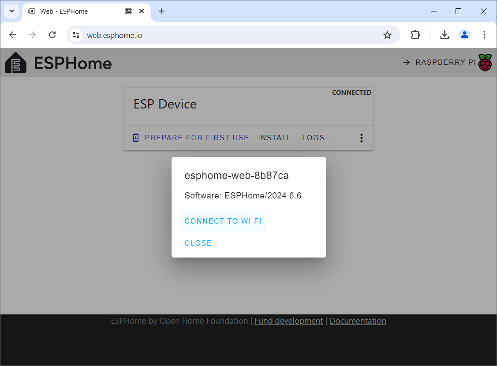

 
# Configuring WiFi

> Making Sure Your ESPHome Device Knows How To Connect To Your WiFi

Typically, when you create your own *firmware*, you have added the *WiFi access parameters* to your configuration, so your device connects automatically.

If you have just *provisioned* the device, or if *WiFi* has changed for some reason and you have no access to your *ESPHome dashboard*, then you can always reconfigure your device.

> [!IMPORTANT]
> Manually setting the *WiFi access parameters* is mandatory for *provisioned devices* (where you just installed the generic *ESPHome firmware*). Only when a device connects to your *WiFi* can it be auto-detected by *ESPHome* and *Home Assistant*.

## Connecting New Device To WiFi

If you used the *default provisioning firmware* downloaded from *esphome.io*, the device does not yet know how to connect to your *WiFi*.

Part of the default *ESPHome* provisioning firmware is *improv_serial* (*improv* via *BLE* is not available since *ESP32 S2* does not support *bluetooth*). 

This is how you set (or change) *WiFi access*:

1. Connect the microcontroller via *USB cable* to your computer. **Do not** enable *firmware update mode*. If in doubt, press the *reset* button once. 

2. Make sure you closed all other tools (i.e. the *Adafruit* flasher). Then open the[ESPHome Web Tools](https://web.esphome.io/) in your browser.

3. Click *CONNECT*, and select the microcontroller in the dialog. Then click the *three dot* menu and choose *Configure Wi-Fi*.

4. A dialog opens. Note the *temporary device name* (i.e. *esphome-web-8b87ca*). With this name will the device surface in *ESPHome Dashboard* once you configured *WiFi*.

5. Click *CONNECT TO WI-FI*, select the *WiFi SSID* you want to connect to, and click *CONNECT*. After a few seconds, you get a confirmation that the device is now fully configured.

> Tags: EspHome, WiFi, Improv

[Visit Page on Website](https://done.land/tools/software/esphome/configuringwifi?051647071511241259) - created 2024-07-06 - last edited 2024-07-10
