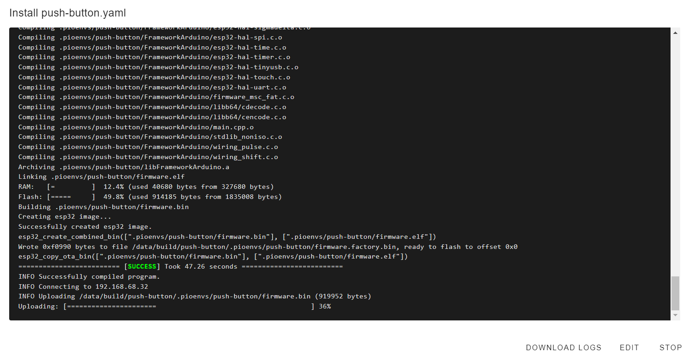

 
# Push Button

> Controlling Any Device Via Physical Push Buttons

In this very simple example, a *push button* is connected to a microcontroller. When the push button is pressed, it sends a message to *Home Assistant*, enabling you to physically control any other device.

## Use Case
This example is my prototype for automating my lab. I wanted to build a physical dashboard with ten push buttons that would then control ten "smart" plugs. This way, I can control the devices in my lab (i.e. 3D printer, oscilloscope, bench supply, etc) from one simple-to-use physical control panel.

In this example, I am using a *ESP32 DevKitC V4* board, and the push button is connected to *GPIO4*. You can of course adapt this to just about any microcontroller board and *GPIO*.

## Implementation

The implementation as a *ESPHome device* always consists of two steps:

* **Hardware Schematics:** design the hardware circuitry (just as you would in conventional programming projects)
* **Translate Hardware To Configuration:** instead of programming, you *describe* your hardware in the *ESPHome device configuration*.


## Hardware Schematics
Here is the hardware schematic for this very simple project:


* When the user presses the *push button*, *GPIO4* is pulled *low*. 

* When the user *releases* the button, the pin is *floating*. So the pin needs to be configured as *input* and *pullup* (activating the *ESP32* internal pullup resistor to keep the pin *high* when the button is not pressed).

## Translate To Configuration

In more conventional *IDEs* like *Arduino IDE* or *platformio*, you would now open the code editor and start programming.

In *ESPHome*, you are *describing* your hardware details and requirements by as adding lines to the end of your existing *default configuration*. 

**Do not replace your default configuration! *Append* the hardware information.**


### Fundamental Wiring
The fundamental wiring translates like this:

````
binary_sensor:
  - platform: gpio
    pin: GPIO4
    name: Pushbutton1
````

> [!TIP]
> Edit your *configuration* right inside the web editor. This way, you get invaluable *tooltips* and *IntelliSense-like* auto-completion. Press `Ctrl` + `Space` to re-open *Intellisense*-dialogs if you accidentally closed them.    


#### Component **binary_sensor**
A [binary_sensor:](https://esphome.io/components/binary_sensor/gpio.html#gpio-binary-sensor) describes a component that can have exactly *two states*. The details (i.e. the *GPIO* the component is connected to) are specified as *indented* properties: 

* *platform:* always *GPIO*
* *pin:* the *pin number* you are using
* *name:* the *name* you want to assign to this *entity*. This will be the name that you can later use in *HomeAssistant* to access the push button.

However, I haven't yet completely described my requirements. The pin needs to be an *input*, and it should use a *pullup resistor*.


### Fine-Tuning Components
There are a few more things that need to be added to the *configuration*:

* The *GPIO* needs to activate its pullup resistor (so the GPIO is not in *floating* (undefined) state when the button is *not* pressed)
* We need *debouncing* because mechanical switches tend to *vibrate* and can produce unwanted high-frequency signals
* According to the *schematics*, the button is connected to *GND*, so the *GPIO* is *high* when the button is *not* pressed, and it is *low* when the button *is* pressed. We need to *invert* this because we want some action to occur when the button is pressed, so it should be *high* when it is *active*, not vice versa.

All of this can be surprisingly easily adjusted. *ESPHome components* like [binary_sensor](https://esphome.io/guides/configuration-types#config-pin-schema) are one-stop solutions that contain all the functionality typically needed. 

You don't need to write a single line of code to meet both of the above requirements. Just add these lines:


````
binary_sensor:
  - platform: gpio
    name: Pushbutton1
    pin: 
        number: GPIO4
        inverted: true
        mode:
          input: true
          pullup: true
    filters: 
      - delayed_on: 10ms
      - delayed_off: 10ms
````

Here is what the additional lines do:

* **inverted:** inverts the *GPIO* signal
* **pullup:** activates the internal *pullup resistor*. When the pin has no contact, it is pulled *high*
* **delayed_on/delayed_off:** a state change must occur for at least the specified amount of time, effectively *debouncing* the button

> [!TIP]
> It is best to first focus on *one ESPHome component* only, i.e. the *binary_sensor*. Visit the [documentation](https://esphome.io/components/binary_sensor/gpio.html#gpio-binary-sensor) and the [pin schema](https://esphome.io/guides/configuration-types#config-pin-schema) to find out what the component can do for you.


When you are done updating your *configuration*, click *SAVE* and then close the editor to return to the *ESPHome Dashboard*.


### Validate Configuration
Before you do anything else, *validate* your *configuration*: this makes sure your updated *configuration* does not contain errors. Click the *three-dot* menu, and choose *Validate*. 


If there are issues with your *configuration*, you get error messages similar to this one:

````
mapping values are not allowed here
  in "/config/esphome/push-button.yaml", line 35, column 18
````

The most likely cause are wrong *indentation*, wrong *keyword order*, and missing *hyphens*. Always review the *ESPHome documentation* for the component you are using to see which keywords belong to the same entity.


## Uploading New Firmware
Once validated, click the *three dot* menu on the *ESPHome tile* and click *Install*, then *Wirelessly*, to automatically build and upload the firmware for your updated configuration.




Once uploaded, click *STOP* to close the terminal window, then visit the *ESPHome Dashboard* and verify that your updated device is marked *ONLINE*.

## Testing Device

Sometimes - as in this case - the device cannot be tested directly. When you press the button, there is no visible response.

To test and diagnose a device in *Home Assistant*, click *Developer tools* in the sidebar, then click the tab *STATES*.


> [!IMPORTANT]
> If your sensor does not show up, you might [have to add it to *Home Assistant*](https://done.land/tools/software/esphome/addtohomeassistant) first. Check *Notifications* in the sidebar to see whether *Home Assistant* has auto-detected your device, and add it to *Home Assistant*.


Next, click the text box below *Entity*, and enter part of the name of your device. You can now see its *entities*:


The *push button* is represented by the entity *binary_sensor.push_button_pushbutton1*, and its *State* is *off*.

This is correct: the push button is *not* pressed, so the *GPIO* is *pulled high*, and since the *configuration* added *inverted:true*, the current state is *low*.

Once you press the push button, the value of *State* should immediately change from *false* to *true*. If it does not, you need to review your wiring and your *configuration* and make sure both match, and you specified the correct *GPIO pin*.


> Tags: EspHome, Home Assistant, Push Button, Configuration

[Visit Page on Website](https://done.land/tools/software/esphome/editconfiguration/pushbutton?114898061229240725) - created 2024-06-24 - last edited 2024-07-02
