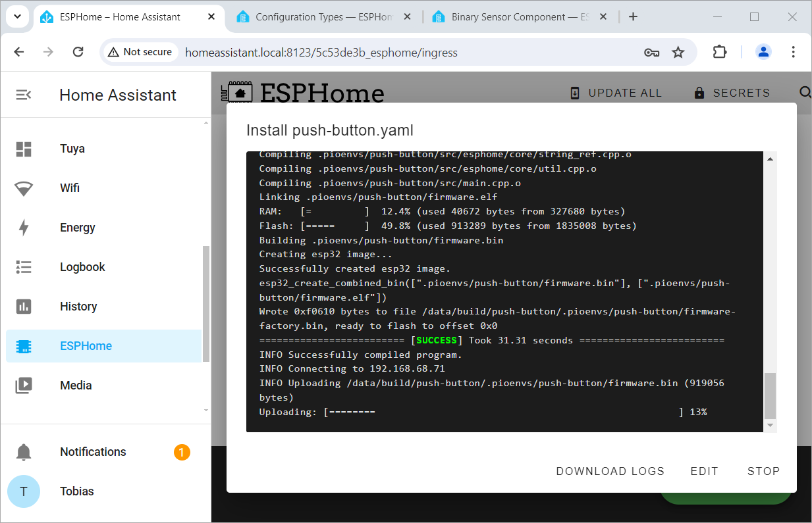

 
# Edit Configuration

> Programming By Describing Your Hardware Instead Of Writing Code 


When you created a new device in *ESPHome*, you are now able to *program* its microcontroller - without actually programming a single line of code. 


The *configuration* tells *ESPHome* all it needs to know to automatically program the *firmware*.

When you update the *configuration* and push the updated configuration to your *microcontroller* (i.e. by using convenient *over-the-air* (*OTA*) wireless updates), you can easily re-program your microcontroller any time. 


## Prerequisites

This article deals with *changing and updating* a *configuration*. It assumes that you already did this:

* **ESPHome installed:** *ESPHome* should be up and running already, either as part of *Home Assistant*, or *stand-alone*
* **New Device created:** You created a *new device* inside the *ESPHome Dashboard* and ensured that your new device is marked as *ONLINE*.  

<details><summary>Recap: How To Successfully Provision A New EspHome Device</summary><br/>   

Let's recap the process of *initializing* a new microcontroller in *ESPHome*:

1. **Create New Device:** inside the *ESPHome Dashboard*, create a new device during which you will be asked to *name* your project, and to select the type of *microcontroller* you are using. At the end of the creation process, the dialog offers to *Install* the created firmware to your microcontroller. Choose *Skip*.

2. Microcontrollers that you have previously provisioned and that are powered on will be marked with *ONLINE* in the tiles' upper right corner. Your newly added *configuration* hasn't yet been uploaded to any microcontroller, so it is obviously still marked as *OFFLINE*:    


3. Now your actual microcontroller is provisioned: the automatically created *firmware* needs to be uploaded for the first time. This initial provisioning requires that you connect the microcontroller via *USB cable* to the computer running *ESPHome*. Then click the *three dot* menu, and choose *Install*:


3. This invokes the *firmware upload tool*. Choose *Plug into the computer running ESPHome Dashboard*, and select the *USB port* the microcontroller is connected to:


4. Now the *firmware* is compiled and will be uploaded to your microcontroller. You see a terminal window that logs every step, similar to what you would see in a manual *IDE* like *platformio*.


5. In the dialog showing the terminal window, click *STOP* to no longer listen to the status messages. In your *ESPHome Dashboard*, your microcontroller will now be marked *ONLINE*: it is now running the *ESPHome firmware* that you just uploaded.


</details>

## Opening The Configuration

To open and view the *configuration* of an *ESPHome device*, click *EDIT*:


When you freshly initialized a new *microcontroller*, 


This opens an editor and shows the current *configuration*. 

### Default Configuration

When you open the *configuration* of a new *ESPHome device* for the first time, its *configuration* consists of just the default informaation and may look similar to this:


````
esphome:
  name: push-button
  friendly_name: Push Button

esp32:
  board: esp32dev
  framework:
    type: arduino

# Enable logging
logger:

# Enable Home Assistant API
api:
  encryption:
    key: "LJ7wNffXscLySBpU3EUMMNGZs9WIP6GkGWtXukteh+s="

ota:
  password: "6b38baa123911afe81991f681a649078"

wifi:
  ssid: !secret wifi_ssid
  password: !secret wifi_password

  # Enable fallback hotspot (captive portal) in case wifi connection fails
  ap:
    ssid: "Push-Button Fallback Hotspot"
    password: "ItWAchCo3PPo"

captive_portal:
````

You don't necessarily need to touch these entries. 

> [!TIP:]
> Hover over items in the *configuration* to view *tooltips* that explain in detail what these items do.    


<details><summary>Here is what the default configuration items do:</summary><br/>


* **esphome:**
  * *name:* *mDNS* network name that is assigned to the device. It is derived from your project name. Spaces and special characters are replaced.
  * *friendly name:* clear-text name that appears in the *ESPHome dashboard*. 

* **esp32:** (this can be a different item when you have selected a different microcontroller)
  * *board:* the type of microcontroller board. *esp32dev* is the default configuration for generic *ESP32* boards.
  * *framework:* the type of programming framework to use. By default, *ESPHome* uses *Arduino*, but you could also use *ESP-IDF* (the ESP vendors' own programming environment)

* **logger:** by default, all messages with a severity of *DEBUG* or higher are logged through the serial port. You can [adjust](https://esphome.io/components/logger.html#logger-component) these settings, i.e. for more verbose logging.

* **api:** specifies an *encryption key* that is required whenever you want to communicate wirelessly with the microcontroller via the *ESPHome API*. This key is automatically generated and stored for you. It must match the key inside the *firmware* that was uploaded to your microcontroller.   

* **ota:** defines the secret password for *over-the-air* firmware updates. This password must match the password defined in the uploaded firmware. *ESPHome* can then upload future *firmware updates* conveniently via *WiFi*.   

#### IMPORTANT: Breaking Change
Previously, *OTA* was defined in this way:

````
ota:
  password: "..."
````

Starting with *ESPHome 2024.6.0*, this entry now must look like this:

````
ota:
  - platform: esphome
    password: "..."
````

If you are using older configurations, it is sufficient to add `- platform: esphome` to make sure your configuration compiles with the current versions of *ESPHome*.


* **wifi:** defines the access parameters for your home *WiFi*. The actual *SSID* and *password* are stored globaly in the secret store.

  * *ap:** if your microcontroller is unable to connect to your *home Wifi* for whatever reason, the *ESPHome firmware* automatically opens its own *WiFi access point* (*hotspot*). 

* **captive_portal:** when this component is part of your *configuration*, it instructs your microcontroller to provide a web portal that you can use to change the *WiFi settings* or manually upload *new firmware*. The *captive portal* is activated when the regular *WiFi* cannot be reached, and can be accessed via the *hotspot* that is defined in *ap:*. There are no configuration settings for this item.


</details>

## Editing Configuration
The initial *configuration* ensures that your microcontroller can be accessed wirelessly, but it doesn't do anything (yet).


### Push Button Example Project
To actually do useful work, you need to *describe* your hardware setup.

Let's assume you want to hook up a *push button* to your *microcontroller*, and any time the user presses this button, you want something to happen.


In this example, I am using a *ESP32 DevKitC V4* board, and the push button is connected to *GPIO4*. You can of course adapt this to just about any microcontroller board and *GPIO*.

Here is the hardware schematic:


Basically, when the user presses the *push button*, *GPIO4* is pulled *low*. When the user *releases* the button, the pin is *floating*. So the pin needs to be configured as *input* and *pullup* (activating the *ESP32* internal pullup resistor to keep the pin *high* when the button is not pressed).

### Describing The Hardware

In more conventional *IDEs* like *Arduino IDE* or *platformio*, you would now open the code editor and start programming.

In *ESPHome*, you are *describing* your hardware details and requirements. This is as simple as adding these lines to the end of your existing *configuration*:

````
binary_sensor:
  - platform: gpio
    pin: GPIO4
    name: Pushbutton1
````

> [!TIP]
> Edit your *configuration* right inside the web editor. This way, you get invaluable *tooltips* and *IntelliSense-like* auto-completion. Press `Ctrl` + `Space` to re-open *Intellisense*-dialogs if you accidentally closed them.    


#### Component **binary_sensor**
*ESPHome* takes care of all of the *programming tasks* in the background and just asks you to provide the details:

* [binary_sensor:](https://esphome.io/components/binary_sensor/gpio.html#gpio-binary-sensor) a built-in component that knows how to deal with sensors that have exactly *two states* (i.e. *on* and *off*, just like a *push button*)   
  * *platform:* always *GPIO*
  * *pin:* the *pin number* you are using
  * *name:* the *name* you want to assign to this *entity*. This will be the name that you can later use in *HomeAssistant* to access the push button.

However, I haven't yet completely described my requirements. The pin needs to be an *input*, and it should use a *pullup resistor*.

### Investigating Components

The fundamental purpose of *ESPHome components* (like *binary_sensor*) is to provide all the *default functionality* that you may require - so you can focus entirely on your specific hardware setup.

> [!TIP]
> If you are new to *ESPHome*, stick to *one* component, like *binary_sensor*. Read the [documentation](https://esphome.io/guides/configuration-types#config-pin-schema), and make yourself at home by investigating all of its capabilities and options.   

#### Pullup Resistor
As it turns out, activating the *input* mode and *pullup resistor* is just a matter of adding the appropriate options to your *configuration*:

````
binary_sensor:
  - platform: gpio
    pin: GPIO4
    name: Pushbutton1
    mode:
        input: true
        pullup: true
````

#### Debouncing
While at it, we can also take care of a common issue with mechanical buttons: *debouncing*. Mechanical buttons tend to *bounce*: when the user activates the button, its contacts  vibrate and can cause multiple *on* and *off* signals in rapid succession until a solid contact is made.

The component *binary_sensor* specializes in buttons, so it can take care of *debouncing* as well by setting a time limit: only when the button was activated (or released) for a given time will it count as a signal change.

Here is my complete *configuration* for the button:

````
binary_sensor:
  - platform: gpio
    pin: GPIO4
         inverted: true
    name: Pushbutton1
    filters: - delayed_on: 10ms
             - delayed_off: 10ms
    mode:
        input: true
        pullup: true
````

> [!NOTE]
> I added *inverted: true* because physically, the pin is *high* when the push button is *pressed*, and *low* when it is *released*. I would like this to be just the opposite: *high* when the button is pressed.     


### Verifying Configuration
When you are done updating your *configuration*, click *SAVE* and then close the editor to return to the *ESPHome Dashboard*.

Before you do anything else, as final step you should *validate* your *configuration*: this makes sure your updated *configuration* does not contain errors.

Click the *three-dot* menu, and choose *Validate*. If there are issues with your *configuration*, you get error messages similar to this one:

````
mapping values are not allowed here
  in "/config/esphome/push-button.yaml", line 35, column 18
````

In case of errors, close the dialog, and click *EDIT* again to re-open the *configuration* in the editor.

#### Indentation And Grouping Matters
The most common source of errors are *wrong indentations* and *wrong grouping* Indentations *structure* the YAML document, and *grouping* makes sure items are interpreted correctly.

Put differently, your *configuration* is really a *hierarchical tree*, and each *parent* must support the *child elements* you specify.

This is one of the common entry hurdles when you are new to *ESPHome* but becomes second nature quickly. Just make sure you take a minute and [consult the documentation](https://esphome.io/components/binary_sensor/index.html) for the *ESPHome component* you are intending to use.

#### Chaotic Configuration Without Formal Structure
Compare the *beginners configuration* that I used above and that is full of indentation and grouping issues:

````
binary_sensor:
  - platform: gpio
    pin: GPIO4
         inverted: true
    name: Pushbutton1
    filters: - delayed_on: 10ms
             - delayed_off: 10ms
    mode:
        input: true
        pullup: true
````

#### Correctly Structured Configuration
This is how the *configuration* needs to be correctly indented and grouped:

````
binary_sensor:
  - platform: gpio
    name: Pushbutton1
    pin: 
        number: GPIO4
        inverted: true
        mode:
          input: true
          pullup: true
    filters: 
      - delayed_on: 10ms
      - delayed_off: 10ms
````

## Uploading Configuration
When your updated *configuration* is validated, it is time to transfer it to your microcontroller.

You cannot directly upload a *configuration* to your microcontroller. Instead, ask *ESPHome* to automatically derive a new *firmware* from it, and then upload the new *firmware* to your microcontroller.

Here are the steps to reprogram your microcontroller:

1. In the *ESPHome Dashboard*, make sure your microcontroller is marked *ONLINE*. Click the *three-dot* menu, and choose *Install*.

2. Since your microcontroller has already been provisioned, you can now choose *Wirelessly*, and upload the new firmware conveniently via *OTA* (*over-the-air*).

3. *ESPHome* now compiles the new *firmware* and then uses *OTA* to wirelessly transfer the new *firmware* to your microcontroller:



4. Once the transfer has completed, click *STOP* to close the terminal window. Verify that your microcontroller is still labeled *ONLINE* in *ESPHome Dashboard*. You just successfully re-programmed your microcontroller - without writing any code.


Your new *push button device* can't do much all by itself - after all it just features a *push button* but nothing else that could be controlled by this button.

That's why *combining ESPHome with Home Assistant* leverages so many *synergies*: no longer does a single device *needs* to do *everything* by itself. See the next article for details.

> Tags: EspHome, Home Assistant, Configuration, ESP32, Programming, YAML

