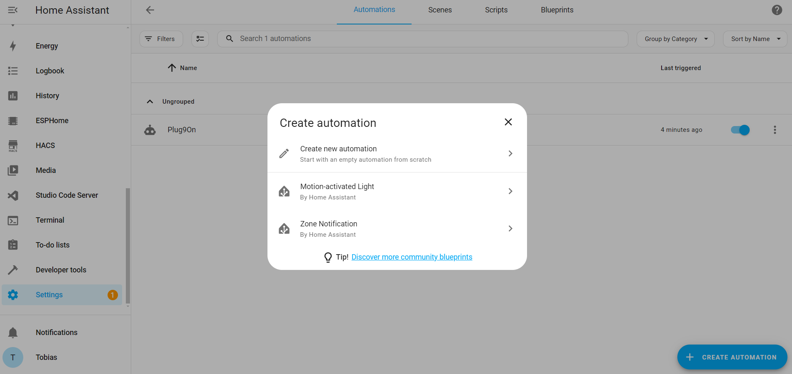
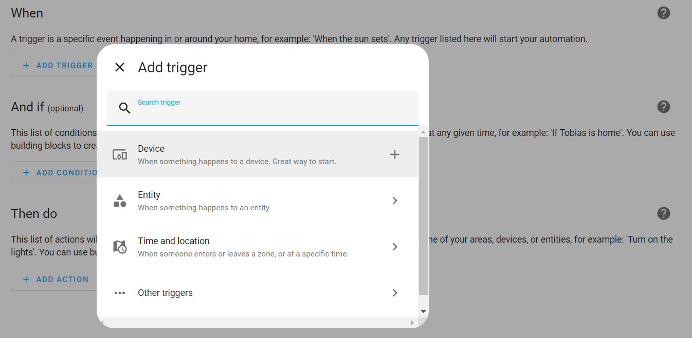
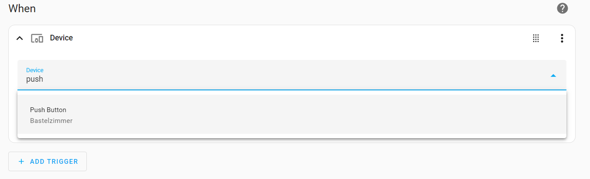
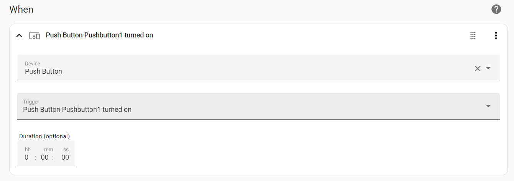
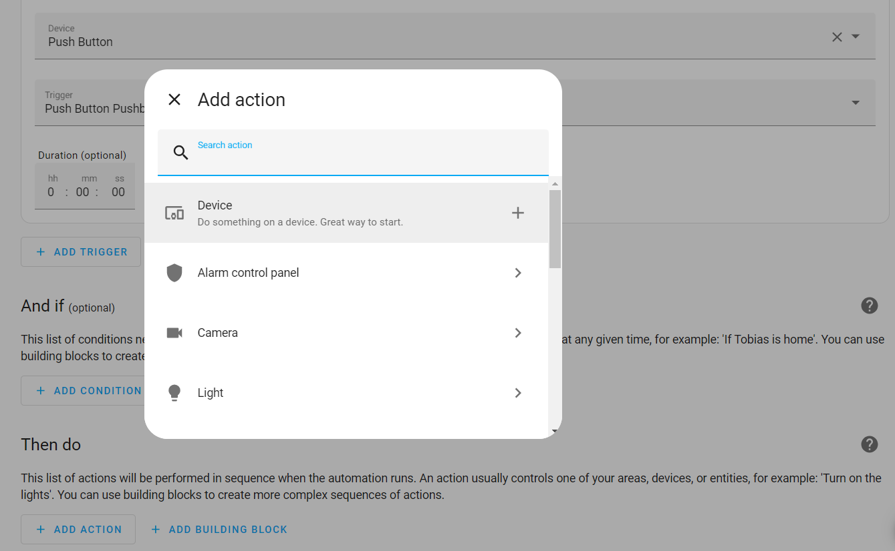
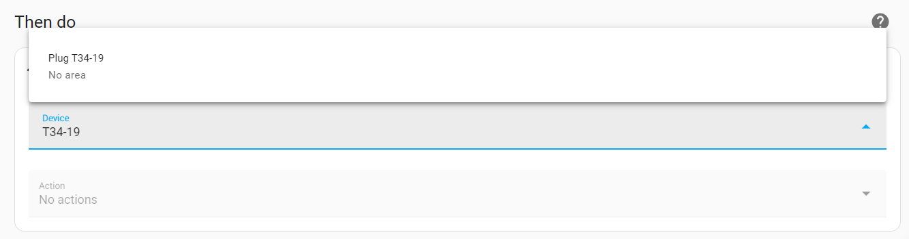

 
# Adding Automation

> Teach Home Assistant What To Do When Something Changes In Your Environment

*Home Assistant* provides you access to all of your wireless devices, whether they are *commercial* or *ESPHome DIY*. With *dashboards* covered in a previous article, you control devices *manually*. With *Automations*, you teach *Home Assistant* how it should respond *automatically* whenever a *device entity* changes.

## Visiting Automations

To view and add new automations, click *Settings* in the *Home Assistant* sidebar, then click *Automations & scenes*. This opens a view with a list of all of your automations. At the beginning, this list is of course empty.

### Creating New Automation
To create a new *automation*, click *CREATE AUTOMATION* in the lower right corner. This opens a dialog that walks you through creating the new automation task.

> [!NOTE]
> I'll walk you through creating a simple new automation that assumes that you have [created a simple push button device](https://done.land/tools/software/esphome/introduction/editconfiguration/pushbutton), and you'll see how easy it is to connect this push button to a remotely controllable electrical plug: in the future, whenever you press the push button, the electric plug toggles state.

1. Click *Create new automation* to create a new blank automation. You can now graphically define *when* this automation script should be triggered, *if* there should be additional conditions met, and *then* what needs to be done:

    

2. Click *ADD TRIGGER*, then click *Device* because you want something to happen when one of your devices changes.

    

3. Enter part of the device name. If you created the *ESPHome push button device*, enter *push*. The device shows in the combo box. Select it.

    

4. In the textbox *Trigger*, you see the various state changes that you can select. *Push Button Pushbutton1 turned on* is already selected. That's perfect: you want something to happen when the pushbutton gets pressed (aka when it is *turned on*).

    

5. Move to the section *Then do*, and click *ADD ACTION* to determine *what* should happen when the push button is pressed.

    

6. Click *Device* because you again want to access one of your devices. In this example, I want to access one of my *smart Tuya electric plugs* that I added to *Home Assistant* earlier. You can of course target *any* available device.

    

7. Select the device, i.e. by entering part of its name.

    

8. In the textbox *Action*, you now see the actions this device supports. For my electric plug, I choose the action *Toggle Plug*. Click *SAVE* to save your automation.

    

9. Enter a *name* for your new automation, and optionally describe what it is used for. Once you add many more *automations*, this helps you keep organized. Then click *SAVE*.

    

Now you are done. Click the *left arrow* on top to return to the list of automations. Your new automation is already functional.

When you now press the push button, *Home Assistant* automatically senses the state change and executes your automation. The electric plug toggles, and you now have a way to control electrical devices from your push button device.

> Tags: EspHome, Home Assistant, Automation, Push Button, Toggle

[Visit Page on Website](https://done.land/tools/software/esphome/introduction/addingautomation?769352071207240856) - created 2024-07-08 - last edited 2024-07-13
