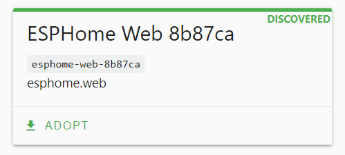
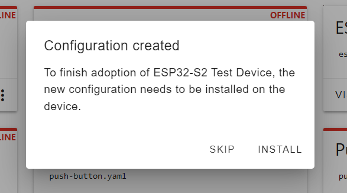

 
# Adoption

> Adopting Provisioned ESPHome Devices 

Once you have [provisioned](https://done.land/tools/software/esphome/provisionnewmicrocontroller) an *ESPHome* device and made sure it [can connect to *WiFi*](https://done.land/tools/software/esphome/configuringwifi), it automatically surfaces in *ESPHome Dashboard* and can be *adopted*.

*Adoption* only applies to devices that use a *generic ESPHome firmware*. Such devices can be added to *any* ESPHome Dashboard instance.

## Adopting New Device
Once a [fully provisioned ESPHome device](https://done.land/tools/software/esphome/provisionnewmicrocontroller) connects to *WiFi*, *ESPHome Dashboard* picks it up and shows a green *DISCOVERED*.

> [!NOTE]
> Make sure the device and *ESPHome* are connected **to the same network**.

The device still uses the same *temporary name* that was assigned by [ESPHome Web Tool](https://web.esphome.io/) during provisioning, and that was shown when the [WiFi details were assigned](https://done.land/tools/software/esphome/configuringwifi).

You can now *Adopt* the device.

Understanding ESPHome Adoption
 

When *ESPHome* discovers a new device with a *generic firmware*, it offers to *add this device* to your *ESPHome environment*. If you accept by clicking *ADOPT*, you can assign a new name to the device, and *ESPHome* creates a *configuration* for this device, including unique access keys.

Once the device is adopted, you turned it into a *specific device*. You can now edit and update its *configuration*, and install new firmware wirelessly - but only in the *ESPHome instance* that *adopted* the device. The device is now no longer *generic* and can no longer be adopted by other *ESPHome instances*.

1. Click *Adopt*. *ESPHome* opens a dialog, and you can now assign a meaningful name to the device. Click *ADOPT*.

    

2. *ESPHome* now creates a specific *configuration* for your device that you can later use to configure it. The new configuration needs to be uploaded to the device (actually, a *firmware* representing the configuration). Click *INSTALL* if you want to do this now, or click *SKIP* if you want to adjust the configuration first. In this example, click *SKIP* because there are a few important adjustments to do.

    

3. In *ESPHome Dashboard*, look for the tile that represents the device. In its upper right corner, you should see the label *ONLINE*. The adoption process has renamed the *friendly name*, but the device still uses the awkward temporary name for its *hostname* (*mDNS name*):

    

4. To rename the *hostname*, click the *three-dot* menu, then click *Rename hostname*.

    

5. Enter the new host name. You can only use lower case letters, numbers, and a few special characters. Click *RENAME*.

    

*ESPHome* now recompiles the firmware and uploads it to your device. Click *CLOSE* to close the terminal window.

Once the device has rebooted, you are done: your device now uses the name you assigned, and the device host name has also been changed.

You can now click *EDIT* and review or expand your device *configuration*, save it, then click the *three dot* menu and choose *Install* - *Wirelessly* to program and work with your new device - but only in the *ESPHome instance* that *adopted* the device. The device is now no longer *generic* and can no longer be adopted by other *ESPHome instances*.

> Tags: EspHome, Adopt

[Visit Page on Website](https://done.land/tools/software/esphome/introduction/adoption?010732071511241259) - created 2024-06-07 - last edited 2024-07-10
