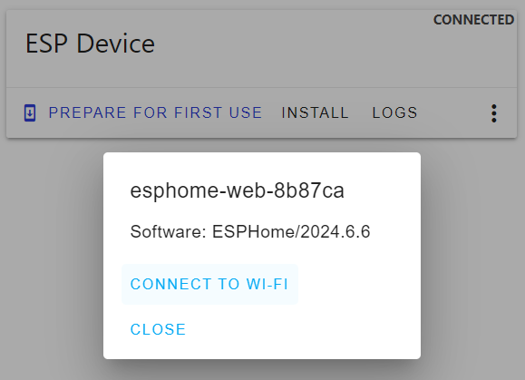

 
# Configuring WiFi

> Making Sure Your ESPHome Device Knows How To Connect To WiFi Networks

This article assumes you have uploaded *ESPHome firmware* to your microcontroller - one way or another.

If you have [provisioned](https://done.land/tools/software/esphome/introduction/provisionnewmicrocontroller) the microcontroller with *generic ESPHome firmware*, and you haven't yet configured the *WiFi access details*, then now is the time to do this.

A device **must** connect to *WiFi* in order to become visible and manageable in *ESPHome*.

## Connecting New Device To WiFi

Part of the default *ESPHome* provisioning firmware is *improv_serial* (*improv* via *BLE* is available only for microcontrollers that support *bluetooth* - *ESP32 S2* for example does not support *bluetooth*). 

*Improv_serial* lets you connect to your microcontroller via *USB cable*. You can then configure its *WiFi parameters*.

> [!TIP]
> *Improv_serial* works with *all microcontrollers* because it is a functionality of the *ESPHome firmware*. Do not confuse it with *firmware upload over USB* which always requires a special *firmware upload mode* to enable the *ESP32 boot loader*. This mode is causing issues with boards like *ESP32 S2 Mini*. *Improv* and any other *ESPHome* feature like *OTA wireless updates* are not affected and work like a charm.

1. Connect the microcontroller via *USB cable* to your computer. **Do not** enable *firmware update mode*. If in doubt, press the *reset* button once. 

2. Make sure you closed all other tools (i.e. the *Adafruit* flasher). Then open the[ESPHome Web Tools](https://web.esphome.io/) in your browser.

3. Click *CONNECT*, and select the microcontroller in the dialog. Then click the *three dot* menu and choose *Configure Wi-Fi*.

    

4. A dialog opens. Note the *temporary device name* (i.e. *esphome-web-8b87ca*). With this name will the device surface in *ESPHome Dashboard* once you configured *WiFi*.

    

5. Click *CONNECT TO WI-FI*, select the *WiFi SSID* you want to connect to, and click *CONNECT*. After a few seconds, you get a confirmation that the device is now fully configured.

> Tags: EspHome, WiFi, Improv, SSID, Configure

[Visit Page on Website](https://done.land/tools/software/esphome/introduction/configuringwifi?051647071511241259) - created 2024-06-04 - last edited 2024-07-12
