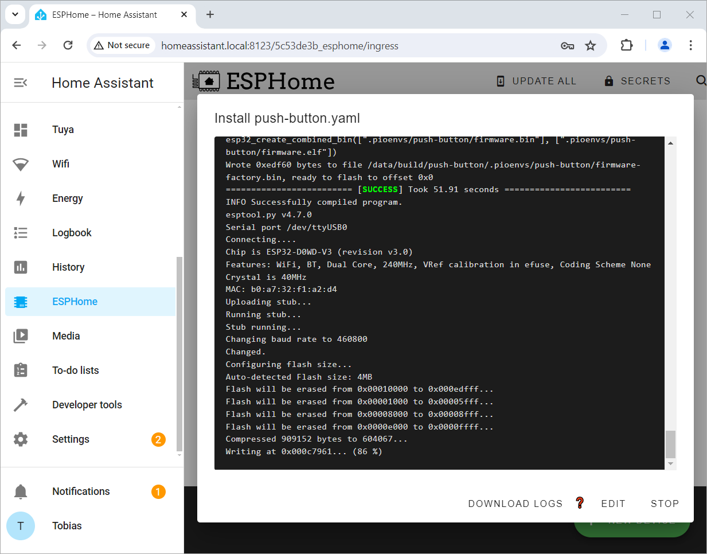

 
# Edit Configuration

> Programming A ESPHome Device By Describing Its Hardware 


Once you added a new device to *ESPHome Dashboard*, you are now ready to *program* its microcontroller - without actually writing a single line of code. Instead, you *describe* your hardware to *ESPHome*.

Here is the typical workflow:

* **Adjusting Configuration:** edit the *default configuration* of an *ESPHome device*, and describe the attached hardware it uses.
* **Install Updated Firmware:** let *ESPHome* create new firmware based on your updated *configuration*, and upload it *wirelessly* to your microcontroller

It is really this simple.

## Prerequisites

This article assumes that you already completed these steps:

* [ESPHome installed:](https://done.land/tools/software/esphome#installation) *ESPHome* should be up and running already, either as part of *Home Assistant*, or *stand-alone*
* [New ESPHome Device created:](https://done.land/tools/software/esphome/introduction/provisioningdirectly#add-new-device) You created a *new device* in the *ESPHome Dashboard*, or you [adopted](https://done.land/tools/software/esphome/introduction/adoption) a microcontroller that you previously [provisioned for ESPHome](https://done.land/tools/software/esphome/introduction/provisionnewmicrocontroller), and ensured that it is marked *ONLINE* (that it is fully working and ready for action).

<details><summary>Recap: How To Successfully Provision A New EspHome Device</summary><br/>   

Let's recap the process of one of the many ways to *initialize* a new microcontroller in *ESPHome*:

1. **Create New Device:** inside the *ESPHome Dashboard*, create a new device during which you will be asked to *name* your project, and to select the type of *microcontroller* you are using. At the end of the creation process, the dialog offers to *Install* the created firmware to your microcontroller. Choose *Skip*.

2. Microcontrollers that you have previously provisioned and that are powered on will be marked with *ONLINE* in the tiles' upper right corner. Your newly added *configuration* hasn't yet been uploaded to any microcontroller, so it is obviously still marked as *OFFLINE*:    

  

3. Now your actual microcontroller is provisioned: the automatically created *firmware* needs to be uploaded for the first time. This initial provisioning requires that you connect the microcontroller via *USB cable* to the computer running *ESPHome*. Then click the *three dot* menu, and choose *Install*:

  

3. This invokes the *firmware upload tool*. Choose *Plug into the computer running ESPHome Dashboard*, and select the *USB port* the microcontroller is connected to:


  

4. Now the *firmware* is compiled and will be uploaded to your microcontroller. You see a terminal window that logs every step, similar to what you would see in a manual *IDE* like *platformio*.

  


5. In the dialog showing the terminal window, click *STOP* to no longer listen to the status messages. In your *ESPHome Dashboard*, your microcontroller will now be marked *ONLINE*: it is now running the *ESPHome firmware* that you just uploaded.


  

> [!TIP]
> If this quick guide did not work for you, start with [provisioning a new microcontroller](https://done.land/tools/software/esphome/introduction/provisionnewmicrocontroller).

</details>

## Editing The Configuration

To open and view the *configuration* of an *ESPHome device*, click *EDIT*. This opens its current *configuration* in the editor. 


**Do not** touch the *default configuration* (unless you know what you are doing and would for example like to rename your project, or change its *WiFi* connection).

Move to the *end* of the configuration, and *begin adding* new lines that describe the additional components that your project is using. How that is accomplished, and *what exactly* you add to your *configuration* will be explained in great detail in these [examples](https://done.land/tools/software/esphome/introduction/exampledevices).


> [!IMPORTANT]
> When you edit a *configuration*, always make sure you click *SAVE* in the upper right corner when you are done. Closing the editor without saving immediately discards all changes without confirmation.


## Validating Edited Configuration
Once you changed a *configuration*, always *validate* it immediately after closing the editor: click the *three-dot* menu in the *ESPHome device tile*, and then click *Validate*.


If your *configuration* is formally ok, the validation result should always be *Configuration is valid!*. If you get errors instead, these are the top two reasons:

### Caveat: Indentation
A *configuration* really is a *tree-like* hierarchical structure using *YAML* format: items are *grouped* by *indentation*. That's why *correct item order* and *strict indentation* is *crucial*. 

This is a typical error message that may bite you:

````
mapping values are not allowed here
  in "/config/esphome/push-button.yaml", line 35, column 18
````

It essentially translates to: *ESPHome* came across key words that did not make sense at that position. So most likely, they are in the wrong order, or due to wrong indentation, they were misinterpreted.

Here is an example of such a *configuration* (don't focus on the details, just look at the general structure):

````
binary_sensor:
  - platform: gpio
    pin: GPIO4
         inverted: true
    name: Pushbutton1
    filters: - delayed_on: 10ms
             - delayed_off: 10ms
    mode:
        input: true
        pullup: true
````

This is how the *configuration* should have been formatted:

````
binary_sensor:
  - platform: gpio
    name: Pushbutton1
    pin: 
        number: GPIO4
        inverted: true
        mode:
          input: true
          pullup: true
    filters: 
      - delayed_on: 10ms
      - delayed_off: 10ms
````

As you see, the *order*, the *indentation*, and thus the *grouping* is essential for *ESPHome* to correctly understand your input.

### Breaking Changes
From time to time, *ESPHome* receives updates. Occasionally, these updates introduce *breaking changes*. So when you *update ESPHome* and your existing configurations no longer work and suddenly produce validation errors like the one below, most likely the general *ESPHome formatting rules* have changed:

````
Failed config

ota.unknown: [source /config/esphome/push-button.yaml:19]
  
  'ota' requires a 'platform' key but it was not specified.
````

The breaking change in this example was introduced with *ESPHome version 2024.6.0*. Until then, *OTA* was defined like this:

````
ota:
  password: "..."
````

Beginning with version *2024.6.0*, it now needs to be defined like so:

````
ota:
  - platform: esphome
    password: "..."
````


Unfortunately, *ESPHome* does not fix such formatting changes automatically. Instead, you need to manually adjust all of your existing configurations. Newly created devices will automatically use the new format.


## Uploading Configuration
Once your updated *configuration* is validated, it is time to upload it to your microcontroller and put it to work:

1. In *ESPHome Dashboard*, make sure your microcontroller is marked *ONLINE*. Click the *three-dot* menu, and choose *Install*.

2. Since your microcontroller has already been provisioned, you can choose *Wirelessly*, and upload the new firmware conveniently via *OTA* (*over-the-air*).

3. *ESPHome* compiles the new *firmware* and then uses *OTA* to wirelessly transfer the new *firmware* to your microcontroller:

  

4. Once the firmware is installed, click *STOP* to close the terminal window. Verify that your microcontroller is labeled *ONLINE* in *ESPHome Dashboard*, indicating that it booted correctly with the new firmware. 

You just successfully re-programmed your microcontroller - without writing any code.


> Tags: EspHome, Home Assistant, Configuration, Programming, YAML, Validation

[Visit Page on Website](https://done.land/tools/software/esphome/introduction/editconfiguration?070255061229240725) - created 2024-06-10 - last edited 2024-07-12
