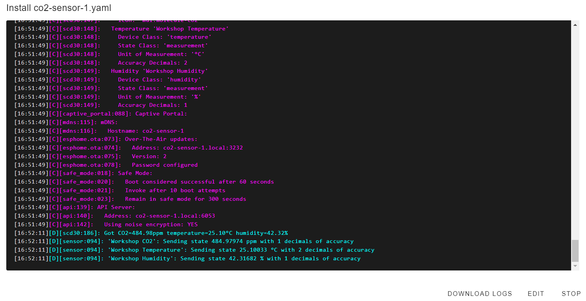

 
# CO2 Sensor

> Creating A High Precision CO2 Sensor Based On SCD30


The [Sensirion SCD30](https://done.land/components/data/sensor/airquality/scd30) is a high precision specialized NDIS CO2 sensor that can be used to monitor *air quality*.

Using this sensor in an *ESPHome device* illustrates just how easy and straight-forward it is to build such sensor devices.


> [!CAUTION]
> The *SCD30* is a highly *sensitive* device. Handle with care according to manufacturer guidelines, and **do not touch** the measuring tube. 

## Hardware Schematics
The *SCD30* is a *3.3V* device and uses a *I2C* interface to communicate with the microcontroller. 

> [!TIP]
> It is best used with its *service board* attached. The service board contains *voltage regulators* and *level shifters* to ensure that the sensor is protected from inappropriate voltages.   


  
## Translate To Configuration
The sensor uses the *I2C* interface so we need to tell *ESPHome* the *I2C* pins that the sensor is using.

The sensor itself is supported natively by *ESPHome*, and all that's left to do is specify the update interval.

````yaml
i2c:
  sda: GPIO21
  scl: GPIO22
  scan: False
  id: bus_a

sensor:
  - platform: scd30
    co2:
      name: "Workshop CO2"
      accuracy_decimals: 1
    temperature:
      name: "Workshop Temperature"
      accuracy_decimals: 2
    humidity:
      name: "Workshop Humidity"
      accuracy_decimals: 1
    temperature_offset: 1.5 °C
    address: 0x61
    update_interval: 60s
    
````

> [!TIP]
> Make sure you choose a wise update interval. You don't need to report CO2 values every second. In fact it would probably be sufficient to update the readings every 5 minutes. Longer update intervals reduce energy consumption but more importantly, increase the sensor life span.    

## Validation And Upload
Like always, after you saved your configuration and *validated* it, you upload it to your microcontroller by clicking the *three-dot* menu. Then click *Install* and *Wirelessly*.



  
The log already includes first readings. As always, after you uploaded the firmware, click *STOP* to close the terminal window, then go to the *ESPHome dashboard* and verify that your device is marked *ONLINE*.

## Diagnostics


To verify correct functionality, in the *Home Assistant* side bar, click *Developer tools*, click the tab *States*, then click into the text box below *Entity*, and enter part of your sensor name.


> [!IMPORTANT]
> If your sensor does not show up, you might [have to add it to *Home Assistant*](https://done.land/tools/software/esphome/introduction/addtohomeassistant) first. Check *Notifications* in the sidebar to see whether *Home Assistant* has auto-detected your device, and add it to *Home Assistant*.
You now see the current readings, and (depending on the update interval you set) you can now see these values change over time.


  


### Monitoring And Logs
Once the new sensor works fine, you can now add its *entities* (i.e. CO2 value, temperature, and humidity readings) to your *Home Assistant dashboards* and display these values i.e. as a *gauge* or a *graph*.


You don't just get a momentary display but also a *continuous monitoring* and *logging*: when you click the sensor gauge, *Home Assistant* pulls the sensor history data and shows a graph.

Without diving too much into detail, all of this is highly customizable: you control the type and style of dashboard item, can define the timespan to show, and your *ESPHome* device *configuration* sets the *update interval* in which *Home Assistant* polls new sensor values.


> Tags: EspHome, Home Assistant, CO2, Sensor, Sensirion, SCD30

[Visit Page on Website](https://done.land/tools/software/esphome/introduction/exampledevices/co2sensor?036545061229240725) - created 2024-07-01 - last edited 2024-07-12
