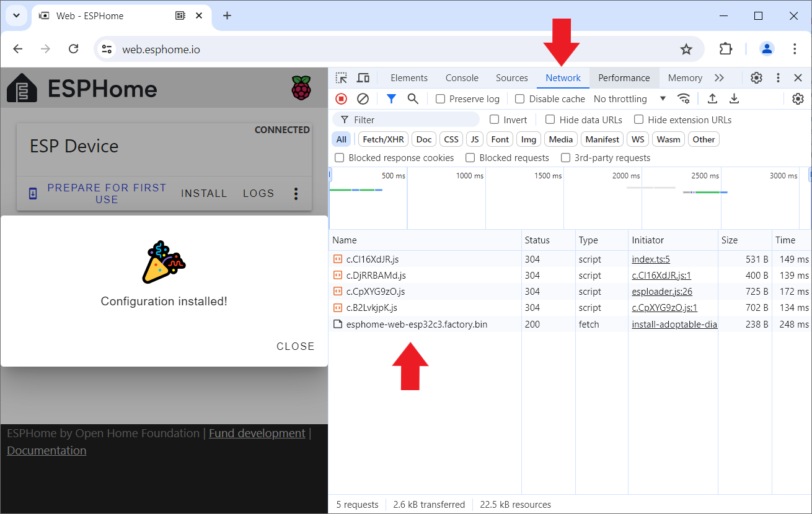
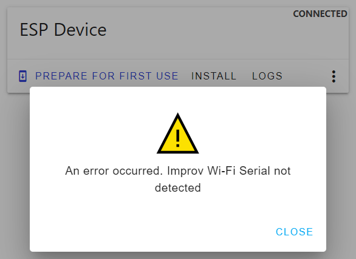
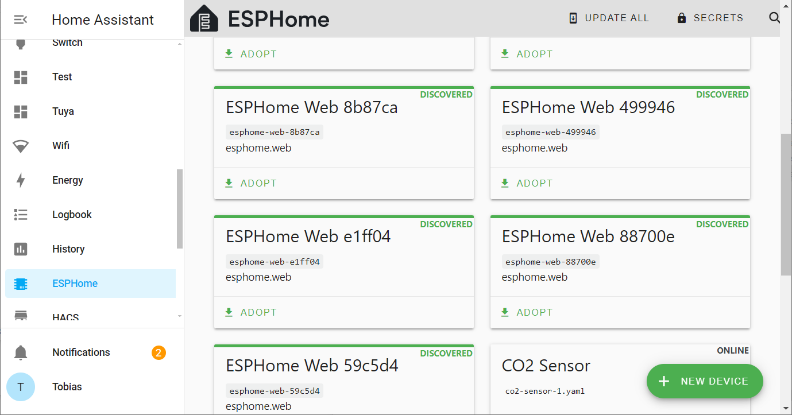

 
# Manual Provisioning

> Successfully Provision ESP32 S2 Mini (And Other Models Incompatible With ESPHome Web Tool)

Provisioning requires that you at least *once* upload *ESPHome firmware* via *USB cable*. After this succeeds, you then use  *wireless OTA* to upload any future firmware updates. All *USB and button-press hassles* are then a thing from the past.

Which is why it is extremely *frustrating* when the [ESP Web Tool](https://web.esphome.io/) does not work with your microcontroller board, and you just can't get the *initial ESPHome firmware update* done via *USB*.

> [!TIP] 
> *ESP32 S2 Mini* is a popular example for a board that cannot be *provisioned* by *ESPHome* (because of its strange *USB implementation*). With the steps below, you get it done anyway. Thanks to the new *ESPHome firmware* and its *wireless updates*, you *heal* its *USB woes* as in the future you no longer need *USB firmware upload mode*.

## Quick Overview

Connecting and uploading new *firmware* via *USB cables* is technically challenging: it may work flawlessly with one microcontroller type, and may as well cause a plethora of frustrating issues and error messages with another.   

Why USB Communications Is So Prone To Errors
 

Communication via *USB* is technically not strictly standardized: a variety of techniques exist by which microcontrollers and boards can transfer information via *USB*: 

* **Native USB support:** newer microcontrollers come with native *USB support* built-in. However, there are different levels of native *USB support*.
  * **USB OTG (On-The-Go):** found in *ESP32-S2* and *ESP32-S3*
  * **USB Serial/JTAG:** found in *ESP32-C3*
* **UART Chips:** microcontrollers lacking native *USB support* use separate *UART chips* on the microcontroller boards. There are many different *UART chip families*, and they require specialized drivers on your PC that may or may not be part of the OS. Some require separate driver installation.

What makes matters worse is that firmware updates via USB require the microcontroller to enter a special *firmware upload mode*. Some boards switch to this mode automatically, some switch *sometimes* automatically, and some require the *boot* switch to be pressed during a *reset*.

As if that wasn't enough, some microcontroller boards like *ESP32 S2 Mini* actually change *USB port* when switching from normal mode to *firmware upload mode*, breaking the connection to tools like the *ESPHome Web Tool* that are not expecting this.

## More Robust Tools To The Rescue
[Adafruit ESP Tool](https://adafruit.github.io/Adafruit_WebSerial_ESPTool/) works reliably with *ESP32 S2 Mini* and many other similarly affected microcontroller boards. It runs right inside your browser, just like [ESPHome Web Tools](https://web.esphome.io/): both tools use the same *web serial* connection inside the browser and require a compatible browser, i.e. *Chrome*. Once connected to a microcontroller, this is what the tools look like:

### Firmware File Required
Both tools essentially do the same thing: they upload a *binary firmware file* to a microcontroller. 

[ESPHome Web Tool](https://web.esphome.io/) differs a bit in that it optionally supports the function *Prepare for first use* which in the background downloads a *generic ESPHome firmware file* for you. [Adafruit ESP Tool](https://adafruit.github.io/Adafruit_WebSerial_ESPTool/) always wants *you* to provide the *firmware file(s)* to upload.

Here are the two options you have:

* **Generic Provisioning:** to mimick the *Prepare for first use* functionality and *provision a microcontroller* in a way that it can later be *adopted* by *ESPHome*, **download** the generic firmware file that *ESP Web Tool* uses.
* **Configuration:** to mimick the *Install* functionality and upload a *newly created firmware file* that works just for *one particular microcontroller*, create a dedicated *ESPHome configuration*, let *ESPHome* then create a *firmware file* for it, and download the file to your computer.

Either way, you get a *firmware file* that **Adafruit ESP Tool** can upload to your microcontroller. Here are the step-by-step instructions to create the *binary firmware files* for both approaches:

Downloading Generic Firmware File (aka *Prepare for first use* in *ESPHome Web Tool*)
 
The *default firmware file* that is used by *Prepare For First Use* in *ESPHome Web Tool* is not officially advertised as a separate download. *ESPHome Web Tool* loads it from a *non-public url* that can change without notice.    

These are the *firmware files* I used for various microcontroller types, downloadable as *zip*-files that **need to be unpacked before use**:

| Microcontroller | Generic ESPHome Provisioning Firmware File (zip) | Original Size (KB) | 
| --- | --- | --- |
| ESP8266 | [esphome-web-esp8266.factory.bin](binary_firmware_files/esphome-web-esp8266.factory.zip) | 418 |
| ESP32 | [esphome-web-esp32.factory.bin](binary_firmware_files/esphome-web-esp32.factory.zip) | 1.602 |
| ESP32-S2 | [esphome-web-esp32s2.factory.bin](binary_firmware_files/esphome-web-esp32s2.factory.zip) | 864 |
| ESP32-S3 | [esphome-web-esp32s3.factory.bin](binary_firmware_files/esphome-web-esp32s3.factory.zip) | 1.365 |
| ESP32-C3 | [esphome-web-esp32c3.factory.bin](binary_firmware_files/esphome-web-esp32c3.factory.zip) | 1.516 |

> [!IMPORTANT]
> Make sure you download and use the *firmware file* for the microcontroller type you are using.

> [!NOTE]
> Firmware files for microcontrollers without *bluetooth support* (*ESP8266* and *ESP32-S2*) do not include *Improv-BLE* (*WiFi* configuration via bluetooth). Their firmware file sizes are considerably smaller.

Those *firmware files* may be stale by the time you read this: they are based on *ESPHome 2026.6.6*. That's not really a problem as you *update to the latest ESPHome version anyway* when you later *adopt* the provisioned device into your *ESPHome Dashboard*. 

However, you can try and use the *original urls*, hoping that they still work and meanwhile point to a more recent version of the *firmware file*:

| Microcontroller | Firmware Download for *Prepare for first use* | 
| --- | --- | 
| ESP8266 | [https://firmware.esphome.io/esphome-web/esp8266/esphome-web-esp8266.factory.bin](https://firmware.esphome.io/esphome-web/esp8266/esphome-web-esp8266.factory.bin) | 
| ESP32 | [https://firmware.esphome.io/esphome-web/esp32/esphome-web-esp32.factory.bin](https://firmware.esphome.io/esphome-web/esp32/esphome-web-esp32.factory.bin) | 
| ESP32-S2 | [https://firmware.esphome.io/esphome-web/esp32s2/esphome-web-esp32s2.factory.bin](https://firmware.esphome.io/esphome-web/esp32s2/esphome-web-esp32s2.factory.bin) | 
| ESP32-S3 | [https://firmware.esphome.io/esphome-web/esp32s3/esphome-web-esp32s3.factory.bin](https://firmware.esphome.io/esphome-web/esp32s3/esphome-web-esp32s3.factory.bin) | 
| ESP32-C3 | [https://firmware.esphome.io/esphome-web/esp32c3/esphome-web-esp32c3.factory.bin](https://firmware.esphome.io/esphome-web/esp32c3/esphome-web-esp32c3.factory.bin) | 

Or, you *figure out* the *url* that *ESPHome Web Tool* is using *right now*, follow the same procedure I originally used. This guarantees that you work with the *latest firmware file* and get exactly the same results that you would get by using the *ESPHome Web Tool today*:

1. Open the [ESPHome Web Tool](https://web.esphome.io/) in your browser.
2. Connect *a supported microcontroller* to your computer via *USB cable* (i.e. *ESP32* or *ESP32-C3*). Do **not** connect the *problematic* microcontroller.
3. Once *ESPHome Web Tool* is connected, on the web page, **right**-click the button *PREPARE FOR FIRST USE*. A context menu opens. Click *Inspect*. 
4. This opens the browser *developer tools*. Click the tab *Network*.

    

5. Now, **normal**-click *PREPARE FOR FIRST USE* to actually start the firmware upload.
6. In the *Network* tab, you see the *urls* from which the tool downloads files. The list contains a bunch of *javascript files* plus the *binary firmware file* you are after. It carries the extension *.bin*:
7. When you hover over its entry or click it with the right mouse button, you see the full *url* and can open it in a separate browser tab (which essentially downloads it).

The *firmware files* are **specific** for a given microcontroller type, so if you connected an *ESP32-C3*, you figured out the download url for the *firmware file* that works for this microcontroller type only. Simply compare the *url* you figured out with the table of *download urls* I figured out (see above). If your *url* matches the one in the table, simply use the *urls* in the table for the microcontroller type you are after. 

If the *url* differs from the ones in the table, then meanwhile the *url structure* or *general download location* must have changed. In this case, try and adjust the *url* you just figured out and make it point to the *firmware file* for other microcontroller types: replace any instance of the microcontroller type, i.e. **c3**, with the *required type*, i.e. **s2**. Note that this type designator may appear more than once in the url. Replace all occurances. This way, you get the *url* for the microcontroller you need.

Maybe there are easier ways to get these files, and possibly they are even part of a public repository. I searched for many hours without luck. If you find a better way, please leave a comment below.

Creating Firmware File For One Specific Microcontroller (aka *Install* in *ESPHome Web Tool*)
 

If you deal with just a *single* microcontroller and would like to *immediately* put it to work, then this is what you do to create the *firmware file*:

1. In *ESPHome Dashboard*, click *New Device*, and create a new configuration. Make sure you specify *ESP32-S2* as device type.

    

2. Once you created the *configuration*, click its *three-dot* menu, choose *Install*, then click *Manual download*.

    

3. Choose *factory format* as file format, and download the *firmware file* to your computer.

    

> [!IMPORTANT]
> The *firmware file* you just created **can only be used on *one* microcontroller**. Do not upload it to a bulk of microcontrollers. Since the firmware is already customized (including the device name), you would *clone* microcontrollers and get into trouble with multiple microcontrollers using the same *mDNS* name and the same API keys.

## Uploading Firmware
Once you have the *firmware file* at hand - either the generic one, or a *hand-tailored* that you created via a specific *configuration* - you can now upload it to your microcontroller.

> [!IMPORTANT]
> If you choose to upload the *generic ESPHome firmware file* that you downloaded from *firmware.esphome.io*, **make sure you are selecting the firmware file for your microcontroller type**! If you accidentally upload the firmware made for *ESP32-S3* to a *ESP32-S2*, then the microcontroller will no longer respond. Since *ESP* microcontrollers have a write-protected boot loader, you can simply repeat the steps and upload the *correct* firmware file to fix this. You **cannot brick** *ESP* microcontrollers.

Open the [Adafruit ESP Tool](https://adafruit.github.io/Adafruit_WebSerial_ESPTool/) in your browser:

1. Connect the microcontroller via *USB cable* to your computer. Hold its *boot* button while pressing *reset* to force it into *firmware upload mode*.

2. In your browser, navigate to the [Adafruit ESP Tool](https://adafruit.github.io/Adafruit_WebSerial_ESPTool/). In its upper right corner, click *Connect*.

    

3. Select the microcontroller in the dialog, and click *Connect*. If the tool reports that *no compatible device* was found, make sure you *enabled the firmware upload mode* on the microcontroller: hold its *boot* button while you press its *reset* button.

4. Once connected, in the lower part of the window, click *Erase* to erase the memory. This may take a few seconds, and there are no progress indicators. The black terminal window tells you when the erase process has completed.

    

5. Click the top-most *Choose file* button, then select the *firmware file* you created and downloaded. Click *Program*.

    
6. The firmware is transferred to your microcontroller. A progress bar shows the status.

    

7. Once the firmware has been transferred, click *Disconnect*, and **only then** press the *reset* button on your microcontroller board to make sure it boots from the newly uploaded *firmware*. 

## Configure WiFi Access
If you used the default provisioning firmware that you downloaded from *esphome.io*, the device does not yet know how to connect to your *WiFi*. You need to tell the device the *WiFi SSID* and *WiFi password* before it can go online and be discovered by *ESPHome*.

Part of the default *ESPHome* provisioning firmware is *improv_serial* (*improv* via *BLE* is not available with the *ESP32 S2* as it does not support *bluetooth*). 

*Improv_serial* allows you to connect the device via *USB cable* and [ESPHome Web Tool](https://web.esphome.io/), then configure its *WiFi* in your browser.

> [!NOTE]
> The [default provisioning process](https://done.land/tools/software/esphome/introduction/provisionnewmicrocontroller) using [ESPHome Web Tool][ESPHome Web Tool](https://web.esphome.io/) *failed* for your particular microcontroller (which is why you are *on this page*). Fortunately, *Improv* uses the default *USB Port* and *not* the secondary USB Port that becomes active in *firmware upload mode*. So the *ESPHome Web Tool* works just fine - even with problematic boards like *ESP32 S2 Mini* - once a microcontroller is running *ESPHome firmware*.

You can configure *WiFi* now (and complete the *provisioning process*), or do it later at any time. It just needs to be done *before* you can *see* and *adopt* the microcontroller into *ESPHome*.

1. Connect the microcontroller via *USB cable* to your computer. **Do not** enable *firmware update mode*. If in doubt, press the *reset* button once. 

2. Make sure you closed all other tools (i.e. the *Adafruit* flasher). Then open the [ESPHome Web Tool](https://web.esphome.io/) in your browser.

3. Click *CONNECT*, and select the microcontroller in the dialog. A *ESP32 S2 Mini* should show as *TinyUSB* in this list. If you instead see *ESP32-S2*, then the microcontroller is in *firmware upload mode*. In this case press its *reset* button to return to normal mode.

4. Once connected, click the *three dot* menu and choose *Configure Wi-Fi*.

5. A dialog opens. Note the *temporary device name* (i.e. *esphome-web-8b87ca*). With this name will the device surface in *ESPHome Dashboard* once you configured *WiFi*.

6. Click *CONNECT TO WI-FI*, select the *WiFi SSID* you want to connect to, and click *CONNECT*. After a few seconds, you get a confirmation that the device is now fully configured.

7. Click *CLOSE*, then click the *three-dot* menu, and choose *Disconnect*.

> [!TIP]
> If you can *connect* to your microcontroller, but once you click *Configure Wi-Fi*, you get an error message stating that *Improv Wi-Fi Serial* was not detected, then you either connected the microcontroller in *firmware upload mode* (press its *reset* button, and try again), or you uploaded a wrong *firmware file* that was made for a different microcontroller type (repeat the provisioning with the *correct* firmware file). 

### Flood Of Discovered Devices
If you provision a bunch of microcontrollers this way, whenever you configure its *WiFi*, the connection is automatically tested, so the devices go online and connect to your *WiFi*. 

Even if you turn them off and put them in a drawer immediately after the provisioning process has completed, *ESPHome* may have already picked up the provisioned devices, and the *ESPHome Dashboard* is filling with *discovered devices* that are ready to *adopt*.

Don't worry though: once a *discovered device* goes online, after a grace period *ESPHome* automatically removes its tile again from the dashboard.

> [!TIP]
> Typically, newly provisioned devices surface with their cryptic  *temporary name* in *ESPHome dashboard*. If however you adopted this device before - even if you have meanwhile deleted it from *ESPHome* - it pops up again with the last name that was assigned to it. That's because *ESPHome* identifies new devices by their *MAC address* - which doesn't change.

> Tags: EspHome, Firmware, Upload, ESP32 S2 Mini, ESPHome Web Tool, Adafruit ESPTool

[Visit Page on Website](https://done.land/tools/software/esphome/introduction/manualprovisioning?134804061917245543) - created 2024-06-02 - last edited 2024-07-12
