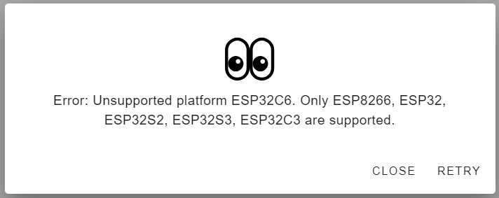
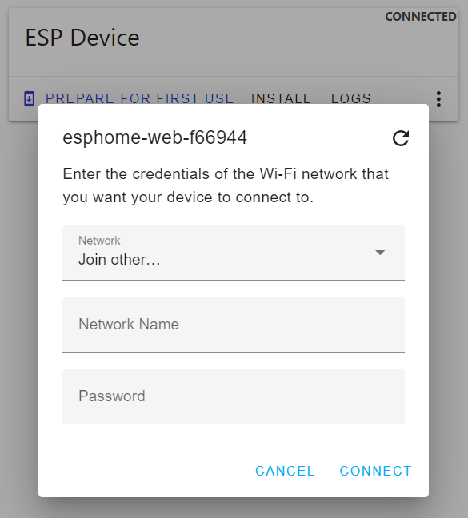

 
# Provision New Microcontroller

> Turn Your Microcontroller Board Into A Fully Managed ESPHome Device


*Provisioning* a new microcontroller is always the first step in an *ESPHome project*: it turns a generic microcontroller into a fully managed *ESPHome device*. The *provisioning procedure* uploads *ESPHome firmware* to the microcontroller. 

Once done, the microcontroller can receive firmware updates *wirelessly* (no need for *USB cables*, tools, and awkward button presses) and is fully manageable by your *ESPHome instance*.

## Supported Microcontrollers

Any microcontroller that is supported by *ESPHome* can be provisioned:

* **Espressif:** *ESP8266*, *ESP32* including newer family members like *S2*, *S3*, *C3*. The latter are still under active development, so expect a few quirks and issues.
* **Raspberry:** *RP2040*
* **Beken and Realtec:** *Beken BK72xx* and *Realtec RTL87xx* are often found in commercial *smart devices* such as *sensors*, *lamps*, or *plugs* and can be converted to *ESPHome devices*, effectively freeing them from proprietary vendor clouds and turning them into locally controlled devices.

> [!NOTE]
> In practice, this is not always trivial since commercial devices typically have neither USB ports nor UART chips to upload new firmware.

<details><summary>Support for ESP32-C6 and ESP32-H2</summary><br/>

Currently, of the *Espressif* family of microcontrollers, *ESP8266*, *ESP32*, *ESP32-S2*, *ESP32-S3*, and *ESP32-C3* are fully supported.





If you'd like to use *ESP32-H2* or *ESP32-C6* today, this is already possible - provided you are willing to *experiment*, use the *esp-idf* framework instead of *Arduino*, and work with some *alternate tools* that do not seamlessly integrate in *ESPHome*.

Here is a *configuration* targeting *ESP32-C6*:

````
esphome:
  name: esp32-c6
  friendly_name: esp32 c6

esp32:
  board: esp32-c6-devkitc-1
  flash_size: 8MB
  variant: esp32c6
  framework:
    type: esp-idf
    version: "5.2.1"
    platform_version: 6.6.0
    sdkconfig_options:
      CONFIG_OPENTHREAD_ENABLED: n
      CONFIG_ENABLE_WIFI_STATION: y
      CONFIG_USE_MINIMAL_MDNS: y
      CONFIG_ESPTOOLPY_FLASHSIZE_8MB: y

# fix for logger from luar123
external_components:
    - source: github://luar123/esphome@fix_logger
      components: [ logger ]
      refresh: never

# Enable logging
logger:

# Enable Home Assistant API
api:
  encryption:
    key: "..."

ota:
  - platform: esphome
    password: "..."

wifi:
  ssid: !secret wifi_ssid
  password: !secret wifi_password

  # Enable fallback hotspot (captive portal) in case wifi connection fails
  ap:
    ssid: "Esp32-C6 Fallback Hotspot"
    password: "..."

captive_portal:
````

You can *compile* it in *ESPHome*. To upload the resulting *firmware file*, you need to use a tool like [esptool-js](https://github.com/espressif/esptool-js) though since [ESPHome Web Tool](https://web.esphome.io/) and the [ESPHome] tool chain aren't supporting those microcontrollers yet.

In any respect, it illustrates that it is just a matter of time until *ESPHome* adds full support for the latest *ESP family members*.

</details>

## Provisioning Strategies
There are two ways of provisioning a microcontroller for use with *ESPHome*:

* **Basic provisioning:** only requires a *web browser*. After provisioning, the microcontroller can be used *at any time - now or later - for a specific project.   
* **Integrated provisioning:** occurs automatically when you create a *ESPHome configuration* and design a particular *ESPHome device*.

<details><summary>Why Should I Do Basic Provisioning?</summary><br/>

Why bother performing a *basic provisioning* when a microcontroller gets provisioned *anyway* once you start a new *ESPHome project* and create a *configuration* for a device?

#### Enable Wireless Access
The key benefit of *basic provisioning* is that it enables your microcontroller to receive *firmware updates wirelessly* without the need to install the initial firmware via the computer that is running **your instance of ESPHome**. Instead, with *basic provisioning*, you can *provision the microcontroller* using *any computer anywhere in the world*.

#### Enable Adoption
That's possible because *basic provisioning* is using a *generic ESPHome firmware* that is not yet bound to a specific *configuration* hosted by a specific *ESPHome instance*. Instead, this special firmware is *detectable by any ESPHome instance*, and once detected, can be easily *individualized* through an [adoption process](https://done.land/tools/software/esphome/adoption).

#### Test New Microcontrollers
*Basic provisioning* is also a good idea if you just want to *prepare* a bunch of microcontrollers for later use. As a welcome side effect, *basic provisioning* coincidentally tests the microcontroller and makes sure its components work as intended. It's a good idea to immediately apply *basic provisioning* to all new microcontrollers you purchase so you identify damaged items and can return them in time.

#### Speed Up Your Projects
Microcontrollers that have received a *basic provisioning* are ready for action: when it's time for a new project, simply take a provisioned microcontroller from your supply, and power it on.

Thanks to provisioning, they automatically connect to your *WiFi* and show in your *ESPHome dashboard* where you can *adopt* them: 

*Adoption* turns the *generic firmware* into a *specific device configuration* by creating a *configuration file* for it. Add a meaningful device name, set the devices' *mDNS host name*, and edit the *configuration* to reflect your hardware project - done.


</details>

## Basic Provisioning
Below steps perform a *basic provisioning* for a fresh microcontroller, for example if you just received a bunch of new microcontrollers that you would like to *prepare* for use with *ESPHome* at a later time.

> [!TIP]
> As a side effect, *provisioning* also serves as a quick test whether your new microcontrollers work correctly.

No specific *prerequisite* or *ESPHome configurations* are needed for this step. In fact, you do not even need *ESPHome* for it. A compatible web browser (i.e. *Chrome*) is all you need.

> [!TIP]
> If the procedure below does not work for your microcontroller, there are alternate ways [to provision ESP32 S2 Mini and similar boards](https://done.land/tools/software/esphome/manualprovisioning) that use incompatible *USB/UART* connectivity.


### Upload Generic ESPHome Firmware
In this first step, you upload generic *ESPHome firmware* to your microcontroller:

1. Connect the microcontroller via *USB cable* to your computer. Place the microcontroller in *firmware update mode*: hold its *boot* button while you shortly press its *reset* button. A *new usb device discovered* sound should heard from your PC.
2. In a browser (*Chrome*, *Edge*), navigate to [web.esphome.io](https://web.esphome.io/), and click *CONNECT*.

    

3. In supported browsers (i.e. *Chrome*, *Edge*), you now see the microcontroller board that is connected to your *USB port*. Select it, and click *Connect*:

    

    > If the list is empty and your microcontroller is not recognized, close all programs and *reboot* your computer.

4. You are presented with a menu. Click *Prepare for first use*:

    

     

5. A dialog explains that you are about to upload the basic *ESPHome firmware* to your microcontroller. Click *INSTALL*. 

    

6. The *ESPHome default firmware* is copied to your microcontroller which takes a few seconds.

    

    > If you just see a spinning wheel for more than a few seconds, keep the *boot* button on the microcontroller pressed until the *firmware upload* starts.

7. Once the installation is complete, you are greeted with a success message. Click *CLOSE*.  

    


8. Press the *reset* button on the microcontroller board to make sure it boots from the new firmware.

The device is now *provisioned*, however it is not yet connected to any specific *WiFi*. To actually use it in *ESPHome*, it needs to connect to the *WiFi* that *ESPHome* is connected to (see next step).

> [!TIP]
> Whether you provision the *WiFi access* **now** or postpone it to **later**. You can perform the *WiFi* configuration (below) at any time. If you plan to use the microcontroller in your own home or lab environment, it is recommended to *fully complete the provisioning process* and add the *WiFi credentials* **now** (as shown below).

### Connecting To WiFi
The provisioning process automatically re-connects the device and shows this dialog:


If you do not want to configure *WiFi* at this point, click *CLOSE*. 

If you instead see the dialog below, click *CLOSE*, then click the *three dot* menu, and choose *Configure Wi-Fi*.




> [!TIP]
> You can always [return to this point](https://done.land/tools/software/esphome/introduction/configuringwifi) by connecting the microcontroller via USB cable, and opening [ESPHome Web Tool](https://web.esphome.io/) in your browser. Once the browser has connected to the microcontroller, click the *three-dot* menu to configure *WiFi access*.

To *complete provisioning* and enable the device to automatically connect to your *WiFi*, click *CONNECT TO WI-FI*. 

In a drop-down list, select the *WiFi SSID* you want to connect to, and provide the *WiFi password*. The connection is then tested, and provisioning is successfully completed.


## What's Next
When you *supply power* to a microcontroller that has been *fully provisioned before*, it automatically boots with its *ESPHome firmware* and connects to your *WiFi*.

Once it is online, it is automatically detected by *ESPHome* and appears as a *newly discovered* device that can be [adopted](https://done.land/tools/software/esphome/introduction/adoption) it. 

During *adoption*, it receives its own individual *configuration file* and now is no longer *adoptable* by any *ESPHome instance*. 

You can now [edit its configuration](https://done.land/tools/software/esphome/introduction/editconfiguration) and add specific logic to it as required.


> Tags: EspHome, Provisioning, WiFi

[Visit Page on Website](https://done.land/tools/software/esphome/introduction/provisionnewmicrocontroller?261597071511241259) - created 2024-06-01 - last edited 2024-07-12
