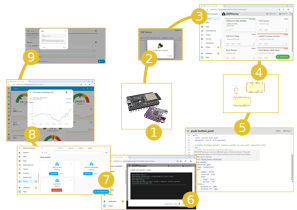
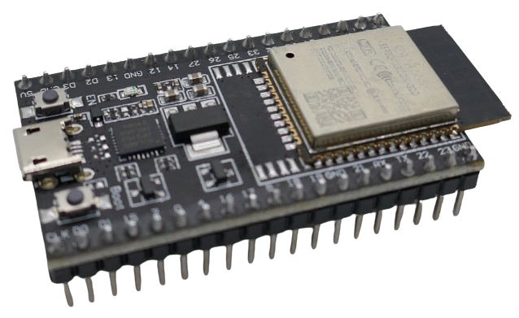
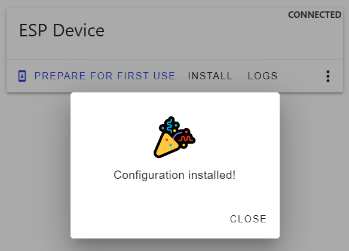
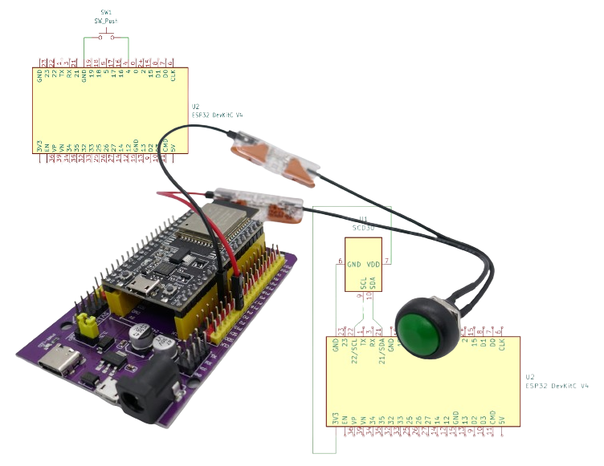
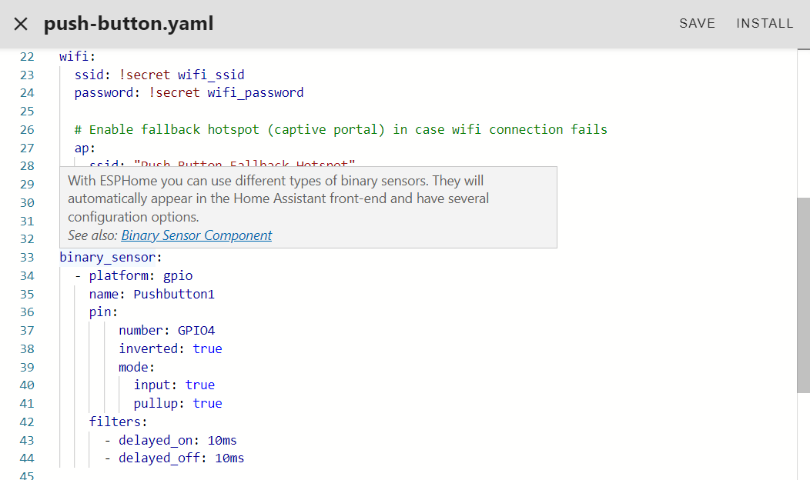
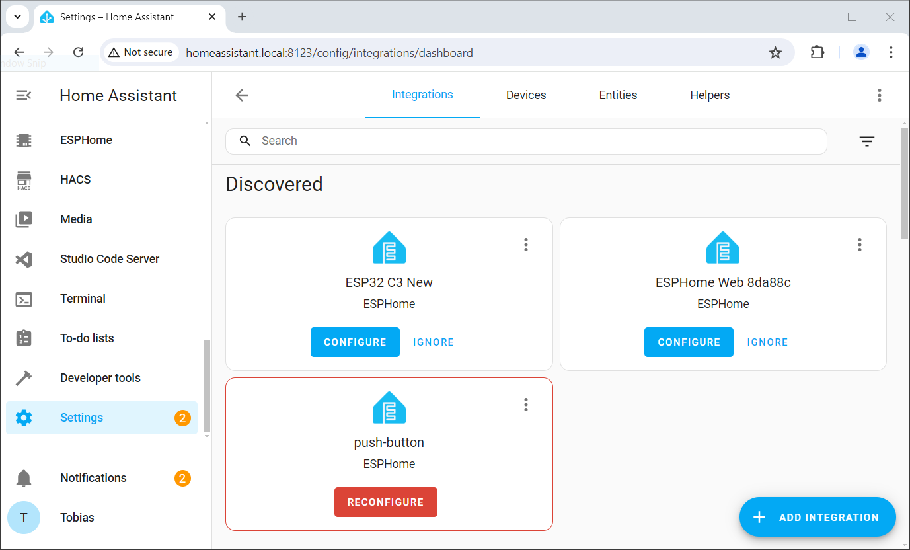
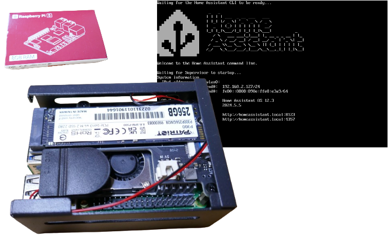
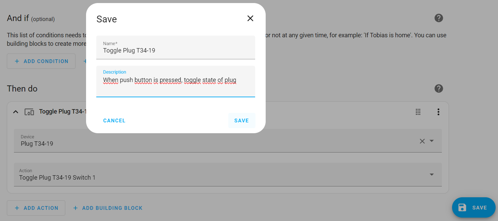

 
# Introduction

> All You Need To Know To Get Started With ESPHome

*ESPHome* consists of a number of moving parts. To better understand how they interact and work, and where to start, here is a quick overview:

## Step 1: Use Supported Microcontrollers
Start with a microcontroller board that is [supported](https://done.land/tools/software/esphome/introduction/provisionnewmicrocontroller#supported-microcontrollers) by *ESPHome*. 

## Step 2: Provision Microcontroller
Open a browser like *Chrome*, and [provision](https://done.land/tools/software/esphome/introduction/provisionnewmicrocontroller) your microcontroller so it can be discovered and used by *ESPHome*. Provisioning *uploads ESPHome firmware* to it.

Don't forget to [configure WiFi access](https://done.land/tools/software/esphome/introduction/configuringwifi) so it can connect to your *WiFi* and be discovered by *ESPHome*.

## Step 3: Adopt Microcontroller in ESPHome
Once a *provisioned microcontroller* goes online, it is automatically discovered by *ESPHome* and surfaces in *ESPHome Desktop* where you can [adopt](https://done.land/tools/software/esphome/introduction/adoption) it. It is now ready to use.

## Step 4: Design Your Hardware Project
Design your *hardware setup* as you normally would do: compose *schematics*, and wire everything up.

## Step 5: Translate Hardware Into ESPHome Configuration
With *ESPHome*, no programming is required. Instead, you [translate* your hardware setup into a *configuration*](https://done.land/tools/software/esphome/introduction/editconfiguration).

## Step 6: Upload Auto-Generated Firmware
When you completed the *configuration* and would like to test it, ask ESPHome to [auto-generate the firmware for it and upload it to your microcontroller](https://done.land/tools/software/esphome/introduction/provisioningdirectly#uploading-firmware).

## Step 7: Add Device To Home Assistant
Once your device is set up and online, *Home Assistant* automatically detects it. [Add your device to Home Assistant](https://done.land/tools/software/esphome/introduction/addtohomeassistant) to be able to tap into plenty of additional functionality.

*Integration with Home Assistant* is optional. If you do not run a *Home Assistant* yet, you may want to [look into setting one up](https://done.land/components/microcontroller/families/raspberry/raspberrypi/assembly/setup). It's really simple and adds so much more opportunities for you.

## Step 8: Home Assistant Dashboards
For example, [add new *dashboards*](https://done.land/tools/software/esphome/introduction/usingdashboards) in *Home Assistant*, and display sensor readings or virtual buttons to control your devices *manually*.

## Step 9: Set up Automations
You can now also [set up automation scripts](https://done.land/tools/software/esphome/introduction/addingautomation) hosted by *Home Assistant* that are automatically *triggered* when a device state changes. 

Whether you want to respond to a *button click*, or turn on *air conditioning* based on a *sensor reading*, is now all possible and requires only a few clicks.

> Tags: EspHome, Overview, Concept

[Visit Page on Website](https://done.land/tools/software/esphome/introduction?178673071213245544) - created 2024-07-12 - last edited 2024-07-12
