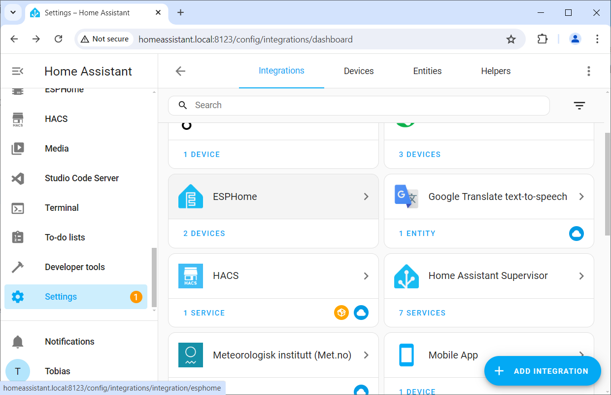
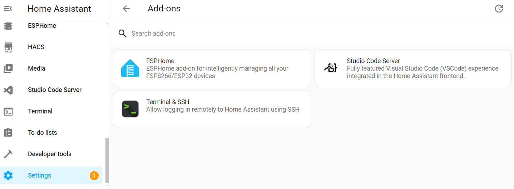
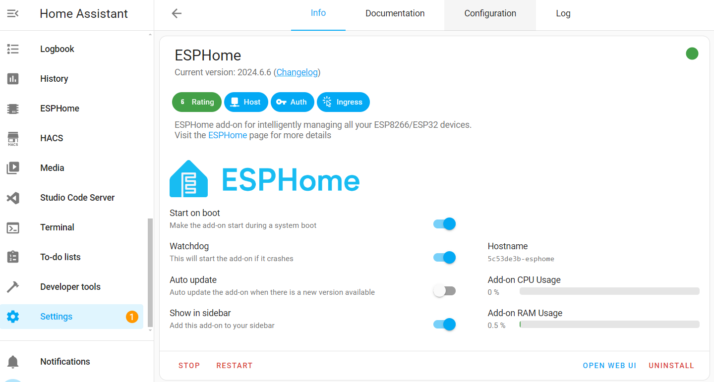

 
# Review Device Entities

> Understanding Entities And Verifying ESPHome Device Status

Once your *ESPHome device* is up and running, and you have added it to *Home Assistant*, you should make yourself familiar with how it surfaces in *Home Assistant*.

This way, you can verify whether all of your device features work as intended, and figure out the *entity ids* assigned to the features. These ids are needed later when you want to access your device features, either to place them on a dashboard, or to automate it. 

> [!NOTE]
> This article deals entirely with how your device surfaces in *Home Assistant*. Should you be using *ESPHome* stand-alone, you can skip this article.

## Visit ESPHome Integration
The bridge between *ESPHome* and *Home Assistant* is the *ESPHome integration*. *Integrations* exist for many different frameworks. It is their job to *translate* between specific devices and *Home Assistant*.

So the first stop is to visit the *ESPHome integration*:

1. In the sidebar, go to *Settings*, then click *Devices & services*. This brings up a list of *integrations*. Look for *ESPHome*. The tile already tells you the number of *ESPHome devices* that you added to *Home Assistant*:

    

2. Click in the upper part of the tile (do not click on the *DEVICES* text in the *lower* part). You now get a summary page with more details. Identify the device you want to investigate.

    

3. You now see a list of available *entities*, each one representing a specific device functionality.

    

In the example above, looking at a *CO2 sensor*, there are four entities listed, each with a unique *Entity ID*.

Only three entities are related to the sensor itself, exposing the current sensor readings for *CO2*, *temperature*, and *humidity*. 

The forth entity is added automatically by *ESPHome* for any device, enabling you to trigger a firmware update.

Click on any entity to see the current value, find out when it was last updated, and view the data history as a graph:

Managing ESPHome Settings
 

There is another control panel that you may visit. It is not related to your *ESPHome devices* but rather controls the options for your *ESPHome integration*.

1. In the sidebar, click *Settings*, then click *Add-ons*. You now see all add-ons that you have installed.

    

2. Click *ESPHome*. You now see the add-on settings and its resource use. 

    

4. To control additional options, in the upper part click *Configuration*. Most options presented here do not need to be changed in regular use cases. 

> Tags: EspHome, Home Assistant, Entities, Entity, Configuration, Options

[Visit Page on Website](https://done.land/tools/software/esphome/introduction/reviewdeviceentities?200026061229240725) - created 2024-07-06 - last edited 2024-07-09
