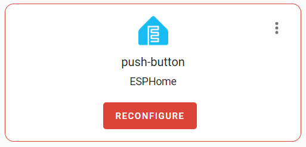
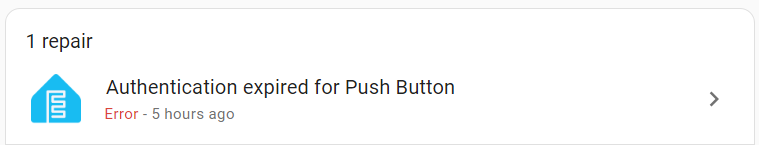
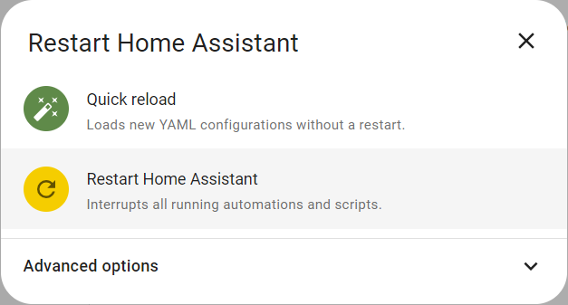
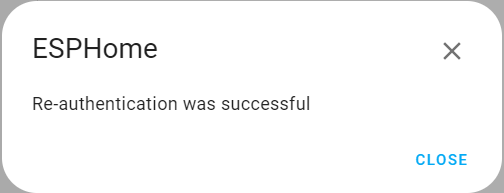
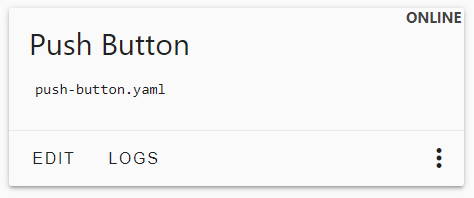

 
# Troubleshooting

> A Summary Of Tips That May Help When ESPHome Devices Don't Work As Expected

There are many moving parts in the *ESPHome experience*. When everything works as expected, this platform is amazing. When things don't work, the many interacting parts make it sometimes difficult to troubleshoot.

## Cannot Connect To Microcontroller Via USB
If you cannot connect to your microcontroller via *USB*, check this first:

1. Connect your microcontroller board via *USB cable* to your computer.
2. Navigate to the [ESPHome Web Tool](https://web.esphome.io/) in a compatible browser like *Chrome*.
3. Click *CONNECT* and check whether your microcontroller appears in the connection list.
4. If that does not help, hold the *boot* button on the microcontroller board, then press the *reset* button. 


### Check USB Cable
If the list is *empty*, keep the connection dialog open, then while you are trying below steps, check to see whether your microcontroller board suddenly appears in the list:

* **Check USB Cable Connections:** make sure the *USB cable* is connected **securely** and plugged in **all the way**. With *USB-C*, there should be an audible and feelable *click* when the connector securely plugs into place.
* **Turn Plug Around:** If you are using *USB-C*, try plugging in the cable the other way (turning the plug by 180 degree)
* **Try Different Cable:** use a different *USB cable*. Quite a few *USB cables* are not suitable for data transmission, either because they do not connect the *data pins* and are for *power supply only*, or because their plugs make loose contact at some pins.
* **Direct Connection:** plug the cable directly into your PC, and do not use external *USB switches* or other devices.

> [!TIP]
> *USB cable issues* are among the most common connection issues. Once you found a cable that works for you, mark it so next time you know which cable to use.

### Reboot PC
If the *USB cable* was not causing the issue, close all programs and *reboot* your *PC*. Then try again.

It is amazing to see this solve many issues related to *USB connections*. When you connected your PC to one or many microcontrollers before via *USB*, apparently the *USB connection* can be impaired, and the *PC* no longer recognizes connected microcontroller - until you *reboot it*.


## Timeout Errors With USB Connections
When trying to upload *firmware* to your microcontroller **via USB cable**, you may get *timeout errors*, and the *firmware upload* does not start.

If you are using browser-based tools like the [ESPHome Web Tool](https://web.esphome.io/), you may see a *spinning wheel* forever.

Here is what you do:

* **Hold *boot* Button:** hold (and continue to hold) the *boot* button on the microcontroller board while your tool is trying to upload the *firmware*. If you already got some type of error message, it is *too late* for this. 
* **Manually Enabling Firmware Upload Mode:** if holding the *boot* button does not work, press its *reset* button (while continuing to hold the *boot* button)


## WiFi Configuration Via USB Not Available
When trying to initially [configure Wifi](https://done.land/tools/software/esphome/introduction/configuringwifi) of a [provisioned microcontroller](https://done.land/tools/software/esphome/introduction/manualprovisioning), you may receive the error message *Improv is not available*.

Here are steps to resolve the issue:

* **Try multiple times:** *it is best to first try and repeat [configuring Wifi](https://done.land/tools/software/esphome/introduction/configuringwifi) a couple of times. Maybe your microcontroller wasn't yet ready for your request. 
* **Reset device:** press the *reset* button on the microcontroller board to make sure it is not in *Firmware Upload Mode*.
* **Restart PC:** restart your host PC, and close all other programs.
* **Re-Provision:** repeat [provisioning the microcontroller](https://done.land/tools/software/esphome/introduction/manualprovisioning), then try [configuring Wifi](https://done.land/tools/software/esphome/introduction/configuringwifi) again.
* **USB Connector:** on boards with *two USB connectors*, [provision](https://done.land/tools/software/esphome/introduction/manualprovisioning) the device using the other *USB connector*.


## Reconfiguration Issues
Occasionally, *Home Assistant* may complain that an *ESPHome device* needs *reconfiguration*.



There may be legit reasons why you need to adjust settings, i.e. if you made changes to the device *configuration* in *ESPHome* that affects *Home Assistant*.

In cases like this, *Home Assistant* issues a new *notification*. Click *Notification* in the *Home Assistant sidebar* to see more details.



In the illustrated case, *Home Assistant* has sensed that the device *is online* but that it cannot *access* it. *Home Assistant* therefore *assumes* that - for whatever reason - you might have changed the secret key that is protecting access to the device.

So when you click *Reconfigure*, you are asked to update this key:


If a *changed secret key* is *really* the root cause, simply open the *device configuration* in *ESPHome*, and copy and paste the secret key from the *configuration* to the dialog.

Unfortunately, the communication problem may not be related to the device key (which typically does not change).

Before you dig any deeper into such problems, try *restarting Home Assistant*:

1. In the *Home Assistant sidebar*, click *Settings*. This shows a list of settings that you can visit.
2. In the upper right corner of the page, click the *three dot* menu, and choose *Restart Home Assistant*. This opens a dialog.

    

3. Click *Restart Home Assistant* to perform a full restart after which all *integrations* are freshly loaded.

After the restart, *Home Assistant* may still show the problem when you click *Settings*.


However, when you click *RECONFIGURE* this time, the issue can be resolved automatically by *Home Assistant*, and the warning message goes away.



> [!NOTE]
> A *restart* of *Home Assistant* is just a workaround and not *fixing* any bugs that may be present in the *Home Assistant software*. However, many bugs occur only in very special scenarios, and hopefully this special constellation won't repeat for you until the particular bug is hopefully fixed in one of the upcoming *Home Assistant updates*. 


### Updating Firmware

To ensure that on the *ESPHome side* your device is in optimal shape, go to *ESPHome Dashboard*, and make sure the device is present and marked *online*.



You may want to ensure that your device is running the latest *firmware* with all *ESPHome updates* included:

Click the *three dot* menu on the device tile, choose *Install*, then *Wirelessly*. 

This recompiles its firmware and uploads it *wirelessly* to the device. The device then reboots. Click *STOP* to close the terminal window once the reboot occurs and no error messages catch your attention.


## Offline Devices
Should your *ESPHome device* not show *ONLINE* in *ESPHome dashboard*, review the following troubleshooting steps:

* **Reset:** Press the *RESET* button on the microcontroller just to make sure the microcontroller is not locked in the *firmware upload mode*.   
* **Power:** Make sure you connect the microcontroller to a *solid and reliable* power source. Most cheap *USB splitters* do not provide enough power. Keep in mind that sensors and components may cause spikes of high power consumption. When the power supply is insufficient, the *ESPHome* firmware senses a *brown-out* and keeps resetting the microcontroller.   
* **Network:** Is the computer that is running *Home Assistant* connected *to the same network* as the microcontroller? This is crucial. If your *Home Assistant* is running on a *Raspberry Pi* that is using a *wired* network cable, and your microcontroller is connecting to *WiFi*, then *mDNS* may not work. 


<details><summary>Using Static IP Addresses (Not Recommended)</summary><br/>

While you *can* configure the *ESPHome* device to use *static IP addresses*, and while you also *can* use *ping* instead of *mDNS* to check for availability, these options are all just *workarounds* for a more fundamental underlying networking problem. 

If you apply these workarounds, chances are you eventually run into other issues until you *fix the underlying network problems* which almost always boil down to this: *Home Assistant* and your devices are connected to different subnets (i.e. *Raspberry Pi* running *Home Assistant* is connected to a *wired* network while all of your devices connect *wirelessly*, and your *WiFi* is running in *Router* mode, effectively separating these networks from each other in a way that *mDNS* name resolution does not work across the networks).    

If you cannot fix the network, you may work around it by using *static IP addresses* and/or *ping* instead of *mDNS*. 

To assign a static *IP address*, add these lines to the section *wifi:*:
````
  manual_ip:
    static_ip: 192.168.2.231
    gateway: 192.168.2.1
    subnet: 255.255.255.0
````

If the problem persists, you may want to disable the *WiFi power saving features* by adding this setting:

````
  power_save_mode: none
````

If you'd like to use *ping* instead of *mDNS* to check availability, in *Home Assistant* go to *Settings*, then *Add-ons*, then click on *ESPHome*. At the top of the page, click on *Configuration*, and turn on *Show unused optional configuration options*. Identify the option *Use ping for status* and turn it on. Then click on *SAVE*. 

**IMPORTANT:** click on the *SAVE* right next to the group of settings you changed. You are prompted to restart *ESPHome*.


</details>


> Tags: EspHome, Troubleshooting

[Visit Page on Website](https://done.land/tools/software/esphome/introduction/troubleshooting?181356071911242818) - created 2024-07-10 - last edited 2024-07-10
