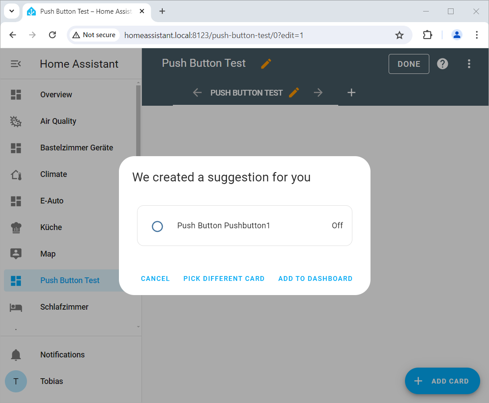

 
# Using Dashboards

> Building A Graphical User Interface For Your ESPHome Device

With just a few clicks, *Home Assistant* creates sophisticated *dashboards* for you. Dashboards can show *entities* implemented by any of the devices you have added to *Home Assistant*.

Our new *ESPHome push button device* exposes *one entity*: the push button. Now it's time to add the push button to a *dashboard*.

## Creating Dashboard
You can edit any existing *dashboard*, or create a new one. Here is how you add a new *dashboard*:

1. In *Home Assistant*, go to *Settings*, then *Dashboards*. Click *ADD DASHBOARD*.

2. Choose *New dashboard from scratch* to create an empty dashboard.

3. Assign a *title* to the new dashboard: *Push Button Test*. Make sure *Show in sidebar* is active, and click *CREATE*.

That's it. In the *Home Assistant* side bar, a new menu item called *Push Button Test* is available, and when you click it, you are presented with your new empty dashboard.

> [!TIP:]
> The header for the dashboard is always *HOME* which is confusing. Click the *pencil* icon to enter *edit* mode, then click the *pencil* to the right of *HOME*, and add a better *title*, i.e. `Push Button Test`. Click *SAVE*. Then click *DONE*.   

## Adding Controls To Dashboard

To add new controls to a dashboard, click the *pencil* icon in the upper right corner of any dashboard. This puts you in *edit* mode.

In this mode, in the lower right corner, *+ ADD CARD* is visible. Click it to add a new user control.

### Adding Entity To Dashboard

Remember: the most important detail about *Home Assistant*: any feature exposed by a device is called *entity*. Each *entity* has a *unique* id.

The easiest way to add controls is *by entity*. Next, select the entity you want to add. You can enter part of the *entity id* into the *Search entities* box to filter the list:

1. Click *BY ENTITY*. In the *Search entities* box, enter *push*.

2. The dialog lists all *entity ids* with *push* in its name. Check *Push Button Pushbutton1*, then click *CONTINUE*.

3. You are now presented with a suggested *card* to represent this *entity*. If you like it, click *ADD TO DASHBOARD*. Else, click *PICK DIFFERENT CARD*.

4. When you clicked *PICK DIFFERENT CARD*, you can select a different *card design*. This requires a bit of experience as the card you select must match the type of *entity*. For a *binary sensor* with just *two states*, you could try the card *Button*.

5. You can then set the details for the selected *card*. You should at least provide a *Name*. For the *Button* card, you can i.e. also assign an *icon* and a *icon size*.

6. When you have set all properties, click *SAVE*. The card is added to the dashboard. Click *DONE* to leave the editing mode.

The card you added is immediately functional: when you press the push button on the *ESPHome push button device*, the card reflects this and shows the *on* state. Once you release the button, the dashboard reverts back to *off* state.

> [!NOTE]
> The type of card you selected controls what you can and what you cannot do. If you 

> Tags: EspHome, Home Assistant, Dashboard, Entity

[Visit Page on Website](https://done.land/tools/software/esphome/usingdashboards?224689061229240725) - created 2024-07-07 - last edited 2024-07-10
