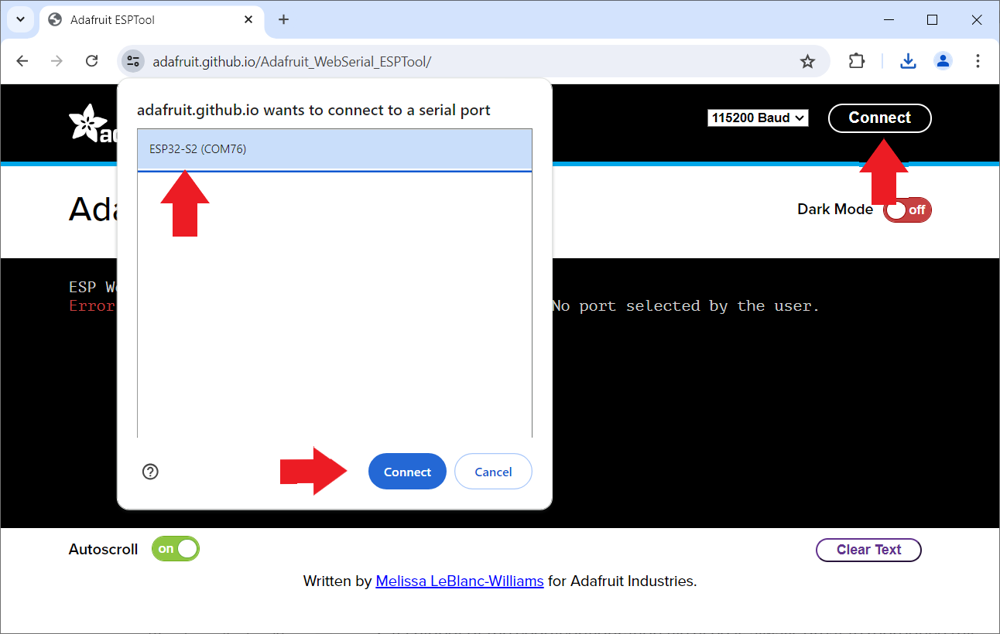
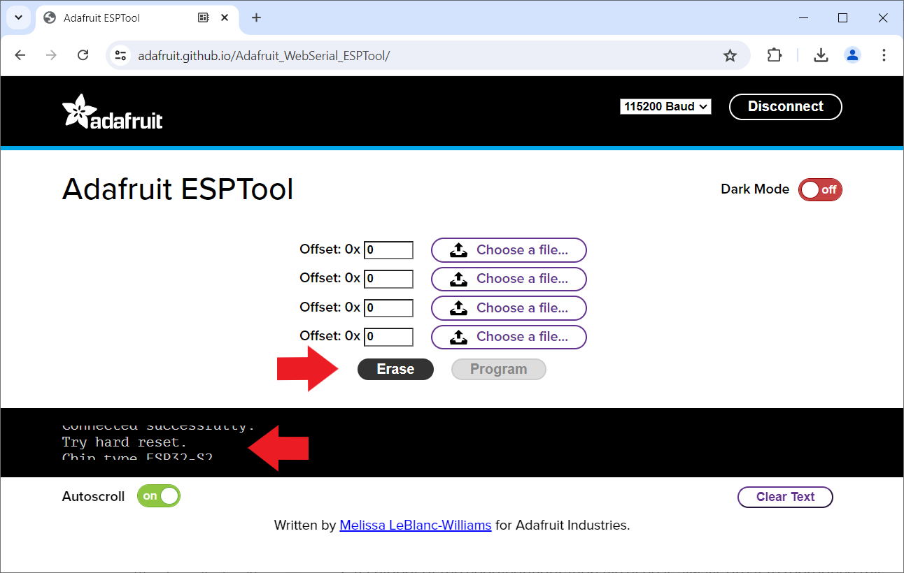
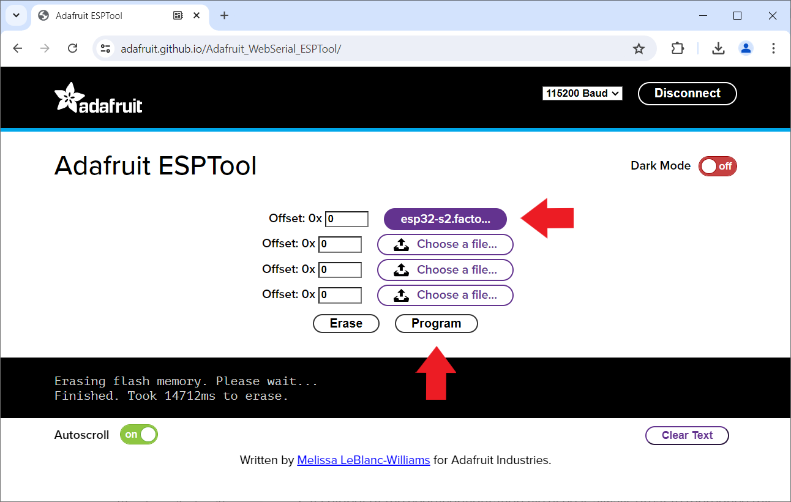
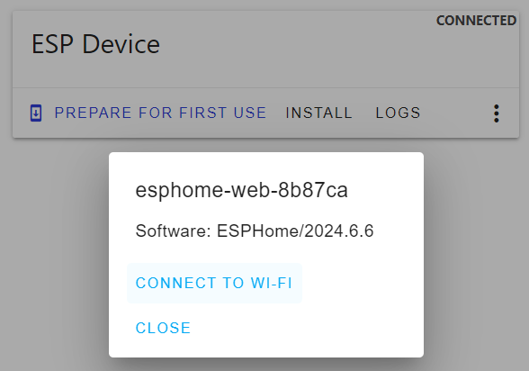

 
# Manual Provisioning

> Successfully Provision ESP32 S2 Mini (And Other Models Incompatible With ESPHome Web Tool)

Provisioning requires that you at least *once* upload *ESPHome firmware* via *USB cable*. After this succeeds, you then use  *wireless OTA* to upload any future firmware updates. All *USB and button-press hassles* are then a thing from the past.

Which is why it is extremely *frustrating* when the [ESP Web Tool](https://web.esphome.io/) does not work with your microcontroller board, and you just can't get the *initial ESPHome firmware update* done via *USB*.

> [!TIP] 
> *ESP32 S2 Mini* is a popular example for a board that cannot be *provisioned* by *ESPHome* (because of its strange *USB implementation*). With the steps below, you get it done anyway. Thanks to the new *ESPHome firmware* and its *wireless updates*, you *heal* its *USB woes* as in the future you no longer need *USB firmware upload mode*.

## Quick Overview

Connecting and uploading new *firmware* via *USB cables* is technically challenging: it may work flawlessly with one microcontroller type, and may as well cause a plethora of frustrating issues and error messages with another.   

Why USB Communications Is So Prone To Errors
 

TCommunication via *USB* is technically not at all straight-forward: a variety of techniques are used by which microcontrollers and boards can transfer information via *USB*: 

* **Native USB support:** newer microcontrollers come with native *USB support* built-in. However, there are different levels of native *USB support*.
  * **USB OTG (On-The-Go):** found in *ESP32-S2* and *ESP32-S3*
  * **USB Serial/JTAG:** found in *ESP32-C3*
* **UART Chips:** microcontrollers lacking native *USB support* use separate *UART chips* on the microcontroller boards. There are many different *UART chip families*, and they require specialized drivers on your PC that may or may not be part of the OS. Some require separate driver installation.

What makes matters worse is that firmware updates via USB require the microcontroller to enter a special *firmware upload mode*. Some boards switch to this mode automatically, some switch *sometimes* automatically, and some require the *boot* switch to be pressed during a *reset*.

As if that wasn't enough, some microcontroller boards like *ESP32 S2 Mini* actually change *USB port* when switching from normal mode to *firmware upload mode*, breaking the connection to tools like the *ESPHome Web Tool* that are not expecting this.

## More Robust Tools To The Rescue
[Adafruit ESP Tool](https://adafruit.github.io/Adafruit_WebSerial_ESPTool/) works reliably with *ESP32 S2 Mini* and many other similarly affected microcontroller boards. It runs right inside your browser, just like [ESPHome Web Tools](https://web.esphome.io/): both tools use the same *web serial* connection inside the browser and require a compatible browser, i.e. *Chrome*. Once connected to a microcontroller, this is what the tools look like:

### Firmware File Required
Both tools essentially do the same thing: they upload a *binary firmware file* to a microcontroller. 

[ESPHome Web Tool](https://web.esphome.io/) differs a bit in that it optionally supports the function *Prepare for first use* which in the background downloads a *generic ESPHome firmware file* for you. [Adafruit ESP Tool](https://adafruit.github.io/Adafruit_WebSerial_ESPTool/) always wants *you* to provide the *firmware file(s)* to upload.

Here are the two options you have:

* **Generic Provisioning:** to mimick the *Prepare for first use* functionality and *provision a microcontroller* in a way that it can later be *adopted* by *ESPHome*, download the generic firmware file that *ESP Web Tool* uses: [https://firmware.esphome.io/esphome-web/esp32s2/esphome-web-esp32s2.factory.bin](https://firmware.esphome.io/esphome-web/esp32s2/esphome-web-esp32s2.factory.bin)
* **Configuration:** to mimick the *Install* functionality and upload a *hand-tailored firmware file*, create a dedicated *ESPHome configuration*, let *ESPHome* then create a *firmware file* for it, and download the file to your computer.

> [!IMPORTANT]
> The *generic* firmware file that you download from *firmware.esphome.io* is *targeting a specific microcontroller type* and does not work with other types. The link above points to the firmware for *ESP32 S2* microcontrollers. If you need the download link for other microcontroller types, expand *Downloading Generic Firmware File* below.
> 
In either way, you get a *firmware file* that **Adafruit ESP Tool** can upload to your microcontroller. 

Here are the step-by-step instructions for both approaches:

Downloading Generic Firmware File
 
The *default firmware file* used by *Provision For First Use* is used internally by the *ESPHome Web Tool*. Its *url* is not actively communicated and can change without notice. 

To find out the *url*, just visit the [ESPHome Web Tool](https://web.esphome.io/), connect it via *USB cable* to a supported microcontroller (i.e. *ESP32* or *ESP32-C3*). Once connected, right-click *PREPARE FOR FIRST USE*, and in the context menu click *Inspect*. This opens the browser *developer tools*. Click the tab *Network*.

Now, click *PREPARE FOR FIRST USE* to start the firmware upload. In the *Network* tab, you see the *urls* from which the tool downloads files. The list contains a bunch of *javascript files* plus the *binary firmware file* you need. It carries the extension *.bin*:

When you hover over its entry or click it with the right mouse button, you see the full *url* and can open it in a separate browser tab (which essentially downloads it).

The *firmware files* are **specific** for a given microcontroller type, so if you connected a *ESP32-C3*, the firmware file works for this microcontroller type only. However, once you know the *firmware file url*, it is no rocket science to change it to other microcontroller types: by replacing the two instances of **c3** with **s2**, you get the *url* for *ESP32-S2*.

Maybe there are easier ways to get these files, and possibly they are even part of a public repository. I searched for many hours without luck. If you find a better way, please leave a comment below.

Creating Firmware File For One Specific Microcontroller
 

If you deal with just a *single* microcontroller and would like to *immediately* put it to work, then this is what you do to create the *firmware file*:

1. In *ESPHome Dashboard*, click *New Device*, and create a new configuration. Make sure you specify *ESP32-S2* as device type.

    

2. Once you created the *configuration*, click its *three-dot* menu, choose *Install*, then click *Manual download*.

    

3. Choose *factory format* as file format, and download the *firmware file* to your computer.

    

> [!IMPORTANT]
> The *firmware file* you just created **can only be used on *one* microcontroller**. Do not upload it to a bulk of microcontrollers. Since the firmware is already customized (including the device name), you would *clone* microcontrollers and get into trouble with multiple microcontrollers using the same *mDNS* name and the same API keys.

## Uploading Firmware
Once you have the *firmware file* at hand - either the generic one, or a *hand-tailored* that you created via a specific *configuration* - you can now upload it to your microcontroller.

Open the [Adafruit ESP Tool](https://adafruit.github.io/Adafruit_WebSerial_ESPTool/) in your browser:

1. Connect the microcontroller via *USB cable* to your computer. Hold its *boot* button while pressing *reset* to force it into *firmware upload mode*.

2. In your browser, navigate to the [Adafruit ESP Tool](https://adafruit.github.io/Adafruit_WebSerial_ESPTool/). In its upper right corner, click *Connect*.

    

3. Select the microcontroller in the dialog, and click *Connect*. Once connected, in the lower part of the window, click *Erase* to erase the memory. This may take a few seconds, and there are no progress indicators. Just hang in there for a while.

    

4. Click the top-most *Choose file* button, then select the *firmware file* you created and downloaded. Click *Program*.

    
5. The firmware is transferred to your microcontroller. A progress bar shows the status.

    

6. Once the firmware has been transferred, press the reset button. 

## What's Next
If you created your own *firmware*, you probably added your *WiFi access information* to the configuration: once your microcontroller boots on the new firmware, it automatically connects to your *WiFi*. Else, your device does not know yet how to access your *WiFi*. 

> [!TIP]
> You may not want to immediately configure *WiFi* as described below. If you just provisioned a bunch of microcontrollers but have no immediate use for them, just place them in a drawer. Once you are ready to use one of them, go ahead and configure *WiFi*.

Part of the default *ESPHome* provisioning firmware is *improv_serial* (*improv* via *BLE* is not available with the *ESP32 S2* as it does not support *bluetooth*). 

This is how you set (or change) *WiFi access*:

1. Connect the microcontroller via *USB cable* to your computer. **Do not** enable *firmware update mode*. If in doubt, press the *reset* button once. 

2. Make sure you closed all other tools (i.e. the *Adafruit* flasher). Then open the [ESPHome Web Tool](https://web.esphome.io/) in your browser.

3. Click *CONNECT*, and select the microcontroller in the dialog. Then click the *three dot* menu and choose *Configure Wi-Fi*.

4. A dialog opens. Note the *temporary device name* (i.e. *esphome-web-8b87ca*). With this name will the device surface in *ESPHome Dashboard* once you configured *WiFi*.

5. Click *CONNECT TO WI-FI*, select the *WiFi SSID* you want to connect to, and click *CONNECT*. After a few seconds, you get a confirmation that the device is now fully configured.

> [!NOTE]
> Funnily enough, the *ESPHome Tool* works just fine with *ESP32 S2 Mini via USB* when configuring *WiFi*. *Improv* uses its default *USB Port* that surfaces as *TinyUSB*. Just the secondary USB Port named *ESP32-S2* that opens in *firmware upload mode* is inaccessible to the *ESPHome Tool*.

> Tags: EspHome, Firmware, Upload, ESP32 S2 Mini, ESPHome Web Tool, Adafruit ESPTool

[Visit Page on Website](https://done.land/tools/software/esphome/manualprovisioning?134804061917245543) - created 2024-06-02 - last edited 2024-07-02
