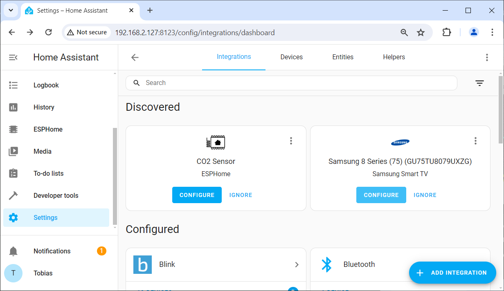

 
# Create New Device

> Creating A New Microcontroller Project

Whenever you want to start a new microcontroller project, the first step is to compose a new *configuration* that describes your hardware. This *configuration* can be created inside *ESPHome Dashboard*.


## Opening ESPHome Dashboard

If you are using *ESPHome* inside *Home Assistant*, click *ESPHome* in the *Home Assistant* side bar. This opens your *ESPHome dashboard*:


If you have installed *ESPHome* stand-alone, you need to first start the local *ESPHome webserver* via this command: `esphome dashboard d:\esphome_projects`. Make sure you adjust the path at the end of the command with the path to your local *ESPHome* project folder that you created during installation.

> [!TIP]
> You can enter above command in any *CLI console* (i.e. *cmd.exe* or *powershell.exe*), or you can press `WIN`+`R` to open the *Run* dialog, and enter the command here.


The command opens a console window that runs the local webserver. Now open a browser, and enter this url: `http://localhost:6052`. This opens the local stand-alone *ESPHome dashboard*:


## Creating New ESPHome Device

The first step in a new microcontroller project is to create a new device in *ESPHome*:

1. Once you opened the *ESPHome dashboard*, click *NEW DEVICE*.
2. A dialog opens and explains a lot of things that you can ignore for now. Click *CONTINUE*.


3. Next, you are asked to assign a *name* to your new device. Note that spaces will be converted to hyphens. In this example, I want to create a new *CO2 sensor #1*, so I assign the name *CO2 Sensor*. Click *Next*.


4. Now select the type of microcontroller you are using. 


5. Access to your device is going to be protected by an *API key*. The next dialog page shows the assigned key so you can copy it. This is not necessary though as *ESPHome* manages the key for you, and you can always show it in the *ESPHome dashboard* later. Click *INSTALL*.


6. Next, the automatically generated *firmware* needs to be transferred to your microcontroller. The first upload to your microcontroller must occur *wired*. All subsequent updates can then occur *wirelessly over-the-air*. Connect your microcontroller via *USB cable* to the computer that is running *ESPHome*.

> [!IMPORTANT]
> It is crucial that you connect the microcontroller to the computer that is *actually running ESPHome*. If you installed *ESPHome* locally and stand-alone on *your computer*, then things are clear. If however you are using *ESPHome* as a add-on to *Home Assistant*, then you need to connect your microcontroller to the computer *that is running Home Assistant* (i.e. a *Raspberry Pi*).   


7. Choose *Plug into the computer running ESPHome Dashboard*. As you can see in the picture below, the port connected to the microcontroller is shown as *dev/tty/USB0*, indicating that this port is run by a *Linux* system (a *Raspberry Pi* running *Home Assistant*). On a *Windows* machine, the port would show as *COMxxx*.


8. *ESPHome* now compiles the firmware file and then uploads it to the microcontroller. This can take several minutes. A terminal window logs each step taken.


9. Wait for the installation process to be finished. There is no distinct *finish* message: the dialog simply shows the output of the serial monitor. When you think the installation is done (or when you are no longer interested in viewing the log entries), click *STOP* to close the window.


All *ESPHome* devices that you created as described above are listed in the *ESPHome Dashboard*:


In the upper right corner you see whether or not the particular device is *online*. 

* **Edit Configuration:** Click on *EDIT* to view the device *configuration*. You can edit and change it any time.
* **Three Dots:** Click on the vertical *three dots* to open the device menu. Here you can click *INSTALL* to push any updates and changes you made to the *configuration* to the device.

> [!IMPORTANT]
> When you followed the steps above, your new device should show up in the *ESP Dashboard*, and it should be marked *ONLINE*. If it is marked *OFFLINE*, see the troubleshooting guide below.    

### Troubleshooting Offline Devices
When you upload *ESPHome firmware* to your microcontroller, the device should be marked as *ONLINE* in the *ESPHome dashboard*.

If it is marked *OFFLINE*, you need to solve this issue first before you move on to other things:

* **Reset:** Press the *RESET* button on the microcontroller just to make sure the microcontroller is not locked in the *firmware upload mode*.   
* **Power:** Make sure you connect the microcontroller to a *solid and reliable* power source. Most cheap *USB splitters* do not provide enough power. Keep in mind that sensors and components may cause spikes of high power consumption. When the power supply is insufficient, the *ESPHome* firmware senses a *brown-out* and keeps resetting the microcontroller.   
* **Network:** Is the computer that is running *Home Assistant* connected *to the same network* as the microcontroller? This is crucial. If your *Home Assistant* is running on a *Raspberry Pi* that is using a *wired* network cable, and your microcontroller is connecting to *WiFi*, then *mDNS* may not work. 


> [!TIP]
> While you *can* configure the *ESPHome* device to use *static IP addresses*, and while you also *can* use *ping* instead of *mDNS* to check for availability, these options are all *workarounds* for a more fundamental networking problem. Chances are you will eventually run into other issues until you *fix the underlying network problems*.   


#### Using Static IP Addresses (Not Recommended)     
Typically, all issues go away automatically when you fix the underlying network problem: *Home Assistant* and your devices are connected to different subnets.    

If you don't want to fix the network, you may to some extend work around it by using *static IP addresses* and/or *ping* instead of *mDNS*. 

To assign a static *IP address*, add these lines to the section *wifi:*:
````
  manual_ip:
    static_ip: 192.168.2.231
    gateway: 192.168.2.1
    subnet: 255.255.255.0
````

If the problem persists, you may want to disable the *WiFi power saving features* by adding this setting:

````
  power_save_mode: none
````

If you'd like to use *ping* instead of *mDNS* to check availability, in *Home Assistant* go to *Settings*, then *Add-ons*, then click on *ESPHome*. At the top of the page, click on *Configuration*, and turn on *Show unused optional configuration options*. Identify the option *Use ping for status* and turn it on. Then click on *SAVE*. 

**IMPORTANT:** click on the *SAVE* right next to the group of settings you changed. You are prompted to restart *ESPHome*.

## Updating Configuration
The *configuration* describes the *hardware setup* of your microcontroller project. Up until now, *ESPHome* just knows the *microcontroller type* because it asked for it.

In this example, I wanted to implement a high-precision *CO2 Sensor* using a *SCD30* sensor component. Without diving into technical details, let's see how a generic microcontroller is turned into such a device - without one line of programming.

### Default Configuration

Visit the *ESPHome Dashboard*, identify your device, and click on *EDIT*. This opens its current *configuration* in an editor.

By default, the configuration may look similar to this:


````yaml
esphome:
  name: co2-sensor-1
  friendly_name: CO2 Sensor #1

esp32:
  board: esp32dev
  framework:
    type: arduino

# Enable logging
logger:

# Enable Home Assistant API
api:
  encryption:
    key: "..."

ota:
  password: "..."

wifi:
  ssid: !secret wifi_ssid
  password: !secret wifi_password
  

  # Enable fallback hotspot (captive portal) in case wifi connection fails
  ap:
    ssid: "Co2-Sensor-1 Fallback Hotspot"
    password: "..."

captive_portal:
    
````

The format of this file is called *YAML*, and it organizes information **by indentation**. This is very important when you start editing it: Always **use two spaces** for indenting one level.

The default configuration defines the network name, the microcontroller type, and the *WiFi* access.

It also contains a number of *security items* like an *API* key, or the *WiFi* password.

*Global* secrets (like the *WiFi* password) are stored centrally, and a placeholder is used. Specific secrets are stored directly in the *configuration*, i.e. the password for uploading a new firmware image (which I have replaced by *...*).


### Adding Hardware Description

You don't really need to mess with the default part of the configuration. You just *add* the description of *what **you** added* to the microcontroller.

Here is my *full* configuration for a beautifully working *CO2 Sensor*:

````yaml
esphome:
  name: co2-sensor-1
  friendly_name: CO2 Sensor #1

esp32:
  board: esp32dev
  framework:
    type: arduino

# Enable logging
logger:

# Enable Home Assistant API
api:
  encryption:
    key: "..."

ota:
  password: "..."

wifi:
  ssid: !secret wifi_ssid
  password: !secret wifi_password
  

  # Enable fallback hotspot (captive portal) in case wifi connection fails
  ap:
    ssid: "Co2-Sensor-1 Fallback Hotspot"
    password: "..."

captive_portal:

i2c:
  sda: GPIO21
  scl: GPIO22
  scan: False
  id: bus_a

sensor:
  - platform: scd30
    co2:
      name: "Workshop CO2"
      accuracy_decimals: 1
    temperature:
      name: "Workshop Temperature"
      accuracy_decimals: 2
    humidity:
      name: "Workshop Humidity"
      accuracy_decimals: 1
    temperature_offset: 1.5 °C
    address: 0x61
    update_interval: 60s
    
````

Basically, I added the information for the *I2C* interface that the sensor uses to communicate with the microcontroller (defining the *GPIOs* used). 

And I added the sensor itself, including its *I2C* address and the desired update interval.

### Update Microcontroller

Whenever you make changes to a *configuration* and save it, these changes must be uploaded to your *microcontroller* to take effect.

So after you saved the changes and closed the editor, click the *three dot* menu. Click *Install*.

Now you see the same dialogs that you saw initially: choose an installation method, and upload the new firmware to your microcontroller.

> [!TIP]
> Once a microcontroller has received its *ESPHome firmware*, from now on its security is set up, and you can use convenient *OTA* (*over-the-air*, *wireless*) updates. No need anymore to physically connect the microcontroller to your computer.


## Home Assistant Integration
Once your *ESPHome* device shows as *ONLINE* in the *ESPHome Dashboard*, it can now be added to *Home Assistant*.

### Not Required

Some users use just *ESPHome*, and in fact *ESPHome* runs stand-alone and does not require *Home Assistant*.

*Home Assistant* makes *ESPHome* just better. Without it, you need to add *user interfaces* and *automation logic* yourself. After all, what good does a *CO2 Sensor* do if you can't see its readings. 

You can easily add *displays* to your *ESPHome device configuration* and use *ESPHome* to create independent stand-alone devices.

### Highly Recommended

Adding *ESPHome* devices to *Home Assistant* is simple and easy, and it provides you with many advantages, most notably you get an automatic user interface plus monitoring.

### Automatic Device Discovery

*Home Assistant* should pick up your new *ESPHome* device automatically within seconds. Just make sure the device reports *ONLINE* in the *ESPHome Dashboard*.


> [!TIP]
> If your *ESPHome* device won't be automatically recognized by *Home Assistant*, check this: go to *Settings*, then *Add-ons*, then click on *ESPHome*. At the top of the page, click on *Configuration*, and turn on *Show unused optional configuration options*. Identify the option *Home Assistant Dashboard Integration* and turn it on if it was off. Then click on *SAVE*.  


### Notification
In its *side bar*, the item *Notification* is marked with an orange bullet, and when you click it, a newly discovered device is reported:


 

Click *Check it out* to see the newly discovered devices. In my example, the newly created *CO2 Sensor* shows up.



Click *CONFIGURE* to add it to *Home Assistant*. You can then assign it a room or location:


### Dashboards And User Interfaces

The new device is now part of *Home Assistant* and can be added to *dashboards* or used in *automation rules*.


When you add its *entities* (i.e. sensor values) to a dashboard, you immediately see the *synergies*: you can now view the sensor readings in real time and combine this sensor with other information.


### Monitoring And Logs

You don't just get a momentary display but also a *continuous monitoring* and *logging*: when you click the sensor gauge, *Home Assistant* pulls the sensor log and shows a graph.

Without diving too much into detail, all of this is highly customizable: you control the type and style of dashboard item, can define the timespan to show, and your *ESPHome* device *configuration* sets the *update interval* in which *Home Assistant* polls new sensor values.


> Tags: EspHome, Home Assistant, ESP8266, ESP32
