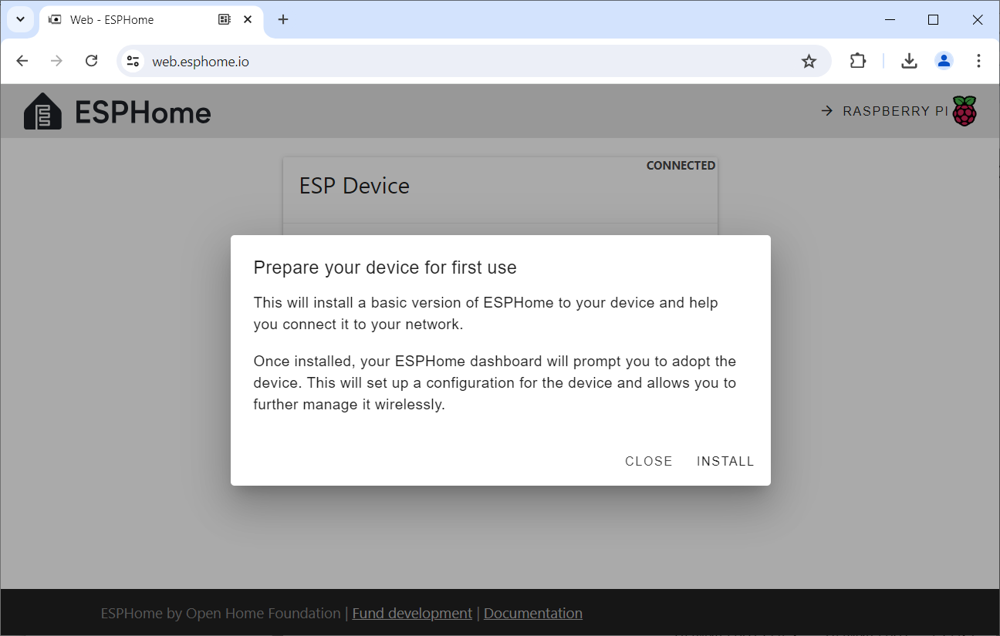

 
# Provision New Microcontroller

> Turn Your Microcontroller Board Into A Fully Managed ESPHome Device

*Provisioning* is the first step: it turns a vanilla microcontroller into a fully managed *ESPHome device*. *Provisioning* uploads *ESPHome firmware* to the microcontroller. 

Once this is done, the microcontroller becomes fully manageable via *ESPHome* and can receive firmware updates *wirelessly*: no need anymore for *USB cables*, tools, and awkward button presses.

## Supported Microcontrollers

You can provision any microcontroller that is supported by *ESPHome*:

* **Espressif:** *ESP8266*, *ESP32* including newer family members like *S2*, *S3*, *C3*. The latter are still under active development, so expect a few quirks and issues.
* **Raspberry:** *RP2040*
* **Beken and Realtec:** *Beken BK72xx* and *Realtec RTL87xx* are often found in commercial *smart devices* such as *sensors*, *lamps*, or *plugs* and can be converted to *ESPHome devices*, effectively freeing them from proprietary vendor clouds and turning them into locally controlled devices.

> [NOTE]
> In practice, this is not always trivial since commercial devices typically have neither USB ports nor UART chips to upload new firmware.

## Provisioning Strategies

You have two fundamentally different *provisioning* options:

* **Provisioning First, Programming Later:** a basic and generic *ESPHome firmware* is uploaded that is providing the default connectivity but not doing anything else. Such microcontrollers can then be connected to a *WiFi* and adopted by *ESPHome* in a separate step.
* **Provisioning And Programming In One:** you start with a *configuration* that describes your hardware and your *WiFi*. This configuration is then converted into a *unique firmware file* and uploaded to a microcontroller. Once it boots, it automatically connects to your *WiFi* and surfaces fully functional in *ESPHome*.

### Provisioning First, Programming Later

This approach can be a perfect strategy when you regularly order microcontrollers in larger quantities: it is always a good idea to *test* them immediately after delivery to not miss return deadlines.

Instead of using *test sketches* to test them, you can as well upload the generic *ESPHome firmware*. All you need for this is a browser and a USB cable. 

If provisioning succeeds, you know the microcontroller works as expected, and have thoroughly tested all its vital functionalities. You can then put these provisioned microcontrollers in storage.

When it's time to use one of them, they are ready to use: once you power them on, they connect to your *WiFi* and surface in *ESPHome* where you can *adopt* them: assign a meaningful name, and customize their *configuration* according to your needs.

## Bulk-Provisioning
Here are the steps that you can apply to new microcontrollers that you want to *test* and *prepare for later use*.

You do not need any specific *prerequisite* or *configuration* for this step, and in fact you do not even need *ESPHome*. A compatible web browser (i.e. *Chrome*) is all you need.

> [!TIP]
> A few microcontroller boards like the *ESP32 S2 Mini* are not supported by the tools used below. If that applies to you, then learn alternate ways [how to provision ESP32 S2 Mini and similar boards](https://done.land/tools/software/esphome/provisionnewesp/workarounds).

### Upload Generic ESPHome Firmware
In this first step, you upload generic *ESPHome firmware* to your microcontroller:

1. Connect the microcontroller via *USB cable* to your computer. Place the microcontroller in *firmware update mode*: hold its *boot* button while you shortly press its *reset* button. A *new usb device discovered* sound should be played by your PC.
2. In your browser, navigate to [web.esphome.io](https://web.esphome.io/), and click *CONNECT*.

    

3. In supported browsers (i.e. *Chrome*), you now see the microcontroller board that is connected to your *USB port*. Select it, and click *Connect*:

    

    > [!IMPORTANT]
    > If you can't see your connected microcontroller in the list, you may have to manually putting it into *firmware download mode* by holding the *boot* button while pressing the *reset* button. Release the *boot* button **after** you release the *reset* button.

4. You are now presented with a menu. Click *Prepare for first use*:

    

5. A dialog explains that you are about to upload the basic *ESPHome firmware* to your microcontroller. Click *INSTALL*. 

    

6. The *ESPHome default firmware* is copied to your microcontroller. This can take a few seconds.

    

7. Once the installation is complete, you are greeted with a success message. Meanwhile, your microcontroller reboots and starts with its brand new *ESPHome firmware*. You may want to press its *reset* button to make sure it leaves the *firmware download mode* and really restarts. Click *CLOSE*.

    

### Connecting To WiFi
You can to stop here, click *CLOSE*, and put the microcontroller into storage. It would then be not (yet) connected to any *WiFi*, and you would have to perform below configuration at a later time when you are ready to use the microcontroller.

If you already know that you are most likely going to use the microcontroller in your *WiFi* anyway, then go ahead and click *CONNECT TO WI-FI*. This completes *full provisioning* by adding the *WiFi* connection details. 

This way, when you later want to use the microcontroller, it is *ready-to-go*, and you just need to connect it to a power supply.

You are now asked to select the *WiFi* you want the microcontroller to be connected to. Enter the *WiFi password*.

After the microcontroller successfully connected to your *Wifi*, provisioning is successfully completed.

> Tags: EspHome, Provisioning, WiFi

[Visit Page on Website](https://done.land/tools/software/esphome/provisionnewesp?261597071511241259) - created 2024-06-01 - last edited 2024-07-10
