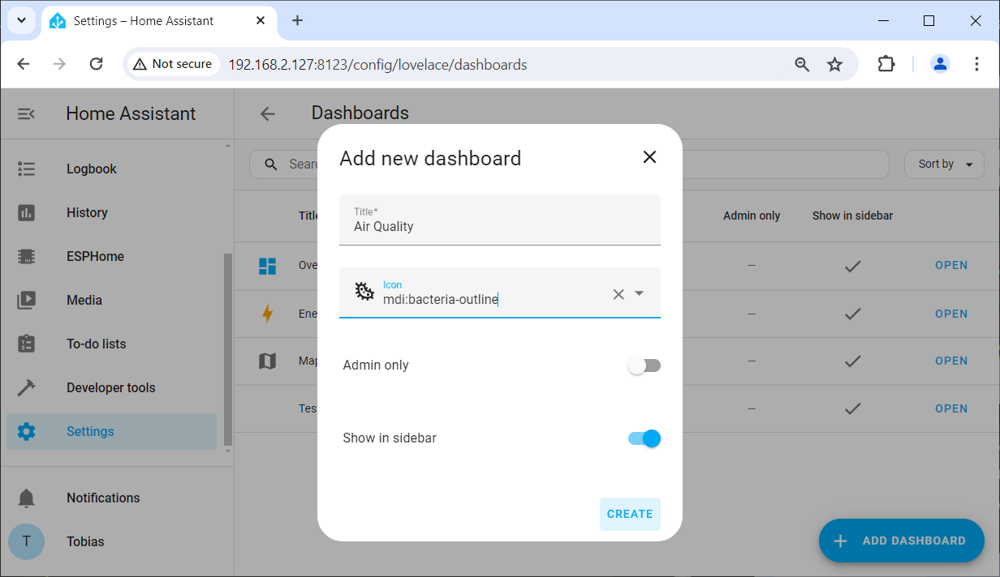

 
# Provision New ESP Microcontroller

> Prepare A New ESP32 Or ESP8266 Microcontroller And Turn It Into A Managed ESPHome Device

When you want to launch a new microcontroller-based electronics project, the first thing is to grab a generic *ESP32* or *ESP8266* microcontroller board and *provision* it. 

## Quick Overview
*Provisioning* a new *ESP* microcontroller involves these two simple steps:

* Add a *New Device* to *ESPHome*
* Upload *ESPHome Firmware* to the microcontroller

After this, your *microcontroller* turns into a fully manageable *ESPHome device*. From now on, you can edit and change its *configuration*, adapt it to your needs and your project circuitry, and conveniently upload the automatically generated *firmware* via *OTA* (*over-the-air*, *wireless*) to your microcontroller.


### What's needed
Here are the prerequisites to create a *ESPHome-provisioned microcontroller*:

* **ESPHome:** you have already installed *ESPHome*. You can install it *stand-alone*, but it is strongly suggested you install *ESPHome* inside *Home Assistant* to fully leverage all of its capabilities and synergies.
* **Microcontroller:** you need a *ESP32* or *ESP8266* microcontroller board
* **USB Cable:** during initial provisioning, the *ESPHome firmware* needs to be uploaded via *USB cable* (once provisioned, all future firmware uploads work wirelessly).


## Adding New ESPHome Device

This first step does not require any hardware. You are creating a *ESPHome default configuration*.


### Visiting ESPHome Dashboard

When using *ESPHome* inside *Home Assistant*, click *ESPHome* in the *Home Assistant* side bar. This opens your *ESPHome dashboard*:


<details><summary>Using ESPHome Stand-Alone</summary><br/>

If you have installed *ESPHome* stand-alone, you need to first start the local *ESPHome webserver* via this command: `esphome dashboard d:\esphome_projects`. Make sure you adjust the path at the end of the command with the path to your local *ESPHome* project folder that you created during installation.

> [!TIP]
> You can enter above command in any *CLI console* (i.e. *cmd.exe* or *powershell.exe*), or you can press `WIN`+`R` to open the *Run* dialog, and enter the command here.


The command opens a console window that runs the local webserver. Now open a browser, and enter this url: `http://localhost:6052`. This opens the local stand-alone *ESPHome dashboard*:


</details>


### Add New Configuration

Inside the *ESPHome Dashboard*, add a new device:

1. Click *NEW DEVICE*. A dialog opens and explains a lot of things that you can safely ignore for now. Just click *CONTINUE*.


2. You are asked to assign a *name* to your new device. Spaces will be converted to hyphens. In this example, the chosen name is *CO2 Sensor #1* (because ultimately, I want this new *ESPHome device* to become a precision CO2 sensor). Click *Next*.


4. Now select the type of microcontroller you are using. 


5. Access to your device is going to be protected by an *API key*. The next dialog page shows the assigned key so you can copy it. This is not necessary though as *ESPHome* manages the key for you, and you can always show it in the *ESPHome dashboard* later. Click *SKIP* to skip uploading the automatically generated firmware to your microcontroller for now.


In your *ESPHome dashboard*, you now see your new *ESPHome device*. It is marked as *OFFLINE* in the tiles' right upper corner which isn't surprising: the device does not yet physically exist. Up to this point, we just created the default configuration.


### Default Configuration


## Uploading Firmware
Next, connect your *microcontroller board* via USB cable **to the computer that is running ESPHome**. 

This physical connection is required only for initial provisioning. Once provisioned, all future firmware updates can be performed wirelessly via *OTA* (*over-the-air updates*). 


> [!TIP]
> If you have installed *ESPHome* as part of *Home Assistant* and run this on a *Raspberry Pi*, connect your microcontroller board to one of the *USB ports* of the *Raspberry Pi*.


1. Visit the *ESPHome Dashboard*. and look for the tile that represents your *ESPHome device*. Click the *three-dot* icon, and choose *Install*.


2. Choose *Plug into the computer running ESPHome Dashboard*. 


3. The port connected to the microcontroller in the screen shot below is shown as *dev/tty/USB0*, indicating that this port is provided by a *Linux* system (a *Raspberry Pi* running *Home Assistant*). On a *Windows* machine, the port would show as *COMxxx*.


4. *ESPHome* now compiles the firmware file and then uploads it to the microcontroller. This can take several minutes. A terminal window logs each step taken.


9. Wait for the installation process to be finished. There is no distinct *finish* message: the dialog simply shows the output of the serial monitor until you click *STOP*. When you feel the installation is done (or when you are no longer interested in viewing the log entries), click *STOP* to close the window.


Once the firmware has been uploaded to your microcontroller board, it reboots and becomes available: in *ESPHome dashboard*, its tile is now marked *ONLINE* in its upper right corner:


> [!IMPORTANT]
> The indicator of success at this point is that your new *ESPHome device* reports as being **online** in *ESPHome dashboard*. If it remains **offline**, you need to troubleshoot connectivity issues before proceeding with anything else (see below).


### Troubleshooting Offline Devices
Should your *ESPHome device* not show *ONLINE* in *ESPHome dashboard*, review the following troubleshooting steps:

* **Reset:** Press the *RESET* button on the microcontroller just to make sure the microcontroller is not locked in the *firmware upload mode*.   
* **Power:** Make sure you connect the microcontroller to a *solid and reliable* power source. Most cheap *USB splitters* do not provide enough power. Keep in mind that sensors and components may cause spikes of high power consumption. When the power supply is insufficient, the *ESPHome* firmware senses a *brown-out* and keeps resetting the microcontroller.   
* **Network:** Is the computer that is running *Home Assistant* connected *to the same network* as the microcontroller? This is crucial. If your *Home Assistant* is running on a *Raspberry Pi* that is using a *wired* network cable, and your microcontroller is connecting to *WiFi*, then *mDNS* may not work. 


<details><summary>Using Static IP Addresses (Not Recommended)</summary><br/>

While you *can* configure the *ESPHome* device to use *static IP addresses*, and while you also *can* use *ping* instead of *mDNS* to check for availability, these options are all just *workarounds* for a more fundamental underlying networking problem. 

If you apply these workarounds, chances are you eventually run into other issues until you *fix the underlying network problems* which almost always boil down to this: *Home Assistant* and your devices are connected to different subnets (i.e. *Raspberry Pi* running *Home Assistant* is connected to a *wired* network while all of your devices connect *wirelessly*, and your *WiFi* is running in *Router* mode, effectively separating these networks from each other in a way that *mDNS* name resolution does not work across the networks).    

If you cannot fix the network, you may work around it by using *static IP addresses* and/or *ping* instead of *mDNS*. 

To assign a static *IP address*, add these lines to the section *wifi:*:
````
  manual_ip:
    static_ip: 192.168.2.231
    gateway: 192.168.2.1
    subnet: 255.255.255.0
````

If the problem persists, you may want to disable the *WiFi power saving features* by adding this setting:

````
  power_save_mode: none
````

If you'd like to use *ping* instead of *mDNS* to check availability, in *Home Assistant* go to *Settings*, then *Add-ons*, then click on *ESPHome*. At the top of the page, click on *Configuration*, and turn on *Show unused optional configuration options*. Identify the option *Use ping for status* and turn it on. Then click on *SAVE*. 

**IMPORTANT:** click on the *SAVE* right next to the group of settings you changed. You are prompted to restart *ESPHome*.


</details>


### Automatic Device Discovery

*Home Assistant* should pick up your new *ESPHome* device automatically within seconds. Just make sure the device reports *ONLINE* in the *ESPHome Dashboard*.


> [!TIP]
> If your *ESPHome* device won't be automatically recognized by *Home Assistant*, check this: go to *Settings*, then *Add-ons*, then click on *ESPHome*. At the top of the page, click on *Configuration*, and turn on *Show unused optional configuration options*. Identify the option *Home Assistant Dashboard Integration* and turn it on if it was off. Then click on *SAVE*.  


### Notification
In its *side bar*, the item *Notification* is marked with an orange bullet, and when you click it, a newly discovered device is reported:


 

Click *Check it out* to see the newly discovered devices. In my example, the newly created *CO2 Sensor* shows up.


Click *CONFIGURE* to add it to *Home Assistant*. You can then assign it a room or location:


### Dashboards And User Interfaces

The new device is now part of *Home Assistant* and can be added to *dashboards* or used in *automation rules*.



When you add its *entities* (i.e. sensor values) to a dashboard, you immediately see the *synergies*: you can now view the sensor readings in real time and combine this sensor with other information.


### Monitoring And Logs

You don't just get a momentary display but also a *continuous monitoring* and *logging*: when you click the sensor gauge, *Home Assistant* pulls the sensor log and shows a graph.

Without diving too much into detail, all of this is highly customizable: you control the type and style of dashboard item, can define the timespan to show, and your *ESPHome* device *configuration* sets the *update interval* in which *Home Assistant* polls new sensor values.


> Tags: EspHome, Home Assistant, ESP8266, ESP32

[Visit Page on Website](https://done.land/tools/software/esphome/provisionnewesp?134804061917245543) - created 2024-06-16 - last edited 2024-06-16
