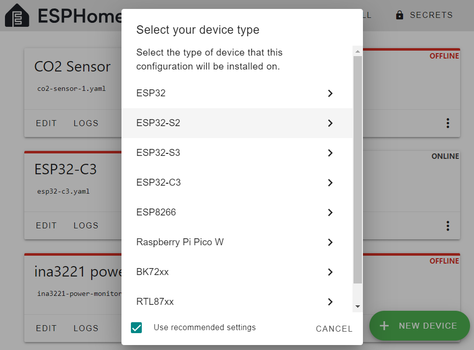
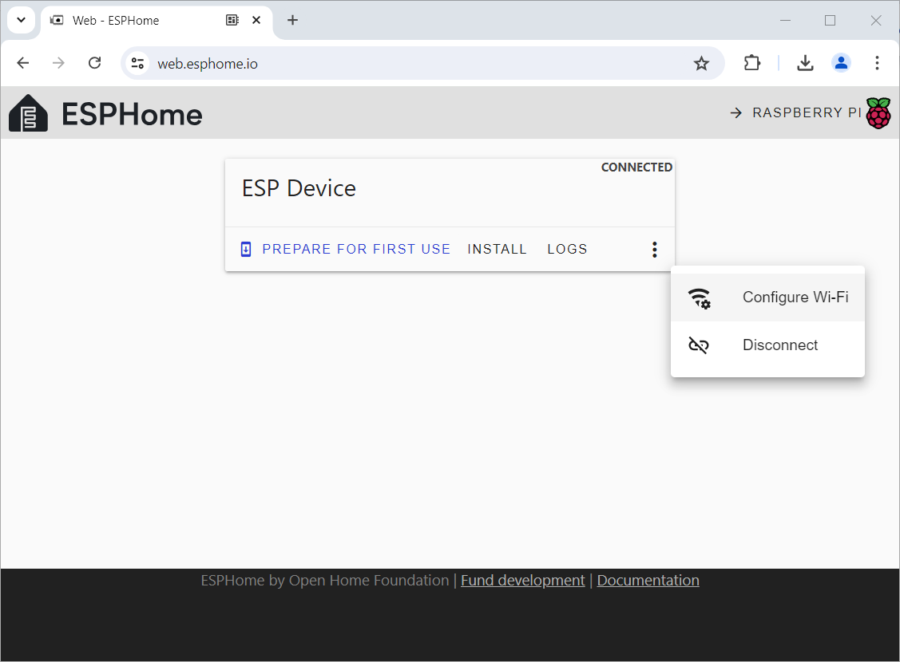

 
# Manual Provisioning

> Successfully Provision ESP32 S2 Mini (And Other Models Incompatible With ESPHome Web Tool)

Some microcontrollers and/or boards do not work with the *ESP Web Tool* and produce connection errors.

In this article you learn how to successfully provision such microcontrollers, including *ESP32 S2 Mini* that is renown for its problematic *USB implementation*.

## Quick Overview

Connecting and uploading new *firmware* via *USB cables* is technically challenging and may work flawlessly, or may cause a plethora of issues and error messages.   

Why USB Communications May Fail
 

The reason for communication problems via *USB* is it is not straight-forward. 

Instead, a variety of techniques exist by which microcontrollers and boards can transfer information via *USB*: 

* **Native USB support:** newer microcontrollers come with native *USB support* built-in. However, there are different levels of native *USB support*.
  * **USB OTG (On-The-Go):** found in *ESP32-S2* and *ESP32-S3*
  * **USB Serial/JTAG:** found in *ESP32-C3*
* **UART Chips:** microcontrollers lacking native *USB support* use separate *UART chips* on the microcontroller boards. There are many different *UART chip families*, and they require specialized drivers on your PC that may or may not be part of the OS. Some require separate driver installation.

Not all tools support all of these techniques, and if your microcontroller or board is not supported, you may have a hard time uploading firmware.

In the case of the *ESP32 S2 Mini*, the board uses a *dual UART concept*: when you connect it to *USB*, a port named *TinyUSB* surfaces. Once you switch the board to *firmware upload mode* (or once it is switched to this mode automatically by tools), it exposes a different COM port named *ESP32-S2*. This breaks many tools and their connections.

### USB Required At Least Once
Unfortunately, using a *USB cable* to upload new firmware is required *at least once*: 

Once you successfully uploaded new firmware that supports *OTA updates* (like *ESPHome firmware*), you no longer need *USB* for communications, and instead you use *WiFi*.

### It's Worth The Effort
If you are currently having troubles getting *ESPHome firmware* installed on a *ESP32 S2 Mini* (or any other microcontroller board), it is absolutely worth the effort to invest a bit of time: once you managed to upload *ESPHome firmware* **just once**, you can then use the default tools and tool chains via *WiFi*, and the *ESP32 S2 Mini* and any similarly affected board is *healed* from its *USB deficiencies*.

### Check This First

Before you dive into alternate tools, first check the most common user errors. Maybe you can use the default tools after all with a few simple tricks.

Top Two Reasons Why Firmware Uploads Fail
 

### Enable Firmware Upload Mode

To receive firmware via *USB cable*, the microcontroller must be switched to *firmware upload mode*. 

This is done automatically for most boards, but some require that you *manually* switch to this mode *before you try and connect* it to *USB*.

Here is the manual procedure:

* **Hold Boot:** hold and keep pressed the *boot* button on the board.
* **Press Reset:** press and release the *reset* button on the board.
* **Release Boot:** release *boot* **after** you released *reset*

*After* a firmware update, the *firmware update mode* needs to be closed by resetting the device. This, too, is taken care of automatically for most boards. 

Press the *reset* button after any firmware update via *USB cable* - just to make sure.

### UART Driver

When you connect your microcontroller via USB to your computer, there should be an *audible sound* indicating that a "New USB Device (was) Discovered* by your PC. 

If no sound plays then you may need to install a driver for the *UART chip* that your microcontroller board uses. Without a driver, the computer cannot connect to the microcontroller.

> [!NOTE]
> Most operatings systems (like *Windows* or *Mac*) ship with many drivers in place that cover the most commonly found devices. There are a couple of *UART* chips though that require manual driver installation.

## Successfully Uploading Firmware
When tools like [ESPHome Web Tools](https://web.esphome.io/) do not work for you and produce communications errors (like *failed to initialize*), switch to more robust tools:

[Adafruit ESP Tool](https://adafruit.github.io/Adafruit_WebSerial_ESPTool/) works fine with *ESP32 S2 Mini* and many other similarly affected microcontroller boards. It runs right inside your browser, just like [ESPHome Web Tools](https://web.esphome.io/).

### Key Difference
Both tools upload binary files to a microcontroller. These are the differences:

* [ESPHome Web Tools](https://web.esphome.io/) is a *specialized tool* designed for *ESPHome*.

* [Adafruit ESP Tool](https://adafruit.github.io/Adafruit_WebSerial_ESPTool/) is a *generic firmware uploader* that can upload *any binary firmware file(s)*, optionally at different offset addresses.

Both tools use the same *web serial* connection inside the browser. They both require a compatible browser, i.e. *Chrome*. Once connected to a microcontroller, this is what the tools look like:

### Firmware File Required
[Adafruit ESP Tool](https://adafruit.github.io/Adafruit_WebSerial_ESPTool/) can only upload existing *firmware files* and has no option like *Provision For First Use* to automatically create a generic *ESPHome firmware*.

That's not really a limitation, though, because *Provision For First Use* is, too, just uploading a binary *firmware file*.

Here are your two options to *get a firmware file* that you can then upload:

* **Single Microcontroller:** if you want to provision a *single microcontroller*, the best way is to create a dedicated *ESPHome configuration* for it, let *ESPHome* then create a *firmware file* for it, and upload this file using the [Adafruit ESP Tool](https://adafruit.github.io/Adafruit_WebSerial_ESPTool/).
* **Bulk Provisioning:** if you want to provision *many* microcontrollers so you can later *adopt* them in *ESPHome dashboard*, upload the special *firmware file* that [ESPHome Web Tools](https://web.esphome.io/) uses when you click *Provision For First Use*.

Creating Firmware File For One Specific Microcontroller
 

If you deal with just a *single* microcontroller and would like to *immediately* put it to work, then this is what you do to create the *firmware file*:

1. In *ESPHome Dashboard*, click *New Device*, and create a new configuration. Make sure you specify *ESP32-S2* as device type.

    

2. Once you created the *configuration*, click its *three-dot* menu, choose *Install*, then click *Manual download*.

    

3. Choose *factory format* as file format, and download the *firmware file* to your computer.

    

> [!IMPORTANT]
> The *firmware file* you just created **can only be used on *one* microcontroller**. Do not upload it to a bulk of microcontrollers. Since the firmware is already customized (including the device name), you would *clone* microcontrollers and get into trouble with multiple microcontrollers using the same *mDNS* name and the same API keys.

### Using Generic ESPHome Firmware File
The *default firmware file* used by [ESPHome Web Tools](https://web.esphome.io/) when you click *Provision For First Use* does not seem to be publicly available anywhere. I wasn't able to find it. Maybe I did not look hard enough.

> [!TIP]
> Just use [ESPHome Web Tools](https://web.esphome.io/) and its *Provision For First Use* functionality with a microcontroller that works (i.e. *ESP32-C3*). Open the *Google Developer Tools* in the browser while the firmware is uploaded. Its *Network* tab tells you the location from where the tool downloads the firmware file.

For *ESP32 S2* microcontrollers including the *ESP32 S2 Mini*, the default firmware file is located here: [https://firmware.esphome.io/esphome-web/esp32s2/esphome-web-esp32s2.factory.bin](https://firmware.esphome.io/esphome-web/esp32s2/esphome-web-esp32s2.factory.bin).

With a bit of trial and error you can easily adjust the *url* and tailor it to other microcontroller types. Replace *s2* with a different type, i.e. *c3* - but note that the type is mentioned *twice* in the url.

## Uploading Firmware
By now you have a *firmware file* - either created by hand for a specific microcontroller, or downloaded from *esphome.io*. Make sure you have the local path for this file available. You'll need it in a second.

To finally *upload* it to your microcontroller board, open the [Adafruit ESP Tool](https://adafruit.github.io/Adafruit_WebSerial_ESPTool/) in your browser:

1. Connect the microcontroller via *USB cable* to your computer. Hold its *boot* button while pressing *reset* to force it into *firmware upload mode*.

2. In your browser, navigate to the [Adafruit ESP Tool](https://adafruit.github.io/Adafruit_WebSerial_ESPTool/). In its upper right corner, click *Connect*.

    

3. Select the microcontroller in the dialog, and click *Connect*. Once connected, in the lower part of the window, click *Erase* to erase the memory. This may take a few seconds, and there are no progress indicators. Just hang in there for a while.

    

4. Click the top-most *Choose file* button, then select the *firmware file* you created and downloaded. Click *Program*.

    
5. The firmware is transferred to your microcontroller. A progress bar shows the status.

    

6. Once the firmware has been transferred, press the reset button. 

## What's Next
If you created your own *firmware*, you probably added your *WiFi access information* to the configuration: once your microcontroller boots on the new firmware, it automatically connects to your *WiFi*.

Else, your device does not know yet how to access your *WiFi*. And that may be a good thing: if you provisioned a bunch of microcontrollers with the *generic ESPHome firmware*, just leave their *WiFi* unconfigured. Put the provisioned microcontrollers in a drawer.

Only when you are ready to actually use one of them in a project, go ahead and configure its *WiFi*.

Once *WiFi* is configured, and the device goes online, *ESPHome* will pick the device up and offers to *adopt* it.

### Configuring WiFi

If you used the *default provisioning firmware* downloaded from *esphome.io*, the device does not yet know how to connect to your *WiFi*.

> [!TIP]
> You may not want to immediately configure *WiFi* as described below. If you just provisioned a bunch of microcontrollers to double-check they work, you can place them in a drawer. Once you are ready to use one of them, that's the best time to go ahead and configure its *WiFi*.

Part of the default *ESPHome* provisioning firmware is *improv_serial* (*improv* via *BLE* is not available since *ESP32 S2* does not support *bluetooth*). 

This is how you set (or change) *WiFi access*:

1. Connect the microcontroller via *USB cable* to your computer. **Do not** enable *firmware update mode*. If in doubt, press the *reset* button once. 

2. Make sure you closed all other tools (i.e. the *Adafruit* flasher). Then open the[ESPHome Web Tools](https://web.esphome.io/) in your browser.

3. Click *CONNECT*, and select the microcontroller in the dialog. Then click the *three dot* menu and choose *Configure Wi-Fi*.

4. A dialog opens. Note the *temporary device name* (i.e. *esphome-web-8b87ca*). With this name will the device surface in *ESPHome Dashboard* once you configured *WiFi*.

5. Click *CONNECT TO WI-FI*, select the *WiFi SSID* you want to connect to, and click *CONNECT*. After a few seconds, you get a confirmation that the device is now fully configured.

> [!NOTE]
> Funnily enough, the *ESPHome Tool* works just fine with *ESP32 S2 Mini via USB* when configuring *WiFi*. *Improv* uses its default *USB Port* that surfaces as *TinyUSB*. Just the secondary USB Port named *ESP32-S2* that opens in *firmware upload mode* is inaccessible to the *ESPHome Tool*.

> Tags: EspHome, Firmware, Upload, ESP32 S2 Mini, ESPHome Web Tool, Adafruit ESPTool

[Visit Page on Website](https://done.land/tools/software/esphome/provisionnewesp/workarounds?134804061917245543) - created 2024-07-03 - last edited 2024-07-02
