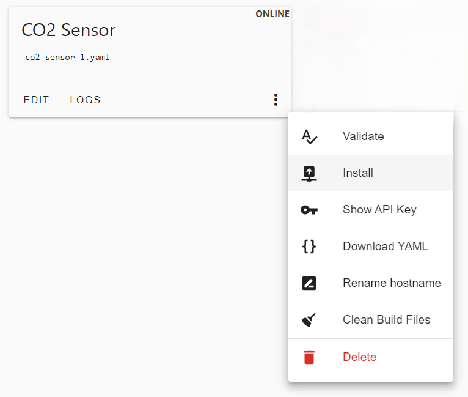
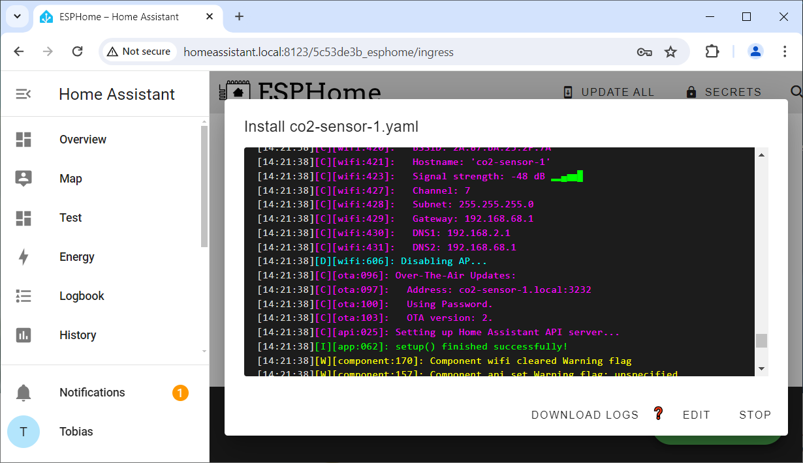

 
# Provisioning Directly

> Provisioning A New Microcontroller Directly Via USB Cable

In the previous examples, the microcontroller was provisioned via a *binary firmware file* that was either downloaded from *esphome.io*, or downloaded from your *ESPHome Dashboard*. [ESPHome Web Tool](https://web.esphome.io/) or [Adafruit ESPTool](https://adafruit.github.io/Adafruit_WebSerial_ESPTool/) was then used to upload the *firmware file* to the microcontroller.

Here is another way to *provision* a fresh microcontroller. It *directly uploads* the *firmware* to the microcontroller without first exporting the *firmware* to a file.

## Prerequisites
This approach is very convenient but has two important rules that must be met: 

* **Connect USB To ESPHome:** the microcontroller must be connected via *USB cable* to the computer *that is running ESPHome*. When you run *ESPHome* locally, this would be your own computer. However, when you run *ESPHome Add-On* inside *Home Assistant*, it would be the computer that runs *Home Assistant*. Often, this is a *Raspberry Pi*. If it is physically accessible to you, just connect the *USB cable* to one of its *USB ports*.
* **Compatible Microcontroller:** the microcontroller (board) must be compatible with [ESPHome Web Tool](https://web.esphome.io/). If you can't upload firmware with this tool, then you can't upload it directly, either, because *ESPHome* is using the same tool chain. So if you get connection errors with your microcontroller, you are limited to [manual provisioning](https://done.land/tools/software/esphome/manualprovisioning).


## Provisioning Directly
These are the steps to *provision* a new microcontroller *directly* from within *ESPHome*:

* **Add New Device:** start in *ESPHome* by creating a *New Device*. This creates a new *default configuration*. You can *edit* it to describe your hardware, or start with the automatically created *default configuration*.
* **Connect To ESPHome:** connect the microcontroller via *USB cable* to the computer **that is running ESPHome**.
* **Install Directly:** create and upload the *firmware* directly to the microcontroller. 

With this approach, there is no need for separate web-based tools like *ESPHome Web Tool*, and you don't need to fiddle with *firmware files* yourself.


### Adding New ESPHome Device

Open the *ESPHome Dashboard*. If you are using *Home Assistant*, click *ESPHome* in its *sidebar*.


<details><summary>How To Open ESPHome Dashboard Without Home Assistant</summary><br/>

If you have [installed *ESPHome* stand-alone](https://done.land/tools/software/esphome#installing-stand-alone-esphome-instance), you need to first start the local *ESPHome webserver* via this command: `esphome dashboard d:\esphome_projects`. Make sure you adjust the path at the end of the command with the path to your local *ESPHome* project folder that you created during installation.

> [!TIP]
> You can enter above command in any *CLI console* (i.e. *cmd.exe* or *powershell.exe*), or you can press `WIN`+`R` to open the *Run* dialog, and enter the command here.


The command opens a console window that runs the local webserver. Now open a browser, and enter this url: `http://localhost:6052`. This opens the local stand-alone *ESPHome dashboard*.

</details>


Inside the *ESPHome Dashboard*, add a new device:

1. Click *NEW DEVICE*. A dialog opens and explains things that you can ignore for now. Just click *CONTINUE*.

    

2. Assign a *name* to your new device that describes your project and is not used with any other existing *ESPHome device*. Spaces are converted to hyphens. Click *Next*.

    

3. Select the type of microcontroller you are using. 

    

4. Access to your device is going to be protected by an *API key*. The next dialog page shows the assigned key so you can copy it. This is not necessary though as *ESPHome* manages the key for you, and you can always show it in the *ESPHome dashboard* later. Click *SKIP* to skip uploading the automatically generated firmware to your microcontroller for now.


In *ESPHome dashboard*, you now see your new *ESPHome device*. It is marked as *OFFLINE* in the tiles' right upper corner. Since the device does not yet physically exist, that's not surprising. Up to this point, we just created a *default configuration*.


### Default Configuration
During provisioning, *ESPHome* has created a *default configuration* for your device. You can see this configuration when you click *EDIT*:


The *default configuration* takes care of the fundamentals like naming, board specs, connecting details for your *WiFi*, etc., and looks similar to this:


````
esphome:
  name: co2-sensor-1
  friendly_name: CO2 Sensor #1

esp32:
  board: esp32dev
  framework:
    type: arduino

# Enable logging
logger:

# Enable Home Assistant API
api:
  encryption:
    key: "..."

ota:
  - platform: esphome
    password: "..."

wifi:
  ssid: !secret wifi_ssid
  password: !secret wifi_password

  # Enable fallback hotspot (captive portal) in case wifi connection fails
  ap:
    ssid: "Push-Button Fallback Hotspot"
    password: "..."

captive_portal:
````

You don't necessarily need to touch these entries. 

> [!TIP]
> Hover over items in the *configuration* to view *tooltips* that explain in detail what these items do.    


#### IMPORTANT: Breaking Change
Previously, *OTA* was defined this way:

````
ota:
  password: "..."
````

Starting with *ESPHome 2024.6.0*, this entry now must look like so:

````
ota:
  - platform: esphome
    password: "..."
````

If you are using older configurations, it is sufficient to add `- platform: esphome` to make sure your configuration compiles with the current versions of *ESPHome*.


<details><summary>What are default configuration items for?</summary><br/>


* **esphome:**
  * *name:* *mDNS* network name that is assigned to the device. It is derived from your project name. Spaces and special characters are replaced.
  * *friendly name:* clear-text name that appears in the *ESPHome dashboard*. 

* **esp32:** (this can be a different item when you have selected a different microcontroller)
  * *board:* the type of microcontroller board. *esp32dev* is the default configuration for generic *ESP32* boards.
  * *framework:* the type of programming framework to use. By default, *ESPHome* uses *Arduino*, but you could also use *ESP-IDF* (the ESP vendors' own programming environment)

* **logger:** by default, all messages with a severity of *DEBUG* or higher are logged through the serial port. You can [adjust](https://esphome.io/components/logger.html#logger-component) these settings, i.e. for more verbose logging.

* **api:** specifies an *encryption key* that is required whenever you want to communicate wirelessly with the microcontroller via the *ESPHome API*. This key is automatically generated and stored for you. It must match the key inside the *firmware* that was uploaded to your microcontroller.   

* **ota:** defines the secret password for *over-the-air* firmware updates. This password must match the password defined in the uploaded firmware. *ESPHome* can then upload future *firmware updates* conveniently via *WiFi*.   


* **wifi:** defines the access parameters for your home *WiFi*. The actual *SSID* and *password* are stored globaly in the secret store.

  * *ap:** if your microcontroller is unable to connect to your *home Wifi* for whatever reason, the *ESPHome firmware* automatically opens its own *WiFi access point* (*hotspot*). 

* **captive_portal:** when this component is part of your *configuration*, it instructs your microcontroller to provide a web portal that you can use to change the *WiFi settings* or manually upload *new firmware*. The *captive portal* is activated when the regular *WiFi* cannot be reached, and can be accessed via the *hotspot* that is defined in *ap:*. There are no configuration settings for this item.


</details>


## Uploading Firmware
Below are the two simplest ways of uploading the *initial* firmware to the microcontroller. Both require a *USB Cable*. 

Firmware needs to be uploaded via *USB Cable* only *once*. As soon as the *ESPHome* firmware is in place, you can conveniently update your microcontroller *wirelessly* (*OTA*).

* **Connect directly to ESPHome** Connect the microcontroller board with a *USB cable* to the **computer that is running ESPHome**. This is not necessarily the computer you are currently using. When i.e. you run *Home Assistant* on a *Raspberry Pi*, you need to connect the microcontroller board to the *Raspberry Pi*.
* **Connect locally:** Download the firmware as a file from *ESPHome* via your web browser. Connect the microcontroller via *USB Cable* to *your* computer, and use the online [ESP Upload Tool](https://web.esphome.io/) to upload the firmware to it.

### Connecting Directly To ESPHome

If you have access to the computer that is running *ESPHome*, then this is the easiest way:


1. Visit the *ESPHome Dashboard*. and look for the tile that represents your *ESPHome device*. Click the *three-dot* icon, and choose *Install*.



2. Choose *Plug into the computer running ESPHome Dashboard*. 


3. The port connected to the microcontroller in the screen shot below is shown as *dev/tty/USB0*, indicating that this port is provided by a *Linux* system (a *Raspberry Pi* running *Home Assistant*). On a *Windows* machine, the port would show as *COMxxx*.


4. *ESPHome* now compiles the firmware file and then uploads it to the microcontroller. This can take several minutes. A terminal window logs each step taken.



5. Wait for the installation process to be finished. There is no distinct *finish* message: the dialog simply shows the output of the serial monitor until you click *STOP*. When you feel the installation is done (or when you are no longer interested in viewing the log entries), click *STOP* to close the window.


> [!TIP]
> The tools used here are fundamentally identical to the ones found in the [ESP Web Tool](https://web.esphome.io/), so the same limitations apply: microcontroller boards that are incompatible with *ESP Web Tool* (like the *ESP32 S2 Mini) do not work with direct connections either.

### Verify Success

Once the firmware has been uploaded to your microcontroller board, it reboots and becomes available: in *ESPHome dashboard*, its tile is now marked *ONLINE* in its upper right corner:


> [!IMPORTANT]
> The indicator of success at this point is that your new *ESPHome device* reports as being **online** in *ESPHome dashboard*. If it remains **offline**, you need to troubleshoot connectivity issues before proceeding with anything else (see below).


### Troubleshooting Offline Devices
Should your *ESPHome device* not show *ONLINE* in *ESPHome dashboard*, review the following troubleshooting steps:

* **Reset:** Press the *RESET* button on the microcontroller just to make sure the microcontroller is not locked in the *firmware upload mode*.   
* **Power:** Make sure you connect the microcontroller to a *solid and reliable* power source. Most cheap *USB splitters* do not provide enough power. Keep in mind that sensors and components may cause spikes of high power consumption. When the power supply is insufficient, the *ESPHome* firmware senses a *brown-out* and keeps resetting the microcontroller.   
* **Network:** Is the computer that is running *Home Assistant* connected *to the same network* as the microcontroller? This is crucial. If your *Home Assistant* is running on a *Raspberry Pi* that is using a *wired* network cable, and your microcontroller is connecting to *WiFi*, then *mDNS* may not work. 


<details><summary>Using Static IP Addresses (Not Recommended)</summary><br/>

While you *can* configure the *ESPHome* device to use *static IP addresses*, and while you also *can* use *ping* instead of *mDNS* to check for availability, these options are all just *workarounds* for a more fundamental underlying networking problem. 

If you apply these workarounds, chances are you eventually run into other issues until you *fix the underlying network problems* which almost always boil down to this: *Home Assistant* and your devices are connected to different subnets (i.e. *Raspberry Pi* running *Home Assistant* is connected to a *wired* network while all of your devices connect *wirelessly*, and your *WiFi* is running in *Router* mode, effectively separating these networks from each other in a way that *mDNS* name resolution does not work across the networks).    

If you cannot fix the network, you may work around it by using *static IP addresses* and/or *ping* instead of *mDNS*. 

To assign a static *IP address*, add these lines to the section *wifi:*:
````
  manual_ip:
    static_ip: 192.168.2.231
    gateway: 192.168.2.1
    subnet: 255.255.255.0
````

If the problem persists, you may want to disable the *WiFi power saving features* by adding this setting:

````
  power_save_mode: none
````

If you'd like to use *ping* instead of *mDNS* to check availability, in *Home Assistant* go to *Settings*, then *Add-ons*, then click on *ESPHome*. At the top of the page, click on *Configuration*, and turn on *Show unused optional configuration options*. Identify the option *Use ping for status* and turn it on. Then click on *SAVE*. 

**IMPORTANT:** click on the *SAVE* right next to the group of settings you changed. You are prompted to restart *ESPHome*.


</details>


> Tags: EspHome, Home Assistant, Provision, Initialize, Configuration

[Visit Page on Website](https://done.land/tools/software/esphome/provisioningdirectly?350408071511241259) - created 2024-06-03 - last edited 2024-07-10
