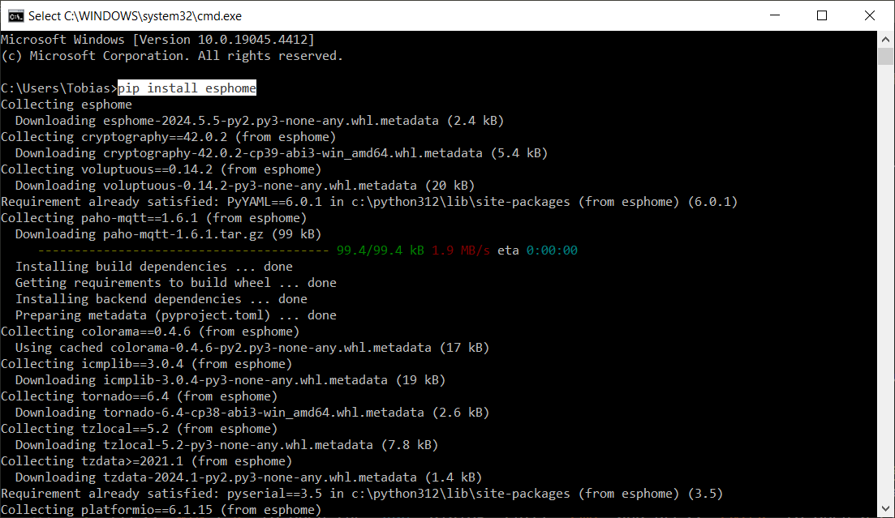
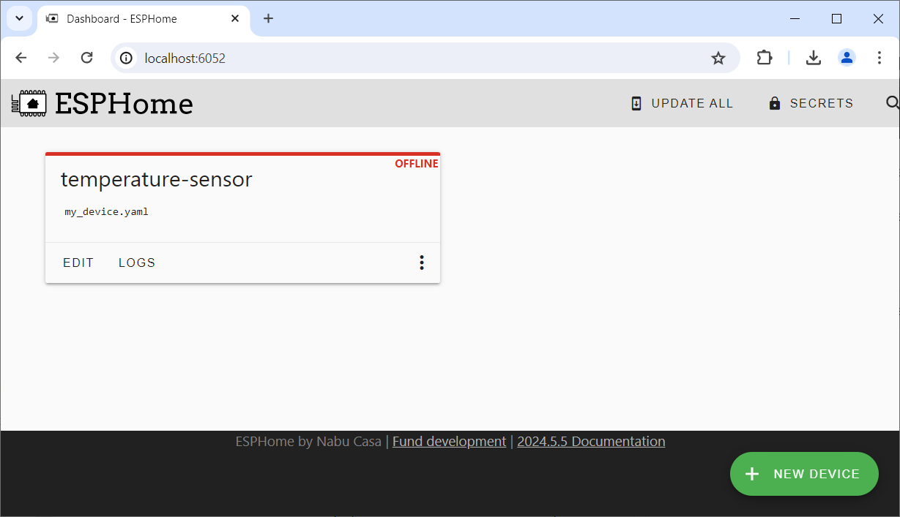

 
# ESPHome

> Free Open-Source Software To Control And Manage ESP Microcontrollers

[ESPHome](https://esphome.io/) is a free *open-source* software that seamlessly integrates into *Home Assistant*, but can also be installed *stand-alone* on various operating systems.

It automatically creates the *firmware* for *ESP* microcontrollers without writing any code. Via a *YAML* file, you *describe* the features of your microcontroller project, i.e. which *GPIOs* you use and what kind of *sensors* or *displays* you connected. *ESPHome* then takes care of the heavy lifting and automatically creates the firmware necessary to operate the microcontroller.

> [!NOTE]
> *ESPHome* is no longer limited to *ESP* microcontrollers. Recent versions integrate [LibreTiny](https://esphome.io/components/libretiny.html), an open-source platform that supports *BK72xx* and *RTL87xx* microcontrollers often found in "smart" devices such as *Plugs* and *Sensors*.

When integrated into *Home Assistant*, your *ESPHome-enabled* microcontrollers can be discovered like any other device and seamlessly integrate into your dashboards. 

## Quick Overview

Let's quickly identify the benefits of *ESPHome*, and where it may be useful for you.

### Repetitive Tasks

When you create microcontroller projects, you are faced with a lot of *repetitive tasks* while programming firmware for it:

* **Libraries:** You need to find, download and integrate the necessary libraries that support the devices and components you use.
* **Displays:** When outputting information locally, you need to write code to drive a display or some other kind of *user interface*.
* **Management:** in order to create a *useful* device, you often need to add *management capabilities*, i.e. a web interface, or some sort of web service that lets users remotely *query* or *control* the device.
* **Wireless:** For *remote management capabilities*, you need to set up a wireless network and implement ways to provide your wifi *SSID* and password.
* **OTA Updates:** Since devices are often mounted in inaccessible locations, you need to provision the microcontroller in a way that enables *over-the-air* updates
* **Security:** To make sure that *only you* can access the microcontroller, you need to carefully implement security features and manage secret keys.
* **Build Environment:** Once you have written the firmware code, you need a tool chain to *compile* the code and *upload* the binary firmware file to your microcontroller.

These are a lot of tasks that take up your valuable time that you'd probably much rather would like to spend on the *creative and fun* part (designing the special functionality of your device).

Since these tasks are *repetitive* and are required for basically *any* new project, the default *ESPHome firmware* takes care of them and enables you to focus on the genuine new features you are trying to implement. 

### Describe Your Project

All that is left for you to do is *tell ESPHome* (via a *YAML* file) which components your project uses, and what the *GPIOs* are that you use to connect them. Based on this *description*, *ESPHome* automatically includes all necessary libraries, composes the firmware code, compiles it, and uploads it to your microcontroller.

### Massive Benefits For Free

This simplifies the above mentioned *repetitive tasks* tremendously as you no longer have to chew on *default tasks* and get these benefits for free (as they are by default handled by the *ESPHome firmware*):

* **Libraries:** *ESPHome* supports almost all standard components (i.e. sensors, displays, etc) and *knows* the libraries required to drive them. It takes care of all provisioning.
* **Displays:** For displays, above applies: *ESPHome* knows almost all commonly used displays and automatically integrates them.
* **Management:** the *ESPHome* firmware automatically implements a basic web interface and web services. The device can be managed with the *ESP tools*. *ESPHome-enabled microcontrollers* are automatically discovered by *Home Assistant*, and their data can be conveniently managed via its dashboards.
* **Wireless:** *ESPHome* automatically integrates the microcontroller into your *WiFi* network and lets you select the available *WiFi* networks.
* **OTA Updates:** the *ESPHome* firmware supports *OTA* out of the box: once a microcontroller is *ESPHome-enabled*, it can be updated with just a click via the dashboard.
* **Security:** all secret management (i.e. safely storing *WiFi* passwords) is done by *ESPHome* (and seamlessly integrates with *Home Assistant* if desired). Access to the microcontroller is protected by secret API keys that are, too, transparently managed by *ESPHome*.
* **Build Environment:** since you do not need to write code, no additional tools are required. You change firmware simply by changing the properties of the *YAML* file that describes your microcontroller setup. *ESPHome* automatically derives the firmware from it and provides multiple options to upload new firmware safely to your microcontroller.

> [!TIP]
> *ESPHome* is a great way to convert DIY projects into valuable devices used inside home automation. But even if you are not interested in *home automation* at all, its *programming-free* concept is appealing to pure electronic hobbyists as well.

## Adding Home Assistant

While you can run *ESPHome* stand-alone, typically *ESPHome* is used inside *Home Assistant*: 

* **ESPHome Stand-Alone:** *Python*-based software that can be installed and run on any computer that supports *Python*. *Python* can be [installed](https://www.python.org/downloads/) on most operating systems including *Windows*, *Linux*, *macOS*, and many more.
* **ESPHome as a Home Assistant Add-On:** Once you installed *Home Assistant*, it takes just a few clicks to install the *ESPHome Add-On* inside of *Home Assistant*.

By using the *ESPHome Add-On* inside *Home Assistant*, you are combining *ESPHome features* with *Home Assistant features* and get even more very useful features for free:

*Home Assistant* can...

* **Monitoring:** ...automatically monitor your devices, query data and sensor readings in defined intervals, monitor battery and online status, and keep logs for easy lookup.
* **Dashboard:** ...provide graphical *dashboards* with switches, gauges, graphs, and more, to *visualize* the data retrieved from your devices.
* **Interaction:** ...connect devices and perform *automations*. For example, when a *temperature sensor* registers a high temperature, a *Home Assistant* automation script could automatically turn on the *air conditioning*. Your devices no longer have to provide complete solutions but instead become flexible *lego pieces* that you can use to compose all kinds of *automation logic*.

Because of this, it is strongly recommended to run *ESPHome* inside *Home Assistant*. Setting up *Home Assistant* is [really easy](https://done.land/components/microcontroller/families/raspberry/raspberrypi).

> [TIP:]
> Running *ESPHome* **stand-alone** makes sense only if you want to design devices that are running **stand-alone** as well. Since this is not the typical use case, in the remainder of this article I am focusing on *ESPHome* as part of *Home Assistant*. If you are new to *Home Assistant*, you may want to browse the articles about [Home Assistant](https://done.land/tools/software/homeassistant) first to make yourself at home.     

### Understanding Entities
When you run *ESPHome* as part of *Home Assistant* and create a new *ESPHome device*, it is automatically discovered by *Home Assistant* once it goes online. 

From the perspective of *Home Assistant*, your *ESPHome devices* are treated just like any other remotely accessible device. In order for *Home Assistant* to work with all kinds of devices, it *abstracts* device capabilities: each device *capability* surfaces as a so-called *entity*.

#### Entities = Device Capabilities

Whatever the capabilities of your *ESPHome device* may be (sensors, switches, lights, etc.), they all surface as *entities* in *Home Assistant*. These entities can then be accessed *manually* as well as *automatically*:

* **Manually: Dashboards:** You can easily add as many *Dashboards* to *Home Assistant* as you may need. *Dashboards* enable you to *manually* interact with devices. Each *dashboard* is composed of graphical *user controls* that are tied to one or more *entities*. For example, the entity representing a *temperature sensor* can be tied to a *gauge* or a *graph*. Likewise, an entity representing a *button* or *switch* can be tied to a *GPIO* that may control a relais.
* **Automatically: Automation Scripts:** Entities can as well be accessed from within *automation scripts*. *Home Assistant* automatically runs these scripts when the defined *conditions* are met. For example, when you tie the entity representing a *temperature sensor* to an automation script, you could define a condition to be a "temperature reading greater than 25 degree celsius", and when the condition is met, *automatically* access the entity representing an *electric plug* to turn on the *air conditioning*.

## Installation

*ESPHome* can either be installed *stand-alone* (if you just want to use it to create *firmware* for *stand-alone* devices), or it can be added as a *plug-in* to *Home Assistant* (if you want to continuously operate and monitor your devices and enable them to interact with each other).

### Home Assistant

If you are running [Home Assistant](https://done.land/components/microcontroller/families/raspberry/raspberrypi), the installation of *ESPHome* is easiest: simply [click here](https://my.home-assistant.io/redirect/supervisor_addon/?addon=5c53de3b_esphome&repository_url=https%3A%2F%2Fgithub.com%2Fesphome%2Fhome-assistant-addon).

This opens a web-based assistant that connects to your instance of *Home Assistant* and installs the *ESPHome add-on* once you click *INSTALL*:

Once installation completed,  access the *ESPHome GUI* via the *Home Assistant* sidebar: click *ESPHome*. This opens the *GUI* where you can start adding new *ESPHome* devices.

### Stand-Alone

*ESPHome* is written in *Python* and runs on any operating system that is supporting this language. 

These are the installation steps on a *Windows* computer:

1. [Install Python](https://www.python.org/downloads/windows/). Scroll down to the *download links*, and download the appropriate installation file, then run it. Install *Python* with the default options.
2. Press `WIN`+`R` to open the *Run* dialog. Enter `cmd` and press `ENTER` to open a classic console window.
3. In the console window, enter `pip install esphome` and press `ENTER`. 

4. Next, in the console window create a new folder for your *ESPHome* projects and set the current path to this folder (adjust the paths in the next three commands accordingly): enter `mkdir d:\esphome_projects`, then enter `d:`, then enter `cd d:\esphome_prpjects`.

This installs the basic (console command driven) version of *ESPHome*. For a more user-friendly *GUI-driven* experience, install the *ESPHome* dashboard.

Installing ESPHome Dashboard
 

These steps are necessary only for *stand-alone* installations. When *ESPHome* runs as part of *Home Assistant*, it always has a dashboard.

1. In the console, enter this command: `pip install tornado esphome`. This installs the necessary files (if required).
2. Launch the dashboard with this command (make sure you enter the path to your projects folder that you just created): `esphome dashboard d:\esphome_projects`.
3. A *Windows Security Alert* dialog opens and asks for firewall permissions. This occurs automatically when a process opens a *web socket*. Since *ESPHome* is only using the local network, the dialog should be dismissed ny clicking *Cancel*. Do not change your firewall permissions.
4. *ESPHome* is now running its own webserver for as long as the console window remains open. Open the *ESPHome dashboard* by opening a browser and entering the url `http://localhost:6052`.

> Tags: EspHome, Home Assistant, Entity

[Visit Page on Website](https://done.land/tools/software/esphome?105913061917245543) - created 2024-06-16 - last edited 2024-07-01
