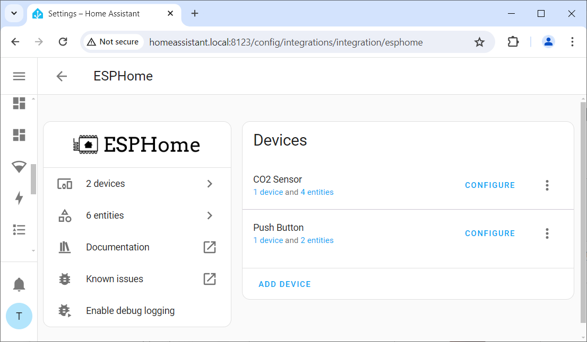

 
# Review Device Entities

> Understanding "Entities" And Checking That ESPHome Device Works As Intended

## Reviewing Device Entities
Once your *ESPHome device* is added to *Home Assistant*, check its details:

1. In *Home Assistant*, go to *Settings*, then *Devices and services*.
2. Click the integration *ESPHome*. You now see all *ESPHome devices* that were added to *Home Assistant*.

In the list, you can see the *Push Button* device that I created in the previous article. It shows *2 entities*.

### Entities

*Entities* are device services you can access. Each *entity* has a unique *ID*, and understanding *entities* is probably the most important thing in *Home Assistant*.

1. Click on *2 Entities* (shown below the device name). You now see all *entities* exposed by the selected *ESPHome device*. 

2. Hover over a *Entity ID* to see the full id in a tooltip. The entity *binary_sensor.push_button_pushbutton1* represents the *physical push button* I defined in the last article. The other entity was added automatically by *ESPHome* for managing the device.

3. Click on the *entity* to open its *log*. You can see when the push button was used, and when the device was unavailable.

4. Click *show more* to open the *real* log with much more detailed information.

> Tags: EspHome, Home Assistant, Discovery, Auto-Discovery, Adding

