 
# Internet Access

> Control Home Assistant Dashboard From Anywhere In The World

[Home Assistant](https://www.home-assistant.io/) runs as a local service in your private network and is accessible through a local ip address (or its default *mDNS* name *homeassistant.local*) on port 8123: `homeassistant.local:8123`.

Neither the *mDNS* hostname *homeassistant.local* nor port 8123 are publicly available from the outside.

If you'd like to manage *Home Assistant UI* from outside your private network - i.e. via smartphone while on vacation - you can set up *remote access*.

## Overview

[Accessing *Home Assistant* from abroad](https://www.home-assistant.io/docs/configuration/remote/) is possible via a number of routes:

* [Home Assistant Cloud/Remote UI:](https://www.home-assistant.io/docs/configuration/remote/) provided by the company that maintains *Home Assistant*. This is by far the easiest solution as it runs *out of the box*. However, this service [has significant cost attached](https://www.nabucasa.com/pricing/) (€7.50 per month or €75 per year as of this writing).
* [VPN:](https://openvpn.net/) By establishing a *VPN* (*virtual private network*) connection, you can access your local network from abroad. This is perfect if you have already set up *VPN*, and providers like [OpenVPN](https://openvpn.net/) offer free accounts.
* [Cloudflare Tunnel:](https://developers.cloudflare.com/learning-paths/replace-vpn/connect-private-network/) *Tunnels* work similar to *VPN* in that they allow secure access to your private network. *Cloudflare* is a renown US-based CDN and Internet Security company that offers *free accounts* that allow you to set up a *tunnel*. Combined with the add-on [CloudFlared](https://github.com/brenner-tobias/addon-cloudflared), this resembles a technically robust and *free* solution. You do need to own a *domain name* (or register one). Domain registration starts at €5/year. 
* **Port forwarding:** this is *insecure* and not recommended since you are making a *port* publicly available at your *Router*. It adds a *dangerous attack surface* since now *anyone in the world* has access to your *Home Assistant login page* and can try to break in or exploit possible bugs. In addition, most *Internet Service Providers* assign *dynamic IP addresses* to private customers that change often, so you would have to take additional provisions to *know* what your currently assigned *IP address* at home is.

**If you don't mind the monthly charge**, then *Home Assistant Cloud* is probably the easiest, safest, and most complete type of remote access. Accessing via [Remote UI](https://www.nabucasa.com/config/remote/) just requires a *paid Nabu Casa account* and setting up the [Home Assistant Cloud](https://www.nabucasa.com/config/) (see the provided links for details).

**If you are looking for a *free* service** and just need remote access to the *Home Assistant front-end*, then the *Cloudflare tunnel* in combination with the *Home Assistant add-on [CloudFlared](https://github.com/brenner-tobias/addon-cloudflared)* is probably the second best solution.

> [!NOTE]
> Setting up a *Cloudflare tunnel* to remotely access the *Home Assistant UI* is very simple and explained below. For more advanced features, i.e. allowing devices or your smartphone to send back sensor data to *Home Assistant* via the *tunnel* while remotely connected, more advanced *tunnel configuration* is required that is beyond the scope of this article.

## Using Cloudflare Tunnel

These are the steps it takes to set up a *basic Home Assistant remote access* based on a *free Cloudflare tunnel*:


* **Grant permission:** in *Home Assistant*, grant permission to your *add-ins* so they may act as a *proxy* for you. 
* **Visit Cloudflare:** create a *free Cloudflare account*, register a domain name, and switch the domain DNS to be managed by *Cloudflare*.
* **Install Cloudflared:** install the *Home Assistant add-on CloudFlared*, and tell it the *domain name* you want to use for external access. The add-on does the rest and creates the *tunnel*.
* **Authorize Tunnel:** Authorize the new tunnel in your *Cloudflare Dashboard*, and associate it with the *domain* that you want to use for *remotely accessing Home Assistant*. 

Once done, you can access your *Home Assistant Dashboard* from anywhere in the world by entering the *domain name* you registered into any browser window, or by using the official *Home Assistant app*.


## Configure Home Assistant
Let's start with this step first as it requires a little bit of advanced *Home Assistant configuration*. All the remaining steps are simple click-work.


<details><summary>Why is this step needed anyway? Is it dangerous?</summary><br/>


When accessing *Home Assistant* remotely, you need someone at the *local Home Assistant instance in your home* that can act on your behalf: a *puppet* (or more technically a *proxy*).

The *Home Assistant CloudFlared* acts as such a proxy. *Home Assistant* needs to *trust* it, and it doesn't trust *anybody* by default.

Granting such permissions is nothing a regular user would do on a regular basis, so there are no controls in the user interface for it.

To grant the permission, you need to *manually* add the appropriate lines into *Home Assistants'* main configuration file named *configuration.yaml*.

For this you need a *file editor* which can be added to *Home Assistant* as an *add-on*. Once you have a *file editor* at hand, editing *configuration.yaml* and adding the permission is simple.

Whenever you edit core settings, the primary risk is that you *mess up vital settings* as there is no *UI* to guide and prevent you from accidentally shooting yourself in the knee.

That's why the guide below makes sure you *test* and *validate* your changes to *configuration.yaml* before you apply them.

> [!CAUTION]
> That said, as always, it is completely up to you and solely at your own risk to apply changes to your instance of *Home Assistant* or generally follow any advice given on this website.

</details>

1. Install a *editor add-on* if you have no file editor installed on your *Home Assistant*. Click below link to install *Studio Code Server* (based on *VSCode*), or install any other file editor of your choice.

    [](https://my.home-assistant.io/redirect/supervisor_addon/?addon=a0d7b954_vscode)

2. If you installed *Studio Code Server*, click *Studio Code Server* in the *Home Assistant sidebar*. Else, open any other *file editor* you may be using.

3. In your *file editor*, open the file `/config/configuration.yaml`. This file may be completely empty, or it may already contain content. If it does, **do not change** any of its existing content. *Append* the lines below to the end of the file:

     ````
     http:
      use_x_forwarded_for: true
      trusted_proxies:
        - 172.30.33.0/24
      ip_ban_enabled: true
      login_attempts_threshold: 5
     ````

     * **use_x_forwarded_for:** Uses the *X-Forwarded-For* header from the proxy to know real client IP.
     * **trusted_proxies:** trusts the *docker network* where the *add-ons* are located
     * **ip_ban_enabled:** bans IP addresses based on login attempts. *(optional)*
     * **login_attempts_threshold:** bans *IP addresses* after the number of consecutive failed login attempts. *(optional)*

     

     > Make sure you get the *indendation* right. *Studio Code Editor* shows squiggles and tooltips if your indentation is incorrect, but other editors may not double-check for you. *Studio Code Server* also applies your edits to the file immediately. There is no need to *save* edits.

3. In the *Home Assistant sidebar*, click *Developer tools*, then make sure the tab *YAML* at the top of the page is selected. Click *CHECK CONFIGURATION*. Assert that your edits won't prevent *Home Assistant* from starting.


    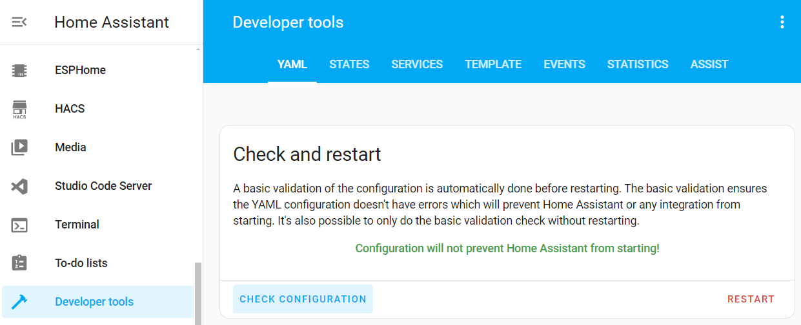

4. Click *RESTART*, then *Restart Home Assistant* to fully restart *Home Assistant*.


## Signing Up With CloudFlare
Create a new free account with [CloudFlare](https://dash.cloudflare.com/sign-up). 

An overview of its services and what you can do with your account can be found [here](https://developers.cloudflare.com/fundamentals/setup/), but this reading or any  expertise with *Cloudflare* is not required.

Just stay logged into your *Cloudflare account* and follow  the next steps  up a free *remote access* for *Home Assistant*.


### Register Domain Name
Register a new domain name with [United Domains](https://www.united-domains.de/),  [Namecheap](https://www.namecheap.com/), or any other registrar.


> [!IMPORTANT]
> "Free" domain names from services like [FreeNom](https://www.freenom.com/) do not work.


You can register a new domain from inside *Cloudflare* as well, in which case you do not need to  switch *DNS* for your domain to *Cloudflare* separately (and can skip the next section) as it is by default using *Cloudflare DNS*.

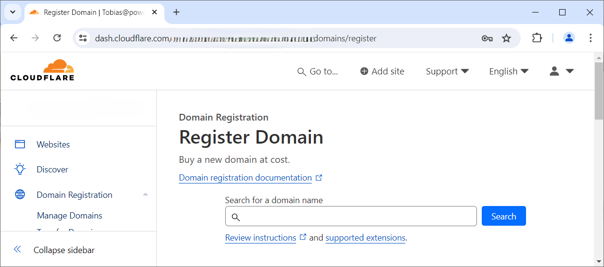

> [!NOTE]
> Choose a less popular *domain name*: *fredslittlehomeautomation.online* currently costs just €3 for the first year whereas *myhome.cloud* is available for €9.554.


### Add Domain DNS To Cloudflare
If you got your *domain* from a registrar other than *Cloudflare*, switch the *DNS* for it to *Cloudflare* so *Cloudflare* can manage it:

1. Log into your *Cloudflare dashboard*, and in the sidebar click *Websites*. 
2. lick *Add a site* to add your domain name. Follow the instructions.

## Install Add-On "Cloudflared"

On *Home Assistant*, install the *add-on Cloudflared*. 


<details><summary>What does "Cloudflared" do? Do I really need it?</summary><br/>

[Cloudflared](https://github.com/brenner-tobias/addon-cloudflared) is a free and open-source add-on for *Home Assistant* - you can [visit](https://github.com/brenner-tobias/addon-cloudflared) its project page and review its source code if in doubt.

You don't necessarily *need* this *add-on*. It just makes things so much easier. Without it, you would have to define the *tunnel* yourself, and you would have to take provisions on the *Home Assistant* side so that it would respond to the *tunnel*.

In a nutshell, *CloudFlared* is your local *proxy* that acts on your behalf whenever you access *Home Assistant* remotely: 

You enter the *Cloudflare tunnel* with your *registered domain name*, and at the other end, *Cloudflared* receives your commands and sends back the requested information.


</details>


Here are the three steps required:

* **Add-On Store:** make sure the add-on is available in the *Home Assistant Add-On Store*
* **Install:** install the add-on from the store
* **Configure:** set the domain name that you want to use to externally access *Home Assistant*
* **Launch Add-On:** launch the add-on, let it auto-create the tunnel, and authorize it in your *Cloudflare dashboard*

### Make Cloudflared Add-On Available
The add-on [Cloudflared](https://github.com/brenner-tobias/addon-cloudflared) is not part of the "official" *Home Assistant* add-ons. To be able to *install* it in the *Home Assistant Add-On Store*, it first must be added to the list of available add-ons:

1. Click the link below to navigate to the list of custom *urls* that can be installed via *Home Assistant Add-On Store*:

    [](https://my.home-assistant.io/redirect/supervisor_add_addon_repository/?repository_url=https%3A%2F%2Fgithub.com%2Fbrenner-tobias%2Fha-addons)


1. A confirmation dialog opens. Verify that the local link to your *Home Assistant* in the bottom part of the dialog is correct. The link should point to `http://homeassistant.local:8123`. If it points to an *IP address*, make sure *Home Server* is currently using this address, or click the pencil icon to change the url.

    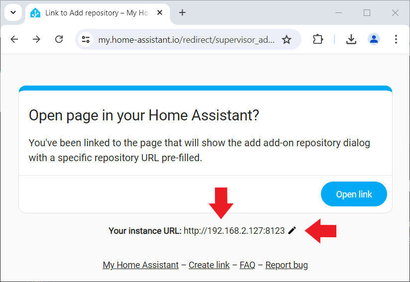

2. When you are certain the *url* in the dialog is correct, click *Open link*. You are connected to *Home Assistant* and see the *Manage add-on repositories* page. The textbox *Add* is pre-populated with the *url* for the add-on you need. Click *ADD*.

    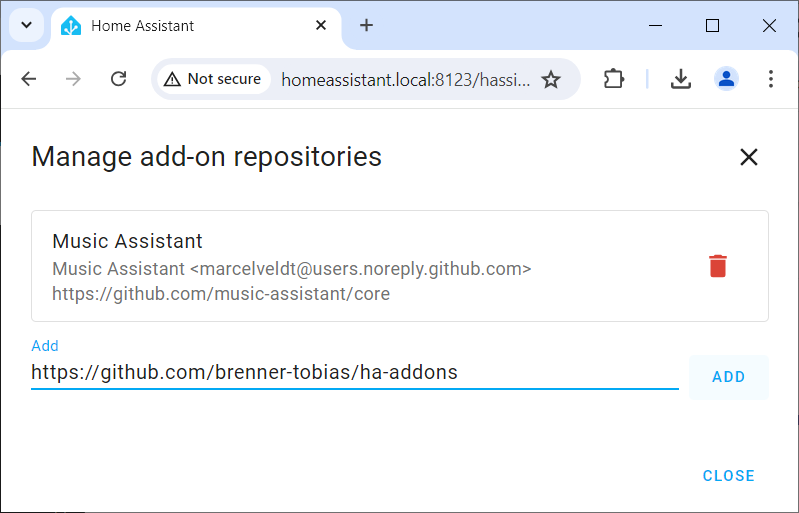

3. The *source url* for the new *add-on* is added to your *custom add-ons* in your *Add-On Store*. Click *CLOSE* to close the dialog.

    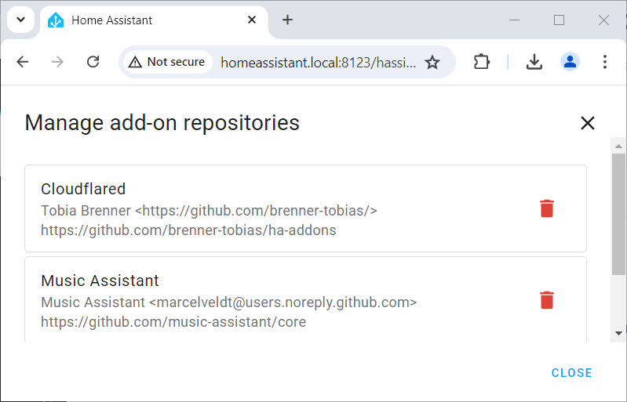


> [!NOTE]
> You have just *added the source location* of the *add-on* to your *Add-On Store* so you can later *install* it. The *add-on* is at this point not yet installed (see next step).


### Install Cloudflared Add-On
Next, *install* the *cloudflared* add-on:

1. In the *Home Assistant sidebar*, click *Settings*, then *Add-ons*. This opens a page with all of your currently installed *add-ons*.

    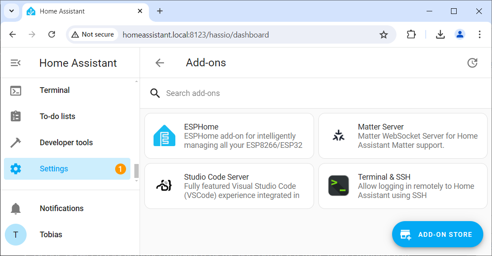

2. Click *ADD-ON STORE* to open the store, and search for *cloudflared*. Thanks to the previous step, this "inofficial" *add-on* is discovered.

    

3. Click the *add-on tile*. At the bottom of the tile, click *INSTALL*.

    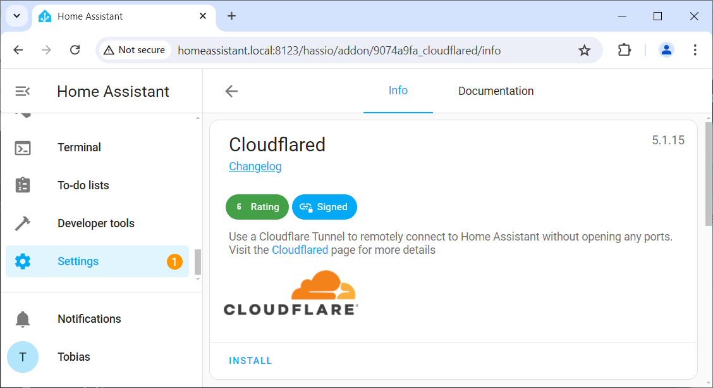

4. The installation takes only a few seconds. Once it is installed, **do not start the add-on yet**.

    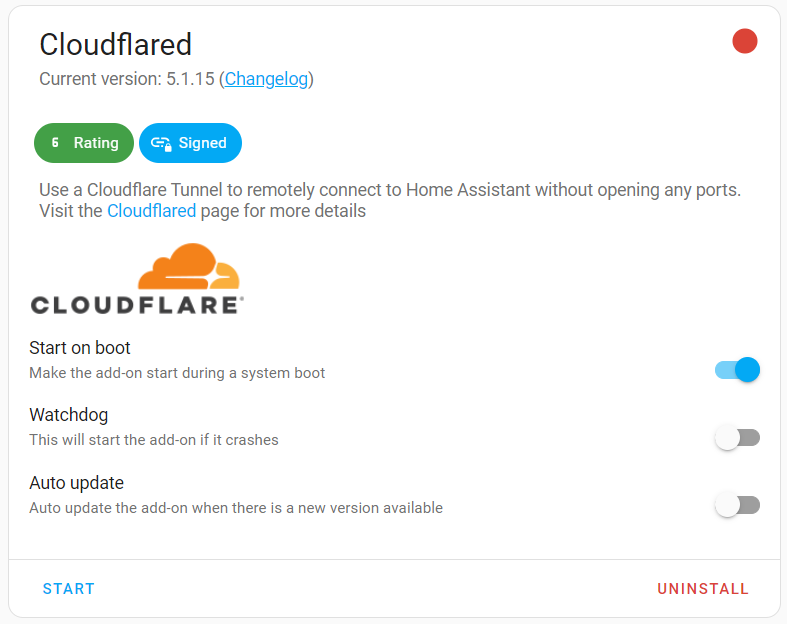


### Configure Cloudflared
Teach *cloudflared* the *domain name* you want to use to access *Home Assistant*. For this, in the *add-on page*, at the top click *Configuration*.


1. If you have closed the browser already or would like to return to this step at a later time, here is how you re-open the window: in the *Home Assistant sidebar*, click *Settings*, then *Add-ons*, then click on *Cloudflared*.

   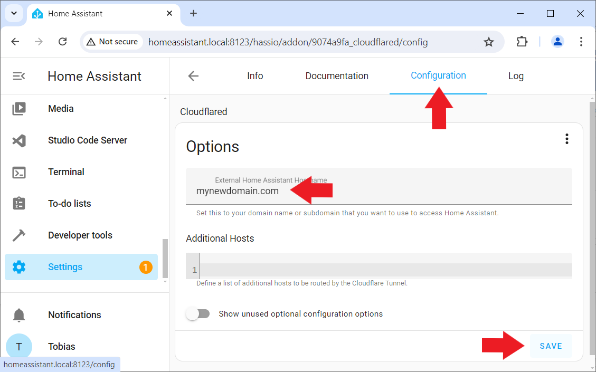

2. In the text box *External Home Assistant Hostname*, enter the name of the *domain* you registered. Then click *SAVE*.

    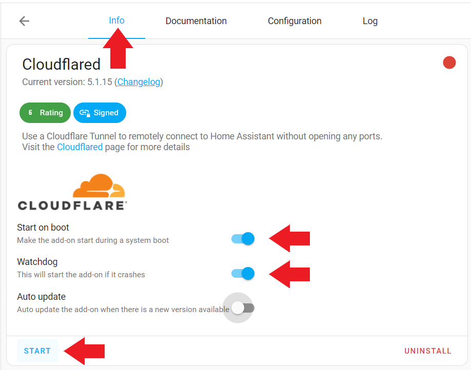


### Launch Cloudflared
*Start* the add-on *cloudflared*:

1. At the top, click the tab *Info*, then turn on the options *Start on boot* and *Watchdog* to make sure the *add-on* is always available. Finally, in the bottom part click *START*.


    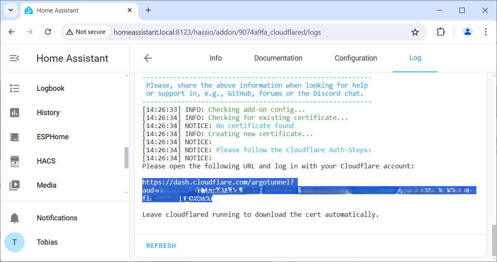

2. At the top, click *Log* and scroll to the bottom where you find a *cloudflare url* that you need to visit to authorize the tunnel. 

> [!IMPORTANT]
> Leave this window open - you need it in the next step.

### Authorize New Tunnel
Authorize the new *tunnel* in *CloudFlare*, and associate it with the domain you want to use:

1. Copy and paste the *url* from the *Cloudflared log* (see previous step) into your browser. This takes you directly into your *CloudFlare Dashboard* where you need to log in using your *Cloudflare account credentials*.

    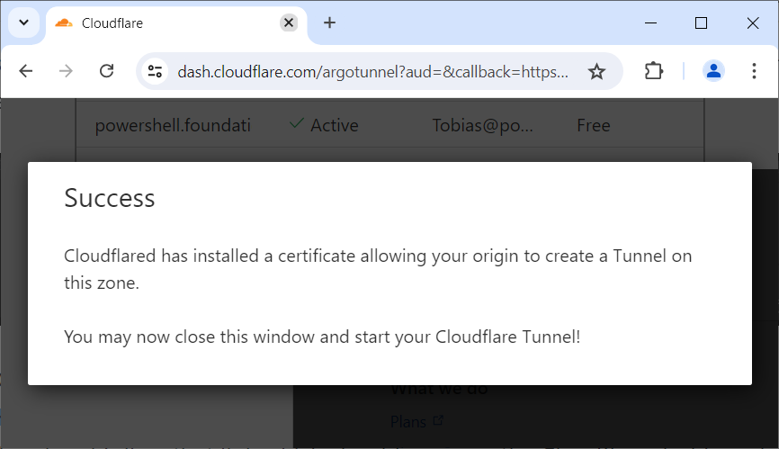


2. Once logged into *Cloudflare*, you are asked to select the *domain* you wish to assign to the tunnel (if you use more than one). *Cloudflare* automatically creates a *certificate* that is picked up by the *cloudflared add-on*, and you are set.

    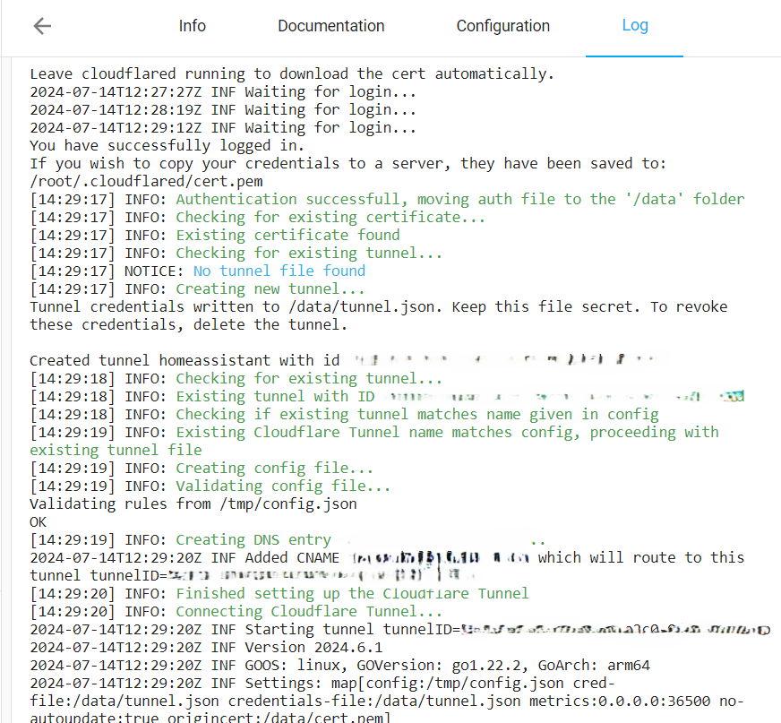


> [!TIP]
> Switch back to the *Cloudflared* (see previous step) tab **Log** to view the authorization process from *cloudflared's perspective* and verify that there are no errors logged.


### Enable Home Assistant Remote Access
Tell *Home Assistant* the new *domain name* that now can be used for *remote access*. 

This ensures that applications such as the official *Home Assistant App* can also remotely access your *Home Assistant*:

1. In *Home Assistant*, in its sidebar click *Settings*, then *System*, and look for the tile *Network*. Below the tile, it reads *External access disabled*.

    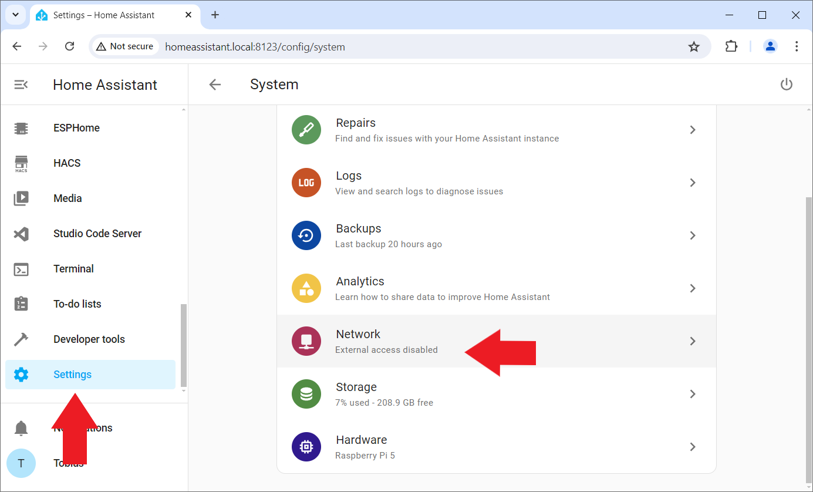

2. Click *Network*. In the text box *Internet*, enter your fully qualified domain name. Do not forget to prepend the *domain name* with `https://`. Then click *SAVE*.

    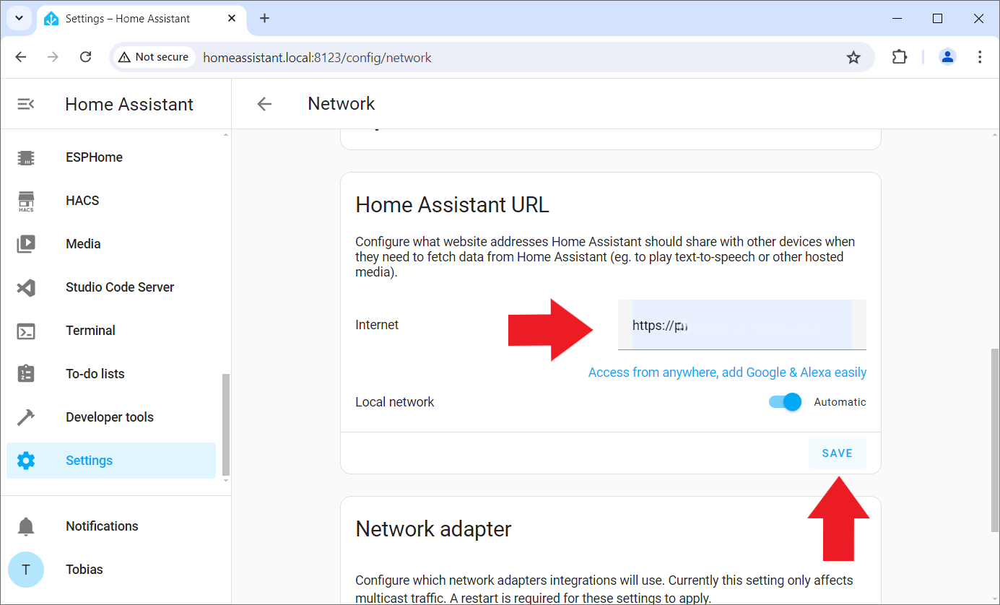

4. At the top, click the *left arrow* in front of *Network* to go back one page. The tile *Network* now reads *External access enabled*.

    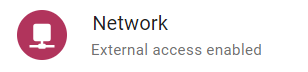

## Accessing Home Assistant Remotely

If you followed all steps, you can now access your instance of *Home Assistant* remotely from anywhere in the world. 

Simply launch a browser, and enter the domain name you used above:

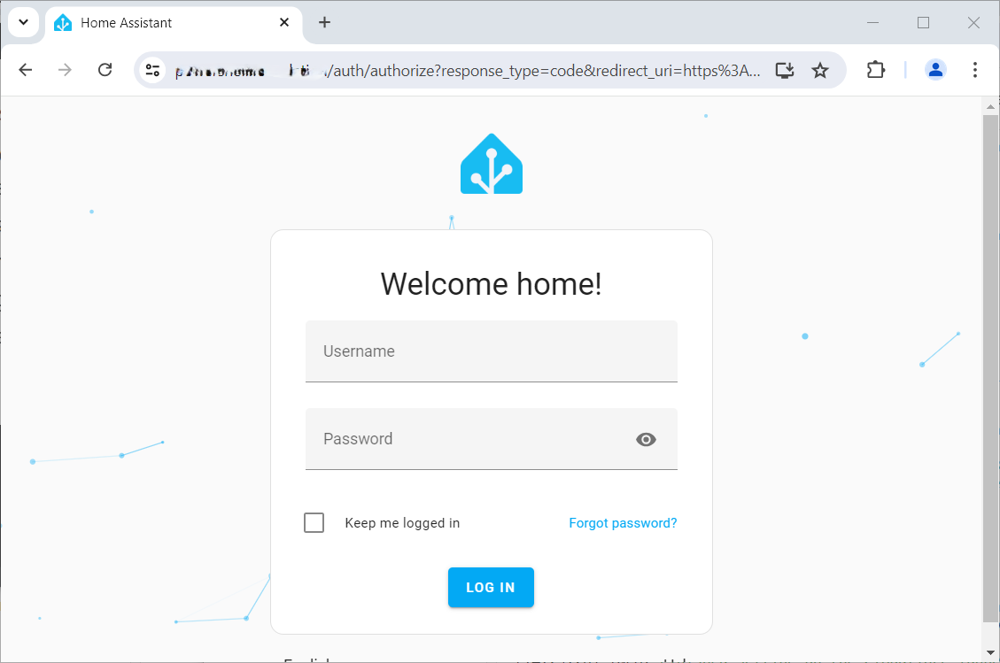

You are greeted with the *Home Assistant login* and can now use your credentials to log into *Home Assistant* - just as if you would use it locally inside your home network.

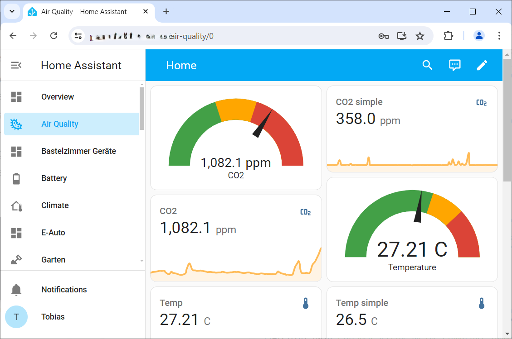

### Using iPhone App
Once your remote access works in a browser, it also works with the official *Home Assistant app* on an *iPhone*.


> [!NOTE]
> I was not yet able to test this on *Android* smartphones. If you tried it, please leave a comment below.


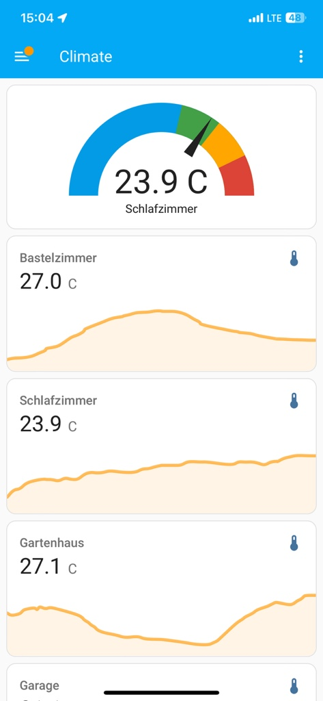


> [!NOTE]
> The *remote access* enables you to check on your home and turn devices on and off. Anything beyond I did not test yet. Trying to transfer sensor readings from your remote device into *Home Assistant* may still fail with this simple setup. Sharing your experience via a comment below would be greatly appreciated, and if you can contribute tips on further improve this solution, please share.


## Final Steps
Your *remote access* is already working: when you enter your *domain name* into any browser, you are taken directly to your *Home Assistant Dashboard*.

Below are a few recommended steps to *secure* and *polish* your *remote access*.


### Forcing HTTPS Access
Ask *Cloudflare* to automatically *encrypt* your network connection to prevent *man-in-the-middle* attacks and *network sniffers* that otherwise might spy on the *credentials* you use to log into *Home Assistant*:

1. Visit your [Cloudflare Dashboard](https://dash.cloudflare.com/). In its sidebar, click *Websites*, then click on the tile representing the *domain* you have configured to *remotely access Home Assistant*. 

    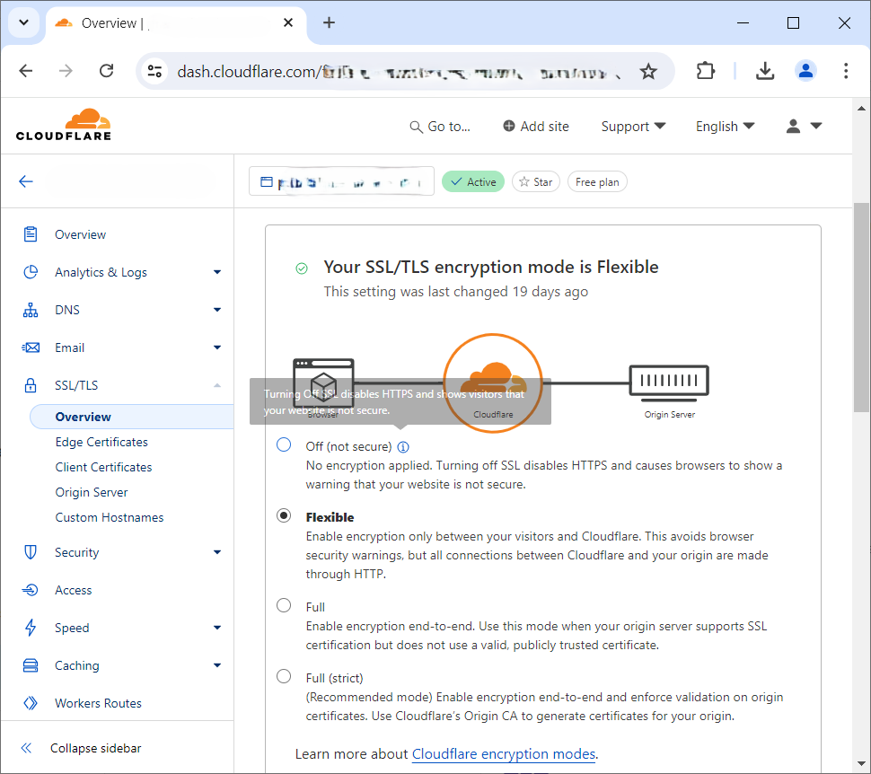

2. In the sidebar, go to *SSL/TLS*. Make sure the mode is set to *Flexible*. Then in the sidebar, click the subitem *Edge Certificates*.

    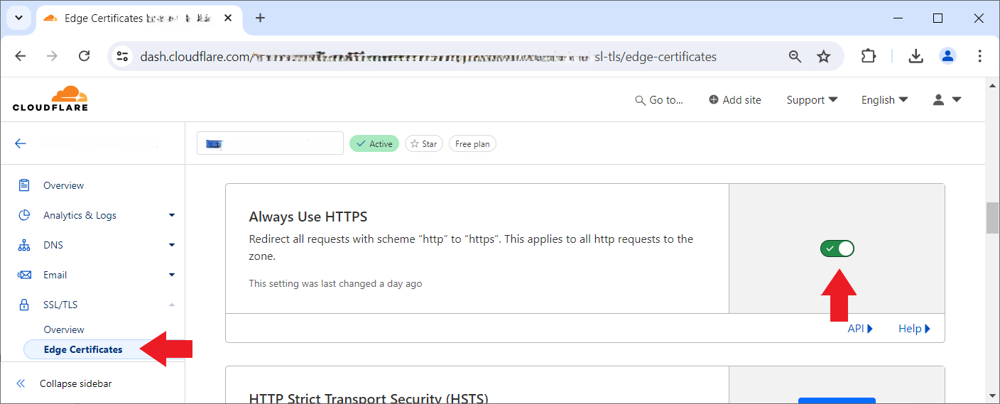

3. Scroll down the list of security features until you see *Always use HTTPS*, and enable this setting.

Now, when you just enter your *domain name* into a browser, or when you accidentally use the prefix *http://*, *Cloudflare* automatically changes this to *https://* and *encrypts* your data.

### Blocking Malicious Actors
*Cloudflare* lets you configure custom *Web Application Firewall Rules* that are a powerful way of blocking malicious attackers.

Below are *four examples* for significantly limiting your *attack surface*, based on *geography*, *device type*, *ip address*, and *bot detection*.

> [!TIP]
> *Free CloudFlare accounts* can define up to *five custom WAF rules*. Below *four rules* can be *combined* by using the locical operators *and* and *or* in case you are exceeding your rule limit.

#### Blocking Countries
Most malicious attacks typically do not originate in your neighborhood. By blocking countries that you are not visiting, you can limit your *attack surface* considerably.


1. Visit your [Cloudflare Dashboard](https://dash.cloudflare.com/). In its sidebar, click *Websites*, then click on the tile representing the *domain* you have configured to *remotely access Home Assistant*. 

2. In the sidebar, go to *Security*, and click the subitem *WAF* (*Web Application Firewall*). Below, click *Custom rules*.

    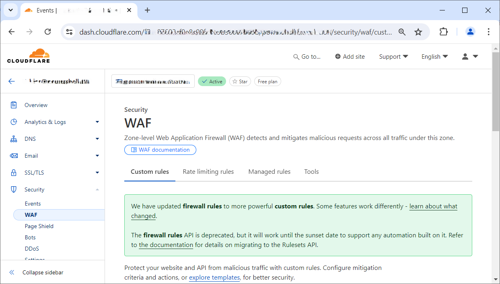


3. Scroll down a bit, and click *Create rule*. Assign a name to your rule, i.e. *Block countries*. Below *When incoming requests match...*, in *Field* select *Country*. Use *is not in* as *Operator*. In *Value*, now enter the countries in which you **want** to use *remote access*.

    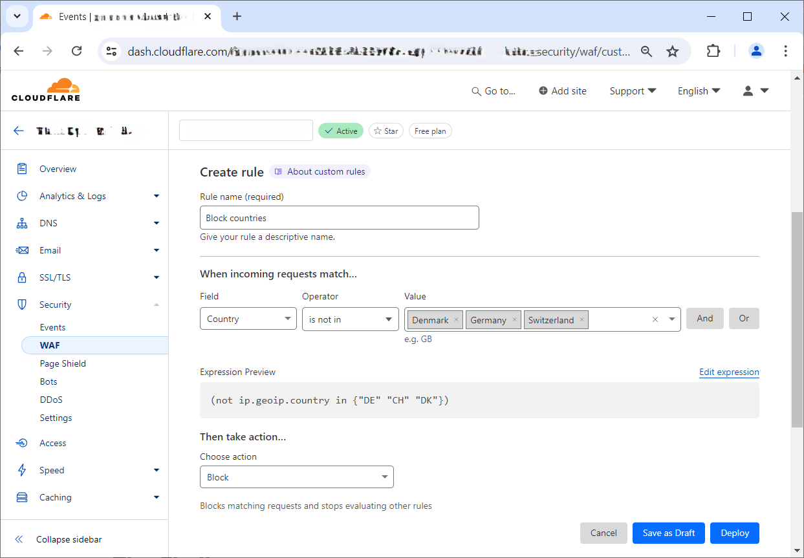

4. Below *Then take action...* select *Block*. Then click *Deploy*. 

Now any request from any country *except the ones you explicitly whitelisted* will be blocked.

> [!TIP]
> You can [find out](https://www.whatismybrowser.com/detect/what-is-my-user-agent/) the *user agent string* by which a particular browser on a particular device identifies itself. Navigate to this link from all devices that you plan to use, then create a rule that identifies these user agents.

#### Blocking User Agents
If you *know* that you will be using your *remote access* only from certain devices, you can limit access to the *user agent ids* of such devices.

1. [Find out](https://www.whatismybrowser.com/detect/what-is-my-user-agent/) the user agent for all devices you are planning to use, and make a list of user agents you want to *allow*.

2. Follow the steps for [Blocking Countries](#blocking-malicious-actors), then create a new rule, and assign it a name: *Block User Agents*.

3. In *Field*, select *User Agent*. Use the operator *does not start with*, then put *one* of your legit *user agent strings* into the field *Value*. 


    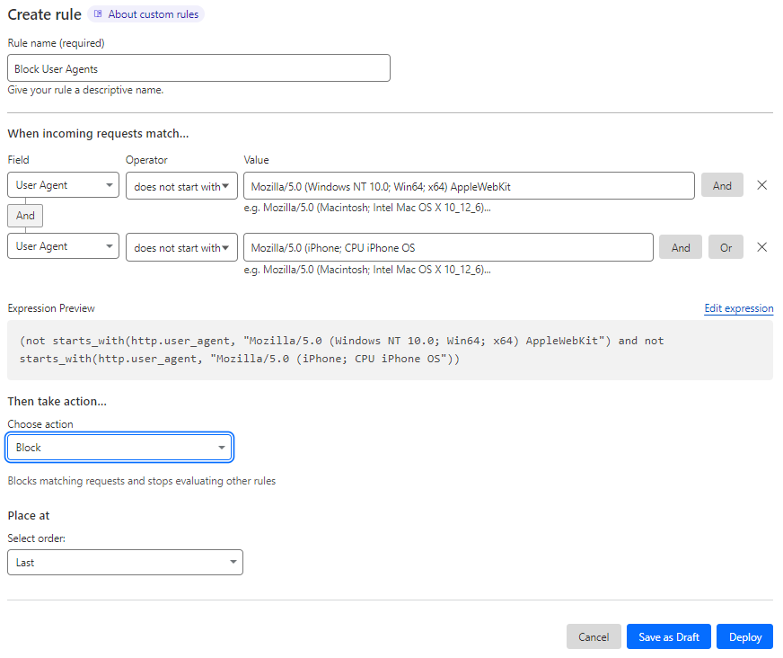

4. Remove from the *right side* (the end of the *user agent*) as much information as you like to find a balance of being *specific* while not being *too specific*. If you check for the *entire user agent*, your rule blocks access to your devices when they *update* any of their browser components, and the version numbers in the *user agent string* change.

5. Click the button *And*. Repeat the steps for all *user agents* you want to *allow*.

6. If you plan on using the *Home Assistant App* remotely, click *And*, then add another *user agent* named *Home Assistant*.

7. When you are done, click *Deploy*.

Test your *remote access* with all devices you want to use. If a particular device (or *browser* or *app*) no longer works, go back to your rules and adjust them. 

For debugging, you can *disable* selected rules and check to see whether this causes the unwanted block, then refine the rule settings.

> [!TIP]
> If your *Home Assistant App* gets blocked due to errors in your *rules*, the app shows its *initialization screen* and wants to search for your *Home Assistant instance* again. Even if you change or disable your rules, the app stays in this mode. You need to connect your smartphone to *WiFi* and follow the instructions in the app to redo its initial setup. Only then can you continue testing your remote access with the app.

#### Blocking Bots
*Cloudflare* can automatically protect your *remote access* against all *known bots*.


1. Follow the steps for [Blocking Countries](#blocking-malicious-actors), then create a new rule, and assign it a name: *Block Known Bots*.

2. In *Field*, select *Known Bots*. Enable *Value*.

3. In *Choose action*, select *Block*, then click *Deploy*


#### Blocking Threats
*Cloudflare* associates any *IP address* with a *threat score* based on its reputation, calculated based on [Project Honeypot](https://www.projecthoneypot.org/) and internal *Cloudflare intelligence*.

The result is a numerical value in the range of 0 to 100 with 0 representing *low risk*. Values above 10 may represent *spammers* or *bots*, while values above 40 identify *bad actors* on the Internet.

Here is a rule that restricts access to your *tunnel* based on the *threat level*:


1. Follow the steps for [Blocking Countries](##blocking-malicious-actors), then create a new rule, and assign it a name: *Block Threats*.

2. In *Field*, select *Threat Score*. Use the operator *greater than*, and in *Value*, pick the *threat level*, for example *10*.

3. In *Choose action*, select *Block*, then click *Deploy*

### Monitor Remote Access
It is recommended to regularly *monitor* your *remote access* in your [Cloudflare Dashboard](https://dash.cloudflare.com/) to become aware of unusual activities.

Once logged in, in the *Cloudflare Dashboard sidebar* click *Websites*, then click the tile of your *domain name*.

This provides you with a general overview of *visitors*, *traffic*, and *origin*. Make sure what you see is what you expect.


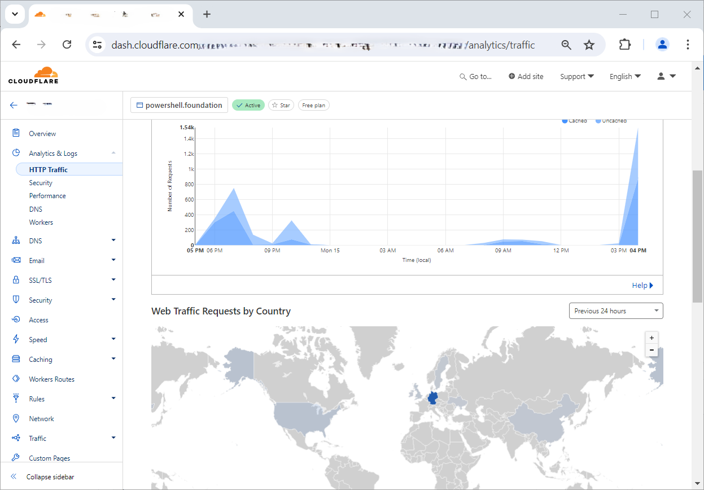

> [!TIP]
> If for instance you see unusual visitors from a country other than the ones you have been to recently, review your *WAF firewall rules* to *block these countries* (see above).

#### Firewall Events
Next, in the sidebar click *Security*. Now you see your *WAF Firewall Events*. This shows the results of your *firewall rules*.


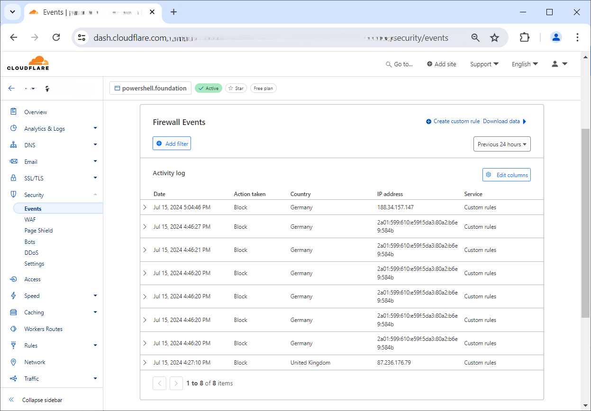

### Security Conclusions

Always keep in mind: no matter how you implement your *remote access*: it will almost immediately be under constant attack. 

No one is targeting you *personally*. *IP addresses* are attacked *automatically*, and highly sophisticated systems test for a wide range of *vulnerabilities* and *zero-day exploits*. 

*Cloudflare* is a highly specialized company that protects web businesses around the globe - and with just a bit of configuration (as outlined above), your *remote access* is now also much better protected than most alternatives. If you need even more protection, *upgrade to a paid plan*.

Also re-evaluate the *need* for your remote access: do you *really* need it, and is it worth the additional risk?

> [!TIP]
> *Disabling* your remote access until you do go on vacation or are away from home for a prolonged period of time might be a wise *trade-off*.

> Tags: Home Assistant, Internet, Access, Cloudflare, Cloudflared, Proxy, Remote Access

[Visit Page on Website](https://done.land/tools/software/homeassistant/internetaccess?705421071514241948) - created 2024-07-13 - last edited 2024-07-13
