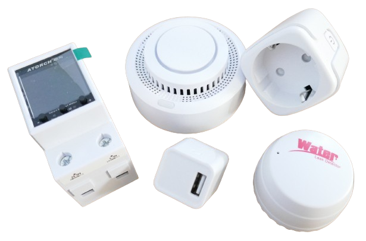

 
# Tuya

> Using Chinese Tuya Smart Devices

[Tuya](https://www.tuya.com/) is a Chinese company offering an *IoT platform* for generic *IoT devices*: *wireless plugs*, *lights*, and more. 

]

When you come across a *smart device* with *tuya* logo, the device is designed and manufactured by a generic company that prepared the *device firmware* so that it utilizes the *Tuya cloud services*. 

]

> [!NOTE]
> For *customers* there are no fees: just register a *free account* with *Tuya*. Vendors contract separarely with *Tuya* to get permission to use their cloud: even small *IoT companies* with no budget to set up their own *cloud* can sell *smart devices*.

## Why deal with Tuya?
Devices with *Tuya* logo are *WiFi*-enabled and microcontroller-based, typically available at exceptionally competitive pricing.

For example, a *smart electric plug* with built-in *power meter* is regularly sold for less than €3 at [AliExpress](https://aliexpress.com/). That's less than a maker would pay for the parts.

Typical *consumers* control *Tuya* devices via smartphone app: [Tuya](https://apps.apple.com/de/app/tuya-smart/id1034649547) or [SmartLife](https://www.tuya.com/product/app-management/all-in-one-app) both work.

### ESPHome And Home Assistant
What makes *Tuya smart devices* especially exciting is that they can be used as part of *automations* in [Home Assistant](https://done.land/tools/software/homeassistant) and other automation platforms. 

You can even replace the *firmware* on their internal microcontroller to completely take control, and disconnected any *cloud dependencies*.

* **Home Assistant:** comes with an official *Tuya integration* that discovers all *Tuya*-enabled devices and makes their *entities* (device features) accessible. The integration uses the *Tuya cloud API* and requires no changes at the device: very simple to set up and use. The downside is that any failure in any part of the cloud service tool chain is a ***single** point of failure*, and *Tuya devices* become inaccessible - whether your *Internet connection* fails, the *Home Assistant integration* has a bug, or the *Tuya cloud API* does not respond.
* **ESPHome:** most *Tuya*-enabled devices use *ESP8266*, *Beken BK72xx*, or *Realtec RTL87xx*. They are all supported by *ESPHome*, so you can *replace* the proprietary *firmware* with *ESPHome firmware*, turning the device into a locally controllable *ESPHome device*. This replacement requires *expert knowledge*, but in exchange you *eliminate* all dependencies to the *Internet* and *Tuya cloud API*. For *Home Assistant*, the device is now an *ESPHome device*, and the *Tuya integration* is not used.

### Use Cases
Whether you access **original** *Tuya devices* through the built-in *Tuya integration*, or whether you **convert** *Tuya devices* to *ESPHome devices*: you use *cheap but relatively powerful Chinese hardware* as part of your *home automation*:

* **Control Applicances and Their Power Consumption:** use *smart plugs* to turn appliances in your household on and off, based on other devices managed by *Home Assistant*, i.e. *buttons*, *dashboards*, or *sensor readings*. I.e. create a physical dashboard with push buttons to control different appliances anywhere in your home, including power consumption monitoring (most *smart plugs* come with *power monitoring functionality*).
* **Build Smart Fire Hazard Protection Systems:** cheap (but reliable) *wireless Tuya smoke detectors* can be turned into a sophisticated *fire alarm network*, and *Home Assistant* can turn on *sirens or alarm lights* when *any* of the smoke detectors triggers, or send off an *email*. Cost of commercial systems with such a feature set would be prohibitive for private homes.
* **Create Open-Source Hue-like Lighting:** There are ubiquous *Tuya* lights and led stripes available, and combined with *Home Assistant*, you can design your own open-source *home light system* that controls *scenes* and can turn on illuminations based on time of day, whether you are at home, or whatnot.

These, and the many other use-cases basically illustrate what *Home Assistant* enables you to do. *Tuya* just adds many more *controllable devices* at a very reasonable cost.

## WiFi vs. Zigbee
*Wireless Tuya* devices use *WiFi* or *Zigbee* for wireless connection: 

* **WiFi Device:** connects directly to your *WiFi* and increases the total number of *WiFi devices* (each *WiFi device* requires its own unique *IP address*). Devices can only be connected at locations where *WiFi coverage* is strong enough.
* **Zigbee Device:** connects to a *self-organizing Zigbee network*. *Zigbee devices* are addressed by the *Zigbee network* and do not increase the total number of *WiFi devices*. A *Zigbee gateway* connects the *Zigbee network* to *WiFi*, and only this gateway must be located within the *WiFi coverage*. *Zigbee End Devices* connect to another *Zigbee End Devices* with *Zigbee Router capabilities*. 

*Zigbee devices* are ideal for locations with weak *WiFi coverage*, and to reduce the total number of *WiFi devices*. A *Zigbee Gateway device* is required for *Home Assistant* to be able to contact the *Zigbee network*.

### Zigbee Network
*Zigbee* devices create their own *self-organizing* network that is independent of *WiFi* (it uses the same frequency range). In *Zigbee networks*, there are three *Zigbee device types*:

* **ZigBee Coordinator (ZC):** each *Zigbee network* has exactly **one** coordinator. It bootstraps the *Zigbee* network, then acts as a *Zigbee Router*, and is always *on*.
* **ZigBee End Device (ZED):** the device you want to control: it can **poll** *Zigbee Routers* whenever it wants to exchange data. This way, the device can be *off* most of the time to conserve energy, and contact its *Zigbee Router* (much like a *mailbox*) whenever it is ready to exchange information. 
* **Zigbee Router (ZR):** connects to *Zigbee End Devices* and buffers data for *Zigbee End Devices* until they *wake up* and *poll* data.

### Advantages
These modular device types lead to the unique *advantages* of *Zigbee*:

* **Low Energy:** Pure *End Devices* can be *off* most of the time to save energy. They can run on a battery for a long time.
* **Coverage:** *End Devices* can connect to *any Zigbee Router*, and most *AC powered End Devices* automatically also act as a *Zigbee Router*. To connect to a *Zigbee device* in a faint location, just make sure you position enough *Zigbee End Devices with Router capability* between the *End Device* and the *Coordinator*. Data can then hop across multiple *Zigbee Routers*.

> [!TIP]
> Due to its flexible *Router* concept, you can tailor network coverage exactly to your needs. Just make sure you know which of your *Zigbee End Devices* are in fact also *Zigbee Routers* that extend network coverage. *AC powered* devices *typically* serve as *Routers*. *Battery-powered devices* never route and never extend network coverage.

### Zigbee Gateway
In order for *Home Assistant* to discover and use *Zigbee devices*, it needs access to the *Zigbee network*.

This is typically done by plugging a *USB Zigbee Gateway device* into one of the USB ports of the computer that is running *Home Assistant*.

A *Zigbee Gateway* is a *Zigbee Coordinator* that also translates between *WiFi* and *Zigbee*. The *maximum number of supported Zigbee End Devices* depends on the capabilities of the *Zigbee Gateway*. Some gateways support just *35 devices* while others happily deal with more than *100 devices*. 

> [!IMPORTANT]
> To use *Zigbee Devices* with *Home Assistant*, make sure you purchase a [HA-compatible Zigbee Gateway device](https://www.home-assistant.io/integrations/zha/). Some are *vendor-specific* and work only with *Zigbee devices* from one particular vendor (i.e. *Tuya*). 

 The maximum *number* of *Zigbee End Devices* you can use depends on the capabilities of the *Zigbee Gateway device* you choose. Some support only *35 devices* whereas others can coordinate more than 100.

### Multiple Zigbee Networks
Some vendors (i.e. [Philips Hue](https://www.philips-hue.com/) lights) use proprietary *Zigbee networks* with their own *Zigbee gateway devices*, so in your home there may already be a *Zigbee network* connected to your *WiFi*.

Leave existing *Zigbee networks* untouched: simply add a *new Zigbee Gateway device* to add a new *Zigbee network*. Only when you *pair* a particular device, you select the network the device is associated with.

> [!TIP]
> The only limiting factor is *RF bandwidth:* all *WiFi-* and *Zigbee*-networks in your vicinity (your own **and** wireless networks of your neighbors) use the same *radio frequencies* and can interfere with each other.

## Caveats

*Tuya* is a *cloud service* that works out of the box and requires next to no configuration - so it is *very easy to use*. This comes at a price:

* **Privacy:** *Tuya* knows when you turn on a *smart plug* in your home. Whether that's of concern to you is:  up to you
* **Reliability:** *Tuya smart devices* may stop working when the cloud service stops working. This is always true for devices that you manage via the *Home Assistant integration* (that is *always* controlling devices via the *Tuya cloud API*). The *SmartLife app* can control devices *locally*, too, and may serve as a fallback in case of *Internet outage*.

> [!IMPORTANT]
> Evaluate use cases carefully: it may be ok when the garden illumination occasionally does not automatically turn on in the evening. If a *Tuya smart plug* controls the *garden pump* and your automation suddenly cannot *turn it off anymore* (while you may be away on vacation), that's a different ball game.

 If you *rely* on *controlling crucial devices*, avoid *cloud-based* solutions or add a fallback strategy. Such a fallback is sometimes built into the devices: *smart plugs* have a manual switch that always works (provided you have physical access to it).

### Local Control

One way of limiting risk and improving *reliability* is to control *Tuya devices* **locally**. 

#### ZigBee: Simple 
For *Zigbee* devices, *local control* is easy: excluding *Tuya cloud services* is as simple as *not pairing* the devices to a *Tuya Zigbee Gateway device*. 

Instead, *pair* the device with a **vendor-independent** *Zigbee gateway*, and use [Zigbee Home Automation (ZH)](https://www.home-assistant.io/integrations/zha/) instead of *Tuya* or *SmartLife* apps.

#### WiFi: Hard
For *WiFi* devices, *local control* is much harder: you would need to exclude *Tuya* at the *firmware level*:

* [LibreTiny](https://github.com/libretiny-eu): open-source development platform for *IoT modules* used in *Tuya devices*. This ecosystem consists of tools like [Itchiptool](https://github.com/libretiny-eu/ltchiptool) to read and replace *firmware*, and [esphome-kickstart](https://github.com/libretiny-eu/esphome-kickstart) ready-to-use *binary firmware files* to replace the *proprietary firmware* with *ESPHome firmware*. With *LibreTiny*, you *permanently remove* cloud dependencies and turn the device into a *real local ESPHome device*.

> [!TIP]
> Replacing device firmware with *ESPHome firmware* (or any other) can be done in a number of ways: some exploit bugs in the original firmware and work *wirelessly* (i.e. [Tuya Cloudcutter](https://github.com/tuya-cloudcutter/tuya-cloudcutter). Others require opening and sometimes even de-soldering the microcontroller in order to upload a new firmware via *UART programmer*. Replacing *device firmware* is the only solid way of removing *cloud dependencies*, but it is not for the faint-hearted and requires either solid experience or considerable determination.

> [!IMPORTANT]
> Replacing firmware comes with risks: the device may stop working altogether, or some of its functionality may become inaccessible. 

#### Tuya Local: Debatable Workaround
If replacing microcontroller firmware is over your head or feels too risky, *workarounds* like  [Tuya-Local](https://github.com/make-all/tuya-local) exist: a *Home Assistant integration* that can be used in place of the official *Tuya integration*.

*Tuya Local* exploits the undocumented *Tuya local API*: this API is an **internal** *emergency access mechanism* designed to *complement* the *Tuya cloud API*. The *local API* is used for **temporary** situations like *internet outage*.

*Tuya local* uses the *local Tuya emergency access* for **permanent** use by luring *Tuya devices* into believing that there is currently an *internet outage*. 

There are a number of debatable issues with this approach:

* **Substantial Work:** it takes substantial time and effort to reconfigure *all devices* (and your network) to *simulate* a local internet outage and be able to access the devices via their secret *Tuya* keys.
* **Unreliable:** based on reverse-engineering and a non-public API, this integration may fail at any time as the *Tuya local API* (like any non-public API) may change at any time without prior notice.
* **Limited:** *Tuya local API* is designed to provide **temporary** *basic emergency device access*: it may not support all device types and all device features, and it may fail over time when access keys become stale.
* **Cloud Still Needed:** *Tuya Local* isn't  eliminating cloud dependencies: you still need a *Tuya account*, the devices still need to be added to the *Tuya* or *SmartLife* app (as the *local API* requires the *Tuya-assigned* secret device keys). Contact to the cloud is required in regular intervals. 

### Worth the effort?
*"Freeing"* a *Tuya device* from the cloud takes effort, so unless you are genuinely interested in the involved techniques, carefully consider it:

* **Cloud Works Great For Most Users:** Try the official *cloud* approach first, and test the stability **for yourself**. Any part of the *cloud* tool chain is a *single point of failure*: your network setup, ISP, *Home Assistant*, its integration, *Tuya* cloud servers, etc. This explains why the *majority* of users enjoys flawless operation while a few users are regularly hit by frustrating issues and interruptions. With a bit of luck, *Tuya devices* work great for you *as-is*.
* **Solving Old Problems By Creating New Problems:** Always carefully evaluate solutions that claim to work *locally* (like [Tuya-Local](https://github.com/make-all/tuya-local)). Controlling *Tuya devices* locally is based on reverse engineering of the *Tuya local API*, and the result may not be supported for all device types, may require assigning *static IP addresses* or other *network and firewall configurations*, and may *still* require that the official *Tuya cloud API* is regularly contacted to update keys. Such solutions may work beautifully for you, but they are just *workarounds* with a lot of *configuration effort* that *do not really solve* the underlying problem and can stop working at any time (if the *Tuya local API* changes).
* **Great Alternative, But Not For Free:** With [LibreTiny](https://github.com/libretiny-eu), there is a *great* alternative that truly *removes any cloud dependency*. Such a conversion is technically challenging though.

### Conclusion
Use *Zigbee* devices instead of *WiFi* devices if you plan to eliminate *Cloud access*.

If you have already purchased *WiFi* devices, use the official *Home Assistant Tuya integration* first: chances are this works amazingly well for you.

If it does not, or if you'd like to remove *cloud dependency* for other reasons, replace the device *firmware* on each device, and use a new firmware that does not require *cloud services* at all. 

> [!TIP]
> *Workarounds* like *Tuya Local* do not remove *Cloud dependency* and provide only limited benefits while adding substantial effort.

If replacing the *device firmware* is over your head, then stick with the official *Tuya cloud*, and limit the use of *Tuya devices* to use cases that you can afford to become temporarily unavailable.

> Tags: Home Assistant, ESPHome, Cloud, Cloudcutter, SmartLife, LibreTiny, Firmware, Itchiptool, Tuya Local, Tuya Local API, Tuya Cloud API, Tuya API

[Visit Page on Website](https://done.land/tools/software/tuya?501206071119243057) - created 2024-07-18 - last edited 2024-07-18
