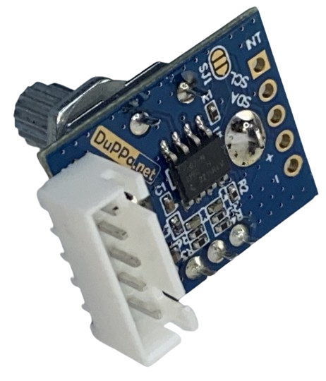

# Rotary Encoders
:stopwatch: Reading time: 10 minutes.

## Endless Turns And A Switch

**Rotary Encoders** look similar to *potentiometers* but they are completely different: a **Rotary Encoder** knob can be endlessly turned right or left, and when you press the encoder, it often additionally works like a switch (i.e. to confirm a setting).

To register when the knob turns, the **Rotary Encoder** internally has two switches and a disk with holes. WHen you turn the encoder knob, the disk turns. Whenever a hole in the disk passes the two switches, they get contact to **GND**, one after the other.

When you turn the knob in one direction, then switch A gets contact before switch B, and when you turn the knob in the other direction, it is the other way around.

Some **Rotary Encoder** have a third (and independent) switch that is activated when the knob is pressed.

The picture below shows a *raw* **Rotary Encoder** at the left side. Often, they are mounted to a simple breakout board like the one on the right side:

## *Raw* and *Smart* 
A **Rotary Encoder** is just the physical device itself, basically consisting of three switches. You can directly connect it to your microcontroller and work with it. 

Working with **Rotary Encoders** directly can be painful, though, because they are *dumb* devices and send raw data that needs to be post-processed and interpreted in order to figure out what the **Rotary Encoder** is actually doing. To work with these, the firmware (your software) needs to be smart and know how to identify and interpret the raw signals. Luckily, there are ready-to-use libraries that take over most of the tricky part.

What they cannot work around is the fact that *raw* **Rotary Encoders** require **4** GPIO pins. If the encoder acts as a switch when you press it, you need a total of **5** GPIO switches.

That's why there are also *smart* **Rotary Encoders** (discussed elsewhere): the encoder comes with its own mini-processor who does all the heavy lifting: signal interpretation, noise, post-processing, communication. This is what *smart* **Rotary Encoders** can look like:

In the picture, you can clearly identify the dedicated microprocessor that makes this **Rotary Encoder** smart.

Such boards typically communicate via *IC2*: just two GPIO pins are needed (not five), and they are shared among all other *I2C* devices. If you increase the number of **Rotary Encoders** in your project, the number of required GPIO stays the same.

In this section, we are looking at the *raw* **Rotary Encoders** and how you work with them directly.

## Testing A *Raw* Rotary Encoder

Here is a test setup to examine how a directly connected **Rotary Encoder** can be used.

For this test, you need this:

* **Microprocessor**: I am using an *ESP8266*.
* **Rotary Encoder**: I am using a vanilla encoder with built-in switch (5-pn model)
* **OLED Display**: I am using a vanilla *I2C* 0.96 inch *SSD1306* display

> [!NOTE]  
> If you have never worked with *OLED* displays before, then you should now. Of course you could output information to the *IDE*s serial monitor and skip the *OLED* stuff. But after all, we are all creating gadgets and fun electronics for the real world, so serial monitor output is really no fun.
>
> *OLED* displays are so inexpensive, so readily available, and so easy to use that you shouldn't hesitate to routinely add them to your microcontroller projects for outputting information in a fun and intuitive way.

### Different Types

When you purchase a *really really raw* **Rotary Encoder**, you just get an encoder switch which looks similar to a potentiometer. It has four or five "legs", two on one side and two or three on the other:

A bit easier to work with are breakout boards: they provide easily accessible pins and come with three pullup resistors. 

> [!IMPORTANT]  
> Do not confuse these breakout boards with *smart* **Rotary Encoders* mentioned above. 

Here is the schematic of such a breakout board:

### Schematics

