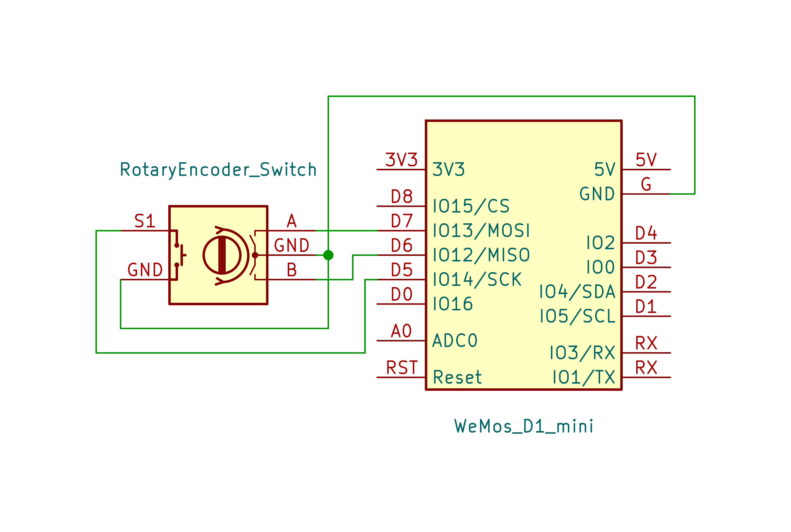
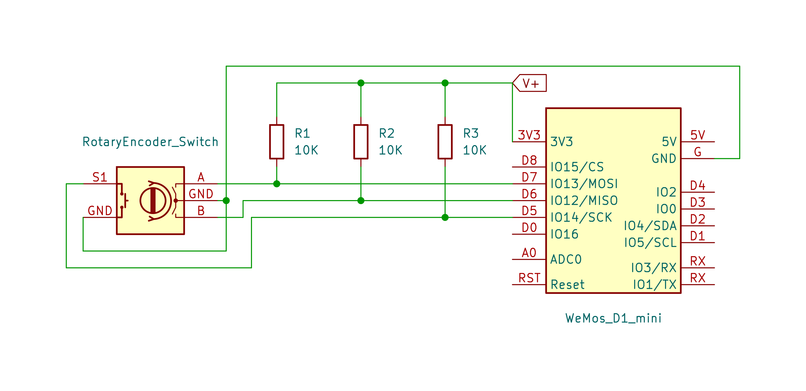

# Using Mechanical Rotary Encoder
:stopwatch: Reading time: 10 minutes.

## Rotary Encoder Pins
Let's hook up a mechanical **Rotary Encoder** to a microcontroller and see how things go. Here is the pin-out for most encoder types:

| Pin | Description |
| --- | --- |
| OUT A | Sometimes also called **CLK**. Connects to switch A inside the encoder |
| OUT B | Sometimes also called **DT**. Connects to switch B inside the encoder |
| SWITCH | Connects to the (optional) third switch that is enabled by pressing the encoder knob |
| GND | Ground. Both pins marked as **GND** are not connected. You must supply **GND** to both of them |

When hooking up such a mechanical **Rotary Encoder** to your microprocessor, the schematics could look like this:

To connect the **Rotary Encoder** to the microprocessor you need **4** wires and **3** GPIO pins, one for each physical switch.

### Using Breakout Boards

A bit easier to work with are simple and readily available breakout boards that have a mechnical **Rotary Encoder** soldered right on to them:

However, these breakout boards require **5** wires, one additional connection to **V+** is required. Why is that?

The schematics provide the answer. Here is the schematic taken from above with the added circuitry from the breakout board:

The breakout board simply adds three *pull-up resistors* that make sure that all three output pins are *pulled up* when the switch is *open*. The only reason why the boards have an additional **+** (or **V+**) pin is to provide positive voltage for these pullup resistors to pull the outputs up.

> [!TIP]
> Simply leave the **+** pin unconnected on such breakout boards if you don't have a wire to spare. If you do, the breakout board is no longer pulling the outputs up. That's all.
>
> You probably do not need the pullup resistors anyway. Most microcontrollers feature GPIOs that have built-in pullup resistors that you can easily activate by software.

For this test, you need this:

* **Microprocessor**: I am using an *ESP8266*.
* **Rotary Encoder**: I am using a vanilla encoder with built-in switch (5-pn model)
* **OLED Display**: I am using a vanilla *I2C* 0.96 inch *SSD1306* display

> [!NOTE]  
> If you have never worked with *OLED* displays before, then you should now. Of course you could output information to the *IDE*s serial monitor and skip the *OLED* stuff. But after all, we are all creating gadgets and fun electronics for the real world, so serial monitor output is really no fun.
>
> *OLED* displays are so inexpensive, so readily available, and so easy to use that you shouldn't hesitate to routinely add them to your microcontroller projects for outputting information in a fun and intuitive way.

### Different Types

When you purchase a *really really raw* **Rotary Encoder**, you just get an encoder switch which looks similar to a potentiometer. It has four or five "legs", two on one side and two or three on the other:

A bit easier to work with are breakout boards: they provide easily accessible pins and come with three pullup resistors. 

> [!IMPORTANT]  
> Do not confuse these breakout boards with *smart* **Rotary Encoders* mentioned above. 

Here is the schematic of such a breakout board:

### Schematics

